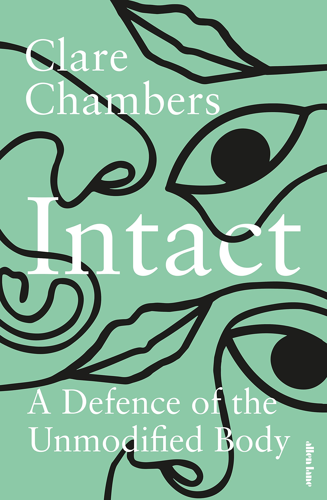

<i><a target="_blank" rel="noopener noreferrer" href="http://www.clarechambers.com/">Clare Chambers</a> is a professor of political philosophy and a Fellow of Jesus College, University of Cambridge. Her work deals with contemporary liberalism, social construction, feminism, and social justice.

We caught up with Clare about facing up to the pressure to modify ourselves, as discussed in her new book, <a target="_blank" rel="noopener noreferrer sponsored" href="http://www.amazon.com/Intact/dp/0241439043?&linkCode=ll1&tag=philosophybre-20&linkId=e045348525065a3693c5777efde5a104&language=en_US&ref_=as_li_ss_tl">Intact: A Defense of the Unmodified Body</a>.</i>

## What’s the core problem you hope to address with your new book, Intact?

As we all know, our culture places huge emphasis on how we look. This focus on appearance has only grown with the development of social media that encourages us to rank each other, selfie culture that tells us that we should always be ready to be photographed, apps that allow us to filter and touch up our appearance to see how we could look ‘better’, and videoconferencing that shows us what we look like as we listen and talk to others.

The problem is that this emphasis on our appearance is hugely damaging to our mental health, and to our equality. On the side of mental health, psychologists diagnose an “epidemic of appearance anxiety” and relate this anxiety to eating disorders, the rise and rise of cosmetic surgery and invasive procedures, and feelings of low self-esteem. On the side of equality, dominant ideas about how bodies should be reflect and reinforce existing structures of inequality and discrimination along lines of sex, gender, race, disability, age, class, and more.

>The emphasis on our appearance is hugely damaging to our mental health, and to our equality.

So in <a target="_blank" rel="noopener noreferrer sponsored" href="http://www.amazon.com/Intact/dp/0241439043?&linkCode=ll1&tag=philosophybre-20&linkId=e045348525065a3693c5777efde5a104&language=en_US&ref_=as_li_ss_tl">Intact</a> I analyze all of this, and show how the idea that _our bodies are never good enough_ is repeated over and over again: in areas such as hair and makeup, body shape and size, health and disability, exercise and bodybuilding, cosmetic and cultural surgery. I develop a new idea — the unmodified body — and argue that it needs defending. The unmodified body is not a body that is literally unmodified or unchanged. That would be impossible. The unmodified body is a body that is allowed to be good enough, just as it is.

## In your book, you discuss some of the slogans that play on or subtly establish body insecurities, such as new mothers being encouraged post-pregnancy to ‘get your body back’ via certain fitness plans. What do these kinds of campaigns reveal about how people are led to think about their bodies?

I find the phrase “getting your body back” so fascinating, and so telling. It’s a very common phrase — if you google it you find thousands of websites offering advice on how women can change their bodies after giving birth. What’s so interesting is that the phrase isn’t something like  “getting slimmer after pregnancy” but rather “getting _your_ body _back_”, which implies that the body you find yourself with after birth is not really _yours_. It’s some sort of counterfeit, imposter body, contrasted with the supposedly real, authentic body that you had before you were pregnant.

But why should the pre-pregnancy body be more truly _yours_ than the post-pregnancy body? After all, the average woman lives with a post-pregnancy body for longer than she lived with a pre-pregnancy body. If the ‘real’ body is the post-pubescent, pre-pregnancy body, that’s a body that a woman might have for only ten or twenty years out of an average lifespan of over eighty. ‘Your’ body that you are supposed to get ‘back’ is a body that was only ever going to be a temporary one. 

So the language of “getting your body back” is another way of saying that our actual, existing, real-life bodies are wrong. They are not good enough. They need to be returned to some idea of how they ought to be. And how they ought to be, in this narrative, is slim, youthful, focused on looks rather than accomplishments. These are ideals of femininity that do not serve women well.

## What would your response be to someone who insists modifying their body is their free individual choice? Or those who advocate body modification in the name of health?

We have the right to try to change our bodies. But we also have the right to live in a society that does not constantly tell us that the bodies we have are wrong. When everyone feels bad about their bodies, it’s not the bodies that are the real problem. It’s the social context.

Our choices to modify our bodies are not made in a vacuum. They’re made in the context of a constant barrage of messages, telling us we should feel worried about our bodies and ashamed of them. Our choices are also made in the context of aggressive marketing of ways to change our bodies: new cosmetic procedures and products, new diets and exercise regimes, new health practices.

>We have the right to try to change our bodies. But we also have the right to live in a society that does not constantly tell us that the bodies we have are wrong.

In the context of all that pressure, all that judgment, all the ranking of bodies, it may be that changing our bodies does make us feel better in the short term. It may be that changing our bodies is better, in some ways, than leaving them alone. It may be that the best way to survive in this context is by doing whatever we can to try to meet these impossible standards. It is not part of my argument to criticize individuals for doing what they can to try to deal with this pressure.

So, in general we do have the right to try to change our bodies. But we also have the right to be sure that modification practices that are offered to us are safe, evidence-based, and effective.

Effectiveness is not just about whether a procedure does cause the promised physical changes. It’s also about whether a body modification procedure succeeds in bringing about the other outcomes that the client hopes for. Will having a different body make you feel happier, more confident, less anxious? Too often, the evidence for the long-term psychological impact of body modification practices just isn’t there. 

<!--big subscribe-->

    
    <h4>Get one mind-opening philosophical idea delivered to your inbox every Sunday (free):</h4>
    

        <form action="https://app.convertkit.com/forms/5812400/subscriptions" method="post" data-sv-form="5812400" data-uid="be0e52d3c0" data-format="inline" data-version="5" data-options="{&quot;settings&quot;:{&quot;after_subscribe&quot;:{&quot;action&quot;:&quot;redirect&quot;,&quot;success_message&quot;:&quot;Success! Now check your email to confirm your subscription.&quot;,&quot;redirect_url&quot;:&quot;https://philosophybreak.com/thank-you/&quot;},&quot;analytics&quot;:{&quot;google&quot;:null,&quot;fathom&quot;:null,&quot;facebook&quot;:null,&quot;segment&quot;:null,&quot;pinterest&quot;:null,&quot;sparkloop&quot;:null,&quot;googletagmanager&quot;:null},&quot;modal&quot;:{&quot;trigger&quot;:&quot;timer&quot;,&quot;scroll_percentage&quot;:null,&quot;timer&quot;:5,&quot;devices&quot;:&quot;all&quot;,&quot;show_once_every&quot;:15},&quot;powered_by&quot;:{&quot;show&quot;:false,&quot;url&quot;:&quot;https://convertkit.com/features/forms?utm_campaign=poweredby&amp;utm_content=form&amp;utm_medium=referral&amp;utm_source=dynamic&quot;},&quot;recaptcha&quot;:{&quot;enabled&quot;:false},&quot;return_visitor&quot;:{&quot;action&quot;:&quot;show&quot;,&quot;custom_content&quot;:&quot;&quot;},&quot;slide_in&quot;:{&quot;display_in&quot;:&quot;bottom_right&quot;,&quot;trigger&quot;:&quot;timer&quot;,&quot;scroll_percentage&quot;:null,&quot;timer&quot;:5,&quot;devices&quot;:&quot;all&quot;,&quot;show_once_every&quot;:15},&quot;sticky_bar&quot;:{&quot;display_in&quot;:&quot;top&quot;,&quot;trigger&quot;:&quot;timer&quot;,&quot;scroll_percentage&quot;:null,&quot;timer&quot;:5,&quot;devices&quot;:&quot;all&quot;,&quot;show_once_every&quot;:15}},&quot;version&quot;:&quot;5&quot;}" min-width="400 500 600 700 800">
        
<ul data-element="errors" data-group="alert"></ul>

            

                <input name="email_address" aria-label="Your Email Address..." placeholder="Your Email Address..." required type="email" />
            

            <button class="button primary" type="submit" data-element="submit">

<svg xmlns="http://www.w3.org/2000/svg" viewBox="0 0 512 512"><path d="M464 64H48C21.49 64 0 85.49 0 112v288c0 26.51 21.49 48 48 48h416c26.51 0 48-21.49 48-48V112c0-26.51-21.49-48-48-48zm0 48v40.805c-22.422 18.259-58.168 46.651-134.587 106.49-16.841 13.247-50.201 45.072-73.413 44.701-23.208.375-56.579-31.459-73.413-44.701C106.18 199.465 70.425 171.067 48 152.805V112h416zM48 400V214.398c22.914 18.251 55.409 43.862 104.938 82.646 21.857 17.205 60.134 55.186 103.062 54.955 42.717.231 80.509-37.199 103.053-54.947 49.528-38.783 82.032-64.401 104.947-82.653V400H48z"/></svg>Join 6,000+ Subscribers</button>
            

            

        </form>
        
One short philosophical email per week. Unsubscribe any time.

    

You also asked about modification practices for health. Part Two of <a target="_blank" rel="noopener noreferrer sponsored" href="http://www.amazon.com/Intact/dp/0241439043?&linkCode=ll1&tag=philosophybre-20&linkId=e045348525065a3693c5777efde5a104&language=en_US&ref_=as_li_ss_tl">Intact</a> discusses this question directly, through a discussion of the idea of the “normal” body. My aim there is to show that even modifications that aim at health are value-laden and fit into this general pattern of viewing our bodies as not good enough. 

I discuss examples like male circumcision, female genital cutting or mutilation (FGM), cosmetic labiaplasty, cosmetic breast implants, and reconstructive breast surgery, and show how these procedures are sometimes understood as being clinical and sometimes cultural; sometimes a right and sometimes a violation. 

I also consider how disabled bodies are understood as needing modification by mainstream, non-disabled culture, and how this understanding harms disabled people. And I show how the question of modification for health becomes particularly significant — and philosophically complex — when we think about modifying children.

## In your book, you state you don’t want to put forward the unmodified body as a conclusion, but rather as a valuable _premise_. Can you explain what you mean here, and why you view this as a modest yet radical position? 

As I mentioned earlier, it’s not part of my argument to criticize individual practices of modification, or to argue that we should never modify our bodies. For starters, this would be impossible. Every time we eat or drink, exercise or rest, engage in personal hygiene or don’t, we’re subtly modifying our bodies. Our bodies can’t be literally unmodified.

But there’s also a deeper reason why the unmodified body is a premise and not a conclusion. Dominant ideals about how bodies should be mean that some of us have bodies that are closer to those ideals than others. Body ideals are structured around sex and gender, emphasise particular racialized features, tend to value youthfulness, and so on. Given that, prizes for remaining unmodified would be prizes for the privileged. 

The problem is not with all body modification practices as such (although some practices are risky or harmful, and I discuss that in the book). The problem is with the constant and overwhelming pressure to modify our bodies — the pressure to think of our bodies as always and inevitably failing. 

One part of this picture is what I call “shametenance”. Shametenance is all the things that we do to maintain the idea that our bodies are shameful. It includes the ways that our bodies are meant to be kept private or unsayable — I discuss the example of period shame here — and all the things we do to conceal those parts or aspects of our bodies that it would be shameful to reveal. For some people that might be the felt need to conceal wrinkles or gray hair; for others it might be about hiding scars or blemishes; for some it might be about hiding fat and disguising body shape; for others, it’s about concealing disability or constructing a body to fit one’s identity. 

My argument is very simple, because it asks us to consider whether we might be able to allow our bodies to be good enough just as they are. It’s about rejecting social pressures, not rejecting all modification. But it’s radical, because it also means refusing shametenance — and this is a very difficult step.

## You develop your principle of the unmodified body by contrasting it with three ‘proxy’ concepts: ‘natural’, ‘normal’, and ‘whole’. Briefly, how does each inform and misinform what you mean by the unmodified body? 

I deliberately use the unfamiliar idea of the “unmodified body” to show that I’m talking about a political principle, not a literal thing. I want to know what it would mean to be unmodified, in this political sense, and why that might be valuable. The way <a target="_blank" rel="noopener noreferrer sponsored" href="http://www.amazon.com/Intact/dp/0241439043?&linkCode=ll1&tag=philosophybre-20&linkId=e045348525065a3693c5777efde5a104&language=en_US&ref_=as_li_ss_tl">Intact</a> proceeds is through discussion of three more familiar proxy concepts: ways that we talk about the value of an unmodified body. Each of them tells us something important about the unmodified body, but none of them is good enough on its own.

The idea of the ‘natural’ body is very familiar. But, as I show, the idea of nature is a frenemy: sometimes friend, sometimes enemy. Sometimes the idea of the natural body can be used in a progressive way, one that helps us to resist oppression. Examples of this use of the idea of nature are the natural hair movement, which defends Afro-textured hair and refuses racist aesthetics, and ecofeminism, which defends the value and power of pregnancy, maternity, and women’s bodies against misogyny. But in other examples the idea of nature is used oppressively, as when it is used to reinforce gender norms and suggest that gender inequality is natural.

<!--small subscribe-->

    <h4>Enjoying this article? Get one like it delivered to your inbox every Sunday (free)</h4>
    
Every Sunday, I break down one mind-opening idea from philosophy. You get the distillation straight to your inbox.

    

        <form action="https://app.convertkit.com/forms/5812400/subscriptions" method="post" data-sv-form="5812400" data-uid="be0e52d3c0" data-format="inline" data-version="5" data-options="{&quot;settings&quot;:{&quot;after_subscribe&quot;:{&quot;action&quot;:&quot;redirect&quot;,&quot;success_message&quot;:&quot;Success! Now check your email to confirm your subscription.&quot;,&quot;redirect_url&quot;:&quot;https://philosophybreak.com/thank-you/&quot;},&quot;analytics&quot;:{&quot;google&quot;:null,&quot;fathom&quot;:null,&quot;facebook&quot;:null,&quot;segment&quot;:null,&quot;pinterest&quot;:null,&quot;sparkloop&quot;:null,&quot;googletagmanager&quot;:null},&quot;modal&quot;:{&quot;trigger&quot;:&quot;timer&quot;,&quot;scroll_percentage&quot;:null,&quot;timer&quot;:5,&quot;devices&quot;:&quot;all&quot;,&quot;show_once_every&quot;:15},&quot;powered_by&quot;:{&quot;show&quot;:false,&quot;url&quot;:&quot;https://convertkit.com/features/forms?utm_campaign=poweredby&amp;utm_content=form&amp;utm_medium=referral&amp;utm_source=dynamic&quot;},&quot;recaptcha&quot;:{&quot;enabled&quot;:false},&quot;return_visitor&quot;:{&quot;action&quot;:&quot;show&quot;,&quot;custom_content&quot;:&quot;&quot;},&quot;slide_in&quot;:{&quot;display_in&quot;:&quot;bottom_right&quot;,&quot;trigger&quot;:&quot;timer&quot;,&quot;scroll_percentage&quot;:null,&quot;timer&quot;:5,&quot;devices&quot;:&quot;all&quot;,&quot;show_once_every&quot;:15},&quot;sticky_bar&quot;:{&quot;display_in&quot;:&quot;top&quot;,&quot;trigger&quot;:&quot;timer&quot;,&quot;scroll_percentage&quot;:null,&quot;timer&quot;:5,&quot;devices&quot;:&quot;all&quot;,&quot;show_once_every&quot;:15}},&quot;version&quot;:&quot;5&quot;}" min-width="400 500 600 700 800">
        
<ul data-element="errors" data-group="alert"></ul>

            

                <input name="email_address" aria-label="Your Email Address..." placeholder="Your Email Address..." required type="email" />
            

            <button class="button primary" type="submit" data-element="submit">

<svg xmlns="http://www.w3.org/2000/svg" viewBox="0 0 512 512"><path d="M464 64H48C21.49 64 0 85.49 0 112v288c0 26.51 21.49 48 48 48h416c26.51 0 48-21.49 48-48V112c0-26.51-21.49-48-48-48zm0 48v40.805c-22.422 18.259-58.168 46.651-134.587 106.49-16.841 13.247-50.201 45.072-73.413 44.701-23.208.375-56.579-31.459-73.413-44.701C106.18 199.465 70.425 171.067 48 152.805V112h416zM48 400V214.398c22.914 18.251 55.409 43.862 104.938 82.646 21.857 17.205 60.134 55.186 103.062 54.955 42.717.231 80.509-37.199 103.053-54.947 49.528-38.783 82.032-64.401 104.947-82.653V400H48z"/></svg>Join 6,000+ Subscribers</button>
            

            

        </form>
        
One short philosophical email per week. Unsubscribe any time.

    

The idea of the ‘normal’ body is frequently found in discourses about health and disability, which I’ve touched on earlier. I argue that there are two ways of thinking about what it is to have a normal body. One approach is to think of normality as something that exists when we compare our bodies to others. The question then is, which others? What is our reference class, and who gets to count as being in it? This way of thinking about normality just reinforces dominant ideals. A better way, or so I suggest, is to think of normality as being relative to us: our bodies are normal if they are normal for us. This raises the intriguing possibility of _allowing_ our bodies to be normal.

Finally, the ‘whole’ body is something that is found in the idea of bodily integrity. Bodily integrity is particularly relevant when we think about intervening in others’ bodies, and so a chapter of <a target="_blank" rel="noopener noreferrer sponsored" href="http://www.amazon.com/Intact/dp/0241439043?&linkCode=ll1&tag=philosophybre-20&linkId=e045348525065a3693c5777efde5a104&language=en_US&ref_=as_li_ss_tl">Intact</a> is dedicated to nine extremely hard cases: times when parents might want to authorize modification on their children’s bodies, but when doing so is controversial. I argue that existing accounts of bodily integrity are not adequate to deal with these hard cases, and I suggest an approach based on the idea of the unmodified body. I also devote a chapter to thinking about times when people feel that their bodies are made whole precisely by modification.

## Thinking speculatively about the future, what are your views on potential body modifications that are designed to enhance the mind, rather than the physical body? (For instance, brain chips that could be implanted to improve, say, memory or creativity…) could the arguments you put forward about the unmodified body apply to the mind, too?

In <a target="_blank" rel="noopener noreferrer sponsored" href="http://www.amazon.com/Intact/dp/0241439043?&linkCode=ll1&tag=philosophybre-20&linkId=e045348525065a3693c5777efde5a104&language=en_US&ref_=as_li_ss_tl">Intact</a> I deliberately don’t discuss enhancements of this sort. They raise very distinct ethical questions — and the book is already very broad in scope. I’m also not sure that the issues I identify — of shame, of anxiety, of harm, of discrimination — apply in the same way and to the same extent to our minds as to our bodies. But it’s a fascinating area, with scope for further work.

## Earlier we discussed slogans like ‘get your body back’ that normalize unrealistic body expectations. How can your defense of the unmodified body be encapsulated into a public health campaign or social movement to counter such slogans? Do you know of any effective methods for tackling the harmful paradigms of ‘beauty’ or ‘normality’ proliferated through culture?

The body positivity movement is doing some of this work, with real impact. But it’s also a movement that has been used by large companies, including beauty companies, to sell their products. The idea of body positivity is an important counterbalance to the idea of body inadequacy and shame. But it’s important that this doesn’t become another way to fail — as is parodied in the [excellent song by Rachel Lark and the Damaged Goods](https://www.youtube.com/watch?v=iZNRriHkJsI): 

>All the other women should love their bodies, but I wanna lose five pounds!

The body neutrality movement is one response to that worry. It’s close to my idea of the unmodified body in that the goal it emphasizes — being neutral about your body — is similar to the idea of letting your body be good enough just as it is. The question always is how can we tackle the pressures to change our bodies collectively, without putting the burden and the shame on individuals? This is largely an empirical question that will require experimentation and study.

## Are you optimistic or pessimistic that society will be persuaded by the arguments in your book?

I’m optimistic that my book will speak to people, and persuade at least some of them. I expect that the reader of <a target="_blank" rel="noopener noreferrer sponsored" href="http://www.amazon.com/Intact/dp/0241439043?&linkCode=ll1&tag=philosophybre-20&linkId=e045348525065a3693c5777efde5a104&language=en_US&ref_=as_li_ss_tl">Intact</a> will find some parts of the book that speak to them, that resonate and relate to their experience; while other parts of the book will be challenging, provocative, or even seem wrong. Which parts prompt which response will differ between readers! But I hope that this juxtaposition — of recognition and challenge, of familiarity and surprise — is productive, and leads readers to see their relationship with their bodies in a new way.

&nbsp;

<i>You can order Clare’s new book <a target="_blank" rel="noopener noreferrer sponsored" href="http://www.amazon.com/Intact/dp/0241439043?&linkCode=ll1&tag=philosophybre-20&linkId=e045348525065a3693c5777efde5a104&language=en_US&ref_=as_li_ss_tl">Intact: A Defense of the Unmodified Body here</a>, or simply hit the banner below.</i>

    <a target="_blank" rel="noopener noreferrer sponsored" href="http://www.amazon.com/Intact/dp/0241439043?&linkCode=ll1&tag=philosophybre-20&linkId=e045348525065a3693c5777efde5a104&language=en_US&ref_=as_li_ss_tl">
        
        

            <h4>Intact: A Defense of the Unmodified Body</h4>
            
<svg xmlns="http://www.w3.org/2000/svg" viewBox="0 0 50 50"><path d="M48.336,7.54c-0.701,0-1.359,0.007-2.018,0.024V5.326h-0.734c-14.262,0-19.043,3.411-20.585,5.252 c-1.542-1.841-6.323-5.252-20.585-5.252H3.68v2.237C3.022,7.545,2.364,7.54,1.664,7.54H0V39.89h1.664 c17.595,0,21.186,4.035,21.698,4.784h3.302c0.557-0.784,4.218-4.784,21.673-4.784H50V7.54H48.336z M23.899,38.431 c-2.457-1.812-7.611-3.914-18.383-4.054V7.175c15.087,0.194,18.001,4.327,18.383,5V38.431z M44.484,34.377 c-10.772,0.14-15.926,2.24-18.383,4.054V12.184c0.416-0.737,3.412-4.814,18.383-5.007V34.377z"></path></svg>BY CLARE CHAMBERS

            <svg xmlns="http://www.w3.org/2000/svg" viewBox="0 0 576 512"><path d="M576 24v127.984c0 21.461-25.96 31.98-40.971 16.971l-35.707-35.709-243.523 243.523c-9.373 9.373-24.568 9.373-33.941 0l-22.627-22.627c-9.373-9.373-9.373-24.569 0-33.941L442.756 76.676l-35.703-35.705C391.982 25.9 402.656 0 424.024 0H552c13.255 0 24 10.745 24 24zM407.029 270.794l-16 16A23.999 23.999 0 0 0 384 303.765V448H64V128h264a24.003 24.003 0 0 0 16.97-7.029l16-16C376.089 89.851 365.381 64 344 64H48C21.49 64 0 85.49 0 112v352c0 26.51 21.49 48 48 48h352c26.51 0 48-21.49 48-48V287.764c0-21.382-25.852-32.09-40.971-16.97z"/></svg>View on Amazon
        

    </a>

