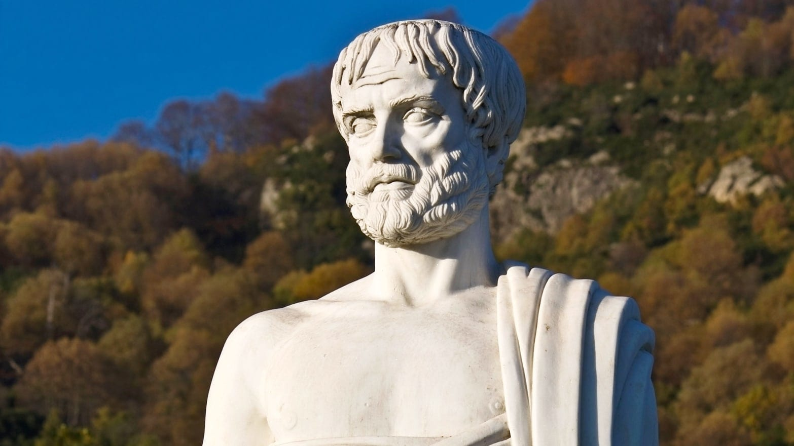

What does the good life look like for human beings? What does happiness mean, and how can we achieve it? What does virtue mean, and how can we exhibit it? 

The ancient Greek philosopher Aristotle outlines his monumentally influential answers to these questions in his <a target="_blank" rel="noopener noreferrer sponsored" href="http://www.amazon.com/gp/product/0199213615/ref=as_li_tl?ie=UTF8&tag=philosophybre-20&camp=1789&creative=9325&linkCode=as2&creativeASIN=0199213615&linkId=f18186fee7d024481a9574760906cea9">Nicomachean Ethics</a>, his most studied work on ethics, which was written around 350 BCE (and features in our list of [Aristotle’s best books](/reading-lists/aristotle/)).

Ultimately, Aristotle thinks the good life boils down to one thing: achieving _eudaimonia_, which is variously translated from Greek as ‘well-being’, ‘happiness’, ‘blessedness’, and in the context of the virtue ethics Aristotle endorsed, ‘human flourishing’.

The way we can achieve _eudaimonia_, Aristotle argues, is by habitually striving for excellence in all that we do. 

In other words, happiness means _excellent activity_ (and typically involves, Aristotle suggests, establishing a happy medium between excess and deficiency in our behavior and character, a recommendation we cover in more detail in our [explainer on Aristotle’s ‘golden mean’](/articles/the-golden-mean-aristotle-guide-to-living-excellently/)).

While regulating our individual behavior to achieve excellence is perhaps the main ingredient in Aristotle’s recipe for happiness, he acknowledges that the good life wouldn’t mean as much without friendship. He writes in the <a target="_blank" rel="noopener noreferrer sponsored" href="http://www.amazon.com/gp/product/0199213615/ref=as_li_tl?ie=UTF8&tag=philosophybre-20&camp=1789&creative=9325&linkCode=as2&creativeASIN=0199213615&linkId=f18186fee7d024481a9574760906cea9">Nicomachean Ethics</a>:

>We consider a friend to be one of the greatest of all good things, and friendlessness and solitude a very terrible thing, because the whole of life and voluntary interactions are with loved ones.

## The importance of friendship: Aristotle

Of the <a target="_blank" rel="noopener noreferrer sponsored" href="http://www.amazon.com/gp/product/0199213615/ref=as_li_tl?ie=UTF8&tag=philosophybre-20&camp=1789&creative=9325&linkCode=as2&creativeASIN=0199213615&linkId=f18186fee7d024481a9574760906cea9">Nicomachean Ethics</a>’s ten sections, Aristotle dedicates two of them to friendship, perhaps indicating its importance in his vision of the good life. “Friendship is one of the most indispensable requirements of life,” he writes:

>For no one would choose to live without friends but in possession of everything else that is good. Friends are of help to the young by protecting them from mistakes; to the elderly by looking after them and making up for their failing powers of action; to those in the prime of life, to help them in doing good things.

So important is friendship, Aristotle declares, that it may even trump justice when it comes promoting the good life for all:

>When men are friends they have no need of justice, while when they are just they need friendship as well, and the truest form of justice is thought to be a friendly quality.

## The 3 levels of friendship

In his detailed analysis of friendship, Aristotle discusses its nature, principles, cultivation, how it contributes to the good life, when it is right to break off a friendship, and the part friendship plays in (and its resemblance to) various forms of political system. 

One of his most enduring contributions to philosophical discussions on friendship is his distinction between its three kinds or levels. He prefaces this by stating: 

>Those who think there is only one [kind of friendship] because it admits of degrees have relied on an inadequate indication; for even things different in species admit of degree.

He then identifies the following ‘species’ of friendship: 

1. **The friendship of _utility_.** These friendships are based on what someone can do for you, or what you can do for another person. It might be that you put in a good word for someone, and they buy you a gift in return. Such relationships have little to do with character, and can end as soon as any possible use for you or the other person is removed from the equation.
2. **The friendship of _pleasure_.** These are friendships based on enjoyment of a shared activity or the pursuit of fleeting pleasures and emotions. This might be someone you go for drinks with, or join a particular hobby with, and is a common level of association among the young, so Aristotle declared. This type of relationship can again end quickly, dependent as it is on people’s ever-changing likes and dislikes.
3. **The friendship of _virtue_.** These are the people you like for themselves, who typically influence you positively and push you to be a better person. This kind of relationship, based as it is on the character of two self-sufficient equals, is a lot more stable than the previous two categories. 

Unsurprisingly, it is this final level — the friendship of virtue — that Aristotle lauds. While friendships of utility and pleasure have their place, it is the rare yet pure friendships of virtue that are the greatest contributors to the good life. 

## The requirements for close friendship

Virtuous friendship takes time — indeed, the length of a relationship indicates its stability — and requires effort on both sides. 

“For perfect friendship you must get to know someone thoroughly,” Aristotle says, “and become intimate with them, which is a very difficult thing to do.” It involves honesty, acceptance, and selflessness. It is two equal parties coming together to forge a bond that provides mutual benefit, enjoyment, and appreciation over the course of a lifetime.

<!--big subscribe-->

    
    <h4>From the Buddha to Nietzsche: join 12,000+ subscribers enjoying my free Sunday Breakdown</h4>
    
In one concise email each Sunday, I break down a famous idea from philosophy. You get the distillation straight to your inbox.

    

        <form action="https://app.convertkit.com/forms/5812400/subscriptions" method="post" data-sv-form="5812400" data-uid="be0e52d3c0" data-format="inline" data-version="6" data-options="{&quot;settings&quot;:{&quot;after_subscribe&quot;:{&quot;action&quot;:&quot;message&quot;,&quot;success_message&quot;:&quot;Thank you, philosopher! Your welcome email will land in your inbox shortly.&quot;,&quot;redirect_url&quot;:&quot;https://philosophybreak.com/thank-you/&quot;},&quot;analytics&quot;:{&quot;google&quot;:null,&quot;fathom&quot;:null,&quot;facebook&quot;:null,&quot;segment&quot;:null,&quot;pinterest&quot;:null,&quot;sparkloop&quot;:null,&quot;googletagmanager&quot;:null},&quot;modal&quot;:{&quot;trigger&quot;:&quot;timer&quot;,&quot;scroll_percentage&quot;:null,&quot;timer&quot;:5,&quot;devices&quot;:&quot;all&quot;,&quot;show_once_every&quot;:15},&quot;powered_by&quot;:{&quot;show&quot;:false,&quot;url&quot;:&quot;https://convertkit.com/features/forms?utm_campaign=poweredby&amp;utm_content=form&amp;utm_medium=referral&amp;utm_source=dynamic&quot;},&quot;recaptcha&quot;:{&quot;enabled&quot;:false},&quot;return_visitor&quot;:{&quot;action&quot;:&quot;show&quot;,&quot;custom_content&quot;:&quot;&quot;},&quot;slide_in&quot;:{&quot;display_in&quot;:&quot;bottom_right&quot;,&quot;trigger&quot;:&quot;timer&quot;,&quot;scroll_percentage&quot;:null,&quot;timer&quot;:5,&quot;devices&quot;:&quot;all&quot;,&quot;show_once_every&quot;:15},&quot;sticky_bar&quot;:{&quot;display_in&quot;:&quot;top&quot;,&quot;trigger&quot;:&quot;timer&quot;,&quot;scroll_percentage&quot;:null,&quot;timer&quot;:5,&quot;devices&quot;:&quot;all&quot;,&quot;show_once_every&quot;:15}},&quot;version&quot;:&quot;6&quot;}" min-width="400 500 600 700 800">
        
<ul data-element="errors" data-group="alert"></ul>

            

                <input name="email_address" aria-label="Your Email Address..." placeholder="Your Email Address..." required type="email" />
            

            <button class="button primary" type="submit" data-element="submit">

<svg xmlns="http://www.w3.org/2000/svg" viewBox="0 0 512 512"><path d="M464 64H48C21.49 64 0 85.49 0 112v288c0 26.51 21.49 48 48 48h416c26.51 0 48-21.49 48-48V112c0-26.51-21.49-48-48-48zm0 48v40.805c-22.422 18.259-58.168 46.651-134.587 106.49-16.841 13.247-50.201 45.072-73.413 44.701-23.208.375-56.579-31.459-73.413-44.701C106.18 199.465 70.425 171.067 48 152.805V112h416zM48 400V214.398c22.914 18.251 55.409 43.862 104.938 82.646 21.857 17.205 60.134 55.186 103.062 54.955 42.717.231 80.509-37.199 103.053-54.947 49.528-38.783 82.032-64.401 104.947-82.653V400H48z"/></svg>Join 12,000+ Subscribers</button>
            

            

        </form>
        
💭 One short philosophical email each Sunday. Unsubscribe any time.

    

Aristotle thinks _loving_ is more the essence of close friendship than _being loved_. To illustrate this, he compares the love we feel for close friends to that a mother feels for her child, reflecting on the “delight mothers take in loving”:

>for some mothers hand over their children to be brought up, and so long as they know their fate they love them and do not seek to be loved in return (if they cannot have both), but seem to be satisfied if they seem them prospering; and they themselves love their children even if these owing to their ignorance them them nothing of a mother’s due.

Aristotle then connects this kind of selfless love — wishing the best for someone else for _their_ sake — to the best kinds of friendship, writing: 

>Now since friendship depends more on loving, and it is those who love their friends that are praised, loving seems to be the characteristic virtue of friends, so that it is only those in whom this is found in due measure that are lasting friends, and only their friendship that endures.

Aristotle does not limit the formation of such friendships to non-relations; they can take place between spouses and family members, too — though he does add some qualifications for relationships that include inequalities, such as the parent-child relationship (suggesting such imbalances should be taken into consideration when reviewing the contributions of each party). 

His one strict limitation is the number of virtuous friendships you can maintain. “To be a friend to many people in the way of perfect friendship is impossible,” he warns:

>it is difficult to share intimately in the joys and sorrows of many people; for one may very likely be called upon to rejoice with one and to mourn with another at the same time.

It would be surprising if anyone could manage more than, say, five of such intensive relationships, meaning some close friends and even family members may be relegated to friendships of pleasure or even utility. So, choose your close friends wisely, and cultivate them virtuously.

## Friendship and the good life

Aristotle’s account of friendship underscores his view that excellent activity is central to a life well-lived, the highest good, and the most accurate definition of happiness. 

In forming relationships, he urges us to go beyond utility and pleasure and seek to _fulfill our human potential_ by connecting with others in the most sincere, meaningful, and prosperous way possible: by cultivating mutual love. 

For mutually loving relationships — those in which two people strive to be the best they can be to each other and themselves — are not just key sources of happiness, Aristotle judges, but among the pinnacles of human achievement. 

(Contrast this with Schopenhauer, who with his [porcupine dilemma](/articles/porcupine-dilemma-schopenhauer-wistful-parable-on-human-connection/) suggests solitude is a better match for achievement than companionship.)

So a life of excellent activity, bolstered by excellent relationships, is very much a recipe for happiness for Aristotle.

## Learn more about Aristotle’s vision of the good life

What do you make of Aristotle’s analysis of friendship? Do you agree with the distinctions he makes? And what characteristics do the best relationships in your life exhibit?

If you’re looking to delve deeper into Aristotle’s teachings, you might enjoy our article on [the ‘golden mean’, Aristotle’s guide to living excellently](/articles/the-golden-mean-aristotle-guide-to-living-excellently/), as well as our quick explainer on why [Aristotle thinks leisure defines us more than work](/articles/aristotle-on-why-leisure-defines-us-more-than-work/).

You can also further explore Aristotle’s ethics and discuss your thoughts with others in our new course and community, <i>How to Live a Good Life</i>, which explores 7 of the world’s most influential philosophies for living — including Aristotelianism, Buddhism, and Existentialism. If you’re interested, consider learning more here: [How to Live a Good Life (According to 7 of the World’s Wisest Philosophies)](/how-to-live-a-good-life/).

<!--how to live a good life-->

    
    <h4>How to Live a Good Life (According to 7 of the World’s Wisest Philosophies)</h4>
    
Explore and compare the wisdom of Stoicism, Existentialism, Buddhism and beyond to forever enrich your personal philosophy.

    <a class="button primary" href="/how-to-live-a-good-life/"><svg xmlns="http://www.w3.org/2000/svg" viewBox="0 0 512 512"><path d="M504 256C504 119 393 8 256 8S8 119 8 256s111 248 248 248 248-111 248-248zm-448 0c0-110.5 89.5-200 200-200s200 89.5 200 200-89.5 200-200 200S56 366.5 56 256zm72 20v-40c0-6.6 5.4-12 12-12h116v-67c0-10.7 12.9-16 20.5-8.5l99 99c4.7 4.7 4.7 12.3 0 17l-99 99c-7.6 7.6-20.5 2.2-20.5-8.5v-67H140c-6.6 0-12-5.4-12-12z"/></svg>Get Instant Access</a>
    
&#9733;&#9733;&#9733;&#9733;&#9733; (50+ reviews for our courses)

