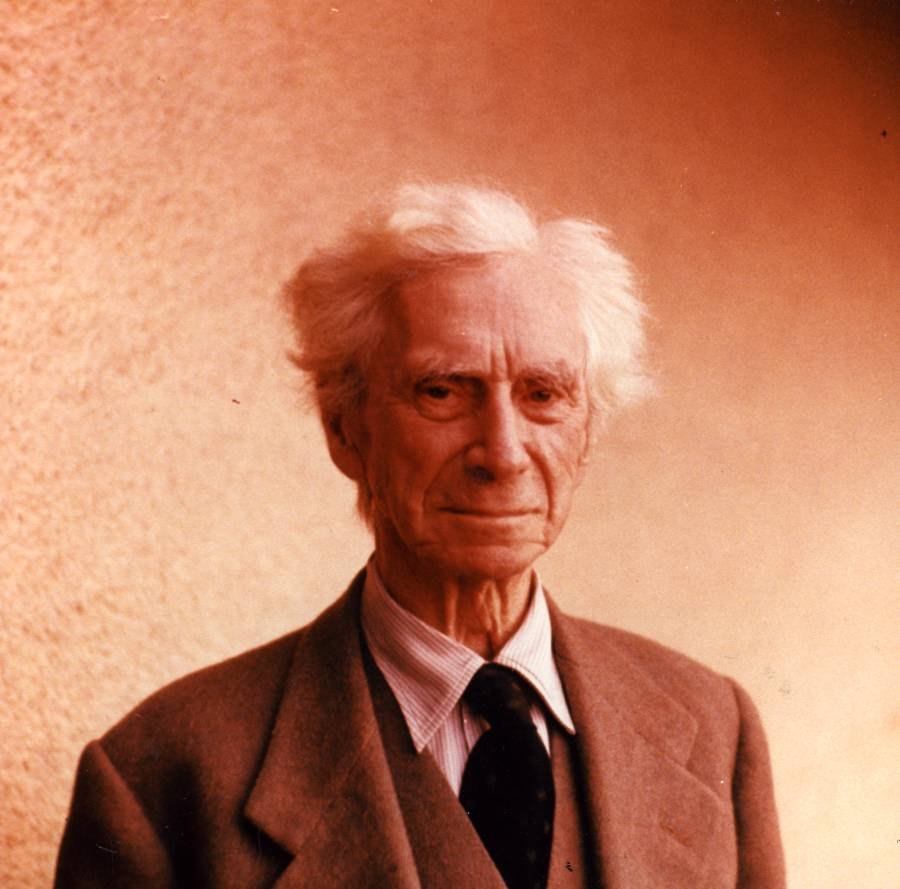

Bertrand Russell was a giant of the twentieth century. Recognized as one of the founders of modern analytical philosophy, his work has significantly influenced mathematics, logic, artificial intelligence, cognitive science, and computer science.⁣⁣

The life Russell led was almost as interesting and inspiring as his work. From being dismissed by both Cambridge Trinity College and New York City College, living through two World Wars, and being arrested twice for political activism; to being awarded the Order of Merit, winning the Nobel Prize for Literature, becoming an early TV personality, and playing a role in halting the Cuban Missile Crisis — Russell was not a philosopher confined to the dusty halls of academia. ⁣⁣

Russell’s character is perhaps best typified by an event that occurred towards the end of his life. At the age of 89, he was jailed for seven days in Brixton Prison for ‘breach of peace’ after taking part in an anti-nuclear demonstration in London. The magistrate offered to exempt him from jail if he pledged himself to ‘good behavior’, to which Russell replied: ‘No, I will not.’⁣

Throughout his academic life, Russell wrote a number of classics, from <a target="_blank" rel="noopener noreferrer sponsored" href="http://www.amazon.com/gp/product/1603864377/ref=as_li_tl?ie=UTF8&tag=philosophybre-20&camp=1789&creative=9325&linkCode=as2&creativeASIN=1603864377&linkId=200e95f0c484cd683a4cd667f3d989a2">Principia Mathematica</a> to <a target="_blank" rel="noopener noreferrer sponsored" href="http://www.amazon.com/gp/product/0415474442/ref=as_li_tl?ie=UTF8&tag=philosophybre-20&camp=1789&creative=9325&linkCode=as2&creativeASIN=0415474442&linkId=516419b2970a230bc4fe987e16fc8266">Human Knowledge: Its Scope and Limits</a>. But it is in his short but powerful introductory book on philosophy for the general reader, <a target="_blank" rel="noopener noreferrer sponsored" href="http://www.amazon.com/gp/product/1724202359/ref=as_li_tl?ie=UTF8&tag=philosophybre-20&camp=1789&creative=9325&linkCode=as2&creativeASIN=1724202359&linkId=fe8466982d5b2c4a09e08c55e2888043">The Problems of Philosophy</a>, in which Russell’s love for the subject is laid bare. Having presented a number of core philosophical topics, Russell then composes a beautiful exposition on why philosophy matters — and explains the value in practicing it at all.  

To start, Russell outlines why there is typically a rather dismissive attitude towards philosophy. As he puts it: 

>Many men, under the influence of science or of practical affairs, are inclined to doubt whether philosophy is anything better than innocent but useless trifling, hair-splitting distinctions, and controversies on matters concerning which knowledge is impossible.

This dismissive attitude towards philosophy is caused by two main things, Russell argues. Firstly, it is due to the fact that philosophy doesn’t produce obvious material benefits like science does. Secondly, it is because philosophy is unable to provide answers to most of the questions it asks. Why, then, is philosophy valuable?

## Uncertainty is important

Regardless of whether we find answers to satisfy our curiosity, Russell argues, it is vital to keep alive our speculative interest in the universe which is apt to be killed if we limit ourselves to what can be known. Why? Because it is precisely in philosophy’s uncertainty that we find its value. As Russell puts it:

>The man who has no tincture of philosophy goes through life imprisoned in the prejudices derived from common sense, from the habitual beliefs of his age or his nation, and from convictions which have grown up in his mind without the co-operation or consent of his deliberate reason. To such a man the world tends to become definite, finite, obvious; common objects rouse no questions, and unfamiliar possibilities are contemptuously rejected.

As soon as we begin to philosophize, however, we find that “even the most everyday things lead to problems which only very incomplete answers can be given.” 

>Thus, while diminishing our feeling of certainty as to what things are, philosophy greatly increases our knowledge as to what they may be; it removes the somewhat arrogant dogmatism of those who have never travelled into the region of liberating doubt, and it keeps alive our sense of wonder by showing familiar things in an unfamiliar aspect.

## Thinking beyond ourselves makes us better people

Humbling our certainty leads to another important value, Russell continues. By contemplating deep, abstract, mysterious subjects, our concern with the world is expanded beyond our own private sphere of interests. Without such contemplation, we may neglect attention to anyone or anything that doesn’t directly impact us — or, worse, mark such things as contrary to our interests, dividing the world into friend or foe. As Russell expounds: 

>Unless we can so enlarge our interests as to include the whole outer world, we remain like a garrison in a beleaguered fortress… In such a life there is no peace, but a constant strife between the insistence of desire and the powerlessness of will. In one way or another, if our life is to be great and free, we must escape this prison and this strife. One way of escape is by philosophic contemplation.

By thoughtfully dwelling on subjects bigger than ourselves, we attain a humble tranquility. As Russell puts it, “through the infinity of the universe the mind which contemplates it achieves some share in infinity”. 

<!--small subscribe-->

    <h4>Enjoying this article? Get one like it delivered to your inbox every Sunday (free)</h4>
    
In one concise email each Sunday, I break down a famous idea from philosophy. You get the distillation straight to your inbox.

    

        <form action="https://app.convertkit.com/forms/5812400/subscriptions" method="post" data-sv-form="5812400" data-uid="be0e52d3c0" data-format="inline" data-version="6" data-options="{&quot;settings&quot;:{&quot;after_subscribe&quot;:{&quot;action&quot;:&quot;message&quot;,&quot;success_message&quot;:&quot;Thank you, philosopher! Your welcome email will land in your inbox shortly.&quot;,&quot;redirect_url&quot;:&quot;https://philosophybreak.com/thank-you/&quot;},&quot;analytics&quot;:{&quot;google&quot;:null,&quot;fathom&quot;:null,&quot;facebook&quot;:null,&quot;segment&quot;:null,&quot;pinterest&quot;:null,&quot;sparkloop&quot;:null,&quot;googletagmanager&quot;:null},&quot;modal&quot;:{&quot;trigger&quot;:&quot;timer&quot;,&quot;scroll_percentage&quot;:null,&quot;timer&quot;:5,&quot;devices&quot;:&quot;all&quot;,&quot;show_once_every&quot;:15},&quot;powered_by&quot;:{&quot;show&quot;:false,&quot;url&quot;:&quot;https://convertkit.com/features/forms?utm_campaign=poweredby&amp;utm_content=form&amp;utm_medium=referral&amp;utm_source=dynamic&quot;},&quot;recaptcha&quot;:{&quot;enabled&quot;:false},&quot;return_visitor&quot;:{&quot;action&quot;:&quot;show&quot;,&quot;custom_content&quot;:&quot;&quot;},&quot;slide_in&quot;:{&quot;display_in&quot;:&quot;bottom_right&quot;,&quot;trigger&quot;:&quot;timer&quot;,&quot;scroll_percentage&quot;:null,&quot;timer&quot;:5,&quot;devices&quot;:&quot;all&quot;,&quot;show_once_every&quot;:15},&quot;sticky_bar&quot;:{&quot;display_in&quot;:&quot;top&quot;,&quot;trigger&quot;:&quot;timer&quot;,&quot;scroll_percentage&quot;:null,&quot;timer&quot;:5,&quot;devices&quot;:&quot;all&quot;,&quot;show_once_every&quot;:15}},&quot;version&quot;:&quot;6&quot;}" min-width="400 500 600 700 800">
        
<ul data-element="errors" data-group="alert"></ul>

            

                <input name="email_address" aria-label="Your Email Address..." placeholder="Your Email Address..." required type="email" />
            

            <button class="button primary" type="submit" data-element="submit">

<svg xmlns="http://www.w3.org/2000/svg" viewBox="0 0 512 512"><path d="M464 64H48C21.49 64 0 85.49 0 112v288c0 26.51 21.49 48 48 48h416c26.51 0 48-21.49 48-48V112c0-26.51-21.49-48-48-48zm0 48v40.805c-22.422 18.259-58.168 46.651-134.587 106.49-16.841 13.247-50.201 45.072-73.413 44.701-23.208.375-56.579-31.459-73.413-44.701C106.18 199.465 70.425 171.067 48 152.805V112h416zM48 400V214.398c22.914 18.251 55.409 43.862 104.938 82.646 21.857 17.205 60.134 55.186 103.062 54.955 42.717.231 80.509-37.199 103.053-54.947 49.528-38.783 82.032-64.401 104.947-82.653V400H48z"/></svg>Join 6,500+ Subscribers</button>
            

            

        </form>
        
One short philosophical email each Sunday. Unsubscribe any time.

    

This contemplative spirit filters through to our actions, too — as we accordingly view our thoughts and desires in the context of the whole:

>Thus contemplation enlarges not only the objects of our thoughts, but also the objects of our actions and our affections: it makes us citizens of the universe, not only of one walled city at war with all the rest. In this citizenship of the universe consists man's true freedom, and his liberation from the thraldom of narrow hopes and fears.

The study and practice of philosophy therefore opens up whole new worlds for us, making us think beyond ourselves to care about the bigger, more fulfilling picture in life. As Russell concludes:

>Philosophy is to be studied, not for the sake of any definite answers to its questions since no definite answers can, as a rule, be known to be true, but rather for the sake of the questions themselves; because these questions enlarge our conception of what is possible, enrich our intellectual imagination and diminish the dogmatic assurance which closes the mind against speculation; but above all because, through the greatness of the universe which philosophy contemplates, the mind also is rendered great, and becomes capable of that union with the universe which constitutes its highest good.

## Explore the best introductions to philosophy

If Russell’s rallying cry for the study of philosophy has piqued your interest, we’ve created a reading list of the top five introductory books on philosophy — including Russell’s <a target="_blank" rel="noopener noreferrer sponsored" href="http://www.amazon.com/gp/product/1724202359/ref=as_li_tl?ie=UTF8&tag=philosophybre-20&camp=1789&creative=9325&linkCode=as2&creativeASIN=1724202359&linkId=fe8466982d5b2c4a09e08c55e2888043">The Problems of Philosophy</a>. Hit the banner below now to further explore the wonderful subject of philosophy. 

<a class="reading-list cta" href="/reading-lists/introduction-to-philosophy/">
    
    

    

        <svg xmlns="http://www.w3.org/2000/svg" viewBox="0 0 576 512"><path fill="#fff" d="M542.22 32.05c-54.8 3.11-163.72 14.43-230.96 55.59-4.64 2.84-7.27 7.89-7.27 13.17v363.87c0 11.55 12.63 18.85 23.28 13.49 69.18-34.82 169.23-44.32 218.7-46.92 16.89-.89 30.02-14.43 30.02-30.66V62.75c.01-17.71-15.35-31.74-33.77-30.7zM264.73 87.64C197.5 46.48 88.58 35.17 33.78 32.05 15.36 31.01 0 45.04 0 62.75V400.6c0 16.24 13.13 29.78 30.02 30.66 49.49 2.6 149.59 12.11 218.77 46.95 10.62 5.35 23.21-1.94 23.21-13.46V100.63c0-5.29-2.62-10.14-7.27-12.99z"/></svg>READING LIST
        

        <h3>An Introduction to Philosophy</h3>
        
The Best 5 Books to Read

    
    
    <svg class="cta swing" xmlns="http://www.w3.org/2000/svg" viewBox="0 0 320 512"><path d="M285.476 272.971L91.132 467.314c-9.373 9.373-24.569 9.373-33.941 0l-22.667-22.667c-9.357-9.357-9.375-24.522-.04-33.901L188.505 256 34.484 101.255c-9.335-9.379-9.317-24.544.04-33.901l22.667-22.667c9.373-9.373 24.569-9.373 33.941 0L285.475 239.03c9.373 9.372 9.373 24.568.001 33.941z"/></svg>
</a>