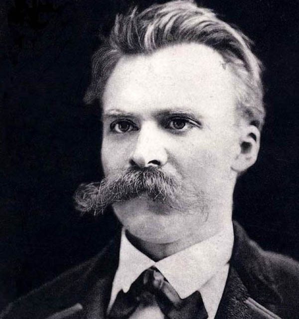

You may or may not be familiar with the below quotation, often attributed to Nietzsche. It bounds across the internet in meme form, usually laid over images of silhouetted people dancing at sunset... or on underground train carriages.

>And those who were seen dancing were thought to be insane by those who could not hear the music.

On a literal level, it’s a rather quirky observation. Nightclubs _would_ look a little off if the music was muted — hordes of fun-loving punters bumping and grinding in silence, like there’s no bloody tomorrow…

With a bit of context and some deeper reading, however, the quotation points to an important and profoundly influential approach to thinking about the world — and our place within it.

## Is there a 'right' way to live?

Friedrich Nietzsche was a 19th-century German philosopher with a bonkers moustache and a brilliant mind. Though he wrote provocatively on many subjects, his core academic focus lay in unpacking why we label some things 'good' and others 'evil', how these judgements are formed, and ultimately how we can transcend such categories to each fulfil our true potential and become the best possible version of ourselves.

Returning to our initial quotation, we can now see why this is a pertinent route into Nietzsche's thinking. Those observing the dancers, Nietzsche says, _cannot hear the music_. The music here can seemingly represent anything — a particular idea, faith, desire — and the ‘dancers’ respond to it, feel it, appreciate it. The observers, meanwhile, untouched by what they cannot hear, dismiss those who respond to it as insane.

On reading the quotation we feel inclined to join the dancers and to condemn the judgemental observers for their ignorance: just because _they_ can’t hear the music doesn’t mean that _we_ are insane for dancing.

So, the take-home message appears to read thus: just because you don’t understand or respond to something, that doesn’t make it insane.

    <h4>Philosophy in Your Twitter Feed</h4>
    
Follow Philosophy Break on Twitter to get philosophy's best questions, wisdom, and ideas directly in your Twitter feed.

    <a target="_blank" rel="noopener noreferrer" class="button secondary" href="https://twitter.com/philosophybreak"><svg xmlns="http://www.w3.org/2000/svg" viewBox="0 0 512 512"><path d="M459.37 151.716c.325 4.548.325 9.097.325 13.645 0 138.72-105.583 298.558-298.558 298.558-59.452 0-114.68-17.219-161.137-47.106 8.447.974 16.568 1.299 25.34 1.299 49.055 0 94.213-16.568 130.274-44.832-46.132-.975-84.792-31.188-98.112-72.772 6.498.974 12.995 1.624 19.818 1.624 9.421 0 18.843-1.3 27.614-3.573-48.081-9.747-84.143-51.98-84.143-102.985v-1.299c13.969 7.797 30.214 12.67 47.431 13.319-28.264-18.843-46.781-51.005-46.781-87.391 0-19.492 5.197-37.36 14.294-52.954 51.655 63.675 129.3 105.258 216.365 109.807-1.624-7.797-2.599-15.918-2.599-24.04 0-57.828 46.782-104.934 104.934-104.934 30.213 0 57.502 12.67 76.67 33.137 23.715-4.548 46.456-13.32 66.599-25.34-7.798 24.366-24.366 44.833-46.132 57.827 21.117-2.273 41.584-8.122 60.426-16.243-14.292 20.791-32.161 39.308-52.628 54.253z"/></svg>Follow Philosophy Break</a>

Now, why is Nietzsche opining this kind of thought? The answer, in fact, might simply be: well, he's not — for it is unclear whether he actually directly wrote our quotation at all. Indeed, [a whole host of writers](https://quoteinvestigator.com/2012/06/05/dance-insane/) could lay claim to being its source.

That it is widely thought to belong to Nietzsche, however, is justified in that the attitude it expresses signifies a recurring idea that permeates his work. This idea emerges when we pair our quotation with something that Nietzsche wrote in one of his last and most read writings, [Thus Spoke Zarathustra](http://www.amazon.com/gp/product/0140441182/ref=as_li_tl?ie=UTF8&tag=philosophybre-20&camp=1789&creative=9325&linkCode=as2&creativeASIN=0140441182&linkId=7eeb1d98e99338b5344b2c6e8eb04c04):

>You have your way. I have my way. As for the right way, the correct way, and the only way, it does not exist.

This pairing — that not understanding something doesn’t mean you can dismiss or belittle it, and that there is no single or correct ‘way’ to life — reveals the core principles of what has come to be known as Nietzsche’s perspectivism.

## A new way of seeing the world: perspectivism

Perspectivism, as the name suggests, is a way of viewing the world through combining differing perspectives. There is not one objective and eternally _true_ way to view or understand the world, Nietzsche suggests, but rather a multitude of differing perspectives that are subject to cultural, societal and biological limitations. As he puts it in a famous aphorism, “There are no facts, only interpretations.” Indeed, philosophers down the ages who declare to have found objective truth have never taken their own biased perspectives into account. Accordingly, it is only through combining these different views that we can begin to appreciate a broader understanding of the universe we live in.

This might seem an obvious point — hardly profound — but perspectivism, as well as [the extent to which Nietzsche truly advocated it](http://nautil.us/blog/nietzsche-is-not-the-proto_postmodern-relativist-some-have-mistaken-him-for) (as opposed to wielding it to undermine objective thinking), is rather controversial, for it points to a _relativist_ attitude towards truth. 

Astrophysicists, for instance, would certainly dismiss the idea that there are a number of different ways to think about, say, the nature of the universe. That life is governed by the laws of physics, they would argue, rests on solid mathematical foundations and myriad experiential data: it is _the_ correct way to think about the universe.

Science’s descriptions have contributed more to the human condition and cohere better with reality than any theological, spiritual, romantic or philosophical viewpoint ever has or indeed could. So, feel free to label all the non-evidence based subjects as mere perspectives, but leave science out of it.

Is perspectivism thus a load of rubbish? Does the deeper reading of our quotation merely reveal a flawed idea? Well, let’s consider how proponents of perspectivism could respond.

Sure, they might say, science has been remarkably successful at explaining and harnessing nature for our benefit, but like everything else it remains a human construct.

The imperfect theories of science are not eternal; they simply express the way _we_ — with our fleeting, biologically limited existences — currently think the universe works, evidenced by data that _we_ — with our primitive, restrictive tools — have access to.

Brilliantly clever? Yes. Wonderfully useful? Yes. _Objectively_ true? Not so sure, for science cannot escape the subjective lens of humankind. Besides, its focus on the physical structure of the universe has led to the sacrifice of something rather significant: meaning.

Take the heart. Is it only a lump of muscle that pumps blood around the body? Or is it, too, a hackneyed metaphor for love? Take stars. Are they only burning masses of exploding gasses, billions of miles away? Or are they, too, the inspiration for a million teenage poets, who weave their hopeless troubles into the night’s sky?

The point, to put an end to this overblown language, is that surely there is a place for all these things: surely our worldview is enriched by collating different perspectives, by thinking of the universe not only in terms of how it works but also in terms of what it means.

Living in an internet age in which mortal battles in online comments sections rage on a daily basis, we could perhaps learn from the thought that none of us really perceive or opine _the_ truth, as such truth may be permanently denied to us due to our limited and finite perspectives.

So, rather than dismiss as insane or stupid opinions that we can’t understand or that differ from our own dogmatic agendas, if we were to consider and combine our subjective perspectives in a rational and thoughtful way — a way that lent sufficient weight to evidence-based approaches, of course — then perhaps, as well as learn something new, we might all get along a bit better, too.

Let's conclude this brief discussion on perspectivism with some final words from our main man Nietzsche, taken from arguably his masterwork, [On the Genealogy of Morals](http://www.amazon.com/gp/product/0199537089/ref=as_li_tl?ie=UTF8&tag=philosophybre-20&camp=1789&creative=9325&linkCode=as2&creativeASIN=0199537089&linkId=3c9dcd07416124082b4457889629bea5): 

>And as to whether these fruits of ours are to _your_ taste? But what is that to the trees!

## Further reading

If you're interested in learning more about Nietzsche and his fascinating, oft-misunderstood philosophy, [we've compiled a reading list](/reading-lists/friedrich-nietzsche/) consisting of just the right mix of primary and secondary literature to give you a well-rounded understanding of exactly why Nietzsche has come to dominate today's popular culture.

Hit the banner below now to further explore the wonderful world of Nietzsche's thinking. 

<a class="reading-list cta" href="/reading-lists/friedrich-nietzsche/">
    
    

    

        <svg xmlns="http://www.w3.org/2000/svg" viewBox="0 0 576 512"><path fill="#fff" d="M542.22 32.05c-54.8 3.11-163.72 14.43-230.96 55.59-4.64 2.84-7.27 7.89-7.27 13.17v363.87c0 11.55 12.63 18.85 23.28 13.49 69.18-34.82 169.23-44.32 218.7-46.92 16.89-.89 30.02-14.43 30.02-30.66V62.75c.01-17.71-15.35-31.74-33.77-30.7zM264.73 87.64C197.5 46.48 88.58 35.17 33.78 32.05 15.36 31.01 0 45.04 0 62.75V400.6c0 16.24 13.13 29.78 30.02 30.66 49.49 2.6 149.59 12.11 218.77 46.95 10.62 5.35 23.21-1.94 23.21-13.46V100.63c0-5.29-2.62-10.14-7.27-12.99z"/></svg>READING LIST
        

        <h3>Friedrich Nietzsche</h3>
        
The Top 7 Books to Read

    
    
    <svg class="cta swing" xmlns="http://www.w3.org/2000/svg" viewBox="0 0 320 512"><path d="M285.476 272.971L91.132 467.314c-9.373 9.373-24.569 9.373-33.941 0l-22.667-22.667c-9.357-9.357-9.375-24.522-.04-33.901L188.505 256 34.484 101.255c-9.335-9.379-9.317-24.544.04-33.901l22.667-22.667c9.373-9.373 24.569-9.373 33.941 0L285.475 239.03c9.373 9.372 9.373 24.568.001 33.941z"/></svg>
</a>