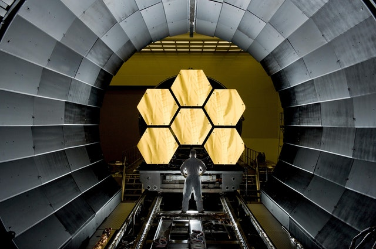

You may or may not be familiar with the below quotation. It bounds across the internet in meme form, usually laid over images of silhouetted people dancing at sunset... or on underground train carriages.

>"And those who were seen dancing were thought to be insane by those who could not hear the music" — Nietzsche.

On a literal level, it’s a rather quirky observation. Nightclubs would look a little off if the music was muted – hordes of pissed-up punters bumping and grinding in silence, like there’s no bloody tomorrow…

With a bit of context and some deeper reading, however, the quotation points to an important and profoundly influential approach to thinking about the world – and our place within it.

## Nietzsche is not an enigma

The very form of quotations – the apostrophes clothing the words before that combined hammer-blow of surname and full stop – fixes our attention, arouses our curiosity. Listen up brain, our eyes signal, this statement is followed by a mysterious, virtually unpronounceable surname, and therefore taps into an esoteric realm of knowledge and meaning that we must pay attention to.

‘Nietzsche’ thus appears as an enigmatic accompaniment to a lofty statement, an exotic brand, an unknowable badge of authenticity… when in actual fact, Friedrich Nietzsche (pronounced neat-cha) was simply a troubled German guy from the 19th century with a bonkers moustache and a brilliant mind.

Nietzsche wrestled not with obscure inaccessible esoteric realms. Rather, he simply attempted to unpack why we label some things 'good' and others 'evil', how these judgements are formed, and ultimately how we can transcend such categories to each fulfil our true potential and become the best possible version of ourselves.

Let’s return to our initial quotation, which is a good route into Nietzsche’s thinking:

>And those who were seen dancing were thought to be insane by those who could not hear the music.

Those observing the dancers, Nietzsche says, cannot hear the music. The music here can seemingly represent anything – a particular idea, faith, desire – and the ‘dancers’ respond to it, feel it, appreciate it. The observers, meanwhile, untouched by what they cannot hear, dismiss those who respond to it as insane.

On reading the quotation we feel inclined to join the dancers and to condemn the judgemental observers for their ignorance: just because they can’t hear the music doesn’t mean that we are insane for dancing.

So, the take-home message appears to read thus: just because you don’t understand or respond to something, that doesn’t make it insane.

Now, why is Nietzsche spouting this sort of thing? The answer, in fact, might simply be: well, he's not – for it is unclear whether he actually directly wrote our quotation at all. Indeed, [a whole host of writers](https://quoteinvestigator.com/2012/06/05/dance-insane/) could lay claim to being its source.

That it is widely thought to belong to Nietzsche, however, is justified in that the attitude it expresses signifies a recurring idea that permeates his work. This idea emerges when we pair our quotation with something that Nietzsche wrote in one of his last and most read writings, Thus Spoke Zarathustra:

>"You have your way. I have my way. As for the right way, the correct way, and the only way, it does not exist" — Nietzsche.

This pairing – that not understanding something doesn’t mean you can dismiss or belittle it, and that there is no single or correct ‘way’ to life – reveals the core principles of what has come to be known as Nietzsche’s Perspectivism.

## A new way of seeing the world: Perspectivism

Perspectivism, as the name suggests, is a way of viewing the world through combining differing perspectives. There is not one objectively true way to view the world, Nietzsche thinks, but rather a multitude of differing perspectives that are subject to cultural, societal and biological limitations. It is only through combining these different views that we can begin to appreciate a broader understanding of the universe we live in.

This might seem an obvious point – hardly profound – but Perspectivism is actually rather controversial.

Astrophysicists, for instance, would certainly dismiss the idea that there are a number of different ways to think about, say, the nature of the universe. That life is governed by the laws of physics, they would argue, rests on solid mathematical foundations and myriad experiential data: it is _the_ correct and objectively true way to think about the universe.

Science’s descriptions have contributed more to the human condition and cohere better with reality than any theological, spiritual, romantic or philosophical viewpoint ever has or indeed could. So, feel free to label all the non-evidence based subjects as mere perspectives, but leave science out of it.

Is Perspectivism thus a load of rubbish? Does the deeper reading of our quotation merely reveal a flawed idea? Well, let’s consider how Nietzsche could respond to these scientists.

Sure, he might say, science has been remarkably successful at explaining and harnessing nature for our benefit, but like everything else it remains a human construct.

The imperfect theories of science are not eternal; they simply express the way we – with our fleeting, biologically limited existences – currently think the universe works, evidenced by data that we – with our primitive, restrictive tools – have access to.

Brilliantly clever? Yes. Wonderfully useful? Yes. Objectively true? Not so sure, for science cannot escape the subjective lens of humankind. Besides, its focus on the physical side of the universe has led to the sacrifice of something rather significant: meaning.

Take the heart. Is it only a lump of muscle that pumps blood around the body? Or is it, too, a hackneyed metaphor for love? Take stars. Are they only burning masses of exploding gasses, billions of miles away? Or are they, too, the inspiration for a million teenage poets, who weave their hopeless troubles into the night’s sky?

The point, to put an end to this overblown language, is that surely there is a place for all these things: surely our worldview is enriched by collating different perspectives, by thinking of the universe not only in terms of how it works but also in terms of what it means.

Living in an internet age in which mortal battles in online comments sections rage on a daily basis, we could perhaps learn from the thought that none of us really perceive or opine the truth, as such truth may be permanently denied to us due to our limited and finite perspectives.

So, rather than dismiss as insane or stupid opinions that we can’t understand or that differ from our own dogmatic agendas, if we were to consider and combine our subjective perspectives in a rational and thoughtful way, then perhaps, as well as learn something new, we might all get along a bit better, too.

Let's conclude this brief discussion on Perspectivism with some final words from our main man Nietzsche, taken from arguably his masterwork, On the Genealogy of Morals: 

>"And as to whether these fruits of ours are to your taste? But what is that to the trees!"