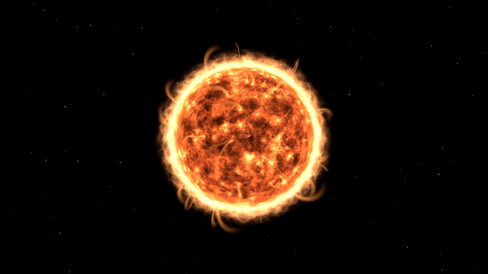
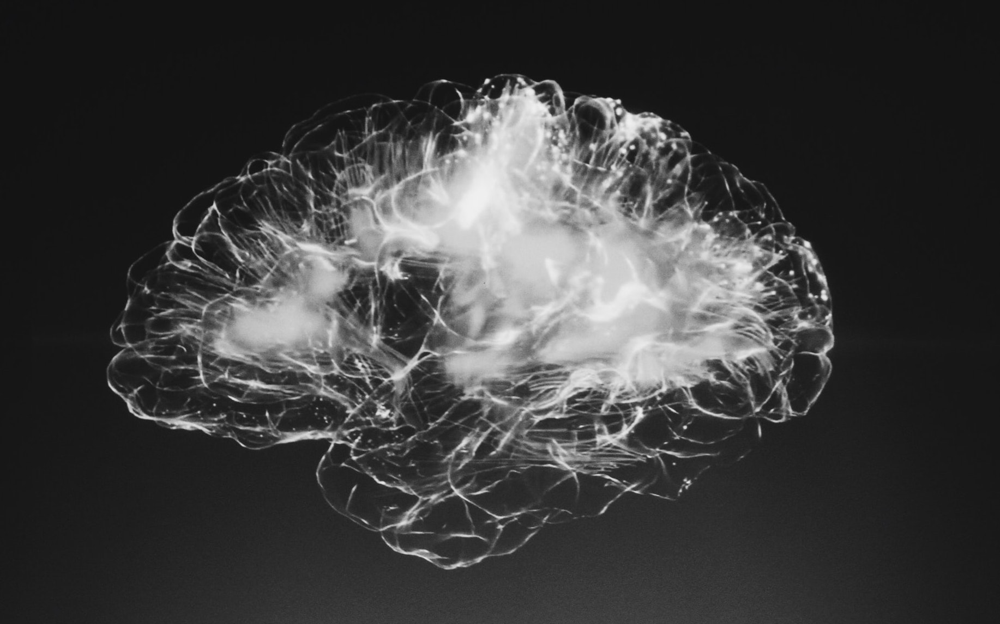

In his 2011 book <a target="_blank" rel="noopener noreferrer sponsored" href="http://www.amazon.com/Beginning-Infinity-Explanations-Transform-World/dp/0143121359?_encoding=UTF8&qid=1656843831&sr=8-1&linkCode=ll1&tag=philosophybre-20&linkId=07514655ee7ba73a83de819f2e487203&language=en_US&ref_=as_li_ss_tl">The Beginning of Infinity</a>, the physicist David Deutsch identifies a common attitude some people hold: that there’s nothing significant about humanity, and that in the grand cosmic scheme of things our lives don’t really matter. This is sometimes called the ‘Principle of Mediocrity’.

Deutsch thinks something that feeds the Principle of Mediocrity is the belief that our place and function in the universe is rather typical. As Stephen Hawking famously put it: 

>[Humans are] just a chemical scum on the surface of a typical planet that’s in orbit round a typical star on the outskirts of a typical galaxy. 

Deutsch argues that while it is true we’re on a (somewhat) typical planet of a typical star in a typical galaxy, “we are far from typical of the matter in the universe”:
 
>For one thing, about 80% of that matter is thought to be invisible ‘dark matter’, which can neither emit nor absorb light… Only the remaining 20% is matter of the type we parochially call ‘ordinary matter’. 

And this ‘ordinary’ matter is ordinary only in the sense that we are familiar with it. ‘Ordinary’ matter is characterized by glowing continuously, and its most common form is the hot plasma found in stars. 

“We scums,” Deutsch explains, “contain liquids and complex chemicals which can only exist at a much lower range of temperatures.” 

Yet, like stars, because we are made of ‘ordinary’ matter, we also glow continuously. “We do not usually think of ourselves as glowing,” Deutsch writes, “but that is due to the limitations of our senses: we emit radiant heat, which is infrared light, and also light in the visible range, too faint for our eyes to detect.”

So, Deutsch notes, humans are made of very uncommon forms of ‘ordinary’ matter, which itself is a rather exotic category of stuff in the cosmos.

## What does the ‘typical’ universe look like?

As well as being made of untypical material, Deutsch argues we are also situated in an untypical location. On the cosmic scale, concentrations of matter as dense as humans, our planet, and our star, though numerous, are rare indeed. 

The vast majority of the universe is vacuum, plus radiation and dark matter. “Ordinary matter is familiar to us only because we are made of it,” Deutsch says, “and because of our untypical location near large concentrations of it.”

<!--big subscribe-->

    
    <h4>Get one mind-opening philosophical idea delivered to your inbox every Sunday (free):</h4>
    

        <form style="margin-bottom: 1em" action="https://philosophybreak.us19.list-manage.com/subscribe/post?u=6f4dbbebde3dd2a464df28ec3&amp;id=48d478eebf&amp;f_id=0083aae4f0" method="post" id="mc-embedded-subscribe-form" name="mc-embedded-subscribe-form" target="_blank">
            <input type="email" placeholder="Your Email Address..." ref={this.input} name="EMAIL" required/>
            <input type="hidden" name="tags" value="6266048" />
            <button class="button primary" type="submit"><svg xmlns="http://www.w3.org/2000/svg" viewBox="0 0 512 512"><path d="M464 64H48C21.49 64 0 85.49 0 112v288c0 26.51 21.49 48 48 48h416c26.51 0 48-21.49 48-48V112c0-26.51-21.49-48-48-48zm0 48v40.805c-22.422 18.259-58.168 46.651-134.587 106.49-16.841 13.247-50.201 45.072-73.413 44.701-23.208.375-56.579-31.459-73.413-44.701C106.18 199.465 70.425 171.067 48 152.805V112h416zM48 400V214.398c22.914 18.251 55.409 43.862 104.938 82.646 21.857 17.205 60.134 55.186 103.062 54.955 42.717.231 80.509-37.199 103.053-54.947 49.528-38.783 82.032-64.401 104.947-82.653V400H48z"/></svg>Subscribe to Weekly Emails</button>
        </form>
        
Join 6,000+ subscribers enjoying one nugget of profundity per week. Unsubscribe any time. 

    

To get to a more ‘typical’ place in the universe, you’d need to travel beyond Earth, beyond the solar system, beyond even the Milky Way, trillions upon trillions of kilometers outwards, deep into intergalactic space. 

What would it be like there? “Imagine the whole of space divided into cubes the size of our solar system,” Deutsch writes: 

>If you were observing from a typical one of them, the sky would be pitch black. The nearest star would be so far away that if it were to explode as a supernova, and you were staring directly at it when its light reached you, you would not see even a glimmer. That is how big and dark the universe is. 

“And it is cold,” Deutsch continues, “cold enough to freeze every known substance except helium… And it is empty: the density of atoms out there is below one per cubic meter. That is a million times sparser than atoms in the space between the stars, and those atoms are themselves sparser than in the best vacuum that human technology has yet achieved… 

“No life could have evolved there, nor any intelligence. Nothing changes there. Nothing happens. The same is true of the next cube and the next, and if you were to examine a million consecutive cubes in any direction the story would be the same.

“Cold, dark and empty,” Deutsch summarizes: 

>That unimaginably desolate environment is typical of the universe ― and is another measure of how <i>un</i>typical the Earth and its chemical scum are, in a straightforward physical sense. 

But we are not only untypical in the straightforward physical sense, Deutsch goes on to argue in <a target="_blank" rel="noopener noreferrer sponsored" href="http://www.amazon.com/Beginning-Infinity-Explanations-Transform-World/dp/0143121359?_encoding=UTF8&qid=1656843831&sr=8-1&linkCode=ll1&tag=philosophybre-20&linkId=07514655ee7ba73a83de819f2e487203&language=en_US&ref_=as_li_ss_tl">The Beginning of Infinity</a>. Humans are radically untypical in that we are capable of _knowing_ how untypical we are. In other words, we possess _intelligence:_ we have the capacity to build and implement knowledge. 

As Robert Nozick also observes in his meditation on [living meaningfully in a vast reality](/articles/on-living-meaningfully-in-a-vast-universe-robert-nozick/), each of us is a _self-aware_ part of the universe, and has the power to shape _other parts_ of the universe. 

The Principle of Mediocrity might make us think our lives lack significance, Deutsch notes, but the reality of our situation is very different. We’re far more significant, far more _interesting_, cosmically-speaking, than the cold empty deserts of ‘typical’ intergalactic space. 

We should thus look out at the cosmos not with defeatism, but with optimism: its vast scope and mystery represents not our powerlessness or mediocrity, but our unique, awesome _potential_ as intelligent, self-aware beings. 

## In just 5 days, you’ll know philosophy’s best answers to life’s big questions

If you’re intrigued to learn more about humanity’s place in the universe, but not sure where to start, check out our [5-day introductory philosophy course](/lifes-big-questions/), which distills the great philosophers’ best answers to life’s big questions, including how we should live, whether we have free will, if perception is reality, and why anything exists. Learn more and see if it’s for you here:

<!--life's big questions-->

    
    <h4>Life’s Big Questions: Your Concise Guide to Philosophy’s Most Important Wisdom</h4>
    
From why anything exists to how we should live, unlock philosophy’s best answers to life’s big questions.

    <a class="button primary" href="/lifes-big-questions/"><svg xmlns="http://www.w3.org/2000/svg" viewBox="0 0 512 512"><path d="M504 256C504 119 393 8 256 8S8 119 8 256s111 248 248 248 248-111 248-248zm-448 0c0-110.5 89.5-200 200-200s200 89.5 200 200-89.5 200-200 200S56 366.5 56 256zm72 20v-40c0-6.6 5.4-12 12-12h116v-67c0-10.7 12.9-16 20.5-8.5l99 99c4.7 4.7 4.7 12.3 0 17l-99 99c-7.6 7.6-20.5 2.2-20.5-8.5v-67H140c-6.6 0-12-5.4-12-12z"/></svg>Get Instant Access</a>
&#9733;&#9733;&#9733;&#9733;&#9733; (50+ reviews for our courses)

