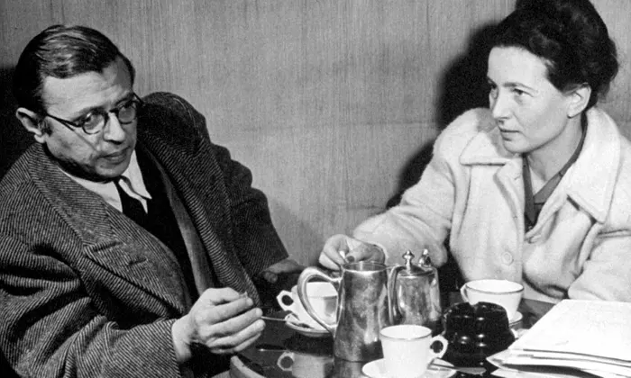

_This article is a modified extract from my [How to Live a Good Life guide](/how-to-live-a-good-life/), which unpacks and compares the practical wisdom of 7 major philosophies, including Stoicism, Existentialism, and Buddhism._

---

A personal philosophy is a set of explanations, values, and principles by which we navigate existence: it’s a framework that describes both what we think about the world and how we can best live in it.

Crucially, whether we’re conscious of it or not, we each _already have_ a philosophy for life.

Our personal philosophies may have been shaped by our families, cultures, religions — or perhaps we’ve formed and affirmed them ourselves.

The point is this: wherever they came from, and regardless of the extent to which we actively reflect on them, we all have a set of values and principles that underpin everything we do — from the careers we choose, to the people we like and dislike; from the politicians we vote for, to the activities that fill our free time.

## What questions should a personal philosophy help us answer?

In our day-to-day lives, our personal philosophies typically sit in the background unchallenged. [As Heidegger observes](/articles/heidegger-on-being-authentic-in-an-inauthentic-world/), it is at moments of crisis, or when wrestling with the more abstract mysteries of life, that the fundamental principles by which we navigate existence come under the spotlight.

For an established, battle-tested personal philosophy should help us answer questions like the following:

- How can I face up to my own mortality, as well as that of my loved ones?
- What does it mean to live a good life, and how can I live one?
- What is worth my time? What isn’t? What’s the most important thing to prioritize?
- What do I owe to other people, and how can I cultivate better relationships?
- Am I seeing the reality of my situation in life clearly?
- How can I stop worrying about the future and derive more meaning and fulfillment from the here and now?
- When I encounter problems, what guiding principles should I use to forge the best path forward?
- Are there any enhancements I can make to my outlook or way of life?

Given their fundamental importance, then, the question is: _are our personal philosophies working for us?_

Are they justified? Do we need to better define them? Do we need to radically overhaul them? Are there any enhancements we could make that would empower us to live happier, more meaningful lives, and provide better answers to the questions above?

## Building a personal philosophy: 6 example philosophies for life

Thankfully, when it comes to shaping our personal philosophies, we do not need to start from scratch. Philosophers have been sharing incredibly insightful answers to life’s big questions for thousands of years.

In the remainder of this article, we’ll consider six of the world’s wisest and most influential philosophies for living.  

By exploring and discussing the wisdom of Aristotle, Epicureanism, Stoicism, Buddhism, Confucianism, and Existentialism, we’ll understand why millions of people have been guided by these philosophies throughout history — and see if they offer anything we want to incorporate into our _own_ way of life.

Hopefully, then, by the end of this article, we’ll come away with clearer ideas not just about some of the most important intellectual frameworks in history, but also about our own personal philosophies.

First up, we travel back to ancient Greece...

## 1. Aristotle: achieving excellence

Aristotle (384 - 322 BCE) was an ancient Greek philosopher who, like his legendary teacher Plato (and _his_ legendary teacher, Socrates), is considered to be one of the most significant figures in the history of Western philosophy.

One of the key innovations of Aristotle’s philosophy for life — and why it remains so enduring today — is that it’s a philosophy grounded entirely in the human world: it doesn’t look _beyond_ everyday human experience in order to declare what’s good.

That might sound like a relatively uncontroversial approach. But many major philosophies and religions typically _do_ look beyond the everyday to advise on what goodness is — say at a transcendent idea, realm, or God.

By contrast, Aristotle thinks the good life simply emerges from our behavior.

We are not born perfect beings; we are not born evil. Almost all of us are capable of good lives, and the more we try to act according to excellence or ‘virtue’ over the course of our lifetimes, the happier we’ll be.

A key concept for Aristotle’s philosophy of the good life is _eudaimonia_, a Greek word broadly meaning happiness or flourishing.

Importantly, Aristotle characterizes eudaimonia not as a feeling, but as an _activity_. Living a good, eudaimonic life means using our rationality to flourish and fulfill our potential for excellence in all that we do.

Aristotle tells us that while luck does have a significant part to play in determining how our lives will turn out, we are all responsible for improving our existences, and many of us are capable of excellence if we put our minds to it.

The reward for excellence is happiness, for far from a fleeting psychological state, happiness (eudaimonia) consists in _good rational activity_ ― in knowing that we are living well and fulfilling our potential as human beings.

For Aristotle, living well thus means getting out into the world and acting excellently in the heat of day-to-day life. It means flourishing and fulfilling our potential in all that we do. It means forging deep and meaningful relationships with our fellow human beings, while maintaining self-sufficiency. It means using reason to navigate all that life throws at us, and creating happiness through the active, ongoing achievement of excellence.

Though he was writing over 2,300 years ago, Aristotle’s influence today looms larger than ever. As the philosopher Robert J. Anderson wrote in his 1986 essay _Purpose and Happiness in Aristotle:_ 

>There is no ancient thinker who can speak more directly to the concerns and anxieties of contemporary life than can Aristotle. Nor is it clear that any modern thinker offers as much for persons living in this time of uncertainty.

If you’re interested in learning more about Aristotle’s hugely influential philosophy for the eudaimonic life, you might like these related reads:

- [The ‘Golden Mean’: Aristotle’s Guide to Living Excellently](/articles/the-golden-mean-aristotle-guide-to-living-excellently/)
- [Aristotle On Why Leisure Defines Us More than Work](/articles/aristotle-on-why-leisure-defines-us-more-than-work/)
- [Aristotle On the 3 Types of Friendship (and How Each Enriches Life)](/articles/aristotle-on-the-3-types-of-friendship-and-how-they-enrich-life/)
- [Aristotle: the Best 9 Books to Read](/reading-lists/aristotle/)

## 2. Epicureanism: living for pleasure

Aristotle wasn’t the only ancient Greek with big ideas about how we should be living our lives. Epicurus (341 - 270 BCE), on whose teachings Epicureanism is based, disagreed with the demanding elitism of Aristotle’s ethics. 

While excellence is important, it is not what happiness and the good life are really guided by. The reality is far simpler, Epicurus claims: the good life is one in which pleasure and tranquility are maximized, and pain is minimized…

Though Epicureanism is often mischaracterized as a debaucherous form of hedonism, Epicurus actually saw philosophy as a kind of _therapy._

We make many mistakes about ourselves and reality, Epicurus thought, and these mistakes can cause us a great deal of anxiety. 

Through careful use of philosophical reasoning, however, we can knock the wind out of our false beliefs, rid ourselves of the pain they cause, and live lives of pleasure and tranquility. 

As the ancient Epicurean philosopher Lucretius tells us, Epicureans think the ultimate good for human nature is as follows: 

>To avoid bodily pain, to have a mind free from anxiety and fear, and to enjoy the pleasures of the senses.

This emphasis on simple pleasures distinguishes Epicurus from other ancient Greek thinkers of the time — including Plato, Aristotle, and Zeno’s Stoics — whose characterization of the good life, as we’ve seen with Aristotle, focuses less on pleasure and more on the pursuit of excellence and virtue. 

Another distinguishing factor is that, unlike those rival schools, Epicurus’s Garden admitted women, and even one of Epicurus’s slaves.

 and his followers discussed philosophy, and lived lives of tranquility.")

This relatively liberal admissions policy alarmed Epicurus’s opponents, who spread a number of rather slanderous stories about him and his followers. (In their more extreme accusations, for instance, the Stoics said the Epicureans lived in conditions of depraved sexual perversion).

Far from a debaucherous party, however, it is thought life in The Garden was actually remarkably simple.

The prevailing diet consisted mainly of bread, water, beans, and a little wine, and the Epicureans spent their days learning, resting, cultivating friendships, avoiding public life, and discussing philosophy.

So, though often caricatured as a rather indulgent, pleasure-obsessed philosophy, Epicureanism is actually more about living life free from anxiety and bodily pain, and places a strong emphasis on friendship and community in the search for a meaningful, happy human life.

Epicurus offers a simple yet powerful recipe for happiness that allowed Epicurean communities all around the world to flourish centuries after his death, and which we might find to be a pleasing balm for the complexities of life today — one that certainty pleased figures like Thomas Jefferson, who in a letter to William Short wrote:

>As you say of yourself, I too am an Epicurean. I consider the genuine (not the imputed) doctrines of Epicurus as containing everything rational in moral philosophy which Greece and Rome have left us.

If you’re interested in learning more about Epicureanism, you might like these related reads:

- [Epicureanism Defined: Philosophy is a Form of Therapy](/articles/epicureanism-defined-philosophy-is-a-form-of-therapy/)
- [Epicurus’s Principal Doctrines: 40 Aphorisms for Living Well](/articles/epicurus-principal-doctrines-40-aphorisms-for-living-well/)
- [Epicurus On Why Death Should Not Concern Us](/articles/epicurus-on-why-death-should-not-concern-us/)
- [Why Death is Nothing to Fear: Lucretius and Epicureanism](/articles/why-death-is-nothing-to-fear-lucretius-epicureanism/)
- [Epicureanism: the Best 6 Books to Read](/reading-lists/epicureanism/)

## 3. Stoicism: beating anxiety

Like Epicureanism, Stoicism — the third and final philosophy for life we’ll consider from ancient Greece — suffers from being misunderstood.

Just as Epicureanism is often mischaracterized as involving reckless self-indulgence, so Stoicism is wrongly thought to be about repressing our emotions and living with a stiff upper lip.

But Stoicism’s approach is far more sophisticated than ‘grit your teeth’. In fact, Stoicism’s aim is to enhance our perspectives in such a way that we’ll never need to grit our teeth again…

<!--small subscribe-->

    <h4>In one concise email each Sunday, I break down a famous idea from philosophy. You get the distillation straight to your inbox:</h4>
    

        <form action="https://app.convertkit.com/forms/5812400/subscriptions" method="post" data-sv-form="5812400" data-uid="be0e52d3c0" data-format="inline" data-version="6" data-options="{&quot;settings&quot;:{&quot;after_subscribe&quot;:{&quot;action&quot;:&quot;message&quot;,&quot;success_message&quot;:&quot;Thank you, philosopher! Your welcome email will land in your inbox shortly.&quot;,&quot;redirect_url&quot;:&quot;https://philosophybreak.com/thank-you/&quot;},&quot;analytics&quot;:{&quot;google&quot;:null,&quot;fathom&quot;:null,&quot;facebook&quot;:null,&quot;segment&quot;:null,&quot;pinterest&quot;:null,&quot;sparkloop&quot;:null,&quot;googletagmanager&quot;:null},&quot;modal&quot;:{&quot;trigger&quot;:&quot;timer&quot;,&quot;scroll_percentage&quot;:null,&quot;timer&quot;:5,&quot;devices&quot;:&quot;all&quot;,&quot;show_once_every&quot;:15},&quot;powered_by&quot;:{&quot;show&quot;:false,&quot;url&quot;:&quot;https://convertkit.com/features/forms?utm_campaign=poweredby&amp;utm_content=form&amp;utm_medium=referral&amp;utm_source=dynamic&quot;},&quot;recaptcha&quot;:{&quot;enabled&quot;:false},&quot;return_visitor&quot;:{&quot;action&quot;:&quot;show&quot;,&quot;custom_content&quot;:&quot;&quot;},&quot;slide_in&quot;:{&quot;display_in&quot;:&quot;bottom_right&quot;,&quot;trigger&quot;:&quot;timer&quot;,&quot;scroll_percentage&quot;:null,&quot;timer&quot;:5,&quot;devices&quot;:&quot;all&quot;,&quot;show_once_every&quot;:15},&quot;sticky_bar&quot;:{&quot;display_in&quot;:&quot;top&quot;,&quot;trigger&quot;:&quot;timer&quot;,&quot;scroll_percentage&quot;:null,&quot;timer&quot;:5,&quot;devices&quot;:&quot;all&quot;,&quot;show_once_every&quot;:15}},&quot;version&quot;:&quot;6&quot;}" min-width="400 500 600 700 800">
        
<ul data-element="errors" data-group="alert"></ul>

            

                <input name="email_address" aria-label="Your Email Address..." placeholder="Your Email Address..." required type="email" />
            

            <button class="button primary" type="submit" data-element="submit">

<svg xmlns="http://www.w3.org/2000/svg" viewBox="0 0 512 512"><path d="M464 64H48C21.49 64 0 85.49 0 112v288c0 26.51 21.49 48 48 48h416c26.51 0 48-21.49 48-48V112c0-26.51-21.49-48-48-48zm0 48v40.805c-22.422 18.259-58.168 46.651-134.587 106.49-16.841 13.247-50.201 45.072-73.413 44.701-23.208.375-56.579-31.459-73.413-44.701C106.18 199.465 70.425 171.067 48 152.805V112h416zM48 400V214.398c22.914 18.251 55.409 43.862 104.938 82.646 21.857 17.205 60.134 55.186 103.062 54.955 42.717.231 80.509-37.199 103.053-54.947 49.528-38.783 82.032-64.401 104.947-82.653V400H48z"/></svg>Join 15,000+ Subscribers</button>
            

            

        </form>
        
💭 One short philosophical email each Sunday. Unsubscribe any time.

    

Stoicism was founded by the ancient Greek thinker Zeno, who arrived in Athens shortly before 300 BCE (around the same time Epicurus established The Garden).

Zeno began lecturing at the Painted Stoa (a covered walkway) in the center of Athens, and attracted a number of followers who, accordingly, came to be known as the Stoics. 

Unfortunately, none of Zeno’s works survive — nor do those of his successors, Cleanthes and Chrysippus. We know of their work only through the quotations and summaries of subsequent authors.

Our knowledge of Stoicism thus mostly comes from its three major Roman practitioners and popularizers: Seneca, Epictetus, and Marcus Aurelius — each of whom knew the now lost ancient Greek works, and built upon them with their own hugely influential contributions.

, left; Epictetus (50 CE - 135 CE), center; and Marcus Aurelius (121 CE - 180 CE).")

The three major Roman Stoics do not present many arguments for why Stoicism as a broader philosophy is true: they mostly presume it _is_ true, and then go on to discuss its profound ethical and psychological lessons.

What are those lessons? Well, perhaps the three most important are the following:

1. Being a good person is the only thing that matters. 
2. Anyone is capable of being a good person, regardless of circumstance.
3. The most crucial contribution we can make to our wellbeing is understanding the _dichotomy of control._

I discuss the [dichotomy of control in detail here](/articles/dichotomy-of-control-a-stoic-device-for-a-tranquil-mind/), but it’s summarized nicely by Marcus Aurelius when he writes in his Meditations:

>You have power over your mind — not outside events. Realize this, and you will find strength.

The German philosopher Arthur Schopenhauer described Stoicism in glowing terms, writing in <a target="_blank" rel="noopener noreferrer sponsored" href="https://www.amazon.com/World-Will-Representation-Vol/dp/0486217612?&linkCode=ll1&tag=philosophybre-20&linkId=db02ca66d0db19bc4e6d505943ff1e3e&language=en_US&ref_=as_li_ss_tl">The World as Will and Representation</a>:

>Stoic philosophy is the most complete development of practical reason in the true and genuine sense of the word; it is the highest summit to which man can attain by the mere use of his reason…

To see why Seneca, Epictetus, and Marcus Aurelius continue to inspire millions of people around the world today, and how you might incorporate their lessons into your own personal philosophy, consider checking out these related reads:

- [The 4 Cardinal Virtues: Stoicism’s Roadmap to the Best Life Possible](/articles/four-cardinal-virtues-stoicism-roadmap-to-the-best-life-possible/)
- [The Dichotomy of Control: a Stoic Device for a Tranquil Mind](/articles/dichotomy-of-control-a-stoic-device-for-a-tranquil-mind/)
- [Stoicism and Emotion: Don’t Repress Your Feelings, Reframe Them](/articles/stoicism-and-emotion-dont-repress-your-feelings-reframe-them/)
- [Seneca: To Find Peace, Stop Chasing Unfulfillable Desires](/articles/seneca-to-find-peace-stop-chasing-unfulfillable-desires/)
- [Amor Fati: the Stoics’ and Nietzsche’s Different Takes on Loving Fate](/articles/amor-fati-the-stoics-and-nietzsche-different-takes-on-loving-fate/)
- [Seneca On Coping with the Shortness of Life](/articles/seneca-on-coping-with-the-shortness-of-life/)
- [Stoicism: the Best 6 Books to Read](/reading-lists/stoicism/)
- [Marcus Aurelius: the Best 5 Books to Read](/reading-lists/marcus-aurelius-best-books/)

## 4. Buddhism: ending suffering

Centuries before the therapeutic philosophical approaches of Epicureanism and Stoicism, the Buddha was sharing his recommendations for how we can see the world clearly, banish suffering, and live good lives…

Buddhism is a philosophical tradition based on the teachings of Siddhartha Gautama, a prince who lived in ancient India around 500 BCE (exact dates vary).

 when he achieved enlightenment following years of searching for the truth about reality. He spent the rest of his life traveling to share his lessons, inspiring the various Buddhist schools that exists across the world today.")

It’s thought the Buddha’s teachings were originally transmitted orally, and only written down in the 1st century BCE in Sri Lanka, with further Buddhist branches spreading throughout India, China, Tibet, Japan, and South-East Asia.

Encompassing as it does a variety of traditions, beliefs, and spiritual practices, Buddhism can be viewed as both a religion and a philosophy.

However, unlike some other religions, its original philosophical teachings are not (necessarily) grounded in any appeals to ‘supernatural’ elements like a creator God or gods, resulting in the emergence of secular Buddhist movements that engender keen philosophical engagement.

Rather than persuade us to believe in anything in particular, the Buddha focuses like a laser on just one subject: teaching us how to alleviate _dukkha_, a Pali word often translated as ‘suffering’, but perhaps stronger than this, intended to capture all of life’s dissatisfaction, disappointment, unfulfilled hopes, and unhappiness. 

Indeed, while the ancient Greeks broadly saw the goal of life as eudaimonia, excellence, and happiness, Buddhists think the purpose of life is _enlightenment:_ seeing the world as it really is, and thus freeing ourselves from suffering. 

The Buddha packages his core teachings in his [Four Noble Truths](/articles/the-buddha-four-noble-truths-the-cure-for-suffering/), which can be summarized as follows: 

1. There is _dukkha_ (suffering)
2. Suffering has a cause
3. Suffering can be eliminated
4. There is a path to eliminating suffering (the Eightfold Path)

Suffering ultimately springs from desire or craving _(tanha)_, which arises from a fundamental mismatch between our worldview and how things really are.

To banish craving and eliminate suffering, the Buddha tells us, we must correct our worldview to see reality clearly.

Three concepts are central to the Buddha’s teaching here: dukkha (suffering), impermanence (everything ends), and [anātman](/articles/anatman-buddhist-doctrine-of-no-self-why-you-do-not-really-exist/) (there is no persisting soul or self). It is by truly internalizing these ‘Three Marks of Existence’ that we can, via the Eightfold Path, see reality clearly and achieve enlightenment. 

As the Buddha puts it in his first sermon, _The Setting in Motion of the Wheel of Teaching:_

>There is a path that leads to the cessation of suffering: it is, indeed, the Noble Eightfold Path: right views, right intentions, right speech, right actions, right livelihood, right effort, right mindfulness, and right concentration.

While perhaps best known in the West for its advocation of detaching from our desires, as well as its practices like mindfulness and meditation, the core of Buddhist philosophy has much to offer on a broad range of topics, from metaphysics to ethics, and many different schools and doctrines have grown up around its original teachings.

As the scholar Richard Gombrich puts it in his book <a target="_blank" rel="noopener noreferrer sponsored" href="https://www.amazon.com/How-Buddhism-Began-Conditioned-Teachings/dp/1138328936?&linkCode=ll1&tag=philosophybre-20&linkId=cd94258c430c492116ea29d478696c5f&language=en_US&ref_=as_li_ss_tl">How Buddhism Began</a>:

>I do not see how one could exaggerate the importance of the Buddha’s ethicization of the world, which I regard as a turning point in the history of civilization.

If you’re interested in learning more about Buddhist philosophy, you might like these related reads:

- [Anātman, the Buddhist Doctrine of No-Self: Why ‘You’ Do Not Really Exist](/articles/anatman-buddhist-doctrine-of-no-self-why-you-do-not-really-exist/)
- [The Buddha On Ending Suffering: the Parable of the Poisoned Arrow](/articles/the-buddha-on-ending-suffering-the-parable-of-the-poisoned-arrow/)
- [Buddhist Philosophy: the Best 7 Books to Read](/reading-lists/buddhist-philosophy/)

## 5. Confucianism: growing morally

Around the same time the Buddha began spreading his teachings across ancient India, a key sage rose to prominence in ancient China: Confucius. 

Confucianism stands in stark contrast with Buddhism. While the Buddha advocates detachment from desire and transcendence from the illusions of convention, Confucius encourages full-hearted attachment in our relationships — and deep commitment to our everyday social customs and rituals.

By paying careful attention to our social obligations and respectfully participating in the civilizations we are part of, Confucius says, we can cultivate our moral characters and live good, harmonious lives to the benefit of all.

 grew up within the fading force of the Zhou dynasty, and sought to understand what had made the dynasty lose its way.")

A pertinent insight into Confucius’s philosophical project comes from his statement in <a target="_blank" rel="noopener noreferrer sponsored" href="https://www.amazon.com/Analects-Penguin-Classics-Confucius/dp/0140443487?&linkCode=ll1&tag=philosophybre-20&linkId=03eaffccae54effa8153d1cb096094eb&language=en_US&ref_=as_li_ss_tl">The Analects</a> that

>I transmit rather than innovate. I trust in and love the ancient ways.

In other words, at a time on the cusp of great upheaval (Confucius lived just before China’s Warring States period), Confucius is intent on reaching back into the past, finding what worked, and transmitting the recipe for stability and wisdom to the present day. 

So what exactly is Confucius promoting? What does the good life look like for Confucians, and what should we direct our efforts towards?

At its core, Confucianism is a system designed to help us maximize our moral development and live together in harmony. The good life is characterized by our loving relationships with our fellow human beings, and so being a good person largely comes down to how we interact with others and society at large.

Happiness is not such a prominent concept in most Chinese philosophies. Joy and pleasure are oft-mentioned, but _eudaimonia_ or happiness — so important for the ancient Greek philosophies we’ve looked at — is not typically recognized as life’s end goal. 

Perhaps the closest analogous role to _eudaimonia_ in Chinese philosophy is the concept of _dao._

For, just as everything is done in service to living a life in accordance with _eudaimonia_ in much ancient Greek philosophy, so everything is done in service to living in accordance with _dao_ in much ancient Chinese philosophy. 

_Dao_ is often translated to mean ‘the Way’, and it essentially refers to the way we ought to live: the optimal path we should follow to live the best, most harmonious life possible.

Indeed, it is outcomes like _harmony_ and _balance_ that are emphasized more than _eudaimonia_ or happiness throughout Chinese philosophy.

For Confucians, _dao_ is specifically a _moral_ way, encapsulating how we should behave in society. It distills the exemplary behaviors of selfless heroes Confucius identifies from ancient China’s past.

Living in accordance with _dao_ is not just valuable in this instrumental sense, however — i.e. it’s not just recommended because it promotes a lifestyle that benefits others.

Rather, living in accordance with _dao_ is valuable for its _own_ sake, for it means living a fully-realized human life. 

_Dao_ thus provides the path to the good life and Confucian _sagehood,_ which represents supreme moral development — attaining a state of flawless, empathetic, spontaneous responsiveness to every possible situation.

Of course, we cannot all become sages overnight. Sometimes we’ll live in accordance with _dao;_ sometimes we’ll fall off the path — and there are different stages of moral development along the way.

<!--small subscribe-->

    <h4>In one concise email each Sunday, I break down a famous idea from philosophy. You get the distillation straight to your inbox:</h4>
    

        <form action="https://app.convertkit.com/forms/5812400/subscriptions" method="post" data-sv-form="5812400" data-uid="be0e52d3c0" data-format="inline" data-version="6" data-options="{&quot;settings&quot;:{&quot;after_subscribe&quot;:{&quot;action&quot;:&quot;message&quot;,&quot;success_message&quot;:&quot;Thank you, philosopher! Your welcome email will land in your inbox shortly.&quot;,&quot;redirect_url&quot;:&quot;https://philosophybreak.com/thank-you/&quot;},&quot;analytics&quot;:{&quot;google&quot;:null,&quot;fathom&quot;:null,&quot;facebook&quot;:null,&quot;segment&quot;:null,&quot;pinterest&quot;:null,&quot;sparkloop&quot;:null,&quot;googletagmanager&quot;:null},&quot;modal&quot;:{&quot;trigger&quot;:&quot;timer&quot;,&quot;scroll_percentage&quot;:null,&quot;timer&quot;:5,&quot;devices&quot;:&quot;all&quot;,&quot;show_once_every&quot;:15},&quot;powered_by&quot;:{&quot;show&quot;:false,&quot;url&quot;:&quot;https://convertkit.com/features/forms?utm_campaign=poweredby&amp;utm_content=form&amp;utm_medium=referral&amp;utm_source=dynamic&quot;},&quot;recaptcha&quot;:{&quot;enabled&quot;:false},&quot;return_visitor&quot;:{&quot;action&quot;:&quot;show&quot;,&quot;custom_content&quot;:&quot;&quot;},&quot;slide_in&quot;:{&quot;display_in&quot;:&quot;bottom_right&quot;,&quot;trigger&quot;:&quot;timer&quot;,&quot;scroll_percentage&quot;:null,&quot;timer&quot;:5,&quot;devices&quot;:&quot;all&quot;,&quot;show_once_every&quot;:15},&quot;sticky_bar&quot;:{&quot;display_in&quot;:&quot;top&quot;,&quot;trigger&quot;:&quot;timer&quot;,&quot;scroll_percentage&quot;:null,&quot;timer&quot;:5,&quot;devices&quot;:&quot;all&quot;,&quot;show_once_every&quot;:15}},&quot;version&quot;:&quot;6&quot;}" min-width="400 500 600 700 800">
        
<ul data-element="errors" data-group="alert"></ul>

            

                <input name="email_address" aria-label="Your Email Address..." placeholder="Your Email Address..." required type="email" />
            

            <button class="button primary" type="submit" data-element="submit">

<svg xmlns="http://www.w3.org/2000/svg" viewBox="0 0 512 512"><path d="M464 64H48C21.49 64 0 85.49 0 112v288c0 26.51 21.49 48 48 48h416c26.51 0 48-21.49 48-48V112c0-26.51-21.49-48-48-48zm0 48v40.805c-22.422 18.259-58.168 46.651-134.587 106.49-16.841 13.247-50.201 45.072-73.413 44.701-23.208.375-56.579-31.459-73.413-44.701C106.18 199.465 70.425 171.067 48 152.805V112h416zM48 400V214.398c22.914 18.251 55.409 43.862 104.938 82.646 21.857 17.205 60.134 55.186 103.062 54.955 42.717.231 80.509-37.199 103.053-54.947 49.528-38.783 82.032-64.401 104.947-82.653V400H48z"/></svg>Join 15,000+ Subscribers</button>
            

            

        </form>
        
💭 One short philosophical email each Sunday. Unsubscribe any time.

    

One of Confucianism’s most distinctive features is its suggestion for how we progress through these stages: namely, through observing ritual practice.

By following and perfecting particular traditions, say Confucians, we can shape our characters and better live according to the key Confucian virtues, perhaps the most important of which is _ren._

_Ren_ is notoriously difficult to translate. ‘Benevolence’ captures some of it, and it is sometimes translated as ‘humaneness’ or ‘human-heartedness’ too, but _ren_ essentially means interacting with others guided by a sense of what’s good from their perspectives. 

It means bringing the right affective state and attitude to all we do, being compassionately receptive to the needs of others in the pursuit of harmony. It is the attitude with which we _expand the self_ to be respectful, reverent, and loyal to all.

Confucianism has shaped Chinese society more than any other philosophical framework. While scholars agree it had a ‘bad 20th century’ (Confucianism came under fire for promoting outdated and inefficient practices), contemporary Confucians think new life can be breathed into its ancient wisdom.

As the contemporary philosopher Stephen C. Angle notes in his book <a target="_blank" rel="noopener noreferrer sponsored" href="https://www.amazon.com/Growing-Moral-Confucian-Guide-Guides-ebook/dp/B09TL9NH7S?&linkCode=ll1&tag=philosophybre-20&linkId=ddec5b6cd41e09670dbf61156112e463&language=en_US&ref_=as_li_ss_tl">Growing Moral</a>: 

>Even though Confucius lived more than two millennia ago… \[his] teachings about how to live continue to resonate everywhere there are parents, children, and families; everywhere people feel stirrings of compassion for others, but sometimes selfishly ignore them; everywhere people wonder about how to interact with their environment… The Confucian tradition has undergone many changes as it has evolved over the centuries, and that process continues down to the present. At the heart of the tradition, though, are profound insights into the human condition that have much to teach us today.

If you’re interested in learning more about Confucian philosophy, you might like these related reads:

- [Confucius: Rituals Grind Our Characters Like Pieces of Jade](/articles/confucius-rituals-grind-our-characters-like-pieces-of-jade/)
- [Mengzi vs. Xunzi On Human Nature: Are We Good or Evil?](/articles/mengzi-xunzi-on-human-nature-are-we-good-or-evil/)
- [Confucius: the Best 6 Books to Read](/reading-lists/confucius/)

## 6. Existentialism: overcoming nihilism

Leaving behind the ancient philosophies of east and west, we’re zooming forward to one of the most influential philosophies of the 20th and 21st centuries: existentialism.

Whereas Confucianism is all about respecting the familial and societal contexts in which you find yourself, existentialism is about defining yourself from a starting point of absolute freedom. 

The frank insights of existentialism have hugely influenced popular culture, film, literature, art, and attitudes the world over — and continue to do so today.

Now, existentialism is not a set of fixed prescriptive principles; it does not strictly outline how we should live, and the thinkers labeled as ‘existentialist’ — from Kierkegaard, Nietzsche and Heidegger to Sartre, Beauvoir, and Camus — differ greatly in their views. 

We might then wonder how existentialism can function as a guide to life. 

Well, despite the disagreement among existentialist thinkers, there is much overlap in their thought — and their forensic analysis of the human condition sheds much light on our existential situation and how we might better think about it.

Indeed, existentialists tend to agree that traditional approaches to philosophy have not really focused enough on our _individual lived experience._ If they had done so, they would have realized that our realities do not fit into neat little conceptual boxes, and neither do our values.

Simply describing the cosmos, existentialists argue, gets us no closer to surviving it — and objectively defining ‘goodness’ with stale theory gets us no closer to embodying it.

The task of life is to _each find a reason to live_. A reason not that we simply subscribe to unthinkingly, nor that we adopt to live up to the expectations of others, but one that we _ourselves_ affirm. 

The chief guide to the good life for existentialism is thus _authenticity._

To live a good life, we must forge our own paths according to what _we_ affirm; not following the rulebooks of others, not conforming to societal norms, but deliberately carving our _own_ paths through life. 

As Nietzsche puts it in his book, <a target="_blank" rel="noopener noreferrer sponsored" href="http://www.amazon.com/Nietzsche-Untimely-Meditations-Cambridge-Philosophy/dp/0521585848?keywords=untimely+meditations+nietzsche&qid=1650787731&sprefix=untime%2Caps%2C164&sr=8-1&linkCode=ll1&tag=philosophybre-20&linkId=9555cc9495e8057117e7a260abdd6cea&language=en_US&ref_=as_li_ss_tl">Untimely Meditations</a>: 

>Nobody can build you the bridge over which you must cross the river of life, nobody but you alone. True, there are countless paths and bridges and demigods that would like to carry you across the river, but only at the price of yourself; you would pledge yourself and lose it. In this world there is one unique path which no one but you may walk. Where does it lead? Do not ask; take it.

The richly diverse work of key existentialist philosophers can be brought together to offer a general picture of what it means to live a good, authentic human life from an existentialist perspective. 

As contemporary philosopher Jennifer Anna Gosetti-Ferencei claims in her book <a target="_blank" rel="noopener noreferrer sponsored" href="https://www.amazon.com/Being-Becoming-Existentialist-Approach-GUIDES-ebook/dp/B08JCSRT5D?&linkCode=ll1&tag=philosophybre-20&linkId=8da6b9fdd4b6b84993580271dce911b7&language=en_US&ref_=as_li_ss_tl">On Being and Becoming</a>: 

>If philosophy can be applied to spiritual ailments, existentialism is one of the most versatile prescriptions.

If you’re interested in learning more about existentialism, you might like these related reads:

- [What is Existentialism? 3 Core Principles of Existentialist Philosophy](/articles/what-is-existentialism-3-core-principles-of-existentialist-philosophy/)
- [Existence Precedes Essence: What Sartre Really Meant](/articles/existence-precedes-essence-what-sartre-really-meant/)
- [Authentic Love: Simone de Beauvoir on What Makes a Healthy Relationship](/articles/authentic-love-simone-de-beauvoir-on-what-makes-a-healthy-relationship/)
- [Heidegger On Being Authentic in an Inauthentic World](/articles/heidegger-on-being-authentic-in-an-inauthentic-world/)
- [Sartre’s Waiter, ‘Bad Faith’, and the Harms of Inauthenticity](/articles/sartre-waiter-bad-faith-and-the-harms-of-inauthenticity/)
- [Kierkegaard On Finding the Meaning of Life](/articles/kierkegaard-on-finding-the-meaning-of-life/)
- [Albert Camus on Coping with Life's Absurdity](/articles/absurdity-with-camus/)
- [Existentialism: the Best 9 Books to Read](/reading-lists/existentialism/)

## What’s your personal philosophy for life?

I asked this question to Philosophy Break’s 15,000+ subscribers, as well as what they think makes life worth living, and their answers represent a goldmine of wisdom and life experience. I feature them in this article: [How to Live a Fulfilling Life, According to Philosophy Break Subscribers](/articles/how-to-live-a-fulfilling-life-according-to-philosophy-break-subscribers/).

Finally, the introductions above offer only a tiny insight into the depth and wisdom of the major philosophies covered. If you’re interested in cultivating a fuller understanding of how they can enrich your personal philosophy, you might like my self-paced guide, [How to Live a Good Life](/how-to-live-a-good-life/), which explores and compares each philosophy across 56 concise lessons. Join 500+ members inside:

<!--how to live a good life-->

    
    <h4>How to Live a Good Life (According to 7 of the World’s Wisest Philosophies)</h4>
    
Explore and compare the wisdom of Stoicism, Existentialism, Buddhism and beyond to forever enrich your personal philosophy.

    <a class="button primary" href="/how-to-live-a-good-life/"><svg xmlns="http://www.w3.org/2000/svg" viewBox="0 0 512 512"><path d="M504 256C504 119 393 8 256 8S8 119 8 256s111 248 248 248 248-111 248-248zm-448 0c0-110.5 89.5-200 200-200s200 89.5 200 200-89.5 200-200 200S56 366.5 56 256zm72 20v-40c0-6.6 5.4-12 12-12h116v-67c0-10.7 12.9-16 20.5-8.5l99 99c4.7 4.7 4.7 12.3 0 17l-99 99c-7.6 7.6-20.5 2.2-20.5-8.5v-67H140c-6.6 0-12-5.4-12-12z"/></svg>Get Instant Access</a>
    
&#9733;&#9733;&#9733;&#9733;&#9733; (50+ reviews for our courses)

