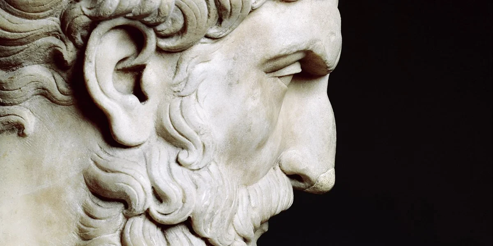

Ancient Greek philosopher Epicurus advocated an atomic, naturalistic view of the universe. He rejected the existence of an immaterial soul, or of anything non-physical, and said that the gods have no influence on our lives. As such, he believed being dead is not to be feared, for none of us will ever experience it. 

As he puts it in a famous aphorism (from Diogenes Laertius’s celebrated survey of ancient Greek thinkers, <a target="_blank" rel="noopener noreferrer sponsored" href="http://www.amazon.com/gp/product/0197523390/ref=as_li_tl?ie=UTF8&tag=philosophybre-20&camp=1789&creative=9325&linkCode=as2&creativeASIN=0197523390&linkId=4f41f433d7cd2ad97c98fcc8f3c45b26">Lives of the Eminent Philosophers</a>, compiled in the third century CE, and also featured in [Epicurus’s Principal Doctrines](/articles/epicurus-principal-doctrines-40-aphorisms-for-living-well/)): 

>Death does not concern us, because as long as we exist, death is not here. And once it does come, we no longer exist.

From this doctrine arose the epitaph: _Non fui, fui, non sum, non curo_ (I was not; I was; I am not; I do not care) — which is inscribed on the gravestones of Epicurus’s followers and seen on many ancient gravestones of the Roman Empire.

.")

## No consciousness means no time

To fully grasp Epicurus’s point, consider what happens when we’re unconscious. We do not _experience_ unconsciousness — in dreamless sleep, for instance, we wake in the morning, and our most recent memory is the last thing we did at night. Though hours may have passed, we did not experience their passing: we just jumped to the next conscious episode. 

So, though on the naturalistic view death is often characterized as an eternal abyss, a black silence, a terrifying nothingness, this characterization is misleading, for it suggests we’ll _experience_ this eternal blackness. But death means the experiencing subject no longer exists. There will be no consciousness there to experience silence, darkness, or the passing of time.

The reason we struggle to imagine what this state is like is because there is _nothing it is like to be in it_. [Consciousness](/reading-lists/consciousness/) is all we’ve ever known, and all we ever _can_ know. 

We learn _objectively_ that the universe existed before we were born, and that it will continue after our deaths, but from our _subjective_ perspectives all that’s ever existed is our consciousness. The non-existence of consciousness thus feels like an outrageous impossibility. 

<!--big subscribe-->

    
    <h4>From the Buddha to Nietzsche: join 9,500+ subscribers enjoying my free Sunday Breakdown</h4>
    
In one concise email each Sunday, I break down a famous idea from philosophy. You get the distillation straight to your inbox.

    

        <form action="https://app.convertkit.com/forms/5812400/subscriptions" method="post" data-sv-form="5812400" data-uid="be0e52d3c0" data-format="inline" data-version="6" data-options="{&quot;settings&quot;:{&quot;after_subscribe&quot;:{&quot;action&quot;:&quot;message&quot;,&quot;success_message&quot;:&quot;Thank you, philosopher! Your welcome email will land in your inbox shortly.&quot;,&quot;redirect_url&quot;:&quot;https://philosophybreak.com/thank-you/&quot;},&quot;analytics&quot;:{&quot;google&quot;:null,&quot;fathom&quot;:null,&quot;facebook&quot;:null,&quot;segment&quot;:null,&quot;pinterest&quot;:null,&quot;sparkloop&quot;:null,&quot;googletagmanager&quot;:null},&quot;modal&quot;:{&quot;trigger&quot;:&quot;timer&quot;,&quot;scroll_percentage&quot;:null,&quot;timer&quot;:5,&quot;devices&quot;:&quot;all&quot;,&quot;show_once_every&quot;:15},&quot;powered_by&quot;:{&quot;show&quot;:false,&quot;url&quot;:&quot;https://convertkit.com/features/forms?utm_campaign=poweredby&amp;utm_content=form&amp;utm_medium=referral&amp;utm_source=dynamic&quot;},&quot;recaptcha&quot;:{&quot;enabled&quot;:false},&quot;return_visitor&quot;:{&quot;action&quot;:&quot;show&quot;,&quot;custom_content&quot;:&quot;&quot;},&quot;slide_in&quot;:{&quot;display_in&quot;:&quot;bottom_right&quot;,&quot;trigger&quot;:&quot;timer&quot;,&quot;scroll_percentage&quot;:null,&quot;timer&quot;:5,&quot;devices&quot;:&quot;all&quot;,&quot;show_once_every&quot;:15},&quot;sticky_bar&quot;:{&quot;display_in&quot;:&quot;top&quot;,&quot;trigger&quot;:&quot;timer&quot;,&quot;scroll_percentage&quot;:null,&quot;timer&quot;:5,&quot;devices&quot;:&quot;all&quot;,&quot;show_once_every&quot;:15}},&quot;version&quot;:&quot;6&quot;}" min-width="400 500 600 700 800">
        
<ul data-element="errors" data-group="alert"></ul>

            

                <input name="email_address" aria-label="Your Email Address..." placeholder="Your Email Address..." required type="email" />
            

            <button class="button primary" type="submit" data-element="submit">

<svg xmlns="http://www.w3.org/2000/svg" viewBox="0 0 512 512"><path d="M464 64H48C21.49 64 0 85.49 0 112v288c0 26.51 21.49 48 48 48h416c26.51 0 48-21.49 48-48V112c0-26.51-21.49-48-48-48zm0 48v40.805c-22.422 18.259-58.168 46.651-134.587 106.49-16.841 13.247-50.201 45.072-73.413 44.701-23.208.375-56.579-31.459-73.413-44.701C106.18 199.465 70.425 171.067 48 152.805V112h416zM48 400V214.398c22.914 18.251 55.409 43.862 104.938 82.646 21.857 17.205 60.134 55.186 103.062 54.955 42.717.231 80.509-37.199 103.053-54.947 49.528-38.783 82.032-64.401 104.947-82.653V400H48z"/></svg>Join 9,500+ Subscribers</button>
            

            

        </form>
        
💭 One short philosophical email each Sunday. Unsubscribe any time.

    

We struggle to comprehend our lives as a finite block of time because we live only _inside the block_. We characterize anything _outside the block_ as eternal blackness or oblivion, because that’s a tempting conception of ‘nothingness’. 

But, by contemplating unconsciousness and dreamless sleep, we can recognize that nothingness isn’t like that. [As the Roman philosopher Lucretius also advises in his beautiful reflection on mortality](/articles/why-death-is-nothing-to-fear-lucretius-epicureanism/), just like before we were born, in death we won’t experience anything that happens — no pleasure, no pain, no anxiety, no fear — for the conscious self simply isn’t there.

If after death our consciousness was to be magically resurrected millions of years in the future, we’d have no sense of the time that had passed. Our last conscious experience would have seemed but a moment ago. So, Epicurus advises, don’t worry about being dead: it won’t even last a millisecond. 

## Further reading

What do you think of this analysis? Do you think Epicurus is right in declaring death is nothing to fear? Or is the prospect of non-consciousness, of being deprived of experience and time, rightly feared?

If you’re looking to delve deeper into the teachings of Epicurus, we’ve created a short [Epicureanism explainer](/articles/epicureanism-defined-philosophy-is-a-form-of-therapy/), as well as a [reading list of the best works of and about Epicureanism](/reading-lists/epicureanism/). Hit the banner below to access it now. 

<a class="reading-list cta" href="/reading-lists/epicureanism/">
    
    

    

        <svg xmlns="http://www.w3.org/2000/svg" viewBox="0 0 576 512"><path fill="#fff" d="M542.22 32.05c-54.8 3.11-163.72 14.43-230.96 55.59-4.64 2.84-7.27 7.89-7.27 13.17v363.87c0 11.55 12.63 18.85 23.28 13.49 69.18-34.82 169.23-44.32 218.7-46.92 16.89-.89 30.02-14.43 30.02-30.66V62.75c.01-17.71-15.35-31.74-33.77-30.7zM264.73 87.64C197.5 46.48 88.58 35.17 33.78 32.05 15.36 31.01 0 45.04 0 62.75V400.6c0 16.24 13.13 29.78 30.02 30.66 49.49 2.6 149.59 12.11 218.77 46.95 10.62 5.35 23.21-1.94 23.21-13.46V100.63c0-5.29-2.62-10.14-7.27-12.99z"/></svg>READING LIST
        

        <h3>Epicureanism</h3>
        
The Best 5 Books to Read

    
    
    <svg class="cta swing" xmlns="http://www.w3.org/2000/svg" viewBox="0 0 320 512"><path d="M285.476 272.971L91.132 467.314c-9.373 9.373-24.569 9.373-33.941 0l-22.667-22.667c-9.357-9.357-9.375-24.522-.04-33.901L188.505 256 34.484 101.255c-9.335-9.379-9.317-24.544.04-33.901l22.667-22.667c9.373-9.373 24.569-9.373 33.941 0L285.475 239.03c9.373 9.372 9.373 24.568.001 33.941z"/></svg>
</a>