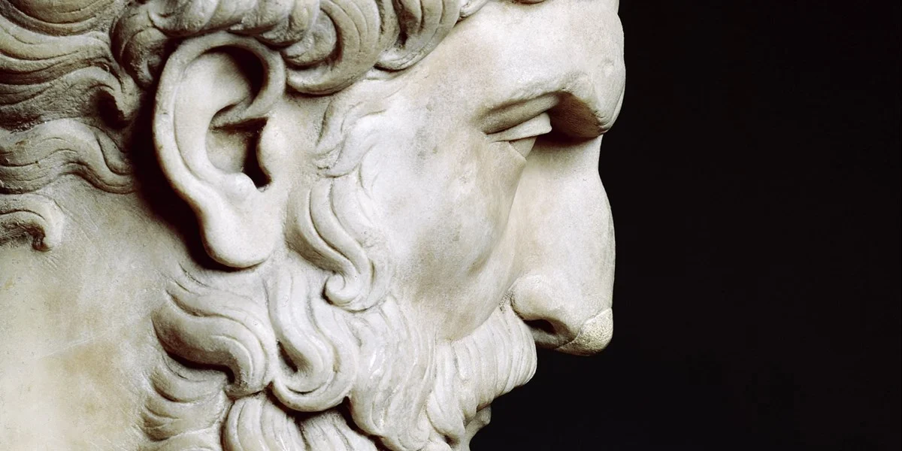

Epicurus was an ancient Greek philosopher whose influential teachings have come to be collectively labeled as Epicureanism. 

Often caricatured as a rather hedonistic, pleasure-obsessed philosophy, Epicureanism (as we outline in our brief [Epicureanism explainer](/articles/epicureanism-defined-philosophy-is-a-form-of-therapy/)) is actually more about living life free from anxiety and bodily pain, and places a strong emphasis on friendship and community in the search for a meaningful, happy human life. 

The Epicureans have things to say not just about ethics, but also share rich views on [metaphysics](/articles/metaphysics-what-is-it-why-is-it-important-today/), [epistemology](/reading-lists/epistemology/), and — more famously — [why mortality is nothing to fear](/articles/why-death-is-nothing-to-fear-lucretius-epicureanism/) and [death should not concern us](/articles/epicurus-on-why-death-should-not-concern-us/).

.")

Hardly any of Epicurus’s own writings survive — which, considering he wrote over 44 books in his lifetime, is an immense loss. 

Much of what we know about Epicurus thus comes through the work of his contemporaries, followers, and critics in the ancient Greco-Roman period, as we outline in our [Epicureanism reading list](/reading-lists/epicureanism/). The extent to which each source paints a reliable view of Epicurean thought continues to be debated by scholars.  

## Epicurus’s Principal Doctrines

Among the original Epicurean fragments that _do_ survive is a list of 40 brilliant, authoritative aphorisms entitled _Principal Doctrines_, which appear to summarize Epicurean thinking on the gods, death, epistemology, the study of nature, justice, friendship, living the good life, and more. 

We know of the doctrines only because the ancient biographer Diogenes Laertius listed them in full in the Epicurean chapter of his wonderful third-century book, <a target="_blank" rel="noopener noreferrer sponsored" href="http://www.amazon.com/gp/product/0197523390/ref=as_li_tl?ie=UTF8&tag=philosophybre-20&camp=1789&creative=9325&linkCode=as2&creativeASIN=0197523390&linkId=4f41f433d7cd2ad97c98fcc8f3c45b26">Lives of the Eminent Philosophers</a>.

The standard English translation of the Principal Doctrines is the <a target="_blank" rel="noopener noreferrer" href="http://classics.mit.edu/Epicurus/princdoc.html">Robert Drew Hicks translation from 1900</a>. 

However, the version we’ll share below is the <a target="_blank" rel="noopener noreferrer" href="https://blogs.ubc.ca/phil102/files/2013/08/Epicurus-PrincipalDoctrines-epicurusinfo.pdf">2006 translation from Erik Anderson</a>. This version is slightly more modern, and benefits from some very valuable contextual groupings from Anderson, who splits the doctrines into eight sections:

1. The four-fold cure for anxiety: don’t fear the gods, don’t fear death, goods are easy to obtain, evils are easy to endure ([aphorisms 1-4](#group1))
2. Pleasure and virtue are interdependent ([aphorism 5](#group2))
3. Social and financial status have recognizable costs and benefits ([aphorisms 6-8](#group3))
4. Through the study of Nature, we discern the limits of things ([aphorisms 9-13](#group4))
5. Unlike social and financial status, which are unlimited, peace of mind can be wholly secured ([aphorisms 14-21](#group5))
6. Happiness depends on foresight and friendship ([aphorisms 22-30](#group6))
7. The benefits of natural justice are far-reaching ([aphorisms 31-38](#group7))
8. So, happiness can be secured in all circumstances ([aphorisms 39-40](#group8))

## Tips for reading the Principal Doctrines

Anderson’s contextual groupings interpret each aphorism as playing a singular part in a larger whole. Likewise, scholars have suggested each aphorism acts almost as a ‘cue card’, representing a summary of Epicurus’s position on various points. 

As such, each aphorism should be considered carefully: it may hold implications unnoticed on a first reading. While each offers a concise introduction to an Epicurean position on a particular point, taken together they form a holistic picture of exactly why Epicureanism inspires followers (and detractors) to this day. 

<!--big subscribe-->

    
    <h4>From the Buddha to Nietzsche: join 6,500+ subscribers enjoying my free Sunday Breakdown</h4>
    
In one concise email each Sunday, I break down a famous idea from philosophy. You get the distillation straight to your inbox.

    

        <form action="https://app.convertkit.com/forms/5812400/subscriptions" method="post" data-sv-form="5812400" data-uid="be0e52d3c0" data-format="inline" data-version="6" data-options="{&quot;settings&quot;:{&quot;after_subscribe&quot;:{&quot;action&quot;:&quot;message&quot;,&quot;success_message&quot;:&quot;Thank you, philosopher! Your welcome email will land in your inbox shortly.&quot;,&quot;redirect_url&quot;:&quot;https://philosophybreak.com/thank-you/&quot;},&quot;analytics&quot;:{&quot;google&quot;:null,&quot;fathom&quot;:null,&quot;facebook&quot;:null,&quot;segment&quot;:null,&quot;pinterest&quot;:null,&quot;sparkloop&quot;:null,&quot;googletagmanager&quot;:null},&quot;modal&quot;:{&quot;trigger&quot;:&quot;timer&quot;,&quot;scroll_percentage&quot;:null,&quot;timer&quot;:5,&quot;devices&quot;:&quot;all&quot;,&quot;show_once_every&quot;:15},&quot;powered_by&quot;:{&quot;show&quot;:false,&quot;url&quot;:&quot;https://convertkit.com/features/forms?utm_campaign=poweredby&amp;utm_content=form&amp;utm_medium=referral&amp;utm_source=dynamic&quot;},&quot;recaptcha&quot;:{&quot;enabled&quot;:false},&quot;return_visitor&quot;:{&quot;action&quot;:&quot;show&quot;,&quot;custom_content&quot;:&quot;&quot;},&quot;slide_in&quot;:{&quot;display_in&quot;:&quot;bottom_right&quot;,&quot;trigger&quot;:&quot;timer&quot;,&quot;scroll_percentage&quot;:null,&quot;timer&quot;:5,&quot;devices&quot;:&quot;all&quot;,&quot;show_once_every&quot;:15},&quot;sticky_bar&quot;:{&quot;display_in&quot;:&quot;top&quot;,&quot;trigger&quot;:&quot;timer&quot;,&quot;scroll_percentage&quot;:null,&quot;timer&quot;:5,&quot;devices&quot;:&quot;all&quot;,&quot;show_once_every&quot;:15}},&quot;version&quot;:&quot;6&quot;}" min-width="400 500 600 700 800">
        
<ul data-element="errors" data-group="alert"></ul>

            

                <input name="email_address" aria-label="Your Email Address..." placeholder="Your Email Address..." required type="email" />
            

            <button class="button primary" type="submit" data-element="submit">

<svg xmlns="http://www.w3.org/2000/svg" viewBox="0 0 512 512"><path d="M464 64H48C21.49 64 0 85.49 0 112v288c0 26.51 21.49 48 48 48h416c26.51 0 48-21.49 48-48V112c0-26.51-21.49-48-48-48zm0 48v40.805c-22.422 18.259-58.168 46.651-134.587 106.49-16.841 13.247-50.201 45.072-73.413 44.701-23.208.375-56.579-31.459-73.413-44.701C106.18 199.465 70.425 171.067 48 152.805V112h416zM48 400V214.398c22.914 18.251 55.409 43.862 104.938 82.646 21.857 17.205 60.134 55.186 103.062 54.955 42.717.231 80.509-37.199 103.053-54.947 49.528-38.783 82.032-64.401 104.947-82.653V400H48z"/></svg>Join 6,500+ Subscribers</button>
            

            

        </form>
        
One short philosophical email each Sunday. Unsubscribe any time.

    

## The 40 Principal Doctrines

Without further ado, here are Epicurus’s 40 Principal Doctrines in full, contextually grouped according to Anderson’s translation:

## The four-fold cure for anxiety

1. _[Don’t fear the gods]_ A blessed and imperishable being neither has trouble itself nor does it cause trouble for anyone else; therefore, it does not experience feelings of anger or indebtedness, for such feelings signify weakness. 

2\. _[Don’t fear death]_ [Death is nothing to us](/articles/epicurus-on-why-death-should-not-concern-us/), because a body that has been dispersed into elements experiences no sensations, and the absence of sensation is nothing to us. 

3\. _[Goods are easy to obtain]_ Pleasure reaches its maximum limit at the removal of all sources of pain. When such pleasure is present, for as long as it lasts, there is no cause of physical nor mental pain present — nor of both together. 

4\. _[Evils are easy to endure]_ Continuous physical pain does not last long. Instead, extreme pain lasts only a very short time, and even less-extreme pain does not last for many days at once. Even protracted diseases allow periods of physical comfort that exceed feelings of pain. 

## Pleasure and virtue are interdependent 

5. It is impossible to live pleasantly without living wisely and honorably and justly, and it is impossible to live wisely and honorably and justly without living pleasantly. Whenever any one of these is lacking (when, for instance, one is not able to live wisely, though he lives honorably and justly) it is impossible for him to live a pleasant life. 

## Social and financial status have recognizable costs and benefits 

6. That natural benefit of kingship and high office is (and only is) the degree to which they provide security from other men. 

7\. Some seek fame and status, thinking that they could thereby protect themselves against other men. If their lives really are secure, then they have attained a natural good; if, however, they’re insecure, they still lack what they originally sought by natural instinct. 

8\. No pleasure is a bad thing in itself, but some pleasures are only obtainable at the cost of excessive troubles. 

## Through the study of Nature, we discern the limits of things 

9. If every pleasure could be prolonged to endure in both body or mind, pleasures would never differ from one another. 

10\. If the things which debauched men find pleasurable put an end to all fears (such as concerns about the heavenly bodies, death, and pain) and if they revealed how we ought to limit our desires, we would have no reason to reproach them, for they would be fulfilled with pleasures from every source while experiencing no pain, neither in mind nor body, which is the chief evil of life. 

11\. If we were never troubled by how phenomena in the sky or death might concern us, or by our failures to grasp the limits of pains and desires, we would have no need to study nature. 

>12\. One cannot rid himself of his primal fears if he does not understand the nature of the universe but instead suspects the truth of some mythical story. So without the study of nature, there can be no enjoyment of pure pleasure. 

13\. One gains nothing by securing protection from other men if he still has apprehensions about things above and beneath the earth and throughout the infinite universe. 

## Unlike social and financial status, which are unlimited, peace of mind can be wholly secured 

14. Supreme power and great wealth may, to some degree, protect us from other men; but security in general depends upon peace of mind and social detachment. 

15\. Natural wealth is both limited and easily obtained, but vanity is insatiable. 

16\. Chance has little effect upon the wise man, for his greatest and highest interests are directed by reason throughout the course of life. 

>17\. The just man is the freest of anyone from anxiety; but the unjust man is perpetually haunted by it. 

18\. When pain arising from need has been removed, bodily pleasure cannot increase — it merely varies. But the limit of mental pleasure is reached after we reflect upon these bodily pleasures and the related mental distress prior to fulfillment. 

19\. Infinite and finite time afford equal pleasure, if one measures its limits by reason. 

20\. Bodily pleasure seems unlimited, and to provide it would require unlimited time. But the mind, recognizing the limits of the body, and dismissing apprehensions about eternity, furnishes a complete and optimal life, so we no longer have any need of unlimited time. Nevertheless, the mind does not shun pleasure; moreover, when the end of life approaches, it does not feel remorse, as if it fell short in any way from living the best life possible. 

>21\. He who understands the limits of life knows that things which remove pain arising from need are easy to obtain, and furnish a complete and optimal life. Thus he no longer needs things that are troublesome to attain. 

## Happiness depends on foresight and friendship 

22. We must consider the ultimate goal to be real, and reconcile our opinions with sensory experience; otherwise, life will be full of confusion and disturbance. 

23\. If you argue against all your sensations, you will then have no criterion to declare any of them false. 

<!--how to live a good life-->

    
    <h4>How to Live a Good Life (According to 7 of the World’s Wisest Philosophies)</h4>
    
Explore and compare the wisdom of Stoicism, Existentialism, Buddhism and beyond to forever enrich your personal philosophy.

    <a class="button primary" href="/how-to-live-a-good-life/"><svg xmlns="http://www.w3.org/2000/svg" viewBox="0 0 512 512"><path d="M504 256C504 119 393 8 256 8S8 119 8 256s111 248 248 248 248-111 248-248zm-448 0c0-110.5 89.5-200 200-200s200 89.5 200 200-89.5 200-200 200S56 366.5 56 256zm72 20v-40c0-6.6 5.4-12 12-12h116v-67c0-10.7 12.9-16 20.5-8.5l99 99c4.7 4.7 4.7 12.3 0 17l-99 99c-7.6 7.6-20.5 2.2-20.5-8.5v-67H140c-6.6 0-12-5.4-12-12z"/></svg>Get Instant Access</a>
    
&#9733;&#9733;&#9733;&#9733;&#9733; (50+ reviews for our courses)

24\. If you arbitrarily reject any one sensory experience and fail to differentiate between an opinion awaiting confirmation and what is already perceived by the senses, feelings, and every intuitive faculty of mind, you will impute trouble to all other sensory experiences, thereby rejecting every criterion. And if you concurrently affirm what awaits confirmation as well as actual sensory experience, you will still blunder, because you will foster equal reasons to doubt the truth and falsehood of everything. 

>25\. If you do not reconcile your behavior with the goal of nature, but instead use some other criterion in matters of choice and avoidance, then there will be a conflict between theory and practice. 

26\. All desires which create no pain when unfulfilled are not necessary; such desires may easily be dispelled when they are seen as difficult to fulfill or likely to produce harm. 

>27\. Of all things that wisdom provides for living one’s entire life in happiness, the greatest by far is the possession of friendship. 

28\. The same conviction which inspires confidence that nothing terrible lasts forever, or even for long, also enables us to see that in the midst of life’s limited evils, nothing enhances our security so much as friendship. 

29\. Among desires some are natural and necessary, some natural but not necessary, and others neither natural nor necessary, but due to baseless opinion. 

30\. Those natural desires which create no pain when unfulfilled, though pursued with an intense effort, are also due to baseless opinion; and if they are not dispelled, it is not because of their own nature, but because of human vanity. 

## The benefits of natural justice are far-reaching 

31. Natural justice is the advantage conferred by mutual agreements not to inflict nor allow harm. 

32\. For all living creatures incapable of making agreements not to harm one another, nothing is ever just or unjust; and so it is likewise for all tribes of men which have been unable or unwilling to make such agreements. 

>33\. Absolute justice does not exist. There are only mutual agreements among men, made at various times and places, not to inflict nor allow harm. 

34\. Injustice is not an evil in itself, but only in consequence of the accompanying fear of being unable to escape those assigned to punish unjust acts. 

35\. It is not possible for one who secretly violates the provisos of the agreement not to inflict nor allow harm to be confident that he won’t get caught, even if he has gotten away with it a thousand times before. For up until the time of death, there is no certainty that he will indeed escape detection. 

>36\. Justice is essentially the same for all peoples insofar as it benefits human interaction. But the details of how justice is applied in particular countries or circumstances may vary. 

37\. Among actions legally recognized as just, that which is confirmed by experience as mutually beneficial has the virtue of justice, whether it is the same for all peoples or not. But if a law is made which results in no such advantage, then it no longer carries the hallmark of justice. And if something that used to be mutually beneficial changes, though for some time it conformed to our concept of justice, it is still true that it really was just during that time — at least for those who do not fret about technicalities and instead prefer to examine and judge each case for themselves. 

38\. Where, without any change in circumstances, things held to be just by law are revealed to be in conflict with the essence of justice, such laws were never really just. But wherever or whenever laws have ceased to be advantageous because of a change in circumstances, in that case or time the laws were just when they benefited human interaction, and ceased to be just only when they were no longer beneficial. 

## So, happiness can be secured in all circumstances 

39. He who desires to live in tranquility with nothing to fear from other men ought to make friends. Those of whom he cannot make friends, he should at least avoid rendering enemies; and if that is not in his power, he should, as much as possible, avoid all dealings with them, and keep them aloof, insofar as it is in his interest to do so. 

>40\. The happiest men are those who enjoy the condition of having nothing to fear from those who surround them. Such men live among one another most agreeably, having the firmest grounds for confidence in one another, enjoying the benefits of friendship in all their fullness, and they do not mourn a friend who dies before they do, as if there was a need for pity.

## Do you want to learn more about Epicureanism?

If these 40 aphorisms have piqued your interest in the teachings of Epicurus, we’ve created a reading list of the best works of and about Epicureanism. Hit the banner below to access it now. 

<a class="reading-list cta" href="/reading-lists/epicureanism/">
    
    

    

        <svg xmlns="http://www.w3.org/2000/svg" viewBox="0 0 576 512"><path fill="#fff" d="M542.22 32.05c-54.8 3.11-163.72 14.43-230.96 55.59-4.64 2.84-7.27 7.89-7.27 13.17v363.87c0 11.55 12.63 18.85 23.28 13.49 69.18-34.82 169.23-44.32 218.7-46.92 16.89-.89 30.02-14.43 30.02-30.66V62.75c.01-17.71-15.35-31.74-33.77-30.7zM264.73 87.64C197.5 46.48 88.58 35.17 33.78 32.05 15.36 31.01 0 45.04 0 62.75V400.6c0 16.24 13.13 29.78 30.02 30.66 49.49 2.6 149.59 12.11 218.77 46.95 10.62 5.35 23.21-1.94 23.21-13.46V100.63c0-5.29-2.62-10.14-7.27-12.99z"/></svg>READING LIST
        

        <h3>Epicureanism</h3>
        
The Best 5 Books to Read

    
    
    <svg class="cta swing" xmlns="http://www.w3.org/2000/svg" viewBox="0 0 320 512"><path d="M285.476 272.971L91.132 467.314c-9.373 9.373-24.569 9.373-33.941 0l-22.667-22.667c-9.357-9.357-9.375-24.522-.04-33.901L188.505 256 34.484 101.255c-9.335-9.379-9.317-24.544.04-33.901l22.667-22.667c9.373-9.373 24.569-9.373 33.941 0L285.475 239.03c9.373 9.372 9.373 24.568.001 33.941z"/></svg>
</a>