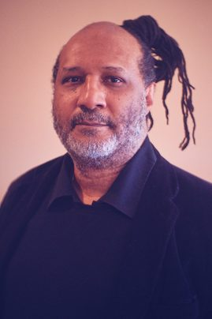
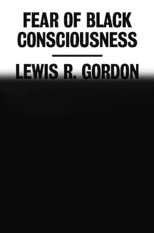

<i><a target="_blank" rel="noopener noreferrer" href="https://twitter.com/lewgord">Lewis Gordon</a> is a philosopher, musician, and public intellectual dedicated to struggles for dignity, freedom, and social justice across the globe. One of the leading scholars of Black Existentialism, he is currently Professor and Head of the Department of Philosophy at UCONN-Storrs in the United States, Honorary Professor in the Unit for the Humanities at Rhodes University in South Africa, Honorary President of the Global Center for Advanced Studies, and Distinguished Scholar in the Honourable PJ Patterson Centre for Africa-Caribbean Advocacy at UWI-Mona in Jamaica.

    

We caught up with Lewis about his brilliantly insightful book, <a target="_blank" rel="noopener noreferrer sponsored" href="http://www.amazon.com/Fear-Black-Consciousness-Lewis-Gordon/dp/0374159025?&linkCode=ll1&tag=philosophybre-20&linkId=a0971bee82965e2398137ceaa1f5a70c&language=en_US&ref_=as_li_ss_tl">Fear of Black Consciousness</a>, which explores how racial identity and human meaning are constructed through history, art, and popular culture. 

With an extraordinary breadth of references and insight, Lewis ultimately argues against ‘seriousness’ or ‘closedness’ towards the worlds we make, and advocates for a radical love and openness towards the multitudinous possibilities of reality.</i>

>People are seduced by reductive thinking, simplified thinking… but to be genuinely curious, you begin to realize reality is just bigger than you are. To have a real commitment to reality and truth, you have to reach beyond yourself, which means you could get your butt kicked. So you need to have some courage: the idea of philosophers who have no courage is an abomination… 

## How did the idea for your book — exploring black consciousness through the lens of existentialism and meaning-making — come about?

I was originally asked to write this book in the 1990s — and I’m glad I didn’t. There are a lot of conceptual tools in the book that I’ve developed in the years since, and they afford a certain elegance to the argument. 

So, when I was asked again more recently whether I’d write a book on black consciousness, I said yes — because, you know, sometimes life is paradoxical. For instance, I often joke with my students that many of them don’t know the meanings of their names, but because I’ve studied classics and ancient languages, I tend to know what people’s names mean. 

And what’s strange is that, even though they don’t know the meaning of their names, and maybe their parents don’t even know the meanings of their names, they nevertheless often manifest the meanings of their names.

So, similarly, sometimes timing is an important issue — there are things we’re supposed to do, not in the sense of fate, but at a subconscious level: the life forces are such that we work on things at the time it’s right to work on them. 

## I’m now thinking whether I live up to the meaning of my name. All I know is that Jack is derivative from John.

Correct. And John is from Jonathan, which is really connected historically to the ancient word for God and wisdom (from Hebrew _Yohanan_ or _y'hohanan_ – “Jah has graced”) and things like that. And with the name Maden, it’s more complicated because it depends on which language it’s coming from, but it’s highly likely to be linked to _Maton_, an ancient name probably mediated by Hebrew, so somebody in your ancestry may have had some connection to Hebrew.

## Fascinating. Now, back to your book…

Yes, and the point is that the timing was now right to write it. Black consciousness is a subject I’ve been thinking about, and the way most people want to write about it tends simply to be historical. 

When people talk about the black consciousness movement in, say, South Africa, within that movement they talk about people like Chabani Manganyi, Steve Biko, and do so from a historical angle. But what they miss is that people like Chabani Manganyi and Steve Biko were philosophers: for Manganyi and Biko, it was not simply about being people in South Africa arguing about being black. 

Similarly, if we go to the United States, there were people who talked about blackness, whether it was W.E.B. Du Bois or all the way through to Richard Wright and then to Frantz Fanon in the Caribbean. 

So, when one begins to ask the question of black consciousness in a different way — beyond historical events — one begins to realize that it interrogates the heart of a certain form of struggle in society. 

>We live in worlds of meaning, and unfortunately at times we commit ourselves to distortions of meaning to serve certain purposes. And these commitments aren’t necessarily about trying to be an evil person manipulating others: sometimes we collapse into contraries and try to make the world neat simply because we’re scared. 

The simple version of this struggle is the presupposition that things black are bad, and things white are good. But that tends to be, proverbially, too black and white. Reality is not neatly black and white. And if we think philosophically, we realize something rather interesting. 

Picture nothing but light, just light. And if you picture only light, what you realize is you can’t see anything. It’s blindness. And if you picture things that are just black, there’s only darkness. 

However, when we have discernibility, when we can make things out in the world, it’s because the light and the dark interact. On a basic level, there’s black and white television, that’s one version. But in other versions, the complexity of color, light, all of these things… This tells us that there are things we try to keep apart that actually belong together.

And it’s not just about color. When we try to separate ourselves from others, when we think of ourselves as individuals like gods separated from others, we fail to understand that if we did that, we’d be so locked into ourselves, that no world can appear. 

Individuality, then, is a scam. It’s based on the metaphysical notion of substance, a thing that can be reality all by itself — but the last I looked, no human being is born by themselves! 

To live in the human world and beyond, reality is always relational. Once we begin to see this, we begin to realize that we impose on ourselves contraries that separate us, and these contraries collapse onto themselves. 

Whereas, if we think dialectically — and by that I mean how when we expose false universals — we begin to see the specificity of things, the meaning of things. And meaning is very crucial for all thought, for communication, for life. 

To put it in sum, we live in worlds of meaning, and unfortunately at times we commit ourselves to distortions of meaning to serve certain purposes. And these commitments aren’t necessarily about trying to be an evil person manipulating others: sometimes we collapse into contraries and try to make the world neat simply because we’re scared. 

So you may notice in the book, I’m not mean: the goal is not to separate humanity into a neat divide of good people, bad people. It’s more to try to understand why sometimes we may take problematic stances.

## A key distinction in your book is that between ‘black consciousness’ with a lowercase ‘b’ and Black consciousness with an uppercase ‘B’. Could you talk a little about that?

Sure. Black consciousness with a lowercase ‘b’ is the historic black consciousness imposed upon people who are not historically black at all. It’s related to the notion of ‘double consciousness’, which involves seeing oneself through the eyes of those who despise one. In the context of black consciousness, this means black people understanding themselves as wretched through the constructs imposed upon them by antiblack racists.  

The book shows that anybody could be made black — and, in fact, historically there weren’t any ‘white’ people either. It was the effort to construct people in those ways that produced these various lowercase forms. 

For instance, there were many different groups of people, not only in Africa but South Asia, the Pacific, South America, who did not think of themselves as black, but were made into lowercase black. 

Uppercase Black is something very different. Uppercase Black is when people are not simply an _effect_ of other people’s action, but they take responsibility for their own actions. Uppercase Black consciousness, as I formulate it, is when you don’t accept the idea that you’re intrinsically a problem. Instead, you shift and argue there’s a problem with a society that makes people into problems. 

>Realizing that people designated ‘black’ are actually human beings who _face problems of antiblack racism_ instead of _being problems_, opens the potential to act upon and change the world — in a word, _agency_. Those with Black consciousness become agents of history. 

Fanon put it beautifully when he reminded us that society affects us, but it’s human beings who create society. We must take responsibility for the society we make. 

Of course, this is not willy-nilly. It’s not like we’re gods creating society. It’s just that our ongoing relationships and interactions do shape it. 

Understanding that means understanding there’s always something we can do. Indeed, in the book, I argue that one of the consequences of the lowercase black, the imposition onto the lowercase black of antiblack racism, is to create the lie of the absence of agency.

But the thing to bear in mind is that I’m not against the people who received the lowercase black. That’s just an historical reality. If you’re enslaved or if you’re colonized or — the list is long — it’s just like it was like being against women when there’s a society that’s degrading to women. It doesn’t mean that women are bad: it means those are struggles women face.

However, when we move now to understanding women as agents of history, blacks as agents of history — in fact, human beings as agents of history — then we begin to understand that in order for us to change the world, we need to affirm our human relationship to it.

## In your investigation of the path from black to Black consciousness, you discuss the ‘spirit of seriousness’, which is when someone fails to acknowledge the contingency of the rules we live by. You offer the example of someone who is militant about the rules of, say, a particular board game, and conflates those rules with fixed laws of nature, when really we could decide to take responsibility for and change the rules at any time.

That’s correct. The spirit of seriousness treats the world as _closed_. And, in fact, all ‘human nature’ arguments are efforts to treat human realities as closed. This is one of the reasons why many existentialists argue against the idea of ‘human nature’. 

Instead of human _nature_, we argue there is a human _condition_. The condition enables possibilities, but unlike human nature it doesn’t set only _one_ possibility. 

So, the first thing is that the spirit of seriousness is anti-human: it closes the world. 

The second thing is that, when we engage the world, we engage the world intelligibly, and that’s why we create rules. But the mistake we make when we create rules is we often then forget that _we created the rules_. 

There are many ways to play draughts or checkers; one could play three-dimensional chess; we could go through games from basketball to football… 

There are so many examples in which we begin to realize that there are countless ways through which to live human reality, and those ways manifest our freedom and our possibilities. 

. “In the context of the United States, black consciousness inaugurated its path to Black consciousness through transforming reflection and sorrow into the blues. This is a form of awakened play, taking responsibility for the rules by which we live and releasing them from the bonds of seriousness…” — Lewis Gordon, Fear of Black Consciousness.")

Being a ‘serious’ person, however, _occludes_ life: it closes off possibility.

And one of the things that’s crucial, particularly if we deal with problems like oppression, is that we often forget oppression is ultimately based on lies — on closed, ‘serious’ lies that cover reality. 

To combat those lies, it’s not as simple as saying, ‘This lie is incorrect. You are not inferior’, because for some that still creates a dichotomy. ‘I’m not inferior, therefore I’m superior’. That’s still locked into that closed logic. 

Only being less _serious_ — only opening rather than covering or closing reality — can bring the truth out. Then you might understand that you live in a world with other people, and that it’s not about superiority or inferiority: it’s about living together. 

For example, in the book, when I talk about the Black Panther film, I point out that the character Killmonger represents the spirit of seriousness because the world for him was closed. The world, he said, consists of conquerors and the conquered. 

But who says that those are the only alternatives? We could actually struggle for a world that has no conquest in it, and get rid of this whole conquer / conquered thing. 

And Hobbes had this problem, too. Hobbes looked at the world in such a way that it was naturally  in a state of war, and peace was simply the absence of war. 

But that’s not how we live our lives. What we need to understand is that there is a form of peace in which we can have conflict that is not war. 

Some conflicts are very productive, and we can learn from them. Some conflicts are very creative, like when we’re on a team playing a game, and in some cases in philosophical argumentation, they can be very productive because they get us to see the world in different ways.

In other words, if you let go of _winning or losing_ and work together to try to understand the world, then things like science, evidence, art, good food, poetry, dancing — so much about what makes life livable can come to the fore.

And you may notice throughout the book, for instance, that nothing, no form is placed in a hierarchy over another. Music is as essential for my arguments as film, as poetry, as song, as scientific arguments, historical arguments, philosophical arguments. And the reason is because if they’re all ultimately connected in some way to truth, to reality, then they can all be communicated with insight.

    <h4>Philosophy in Your Twitter Feed</h4>
    
Follow Philosophy Break on Twitter to get philosophy's best questions, wisdom, and ideas directly in your Twitter feed.

    <a target="_blank" rel="noopener noreferrer" class="button secondary" href="https://twitter.com/philosophybreak"><svg xmlns="http://www.w3.org/2000/svg" viewBox="0 0 512 512"><path d="M459.37 151.716c.325 4.548.325 9.097.325 13.645 0 138.72-105.583 298.558-298.558 298.558-59.452 0-114.68-17.219-161.137-47.106 8.447.974 16.568 1.299 25.34 1.299 49.055 0 94.213-16.568 130.274-44.832-46.132-.975-84.792-31.188-98.112-72.772 6.498.974 12.995 1.624 19.818 1.624 9.421 0 18.843-1.3 27.614-3.573-48.081-9.747-84.143-51.98-84.143-102.985v-1.299c13.969 7.797 30.214 12.67 47.431 13.319-28.264-18.843-46.781-51.005-46.781-87.391 0-19.492 5.197-37.36 14.294-52.954 51.655 63.675 129.3 105.258 216.365 109.807-1.624-7.797-2.599-15.918-2.599-24.04 0-57.828 46.782-104.934 104.934-104.934 30.213 0 57.502 12.67 76.67 33.137 23.715-4.548 46.456-13.32 66.599-25.34-7.798 24.366-24.366 44.833-46.132 57.827 21.117-2.273 41.584-8.122 60.426-16.243-14.292 20.791-32.161 39.308-52.628 54.253z"/></svg>Follow Philosophy Break</a>

## The breadth of references you bring into your work is compelling, ranging from ancient myth to modern films like _Get Out_ and _Black Panther_. What motivates you to incorporate popular culture into your analysis?

I do so to spark the interest of the reader and to demonstrate how things are connected over time. For instance, more people have seen some of the films I discuss than have read classical literature. But you may notice a pattern when I discuss popular films: I argue that all stories and myths actually have myths beneath them, and that’s because myths and stories are repeated. 

For instance, when I talk about the Black Panther film, I show how it’s connected to Jewish myths. And when I talk about Jewish myths, I show how they’re connected to ancient East African myths, and I’m very specific about which ones they are.

I am also an educator, and one of the things methodologically at work with me doing this is to encourage the readers to say, ‘Wow, things are so connected, I should go and read more’. And one of the best ways to make an argument, so to speak, is not simply to assert its content but to do so through performance. 

>For us to deal with the richness of existence, for us to acknowledge the many ways of living in the world we manifest simultaneously, the approach has to be multidimensional.

I’m critical of the neat separation of performing and meaning. That’s how I relate to Kierkegaard: Kierkegaard uses indirection, and you may notice I use a Kierkegaardian trope. 

I have a theory called _disciplinary decadence_. Disciplinary decadence is when a discipline treats itself as reality, instead of something trying to have a _relationship_ with reality. So it ignores other disciplines, what others have to say — in other words, it becomes, in existential terms, _serious_. 

I argue for — and this is a technical term — the _teleological suspension of disciplinarity_. Now what that means is, in order for a discipline to relate to reality, it must be willing to go beyond itself. It must be willing to communicate with others and see what they have to offer.

That’s why I argue for _transdisciplinarity_. You may notice ‘trans’ pops up in interesting ways in the book, because there are people who try to lock ‘transness’ exclusively into sexual or gendered identities. But human beings — because we’re not things — are always transitive, I argue: there’s a ‘trans’ dimension to human reality. 

This scares some people who would like to know that _you are what you are_, end of story. But as everybody knows, you often _discover_ what you are. And at a certain point, you may even learn that you could be more. 

So, _transdisciplinarity_ involves not simply pointing to disciplines, but the performance of them. And I adopt this performative approach throughout the book, because actual human reality is always transforming itself in many ways while maintaining its intelligibility. 

The point is that every moment of human reality can be simultaneously many meanings, but when we treat things too seriously — like the example of the person who says you can’t jump backwards in checkers, or the person who wants to say there’s absolutely only one way ever to to live our lives — these are people who are closing off the multidimensionality of existence.

For us to deal with the richness of existence, for us to acknowledge the many ways of living in the world we manifest simultaneously, the approach has to be multidimensional. 

## Well, I certainly came away from the book feeling like the world was much bigger than before I read it. And perhaps another consequence of your performative approach to arguing against reductive thinking is that, through presenting the diverse connections and histories of stories and myth, it combats what you call ‘epistemic invisibility’, which is the erasure of non-white histories, knowledge, and ideas. How do you think the history of knowledge can be better accounted for? 

Well, the first thing is there’s something I’ve observed throughout my career, which is I don’t focus so much on what people are doing wrong as much as identifying what it means to do things better. In other words, if you see a better way to do things, then you have the obligation to build it. 

When I started out four decades ago, there were people who would say what I’m arguing (regarding epistemic invisibility) doesn’t exist; but I noticed they didn’t actually go away to do their research. They were already locked in the logic that it must be so, and chained to a form of laziness of thought. 

So what I did — and not only me, there were others doing this too — what we did was to create the alternatives. And as these alternatives became available, the richer became people’s understanding of the world. 

>There’s so much to learn. And once we see ourselves as students, ongoing perpetual students, that means we can learn languages, different cultural frameworks, sciences, philosophies. It’s still a tiny, tiny fragment of reality. But we’re open rather than closed to that reality. We’re learning.

The argument is not to replace, say, Descartes or Locke or Hume, it’s for people to learn that they’re not the be all and end all of the world — for people to think, ‘My goodness, I had no idea there was so much that even preceded that kind of thought’. 

That’s all: by building these other stories, by showing what is out there, one now invites people to learn. 

I can illustrate this through an argument I make in the book from a Ghanaian philosopher named Kwasi Wiredu. 

Take a language, say English, and go and meet a person who speaks another language, say Wolof, or Zulu, or Cantonese. 

Now, the naive view of language is that everything that you could possibly learn in Cantonese or Zulu or Wolof is already contained in English. And if you really believe that, then there’s no reason to learn Wolof, Cantonese, or any other language.

However, what actually happens is that when people who speak different languages meet, the concept of isomorphism, which is the one to one relationship with terms in one language and another, gets exhausted. In other words, there’s a certain point where terms pop up in other languages that don’t exist in your language. And everybody knows this happens not just with English and Wolof, Cantonese, or Zulu, but with English and French, Spanish, German, Dutch. 

And the mistake people make is they think the issue is now to somehow _translate the missing word into the base language_. But that is a big mistake. That’s not actually what people do. Anybody who studies an additional language knows that what you do is you just start _using the untranslatable word_. And one day you’re like, ‘Oh, my goodness, I understand it’. 

And then somebody says, ‘Really? Translate it then, what does it mean?’ And then you realize you can’t translate it because it’s not translatable; it’s _learnable_. This is what’s crucial.

Once we learn how to learn, then you can see the other message in the book: we actually _expand our reality_ through learning from one another. 

There’s so much to learn. And once we see ourselves as students, ongoing perpetual students, that means we can learn languages, different cultural frameworks, sciences, philosophies. It’s still a tiny, tiny fragment of reality. But we’re open rather than closed to that reality. We’re learning.

## You finish your book by discussing the concept of ‘radical love’. What part does radical love have to play not just in moving from lowercase to uppercase Black, but in building a better world? 

That analysis takes on a specific lie. The lie is that we could only love those who are like ourselves: in other words, that love is narcissistic. And I connect this to my analysis of political philosophy. The mistake many people make is that they lock power and the world into simply the reproduction of the self. 

But political _possibility_ is where one can actually struggle for those whom one would never know, one would never meet. There’s a form of anonymity, because it’s not a reproduction of the self. All political life, if we’re making the world better for people, is for people we may not ever be able to recognize. 

>I’m arguing that we’re not trying to constrain future humanity to this mess we have made. Instead, we’re trying to open up the possibilities for future humanity to live lives worth living.

For instance, a lot of the people who were the conditions of the possibilities we enjoy today probably wouldn’t even be able to understand us; but we know that our lives, our freedom, the good things that we have, depended on their actions.

So, the concept of radical love basically challenges the thesis that love or ethics rely on similitude, similarity, samenes. We _do_ have sameness and similarity, but we also have the capacity to love those who are not us. 

This is ultimately the challenge in the book, because the people who defend racist societies, sexist societies — their basic defense is that it’s supposedly _human nature_ only to love yourself and those who are like you.

But that is just false. We have seen throughout history not only the human capacity to love those who are not like oneself. We’ve even seen the human capacity to love non-humans. 

And this is something special about us: the argument about radical love is to demonstrate our ability to affirm the dignity and value of so many forms of existence.

Once we see that, that’s the clue to what’s involved in trying to not only make liberation, but also to make freedom. Like liberation, freedom requires being able to articulate belonging, but unlike liberation it doesn’t articulate that belonging as _sameness_. Rather, it’s a celebration of the right of others to live their lives.

That’s what I see as radical love, and that’s what I’m arguing for: I’m arguing that we’re not trying to constrain future humanity to this mess we have made. Instead, we’re trying to open up the possibilities for future humanity to live lives worth living.

&nbsp;

<i>You can order Professor Lewis Gordon’s book <a target="_blank" rel="noopener noreferrer sponsored" href="http://www.amazon.com/Fear-Black-Consciousness-Lewis-Gordon/dp/0374159025?&linkCode=ll1&tag=philosophybre-20&linkId=a0971bee82965e2398137ceaa1f5a70c&language=en_US&ref_=as_li_ss_tl">Fear of Black Consciousness here</a>, or simply hit the banner below.</i>

    <a target="_blank" rel="noopener noreferrer sponsored" href="http://www.amazon.com/Fear-Black-Consciousness-Lewis-Gordon/dp/0374159025?&linkCode=ll1&tag=philosophybre-20&linkId=a0971bee82965e2398137ceaa1f5a70c&language=en_US&ref_=as_li_ss_tl">
        
        

            <h4>Fear of Black Consciousness</h4>
            
<svg xmlns="http://www.w3.org/2000/svg" viewBox="0 0 50 50"><path d="M48.336,7.54c-0.701,0-1.359,0.007-2.018,0.024V5.326h-0.734c-14.262,0-19.043,3.411-20.585,5.252 c-1.542-1.841-6.323-5.252-20.585-5.252H3.68v2.237C3.022,7.545,2.364,7.54,1.664,7.54H0V39.89h1.664 c17.595,0,21.186,4.035,21.698,4.784h3.302c0.557-0.784,4.218-4.784,21.673-4.784H50V7.54H48.336z M23.899,38.431 c-2.457-1.812-7.611-3.914-18.383-4.054V7.175c15.087,0.194,18.001,4.327,18.383,5V38.431z M44.484,34.377 c-10.772,0.14-15.926,2.24-18.383,4.054V12.184c0.416-0.737,3.412-4.814,18.383-5.007V34.377z"></path></svg>BY LEWIS GORDON

            <svg xmlns="http://www.w3.org/2000/svg" viewBox="0 0 576 512"><path d="M576 24v127.984c0 21.461-25.96 31.98-40.971 16.971l-35.707-35.709-243.523 243.523c-9.373 9.373-24.568 9.373-33.941 0l-22.627-22.627c-9.373-9.373-9.373-24.569 0-33.941L442.756 76.676l-35.703-35.705C391.982 25.9 402.656 0 424.024 0H552c13.255 0 24 10.745 24 24zM407.029 270.794l-16 16A23.999 23.999 0 0 0 384 303.765V448H64V128h264a24.003 24.003 0 0 0 16.97-7.029l16-16C376.089 89.851 365.381 64 344 64H48C21.49 64 0 85.49 0 112v352c0 26.51 21.49 48 48 48h352c26.51 0 48-21.49 48-48V287.764c0-21.382-25.852-32.09-40.971-16.97z"/></svg>View on Amazon
        

    </a>

