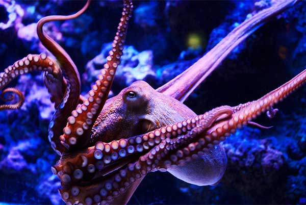

What did you have for breakfast this morning? Was it delicious? Was it one to forget? Whatever it was, you didn't choose to have it. You might think you did. But, in actuality, you didn't. And though you may have had the conscious awareness of choice - porridge or toast? coffee or tea? - and remember making an active decision, the fact is you could not have selected any other option. Any decision you think you may have made was simply an illusion.

And, unfortunately, it doesn't just stop at breakfast. Or lunch. Or dinner. Or in fact _any decision you ever remember making_. Everything you've done couldn't possibly have happened any other way, and everything you will do will be decided for you – without any input from your conscious self.

At least, that's what American neuroscientist and philosopher Sam Harris would tell you.

In his short but persuasive book, [Free Will](http://www.amazon.com/gp/product/1451683405/ref=as_li_tl?ie=UTF8&tag=philosophybre-20&camp=1789&creative=9325&linkCode=as2&creativeASIN=1451683405&linkId=bc8e08d322a1e8e5bb7e110c533bff12), Harris writes:

>Free will _is_ an illusion. Our wills are simply not of our own making. Thoughts and intentions emerge from background causes of which we are unaware and over which we exert no conscious control. We do not have the freedom we think we have.

And, as uncomfortable as this may be, it's very much backed by neuroscientific research.

## Decisions in the brain occur before you are conscious of them

In a famous experiment in the 1980s, physiologist [Benjamin Libet used an electroencephalogram (EEG)](https://www.ncbi.nlm.nih.gov/pubmed/6640273) to demonstrate that activity in the brain's motor cortex can be detected _300 milliseconds_ before a person feels they've decided to move.

In [another study](https://www.ncbi.nlm.nih.gov/pubmed/21486293), subjects were asked to press one of two buttons while watching a clock composed of a random sequence of letters on a screen. The experimenters used functional magnetic resonance imaging (fMRI) to show that two brain regions contained information about which button subjects would press a full _seven to ten seconds_ before the decision was consciously made.

Finally, [more recently](https://www.ncbi.nlm.nih.gov/pubmed/21315264), direct recordings from the cortex have shown that the activity of just 256 neurons is sufficient to predict with 80% accuracy a person's decision to move 700 milliseconds before they become aware of it.

As Harris comments:

>These findings are difficult to reconcile with the sense that we are the conscious authors of our actions. One fact now seems indisputable: some moments _before_ you are aware of what you will do next - a time in which you subjectively appear to have complete freedom to behave however you please - your brain has already determined what you will do. You then become conscious of this 'decision' and believe that you are in the process of making it.

"The phrase 'free will'", therefore, as Harris later clarifies, simply "describes what it feels like to identify with certain mental states as they arise in consciousness" – and our 'freedom' constitutes nothing more than this illusory feeling of control.

In other words, we are the mere conscious witnesses to decisions that, deep in our brains, have already been made.

## Hammering the point home

On Harris's view, your genetics, your childhood, your environment – all of the stimuli you're made up of and exposed to has conditioned your brain, in this moment, to read these very words; and if or when you stop, again, it won't be because you've consciously decided to do so – it will be the result of a lifetime's worth of conditioning forged into your brain, a historical architecture of decision making that causes you to act the way you do at any given moment. As he states:

>Take a moment to think about the context in which your next decision will occur: You did not pick your parents or the time and place of your birth. You didn't choose your gender or most of your life experiences. You had no control whatsoever over your genome or the development of your brain. And now your brain is making choices on the basis of preferences and beliefs that have been hammered into it over a lifetime — by your genes, your physical development since the moment you were conceived, and the interactions you have had with other people, events, and ideas. Where is the freedom in this?

You might now stop and start reading again at random just to spite this hypothesis.

You might think, 'I am _consciously deciding_ to read this article, and if you or Sam Harris continue to baselessly claim I have no agency I might just stop.' Well, here at philosophy break we hope you don't stop – but according to the viewpoint under discussion neither you nor we (nor even Sam Harris) has any bearing over whether or not that actually happens. You have no choice in how you act. You have will – but it is not free.

## Can we rescue free will from neuroscience?

Of course, this deterministic picture of our paths in life has prompted a vast literature attempting to save our notion of free will. 'Compatibilism' is a movement that accepts the neuroscientific picture of the brain but argues there's room within it for the idea that we remain free in how we think and act.

Discussing a full summary of compatibilist positions on free will is beyond the scope of this article, but one that bears exploration - and that Harris himself engages - is a view [well-articulated by American philosopher Daniel Dennett](http://www.amazon.com/gp/product/0262527790/ref=as_li_tl?ie=UTF8&camp=1789&creative=9325&creativeASIN=0262527790&linkCode=as2&tag=philosophybre-20&linkId=795cd4ce217c26f227723f6493490159).

Dennett argues that even if our thoughts and actions are the product of unconscious causes, they are still _ours_. Anything that our brains do or decide is something _we_ have done or decided. All Harris has done in his analysis is drive a wedge between our conscious and unconscious selves: we are still free to consciously shape our worlds - and so influence our unconscious - however we desire.

But, in Harris's view, therein the preceding sentence lies the crux of our misunderstanding around free will: where, in this case, does the 'desire' according to which we'd like to shape the world come from?

In fact, what is the source of _any_ of our thoughts, impulses, or desires? Do we consciously create them? Do they originate in consciousness? Harris argues no: rather, he thinks - and as anyone who has attempted or practises meditation can attest - they _appear_ in consciousness. It thus follows that any conscious intention to 'shape our unconscious' is itself a product of our unconscious workings.

So Harris says to Dennett: we have no _control_ over how or why we desire what we desire – we simply _experience_ these desires. And how does passively witnessing our unconscious workings in any way constitute 'freedom'?

Besides, if our free agency extends to decisions made by unconscious neural networks in our brain, as Dennett posits, does this mean it also includes the 'decisions' made by other organs we have no awareness of, like our digestive tracts, livers, and kidneys? As Harris states:

>To say that you are responsible for everything that goes on inside your skin because it's all 'you' is to make a claim that bears absolutely no relationship to the feelings of agency and moral responsibility that have made the idea of free will an enduring problem for philosophy.

In Harris's view, therefore, compatibilists like Dennett do not address the root issues surrounding free will, rather they change the subject by redefining what it means to be free, and by extending our idea of agency.

Dennett, of course, is aggrieved by Harris's summation of his position and responds to it in his [book-length review of Harris's Free Will](https://samharris.org/reflections-on-free-will/). Harris then [responds to that response](https://samharris.org/the-marionettes-lament/), eventually leading the two of them to [record a podcast](https://samharris.org/podcasts/free-will-revisited/), in which each responds to the other for over an hour. The two of them may well continue to respond to each other for the rest of their lives.

For our purposes in this article, however, we can say that though the argument rages on, Harris's neuroscience-backed case that free will is an illusion - though uncomfortable - is certainly a compelling one, and not easily challenged by competing theories on the subject.

The rather scary question to answer now, therefore, is what if Harris is right?

## Do our choices matter?

If, as on Harris's view, our choices aren't free, do they still matter? We might think that, if we have no free will, we may as well just sit back and do nothing – enjoy the ride of our uncontrollable lives as they play out before us like bizarre long-form experimental theatre performances of which we are mere spectators.

But it's important not to mix determinism - the view that all events are completely determined by pre-existing causes - with fatalism, the view that we are powerless in the face of 'destiny'.

Our choices matter. What we decide to do shapes the paths we take in life. The point is that _we cannot decide what we will decide to do_. As Harris summarises:

>You can change your life, and yourself, through effort and discipline - but you have whatever capacity for effort and discipline you have in this moment, and not a scintilla more (or less). You are either lucky in this department or you aren't - and you cannot make your own luck.
  
...choices, efforts, intentions, and reasoning influence our behavior - but they are themselves part of a chain of causes that precede conscious awareness and over which we exert no ultimate control. My choices matter - and there are paths toward making wiser ones - but I cannot choose what I choose.

This conclusion - that our choices matter but that we cannot choose them - has profound consequences for our ideas of personal and moral responsibility – not to mention blame, justice, success, failure, and the entirety of our social, societal, and legal systems.

## Are we morally responsible for our actions?

If all of our choices are pre-determined, the idea that we are morally responsible for our actions takes a serious hit. As Harris says:

>The men and women on death row have some combination of bad genes, bad parents, bad environments, and bad ideas (and the innocent, of course, have supremely bad luck). Which of these quantities, exactly, were they responsible for?

If we recognize that even the most 'evil' or dangerous people in existence are, at root, unlucky to be who they are, "the logic of hating (as opposed to fearing) them begins to unravel."

Our concept of justice, therefore, should reflect the fact that any of us could have been dealt a very different hand in life. Dwelling on the myriad background causes and processes that lead people to think and act the way they do should make us recognise, as Harris neatly puts it, "just how much luck is involved in morality itself."

Of course, removing personal responsibility from the picture doesn't mean that people who consistently cause harm to others should be encouraged to roam free. The moral justification for criminalizing such behavior, says Harris, is straightforward: everyone else is better off this way. As he states:

>If we could incarcerate earthquakes and hurricanes for their crimes, we would build prisons for them as well.

## The levelling of a pre-determined world

Away from the extremes of crime, Harris's position has consequences for our interactions in everyday life, too. Even if you don't fully agree with the view that free will can be wholly banished from our picture of the world, Harris's case brings into sharp focus the extent to which we are all influenced by things entirely out of our control.

The idea that our conscious selves are not responsible for our roles in life humbles our achievements, lessens our entitlement, and explains our weaknesses. It makes us evermore grateful for those brilliant bundles of genetics and conditioning we call loved ones. It deepens our empathy and compassion for those we don't.

Far from sinking into predictability, a world without free will sparks our curiosity in identifying the chaotic multitude of causes, influences and predispositions that makes each of us uniquely tick.

It makes us wonder: with so many life experiences and worlds colliding, what on earth are any of us going to do next?
