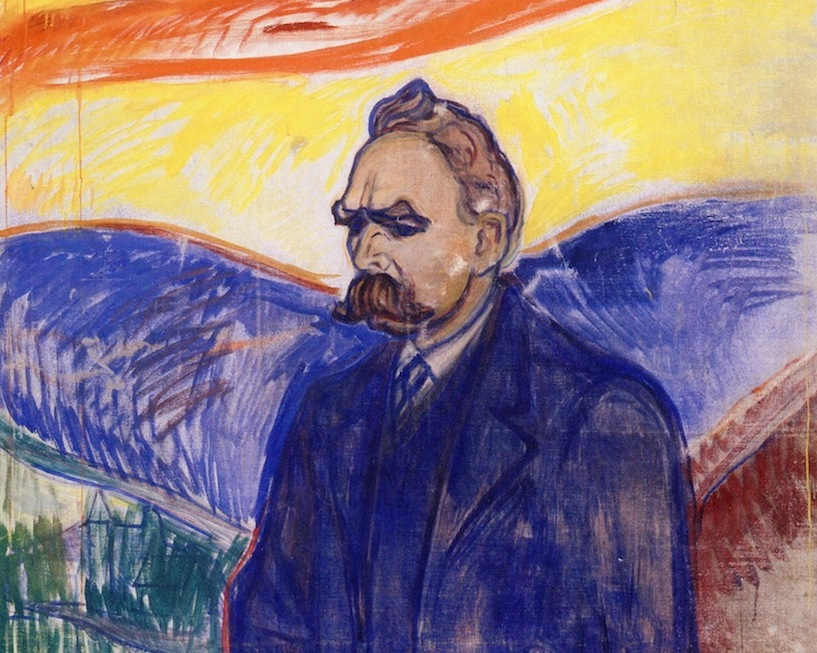

The Piazza Carlo Alberto in Turin, Italy, 1889: a troubled Friedrich Nietzsche sees a horse being flogged by its frustrated owner, whinnying in pain and distress. Unable to bear the sight for a moment longer, Nietzsche rushes over and attempts to protectively throw his arms around the horse’s neck. A brief commotion, and Nietzsche collapses to the ground. 

Shortly afterwards, alerted to a public disturbance, two policemen escort Nietzsche away.

Thus marks the beginning of 11 years of incoherent seclusion, during which the great philosopher-poet Friedrich Nietzsche — descended from dizzying intellectual heights to the depths of insanity — never writes another publishable word...

.")

## Not being, but becoming: values shaped by suffering

While what really happened on that day in 1889 Turin remains unverified, this tale of Nietzsche’s sudden mental breakdown at the age of 44 has been oft-repeated following his death 11 years later in 1900.

Originally, the cause of Nietzsche’s decline in both mental and physical health was attributed to tertiary syphilis. However, this diagnosis has since been judged as almost certainly incorrect. 

The latest verdict, according to the philosopher Charlie Heunemann in his 2013 essay _Nietzsche’s Illness_ (which features in <a target="_blank" rel="noopener noreferrer sponsored" href="http://www.amazon.com/Oxford-Handbook-Nietzsche-Handbooks/dp/019877673X?crid=2E7HX4I01D34E&keywords=the+oxford+handbook+of+nietzsche&qid=1656080884&sprefix=the+oxford+handbook+of+nietzsch%2Caps%2C199&sr=8-1&linkCode=ll1&tag=philosophybre-20&linkId=a9a7719e1842c33076ee84bbf34bcd22&language=en_US&ref_=as_li_ss_tl">The Oxford Handbook of Nietzsche</a>), is that Nietzsche was in all likelihood suffering from a _retro-orbital meningioma_, a tumor on the surface of the brain which can grow continuously over a lifetime. 

This diagnosis fits the lifelong symptoms Nietzsche suffered before his collapse: chronic headaches, vomiting, acute eye pain (and eventual blindness in the right eye), as well as various impairments on the left side of his body. 

If left untreated, meningiomas can also lead to bouts of manic behavior and extremely anxious paranoia, hints of which are scattered across Nietzsche’s writings in the years leading up to his collapse, especially in his letters and works of 1888. 

Regardless of its cause, Nietzsche’s tragic descent into insanity places a moving and sometimes disturbing lens on the many references to ‘madness’ that appear throughout his works. 

In his 1881 work <a target="_blank" rel="noopener noreferrer sponsored" href="https://www.amazon.com/Daybreak-Thoughts-Prejudices-Cambridge-Philosophy/dp/0521599636?&linkCode=ll1&tag=philosophybre-20&linkId=8b7424375dc038acace05d69269b4713&language=en_US&ref_=as_li_ss_tl">Daybreak</a>, for instance, Nietzsche writes: 

>Wherever there is madness there is also a grain of genius and wisdom… All superior men who were irresistibly drawn to throw off the yoke of any kind of morality and to frame new laws had, _if they were not actually mad_, no alternative but to make themselves or pretend to be mad. 

While most scholars regard Nietzsche’s eventual mental breakdown as unrelated to his philosophy (though historically some have argued it was actually an inevitable consequence), there is no doubt that the bouts of ill health Nietzsche suffered throughout his lifetime had a profound impact on his work. 

As Heunemann puts it, 

>No philosopher ever suffered as Nietzsche suffered. 

Nietzsche’s lifelong eye condition made reading and writing difficult, meaning most of his research was painful and his books had to be dictated. 

As he got older, the migraines he’d had all his life became ever more severe, confining him to his darkened quarters for days and sometimes weeks on end, vomiting and depressed. 

By 1879, Nietzsche estimated he lost about one-third of each year to such episodes. Somehow, amidst all this painful disruption, he managed to publish more than a dozen profoundly original books.

## ‘Health’ as a foundational Nietzschean value

Suffering such intense physical discomfort meant that health was a huge preoccupation for Nietzsche, so much so that ‘health’ arguably becomes _the_ foundational value throughout his work, replacing the more conventional values used by other philosophers, like ‘the good’, ‘knowledge’, or ‘truth’. 

Heunemann goes as far to say that Nietzsche’s 

>philosophy as a whole — and his life, come to think of it — were aimed at regaining health after suffering debilitating sickness and finding ways to maintain or enhance one’s health when challenged with injury. 

For instance, in his 1882 book <a target="_blank" rel="noopener noreferrer sponsored" href="http://www.amazon.com/gp/product/0394719859/ref=as_li_tl?ie=UTF8&tag=philosophybre-20&camp=1789&creative=9325&linkCode=as2&creativeASIN=0394719859&linkId=56f8e2d8aef7bc2ab60d5aed696e0fdf">The Gay Science</a>, Nietzsche writes:

>From such abysses, from such severe sickness… one must return _newborn_, having shed one’s skin, more ticklish and malicious, with a more delicate taste for joy, with a tenderer tongue for all good things, with merrier senses, with a second dangerous innocence in joy, more childlike and yet a hundred times subtler than one has ever been before.

On emerging from his frequent episodes of illness, Nietzsche would feel a surge of wellness, of life beginning anew, and would bestride sunlit mountainsides in the Swiss Alps thinking about the cyclical beauty of euphoria and suffering. 

“That which does not destroy me,” he summarizes in a famous aphorism, “makes me stronger.” 

Considering this routine of extremes, it is little wonder that a recurring theme throughout Nietzsche’s works is the advocation of the idea that, rather than passively _being_, life is about actively self-overcoming, of ascending great heights to _become who we really are._ 

Heunemann argues that Nietzsche’s task, both in his personal life and through his philosophy, was to

>compose one’s attitude to make recovery more predominant than resentment.

Nietzsche could not just sit there in his darkened quarters suffering. He needed a framework that lent meaning, even _purpose_, to his suffering — for, as he puts it in <a target="_blank" rel="noopener noreferrer sponsored" href="https://www.amazon.com/Nietzsche-Anti-Christ-Twilight-Cambridge-Philosophy/dp/0521016886?&linkCode=ll1&tag=philosophybre-20&linkId=87e4680fa2bf9969e82dc6acca3a2266&language=en_US&ref_=as_li_ss_tl">Twilight of the Idols</a>, 

>He who has a why to live can bear almost any how. 

How could his suffering be framed as an _opportunity_, rather than pointless, meaningless pain? How could his spirit grow back stronger and healthier even as his body failed him? 

Nietzsche’s philosophical task simply extends this personal objective to humanity as a whole, Heunemann thinks. 

How can the human race emerge stronger from the recognition of its highly limited and pointless existence? How can it do away with the crutches of superstitious beliefs without succumbing to despair? How can we evolve our philosophy, culture, and values to face up to the problem of nihilism? 

<!--big subscribe-->

    
    <h4>From the Buddha to Nietzsche: join 7,000+ subscribers enjoying my free Sunday Breakdown</h4>
    
In one concise email each Sunday, I break down a famous idea from philosophy. You get the distillation straight to your inbox.

    

        <form action="https://app.convertkit.com/forms/5812400/subscriptions" method="post" data-sv-form="5812400" data-uid="be0e52d3c0" data-format="inline" data-version="6" data-options="{&quot;settings&quot;:{&quot;after_subscribe&quot;:{&quot;action&quot;:&quot;message&quot;,&quot;success_message&quot;:&quot;Thank you, philosopher! Your welcome email will land in your inbox shortly.&quot;,&quot;redirect_url&quot;:&quot;https://philosophybreak.com/thank-you/&quot;},&quot;analytics&quot;:{&quot;google&quot;:null,&quot;fathom&quot;:null,&quot;facebook&quot;:null,&quot;segment&quot;:null,&quot;pinterest&quot;:null,&quot;sparkloop&quot;:null,&quot;googletagmanager&quot;:null},&quot;modal&quot;:{&quot;trigger&quot;:&quot;timer&quot;,&quot;scroll_percentage&quot;:null,&quot;timer&quot;:5,&quot;devices&quot;:&quot;all&quot;,&quot;show_once_every&quot;:15},&quot;powered_by&quot;:{&quot;show&quot;:false,&quot;url&quot;:&quot;https://convertkit.com/features/forms?utm_campaign=poweredby&amp;utm_content=form&amp;utm_medium=referral&amp;utm_source=dynamic&quot;},&quot;recaptcha&quot;:{&quot;enabled&quot;:false},&quot;return_visitor&quot;:{&quot;action&quot;:&quot;show&quot;,&quot;custom_content&quot;:&quot;&quot;},&quot;slide_in&quot;:{&quot;display_in&quot;:&quot;bottom_right&quot;,&quot;trigger&quot;:&quot;timer&quot;,&quot;scroll_percentage&quot;:null,&quot;timer&quot;:5,&quot;devices&quot;:&quot;all&quot;,&quot;show_once_every&quot;:15},&quot;sticky_bar&quot;:{&quot;display_in&quot;:&quot;top&quot;,&quot;trigger&quot;:&quot;timer&quot;,&quot;scroll_percentage&quot;:null,&quot;timer&quot;:5,&quot;devices&quot;:&quot;all&quot;,&quot;show_once_every&quot;:15}},&quot;version&quot;:&quot;6&quot;}" min-width="400 500 600 700 800">
        
<ul data-element="errors" data-group="alert"></ul>

            

                <input name="email_address" aria-label="Your Email Address..." placeholder="Your Email Address..." required type="email" />
            

            <button class="button primary" type="submit" data-element="submit">

<svg xmlns="http://www.w3.org/2000/svg" viewBox="0 0 512 512"><path d="M464 64H48C21.49 64 0 85.49 0 112v288c0 26.51 21.49 48 48 48h416c26.51 0 48-21.49 48-48V112c0-26.51-21.49-48-48-48zm0 48v40.805c-22.422 18.259-58.168 46.651-134.587 106.49-16.841 13.247-50.201 45.072-73.413 44.701-23.208.375-56.579-31.459-73.413-44.701C106.18 199.465 70.425 171.067 48 152.805V112h416zM48 400V214.398c22.914 18.251 55.409 43.862 104.938 82.646 21.857 17.205 60.134 55.186 103.062 54.955 42.717.231 80.509-37.199 103.053-54.947 49.528-38.783 82.032-64.401 104.947-82.653V400H48z"/></svg>Join 7,000+ Subscribers</button>
            

            

        </form>
        
One short philosophical email each Sunday. Unsubscribe any time.

    

## Nietzsche’s early life, losing faith, and discovering Schopenhauer

Nietzsche was born in 1844 in the town of Röcken, near Leipzig, in the then Prussian (now German) state of Saxony. Nietzsche’s father, a Lutheran pastor and former teacher, died from ‘softness on the brain’ (a brain tissue ailment) when Nietzsche was just four years old, and Nietzsche’s younger brother died only 6 months later, casting a shadow on his childhood and leaving Nietzsche with his widowed mother, Franziska, and younger sister, Elisabeth. 

As his father had worked for the state, Nietzsche received a scholarship to study at the well-respected boarding school Schulpforta between 1858 to 1864. 

While there, he learned Greek, Latin, Hebrew, and French, and led a music and literature club named ‘Germania’, becoming a highly-skilled piano player, ambitious songwriter, and admirer of the music of German composer Richard Wagner — a figure who would later come to dominate Nietzsche’s social life and philosophy. 

After graduating from Schulpforta in 1864, Nietzsche began studying theology and classical philology at the University of Bonn, with hopes of following in his father’s footsteps and becoming a minister. 

Just one semester later, he ceased his theological studies and lost his faith. Writing to his deeply religious sister Elisabeth to explain his decision, a 20-year-old Nietzsche declared: 

>Hence the ways of men part: if you wish to strive for peace of soul and pleasure, then believe; if you wish to be a devotee of truth, then inquire…

Nietzsche’s interests now lay exclusively in philology (the study of language in historical texts), in large part due to studying under Professor Friedrich Wilhelm Ritschl, whom Nietzsche followed to the University of Leipzig in 1865. 

There, Nietzsche quickly developed an academic reputation for himself with essays on classical poets Theognis and Simonides, as well as the ancient philosopher Aristotle (see our reading list of [Aristotle’s best books here](/reading-lists/aristotle/)). 

An important event for the development of Nietzsche’s thought at Leipzig was the accidental discovery of the great pessimist Arthur Schopenhauer’s 1818 philosophical masterwork, <a target="_blank" rel="noopener noreferrer sponsored" href="https://www.amazon.com/World-Will-Representation-Vol/dp/0486217612?&linkCode=ll1&tag=philosophybre-20&linkId=71603ff000e7e035eb65926519bb5b3d&language=en_US&ref_=as_li_ss_tl">The World as Will and Representation</a>, in a local bookshop.

")

“I do not know what demon suggested I take the book home with me,” Nietzsche later wrote in his journal, but he acted on the suggestion, hungrily consumed the work, and acknowledged how he “gave [himself] over to that gloomy genius”. 

In Schopenhauer, the 21-year-old Nietzsche found a kindred spirit whose pessimistic worldview that _life is suffering_ (yet partially redeemable through art, especially music) captured Nietzsche’s imagination: 

>From every line I heard the cry of renouncement, denial, and resignation. I saw in the book a mirror in which the world, life itself, and my own soul were all reflected with horrifying fidelity.

## An academic prodigy, and meeting Wagner

In 1867, Nietzsche enrolled in required military service, but was soon discharged after suffering a serious chest injury attempting to leap-mount a horse. His injury left him unable to walk for months, and continued to ail him throughout his lifetime. 

Obtaining sick leave from military services, he returned to Leipzig to resume his studies, and in 1869 — on the strength of his work and growing academic reputation — received an offer to become a professor of classical philology at the University of Basel in Switzerland. 

Aged just 24 at the time, Nietzsche remains one of the youngest ever Classics professors to be awarded tenure on record. 

Nietzsche’s move to Basel led to a momentous development in his relationship with the composer Richard Wagner, a true celebrity of his day and 30 years Nietzsche’s senior.

")

The two had briefly met at a gathering in 1868, where Nietzsche’s thralldom with Wagner and enthusiasm regarding Schopenhauer had led to the older man extending an invitation to his house in Tribschen in Lucerne. Nietzsche began visiting the household regularly, forging a strong bond with both Wagner and the composer’s soon-to-be wife, Cosima. 

Nietzsche saw in Wagner a true free spirit. Here was a man who rather than conform to society’s expectations lived by his own values, whose genius at composing music lent meaning to suffering and transcendence to the everyday. 

This man, thought Nietzsche, was humanity’s best hope for restoring art to its glory days of the ancient Greek tragedies. Never since had art met such heights, but with Wagner — who shared Nietzsche’s view — it was possible. 

That Nietzsche saw not just a genius artist but a potential surrogate father in Wagner was not lost on the composer. The relationship between the two was never that of peers, but of the devoted and the devotee, with Nietzsche craving the approval of and often running errands for Wagner and Cosima. 

Indeed, the Wagners didn’t cultivate intimacy with the talented young professor just because they enjoyed his company: they saw an opportunity for the promotion and philosophical justification of Wagner’s artistic legacy.

## The Birth of Tragedy, and of independence

Over the next few years, Nietzsche became increasingly involved in the Wagners’ inner circle. This culminated in the 1872 publication of Nietzsche’s first book, <a target="_blank" rel="noopener noreferrer sponsored" href="https://www.amazon.com/Birth-Tragedy-Spirit-Penguin-Classics/dp/0140433392?&linkCode=ll1&tag=philosophybre-20&linkId=46b3fb5ce95f795e09b414d683d49a59&language=en_US&ref_=as_li_ss_tl">The Birth of Tragedy</a>, in which he outlines his idea that great art involves the careful interplay between two core elements of the human psyche, the Apollonian (which promotes order, symmetry, and harmony) and the Dionysian (which stands for violent chaos and intoxication). 

This controversial work was far from what Nietzsche’s colleagues in the philology department at the University of Basel were expecting as his debut publication, and the book was widely criticized. 

The Wagners, by contrast, praised the work, with Cosima describing it as the clearest expression of ‘Wagnerian’ thought. 

This mixed reception had the dual effect of, on the one hand, distancing a disillusioned Nietzsche from his academic colleagues (he sought a transfer to the philosophy department, which was denied). 

On the other hand, Cosima’s intended praise potentially alerted Nietzsche to the possibility that his thinking was not fully his own.

## Untimely Meditations

Between 1873 and 1876 Nietzsche published four long essays which collectively became known as his <a target="_blank" rel="noopener noreferrer sponsored" href="http://www.amazon.com/Nietzsche-Untimely-Meditations-Cambridge-Philosophy/dp/0521585848?keywords=untimely+meditations+nietzsche&qid=1650787731&sprefix=untime%2Caps%2C164&sr=8-1&linkCode=ll1&tag=philosophybre-20&linkId=9555cc9495e8057117e7a260abdd6cea&language=en_US&ref_=as_li_ss_tl">Untimely Meditations</a>. Intended for a broad audience, they included reflections on Schopenhauer and Wagner (‘Schopenhauer as Educator’ and ‘Richard Wagner in Bayreuth’) which, though mainly positive, foreshadowed a growing detachment from his idols and independence in Nietzsche’s thought. 

Wagner’s 1876 Bayreuth music festival only accelerated this detachment. While Nietzsche had enthusiastically assisted the Wagners in their planning of the Bayreuth opera house project, he was left disappointed by its opening in 1876, feeling the cultural atmosphere did not meet the artistic aspirations he thought were shared between himself and the Wagners — appealing too much, in Nietzsche’s view, to an unhealthy nationalistic German (and ‘plebeian’) spirit. 

The Wagners’ perceived use for Nietzsche dwindled, and he was distanced from the inner circle.

## Human, All Too Human

As his relationship with the Wagners soured, Nietzsche’s health also took a downward turn, which forced him to take leave from his professorship at Basel. He spent the time developing a naturalistic critique of traditional morality and culture, which resulted in the publication of his second full-length book, <a target="_blank" rel="noopener noreferrer sponsored" href="https://www.amazon.com/Human-All-Too-Spirits-Revised/dp/0803283687?&linkCode=ll1&tag=philosophybre-20&linkId=0b44aea23ad08af64e0b581d3141cdad&language=en_US&ref_=as_li_ss_tl">Human, All Too Human</a> in 1878. 

With this work, Nietzsche established two things that would become recurrent throughout his books. Firstly, his trademark style of writing in short, numbered, explosive paragraphs and pithy aphorisms. Secondly, his sustained attacks on conventions — especially religion and traditional morality. 

In <a target="_blank" rel="noopener noreferrer sponsored" href="https://www.amazon.com/Human-All-Too-Spirits-Revised/dp/0803283687?&linkCode=ll1&tag=philosophybre-20&linkId=0b44aea23ad08af64e0b581d3141cdad&language=en_US&ref_=as_li_ss_tl">Human, All Too Human</a>, Nietzsche also explicitly reacts against the pessimistic philosophy of Schopenhauer and Wagner — crudely cloaking his references to the latter as “the artist” — effectively ending his friendship with the composer. 

Having sent his book to the Wagners and simultaneously receiving from them the libretto for Wagner’s new opera _Parsifal_, Nietzsche later wrote the two works crossed in the mail 

>as if two swords had crossed.

Despite his academic leave, Nietzsche’s health did not improve, and he was forced to resign his professorship altogether in 1879, aged just 34. 

Thus began Nietzsche’s wandering years, living a sparse existence off his meager university pension, and the occasional generosity of friends. 

## Nietzsche’s most productive decade

Now free to think and write independently, Nietzsche frequently traveled in an attempt to find climates that eased his health problems (and perhaps also to escape the rather vicious rumor that the increasingly antisemitic Wagner had bitterly begun to spread about him: that Nietzsche’s eye problems came from too much masturbation, that his excessive masturbation came from a fear of having sex with women, that this fear came from a hidden homosexuality, and that this hidden homosexuality explained his long-term friendship with ‘that Jew’ philosopher Paul Rée. An absurd and spiteful rumor, but one that did circulate for a while and affect Nietzsche’s social life). 

The isolated, suffering Nietzsche eventually settled into a pattern where he spent his summers in Sils Maria, a small village in the Swiss Alps where nobody knew who he was, and wintered near the Mediterranean, typically in Italy.

During the summers, and health permitting, Nietzsche hiked in the Swiss Alps almost daily, and the majesty of the mountains inspired the bulk of Nietzsche’s most enduring and profound ideas, including [the death of God](/articles/god-is-dead-nietzsche-famous-statement-explained/), the [eternal recurrence](/articles/eternal-recurrence-what-did-nietzsche-really-mean/), [_amor fati_](/articles/amor-fati-the-stoics-and-nietzsche-different-takes-on-loving-fate/) the [Übermensch](/articles/ubermensch-explained-the-meaning-of-nietzsches-superman/), the slave revolt in morals, perspectivism, and the will to power. 

Writing later in his philosophical autobiography <a target="_blank" rel="noopener noreferrer sponsored" href="https://www.amazon.com/Nietzsche-Anti-Christ-Twilight-Cambridge-Philosophy/dp/0521016886?&linkCode=ll1&tag=philosophybre-20&linkId=87e4680fa2bf9969e82dc6acca3a2266&language=en_US&ref_=as_li_ss_tl">Ecce Homo</a>, Nietzsche draws a comparison between his works and the mountains that characterized them (in a typically compelling statement that features in our list of [Nietzsche’s best quotes](/articles/nietzsche-quotes-97-of-his-cleverest-statements/)):

>Those who can breathe the air of my writings know that it is an air of the heights, a strong air. One must be made for it. Otherwise there is no small danger that one might catch cold in it. The ice is near, the solitude tremendous — but how calmly all things lie in the light. How freely one breathes! How much one feels beneath oneself.

Nietzsche’s startling productivity in the 1880s began with the 1881 publication of <a target="_blank" rel="noopener noreferrer sponsored" href="https://www.amazon.com/Daybreak-Thoughts-Prejudices-Cambridge-Philosophy/dp/0521599636?&linkCode=ll1&tag=philosophybre-20&linkId=8b7424375dc038acace05d69269b4713&language=en_US&ref_=as_li_ss_tl">Daybreak</a>, a work which critically investigates morality and its psychological undercurrents. 

New books then followed almost every year until Nietzsche’s collapse in 1889, including those he is best known for, many of which appear in our reading list of [Nietzsche’s best books](/reading-lists/friedrich-nietzsche/): <a target="_blank" rel="noopener noreferrer sponsored" href="https://www.amazon.com/Gay-Science-Prelude-Rhymes-Appendix/dp/0394719859?&linkCode=ll1&tag=philosophybre-20&linkId=3c4dafed47ee00e7a6b9e9cfe65378e9&language=en_US&ref_=as_li_ss_tl">The Gay Science</a> (1882), <a target="_blank" rel="noopener noreferrer sponsored" href="https://www.amazon.com/gp/product/0140441182?&linkCode=ll1&tag=philosophybre-20&linkId=e08afd371adcb4ca929948fef1ea6124&language=en_US&ref_=as_li_ss_tl">Thus Spoke Zarathustra</a> (1883–5), <a target="_blank" rel="noopener noreferrer sponsored" href="https://www.amazon.com/gp/product/0679724656?&linkCode=ll1&tag=philosophybre-20&linkId=5ecc29f1c46a78a5417cf851de9c9757&language=en_US&ref_=as_li_ss_tl">Beyond Good and Evil</a> (1886), <a target="_blank" rel="noopener noreferrer sponsored" href="https://www.amazon.com/gp/product/0141195371?&linkCode=ll1&tag=philosophybre-20&linkId=5ec5912e78e9d6bbdff90712b3dca5ea&language=en_US&ref_=as_li_ss_tl">On the Genealogy of Morality</a> (1887), and in his final active year <a target="_blank" rel="noopener noreferrer sponsored" href="https://www.amazon.com/Nietzsche-Anti-Christ-Twilight-Cambridge-Philosophy/dp/0521016886?&linkCode=ll1&tag=philosophybre-20&linkId=87e4680fa2bf9969e82dc6acca3a2266&language=en_US&ref_=as_li_ss_tl">Twilight of the Idols</a> (1888) and The Wagner Case (1888), along with <a target="_blank" rel="noopener noreferrer sponsored" href="https://www.amazon.com/Nietzsche-Anti-Christ-Twilight-Cambridge-Philosophy/dp/0521016886?&linkCode=ll1&tag=philosophybre-20&linkId=87e4680fa2bf9969e82dc6acca3a2266&language=en_US&ref_=as_li_ss_tl">The Antichrist</a> and <a target="_blank" rel="noopener noreferrer sponsored" href="https://www.amazon.com/Nietzsche-Anti-Christ-Twilight-Cambridge-Philosophy/dp/0521016886?&linkCode=ll1&tag=philosophybre-20&linkId=87e4680fa2bf9969e82dc6acca3a2266&language=en_US&ref_=as_li_ss_tl">Ecce Homo</a>, which were published only following Nietzsche’s breakdown. 

The majority of these books follow the aphoristic style and critiques of conventional morality, religion, and truth-seeking that Nietzsche established in <a target="_blank" rel="noopener noreferrer sponsored" href="https://www.amazon.com/Human-All-Too-Spirits-Revised/dp/0803283687?&linkCode=ll1&tag=philosophybre-20&linkId=0b44aea23ad08af64e0b581d3141cdad&language=en_US&ref_=as_li_ss_tl">Human, All Too Human</a>, with two notable exceptions. 

Firstly, <a target="_blank" rel="noopener noreferrer sponsored" href="https://www.amazon.com/gp/product/0140441182?&linkCode=ll1&tag=philosophybre-20&linkId=e08afd371adcb4ca929948fef1ea6124&language=en_US&ref_=as_li_ss_tl">Thus Spoke Zarathustra</a> is a densely lyrical, epic prose-poem that Nietzsche regarded as his philosophical masterpiece (while some scholars agree with this judgment, many see it more as a literary achievement, with his philosophy better expressed elsewhere). 

Aping the New Testament in style, it follows the journey of a prophet named Zarathustra who comes down from the mountains to share his “philosophy of the future” (the parallels with Nietzsche’s own life are not, one might suspect, accidental). 

<a target="_blank" rel="noopener noreferrer sponsored" href="https://www.amazon.com/gp/product/0140441182?&linkCode=ll1&tag=philosophybre-20&linkId=e08afd371adcb4ca929948fef1ea6124&language=en_US&ref_=as_li_ss_tl">Thus Spoke Zarathustra</a> is a challenging read and widely open to interpretation, with the key theme being that we must overcome all past value systems and cultivate self-affirmation — a theme embodied by [Nietzsche’s character of the Übermensch](/articles/ubermensch-explained-the-meaning-of-nietzsches-superman/), as well as his idea of [the eternal recurrence](/articles/eternal-recurrence-what-did-nietzsche-really-mean/).

The second exception to the aphoristic style rule is Nietzsche’s 1887 <a target="_blank" rel="noopener noreferrer sponsored" href="https://www.amazon.com/gp/product/0141195371?&linkCode=ll1&tag=philosophybre-20&linkId=5ec5912e78e9d6bbdff90712b3dca5ea&language=en_US&ref_=as_li_ss_tl">On the Genealogy of Morality</a>, which consists of three longer-form essays and is widely considered (alongside <a target="_blank" rel="noopener noreferrer sponsored" href="https://www.amazon.com/gp/product/0679724656?&linkCode=ll1&tag=philosophybre-20&linkId=5ecc29f1c46a78a5417cf851de9c9757&language=en_US&ref_=as_li_ss_tl">Beyond Good and Evil</a>, of which it was planned as an accompaniment) to be one of Nietzsche’s most important works — if not _the_ most important. 

The Genealogy offers a sustained critique and history of morality, and is among the most studied of Nietzsche’s books today, containing Nietzsche’s discussion of “master” and “slave” morality, and the ascetic ideal.

<!--nietzsche-->

<h4>Your Myth-Busting Guide to Nietzsche & His 5 Greatest Ideas</h4>
From God is dead to the Übermensch, learn everything you need to know about Friedrich Nietzsche with our concise online guide.
<a class="button primary" href="/introduction-to-nietzsche/"><svg xmlns="http://www.w3.org/2000/svg" viewBox="0 0 512 512"><path d="M504 256C504 119 393 8 256 8S8 119 8 256s111 248 248 248 248-111 248-248zm-448 0c0-110.5 89.5-200 200-200s200 89.5 200 200-89.5 200-200 200S56 366.5 56 256zm72 20v-40c0-6.6 5.4-12 12-12h116v-67c0-10.7 12.9-16 20.5-8.5l99 99c4.7 4.7 4.7 12.3 0 17l-99 99c-7.6 7.6-20.5 2.2-20.5-8.5v-67H140c-6.6 0-12-5.4-12-12z"></path></svg>Get Instant Access</a>
&#9733;&#9733;&#9733;&#9733;&#9733; (50+ reviews for our courses)

## Romantic rejection, and increasing mania

Now, while he was mostly solitary during the epiphanic period in which he produced his most significant works, Nietzsche did have occasional visits from friends, and one particularly noteworthy relationship was that cultivated between Nietzsche, Paul Rée (of Wagner’s malicious rumor), and the brilliant young Russian student, Lou Salomé, who went on to become a renowned psychoanalyst and writer.

The three initially planned to live and work together in an intellectual trinity, but Nietzsche and Rée soon each developed feelings for Salomé. 

Salomé received marriage proposals from both men — and declined both. She wanted instead to pursue the idea of a celibate intellectual trinity.

At first, it seems Nietzsche was able to take this situation rather lightly, as suggested by the following famous photograph of the three of them together in Lucerne:

.")

However, jealousies among the group soon reached boiling point, and Salomé eventually left for Berlin — accompanied by Rée. 

Nietzsche was distraught by what he saw as a total rejection from his friends, and some scholars suggest it was the bitterness from this encounter that fueled many of the tirades against women that litter Nietzsche’s works. 

Salomé would later go on to write a short biography of Nietzsche and his philosophy, and became close to two thinkers deeply influenced by him, the poet Rainer Maria Rilke and psychologist Sigmund Freud. 

Recalling a hike she’d embarked on with Nietzsche, Salomé writes: 

>At first, he fashioned the mystical superior-human ideal through self-intoxicated fantasy, dreams, and rapture-like visions; and then, in order to save himself from himself, he sought to identify himself with them through one tremendous leap. Finally, he became a dual figure — half sick and suffering; half saved; a laughing and superior human. The one is like a creature, the other a creator; the one assumes a reality and the other a mystical sur-reality.

Salomé’s rather disturbing characterization captures the Nietzsche of this period: while his thinking became ever more original and the depths of his insights ever more profound, the _retro-orbital meningioma_ on his brain never stopped growing, and his health never stopped declining.

## Nietzsche’s leap

By the end of 1888, Nietzsche was displaying symptoms of potential mania in both his behavior (in Turin he would reputedly play Wagner’s music on the piano from memory very loudly and for hours at a time) as well as in his works (particularly his philosophical autobiography <a target="_blank" rel="noopener noreferrer sponsored" href="https://www.amazon.com/Nietzsche-Anti-Christ-Twilight-Cambridge-Philosophy/dp/0521016886?&linkCode=ll1&tag=philosophybre-20&linkId=87e4680fa2bf9969e82dc6acca3a2266&language=en_US&ref_=as_li_ss_tl">Ecce Homo</a>, which features chapter titles such as ‘Why I Am So Wise’, ‘Why I Am So Clever’, ‘Why I Write Such Good Books’, and ‘Why I Am a Destiny’).

In his 2018 work <a target="_blank" rel="noopener noreferrer sponsored" href="http://www.amazon.com/Hiking-Nietzsche-Becoming-Who-You/dp/1250234689?&linkCode=ll1&tag=philosophybre-20&linkId=36a6c3e7e958d38ec31cc16cfbb92854&language=en_US&ref_=as_li_ss_tl">Hiking with Nietzsche</a>, the philosopher John Kaag reflects on the events that took place just before Nietzsche’s collapse, and in considering the philosopher’s ravings in <a target="_blank" rel="noopener noreferrer sponsored" href="https://www.amazon.com/Nietzsche-Anti-Christ-Twilight-Cambridge-Philosophy/dp/0521016886?&linkCode=ll1&tag=philosophybre-20&linkId=87e4680fa2bf9969e82dc6acca3a2266&language=en_US&ref_=as_li_ss_tl">Ecce Homo</a> recalls the myth of the ancient Greek poet Empedocles. 

It is said that Empedocles died by intentionally leaping into a volcano, attempting to prove he’d transcended life’s long suffering. The volcano consumes him, spitting out only a single bronze sandal that falls from the skies. 

“Empedocles’s shoe is all that remains of his fatal or divine experiment,” Kaag remarks, continuing:

>Perhaps _Ecce Homo_ is Nietzsche’s version of Empedocles’s leap. He doesn’t slip; he knows exactly what he is doing. It looks like madness, and perhaps it is, but it is _his_ madness…

“Or perhaps,” Kaag laments, “_Ecce Homo_ is simply Nietzsche’s sandal.” 

Be it on some level willed, or wholly the result of his physical ailments, Nietzsche’s episode with the horse and consequent mental breakdown in Turin in January 1889 marks the end of his productive output — and of his sanity. 

“The line between madness and profundity,” Kaag concludes, 

>is a faint thread high in the mountains that eventually disappears.

Upon receiving letters where Nietzsche had repeatedly signed off his name as ‘Dionysus’, Nietzsche’s close friend Franz Overbeck rushed to Turin to find him raving and incoherent. After unsuccessful treatment in Basel and Jena, Nietzsche’s mother (and later his sister) took over his care. 

Eventually lapsing entirely into silence, Nietzsche lived on until 1900, when he died of a stroke complicated by pneumonia.

## Nietzsche’s legacy

Though Nietzsche’s works were hardly read during his own sane lifetime — <a target="_blank" rel="noopener noreferrer sponsored" href="https://www.amazon.com/gp/product/0679724656?&linkCode=ll1&tag=philosophybre-20&linkId=5ecc29f1c46a78a5417cf851de9c9757&language=en_US&ref_=as_li_ss_tl">Beyond Good and Evil</a> sold just a few hundred copies when Nietzsche initially self-published it — he never doubted that he and his ideas would one day become famous. 

Writing in <a target="_blank" rel="noopener noreferrer sponsored" href="https://www.amazon.com/Nietzsche-Anti-Christ-Twilight-Cambridge-Philosophy/dp/0521016886?&linkCode=ll1&tag=philosophybre-20&linkId=87e4680fa2bf9969e82dc6acca3a2266&language=en_US&ref_=as_li_ss_tl">Ecce Homo</a>, he declares:

>I know my fate. One day my name will be associated with the memory of something tremendous — a crisis without equal on earth, the most profound collision of conscience, a decision that was conjured up against everything that had been believed, demanded, hallowed so far. I am no man, I am dynamite.

Considering the atrocities that were to follow in the 20th century, these prophetic words were — tragically — fulfilled by a project that would have horrified and appalled Nietzsche: Nazi Germany. 

That no one can control their legacy is an especially unfortunate truth in Nietzsche’s case, for during his illness his literary estate fell into the hands of sister, Elisabeth.

<!--small subscribe-->

    <h4>In one concise email each Sunday, I break down a famous idea from philosophy. You get the distillation straight to your inbox:</h4>
    

        <form action="https://app.convertkit.com/forms/5812400/subscriptions" method="post" data-sv-form="5812400" data-uid="be0e52d3c0" data-format="inline" data-version="6" data-options="{&quot;settings&quot;:{&quot;after_subscribe&quot;:{&quot;action&quot;:&quot;message&quot;,&quot;success_message&quot;:&quot;Thank you, philosopher! Your welcome email will land in your inbox shortly.&quot;,&quot;redirect_url&quot;:&quot;https://philosophybreak.com/thank-you/&quot;},&quot;analytics&quot;:{&quot;google&quot;:null,&quot;fathom&quot;:null,&quot;facebook&quot;:null,&quot;segment&quot;:null,&quot;pinterest&quot;:null,&quot;sparkloop&quot;:null,&quot;googletagmanager&quot;:null},&quot;modal&quot;:{&quot;trigger&quot;:&quot;timer&quot;,&quot;scroll_percentage&quot;:null,&quot;timer&quot;:5,&quot;devices&quot;:&quot;all&quot;,&quot;show_once_every&quot;:15},&quot;powered_by&quot;:{&quot;show&quot;:false,&quot;url&quot;:&quot;https://convertkit.com/features/forms?utm_campaign=poweredby&amp;utm_content=form&amp;utm_medium=referral&amp;utm_source=dynamic&quot;},&quot;recaptcha&quot;:{&quot;enabled&quot;:false},&quot;return_visitor&quot;:{&quot;action&quot;:&quot;show&quot;,&quot;custom_content&quot;:&quot;&quot;},&quot;slide_in&quot;:{&quot;display_in&quot;:&quot;bottom_right&quot;,&quot;trigger&quot;:&quot;timer&quot;,&quot;scroll_percentage&quot;:null,&quot;timer&quot;:5,&quot;devices&quot;:&quot;all&quot;,&quot;show_once_every&quot;:15},&quot;sticky_bar&quot;:{&quot;display_in&quot;:&quot;top&quot;,&quot;trigger&quot;:&quot;timer&quot;,&quot;scroll_percentage&quot;:null,&quot;timer&quot;:5,&quot;devices&quot;:&quot;all&quot;,&quot;show_once_every&quot;:15}},&quot;version&quot;:&quot;6&quot;}" min-width="400 500 600 700 800">
        
<ul data-element="errors" data-group="alert"></ul>

            

                <input name="email_address" aria-label="Your Email Address..." placeholder="Your Email Address..." required type="email" />
            

            <button class="button primary" type="submit" data-element="submit">

<svg xmlns="http://www.w3.org/2000/svg" viewBox="0 0 512 512"><path d="M464 64H48C21.49 64 0 85.49 0 112v288c0 26.51 21.49 48 48 48h416c26.51 0 48-21.49 48-48V112c0-26.51-21.49-48-48-48zm0 48v40.805c-22.422 18.259-58.168 46.651-134.587 106.49-16.841 13.247-50.201 45.072-73.413 44.701-23.208.375-56.579-31.459-73.413-44.701C106.18 199.465 70.425 171.067 48 152.805V112h416zM48 400V214.398c22.914 18.251 55.409 43.862 104.938 82.646 21.857 17.205 60.134 55.186 103.062 54.955 42.717.231 80.509-37.199 103.053-54.947 49.528-38.783 82.032-64.401 104.947-82.653V400H48z"/></svg>Join 7,000+ Subscribers</button>
            

            

        </form>
        
One short philosophical email each Sunday. Unsubscribe any time.

    

## Elisabeth’s warped words

Elisabeth had taken a strikingly different life path to her brother: she remained deeply religious, was caught up in the nationalistic German spirit of the times, and in marrying the prominent antisemite Bernhard Förster (Nietzsche did not attend the wedding) became a leading voice in the ugly antisemitism that had been brewing in Germany for years, championed as it was by well-known figures like Wagner. 

After Nietzsche’s collapse, public interest in his philosophy grew, and Elisabeth sensed an opportunity. 

Nietzsche had left behind mountains of notes, and alluded to a future book that would be titled <a target="_blank" rel="noopener noreferrer sponsored" href="http://www.amazon.com/Will-Power-Friedrich-Nietzsche/dp/1522045473?crid=173NP0C6Q4GN3&keywords=the+will+to+power&qid=1650788473&s=books&sprefix=the+will+to+powe%2Cstripbooks%2C142&sr=1-1&linkCode=ll1&tag=philosophybre-20&linkId=33adb89f044ab17f3f1484ecc3768690&language=en_US&ref_=as_li_ss_tl">The Will to Power: Attempt at a Revaluation of All Values</a>. 

With sales of Nietzsche’s earlier works rising quickly, Elisabeth compiled various parts of the notes her brother had left behind, positioned them with some not-so-subtle antisemitic and nationalistic overtones, and released a new work under Nietzsche’s name and planned title. 

This illegitimate publication opened up Nietzsche’s earlier works to misinterpretation after misinterpretation, with passages routinely pulled out of context to justify antisemitism and German nationalism. 

Meanwhile, Nietzsche was fast becoming a household name in Germany — the government even printed 150,000 copies of <a target="_blank" rel="noopener noreferrer sponsored" href="https://www.amazon.com/gp/product/0140441182?&linkCode=ll1&tag=philosophybre-20&linkId=e08afd371adcb4ca929948fef1ea6124&language=en_US&ref_=as_li_ss_tl">Thus Spoke Zarathustra</a> for soldiers to carry into World War I. 

The lonely, suffering, ignored philosopher of the Swiss Alps had posthumously become a celebrity. 

While hugely influential among artists and intellectuals of the time, Elisabeth’s tampering meant that Nietzsche’s nuanced, brilliant writing was butchered in the public consciousness as essentially a bombastic justification of the following creed: ‘might is right’. 

Elisabeth’s close ties to the Nazi party — Hitler attended her funeral in 1935 — ensured that Nietzsche’s name, in the public mind at least, generally lay closely associated to Nazism, and not much else. 

Thankfully, following the Nazi defeat in World War II, efforts were made to sanitize Nietzsche’s name, not least by the philosopher, translator, and poet Walter Kaufmann.

## The fight for Nietzsche’s voice

Kaufmann recognized that Nietzsche was majorly misunderstood in the English-speaking world, and set out on a long-term campaign to not only provide new English translations of all of Nietzsche’s works, but also guide readers in better understanding the profundity of his ideas.

Nowadays, Nietzsche’s popularity in the English-speaking world is arguably the highest it’s ever been, with lively and productive scholarship regularly offering new and refined interpretations of Nietzsche’s thought. 

Indeed, Nietzsche is celebrated not just as an original and provocative thinker, but as a uniquely brilliant writer. 

Outside philosophy, his style has influenced and been lauded by countless poets, novelists, and essayists. Within philosophy, his literary qualities are arguably unrivaled — and many German critics regard his prose as among the pinnacles of what is possible with the language.

However, despite the growing recognition of Nietzsche’s genius as both a thinker and a writer, he remains widely misunderstood, misinterpreted, and misappropriated by people from all over the philosophical and political spectrum, who wish to elevate their particular cause with the power of his rhetoric. 

With a range of thinking so widespread, and a style of writing so stunningly and wickedly provocative, it is perhaps no surprise that Nietzsche’s iconoclastic, hammering utterances — designed to jolt people out of presuppositions — can be so grossly taken out of context.

Here is a thinker who not only changes his mind on key topics throughout his active philosophical period, but who at times suggests he doesn’t _want_ to be understood, not to be purposefully oblique, but because he thinks his readers are not yet _ready_ for what he has to say.

## Deciphering what Nietzsche really wanted

Writing in the century following Nietzsche, the philosopher Hannah Arendt once commented: “there is no lasting happiness outside the prescribed cycle of painful exhaustion and pleasurable regeneration.” 

Nietzsche sought to defy this pessimism by establishing if not a lasting happiness, then at least a lasting philosophy that lent meaning to the cycle, and built a series of cryptic guidebooks for others seeking such meaning. 

Unfortunately, in the end, Nietzsche’s own life arguably succumbed to the first prong of Arendt’s cycle, culminating as it did in mental collapse. As Heunemann concludes: 

>He thought he had solved the riddle of his own existence. But in fact he was being overcome by a malady that had been progressing over his whole life. And that is a tragic ending if ever there was one: for while Nietzsche was in ardent pursuit of one kind of madness [i.e. the euphoric affirmation of life], he fell victim to another. 

Suffering such intense pain and discomfort throughout his lifetime, it is remarkable that Nietzsche had the energy to even pick up a pen, let alone leave us with such a kaleidoscope of ideas to unpick. 

The task we have in Nietzsche scholarship thus lies in gratefully deciphering exactly what he was trying to tell us, and exploring why his works continue to foment and fascinate today.

## Learn more about Nietzsche’s philosophy, including his 5 most important ideas

This article is an extract from our online guide, [Introduction to Nietzsche and His 5 Greatest Ideas](/introduction-to-nietzsche/), which consists of 42 self-paced, myth-busting lessons on Nietzsche’s fascinating yet much-misunderstood philosophy.

If you found this brief biological sketch interesting, and are curious to learn more about Nietzsche’s actual philosophy — including his perspectivism, critique of morality, and ideas like his Übermensch, eternal recurrence, and will to power — then consider exploring the full guide now. [Introduction to Nietzsche and His 5 Greatest Ideas](/introduction-to-nietzsche/) gets rave reviews (one reader describes it as “the best introduction to Nietzsche I’ve come across”), and might be just what you’re looking for!

<!--nietzsche-->

<h4>Your Myth-Busting Guide to Nietzsche & His 5 Greatest Ideas</h4>
From God is dead to the Übermensch, learn everything you need to know about Friedrich Nietzsche with our concise online guide.
<a class="button primary" href="/introduction-to-nietzsche/"><svg xmlns="http://www.w3.org/2000/svg" viewBox="0 0 512 512"><path d="M504 256C504 119 393 8 256 8S8 119 8 256s111 248 248 248 248-111 248-248zm-448 0c0-110.5 89.5-200 200-200s200 89.5 200 200-89.5 200-200 200S56 366.5 56 256zm72 20v-40c0-6.6 5.4-12 12-12h116v-67c0-10.7 12.9-16 20.5-8.5l99 99c4.7 4.7 4.7 12.3 0 17l-99 99c-7.6 7.6-20.5 2.2-20.5-8.5v-67H140c-6.6 0-12-5.4-12-12z"></path></svg>Get Instant Access</a>
&#9733;&#9733;&#9733;&#9733;&#9733; (50+ reviews for our courses)

