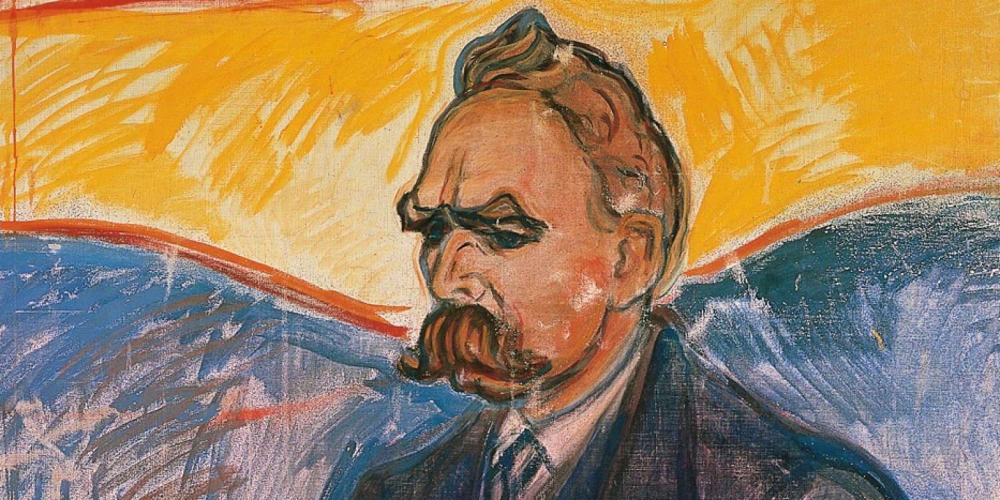

“God is dead,” the German philosopher Friedrich Nietzsche famously declares in his 1882 work, <a target="_blank" rel="noopener noreferrer sponsored" href="http://www.amazon.com/gp/product/0394719859/ref=as_li_tl?ie=UTF8&tag=philosophybre-20&camp=1789&creative=9325&linkCode=as2&creativeASIN=0394719859&linkId=56f8e2d8aef7bc2ab60d5aed696e0fdf">The Gay Science</a>: “God remains dead. And we have killed him.” 

By these words, Nietzsche does not so much mean that atheism is true — indeed, in the passage from which they’re taken, these words are presented as _fresh news_ to a group of atheists — he more means that, because “the belief in the Christian God has become unbelievable”, everything that “was built upon this faith, propped up by it, grown into it”, _including_ “the whole of our European morality,” is destined for “collapse.” 

Nietzsche was writing, of course, in the aftermath of the Enlightenment, a time in which science, mathematics, and philosophy arose across Europe to displace Christianity as the guiding authority on truth about life and the universe. For centuries, Christianity’s teachings about reality — that there exists a Creator outside time and space, and that we should abide by the rules of this Creator to ensure a good afterlife — were entirely dominant. 

However, the scientific revolution and the separation of Church and State across Europe pulled the authoritative rug from underneath Christianity’s feet. Atheism became not only acceptable among citizens, but popular. 

Without a divine power underpinning our existential situation and moral outlooks, however, our paths into the future became rather uncertain. “How shall we comfort ourselves, the murderers of all murderers?” Nietzsche questions: 

>Who will wipe this blood off us? What water is there for us to clean ourselves? What festivals of atonement, what sacred games shall we have to invent? Is not the greatness of this deed too great for us? Must we ourselves not become gods simply to appear worthy of it?

In other words: where do we go from here? If God’s authority is no longer unquestionable, how on Earth _should_ we live our lives? 

## We must face up to the enormity of the death of God

The appropriate response to the age of Enlightenment leading to the death of God, Nietzsche argues, should not be a jeering celebration, nor a shrug of indifference, but a period of deep disorientation and mourning. God was not just an innocuous source of faith and worship, Nietzsche recognizes: God was the indubitable authority that lent power and legitimacy to Judeo-Christian moral values.

<!--big subscribe-->

    
    <h4>From the Buddha to Nietzsche: join 18,000+ subscribers enjoying my free Sunday Breakdown</h4>
    
In one concise email each Sunday, I break down a famous idea from philosophy. You get the distillation straight to your inbox.

    

        <form action="https://app.convertkit.com/forms/5812400/subscriptions" method="post" data-sv-form="5812400" data-uid="be0e52d3c0" data-format="inline" data-version="6" data-options="{&quot;settings&quot;:{&quot;after_subscribe&quot;:{&quot;action&quot;:&quot;message&quot;,&quot;success_message&quot;:&quot;Thank you, philosopher! Your welcome email will land in your inbox shortly.&quot;,&quot;redirect_url&quot;:&quot;https://philosophybreak.com/thank-you/&quot;},&quot;analytics&quot;:{&quot;google&quot;:null,&quot;fathom&quot;:null,&quot;facebook&quot;:null,&quot;segment&quot;:null,&quot;pinterest&quot;:null,&quot;sparkloop&quot;:null,&quot;googletagmanager&quot;:null},&quot;modal&quot;:{&quot;trigger&quot;:&quot;timer&quot;,&quot;scroll_percentage&quot;:null,&quot;timer&quot;:5,&quot;devices&quot;:&quot;all&quot;,&quot;show_once_every&quot;:15},&quot;powered_by&quot;:{&quot;show&quot;:false,&quot;url&quot;:&quot;https://convertkit.com/features/forms?utm_campaign=poweredby&amp;utm_content=form&amp;utm_medium=referral&amp;utm_source=dynamic&quot;},&quot;recaptcha&quot;:{&quot;enabled&quot;:false},&quot;return_visitor&quot;:{&quot;action&quot;:&quot;show&quot;,&quot;custom_content&quot;:&quot;&quot;},&quot;slide_in&quot;:{&quot;display_in&quot;:&quot;bottom_right&quot;,&quot;trigger&quot;:&quot;timer&quot;,&quot;scroll_percentage&quot;:null,&quot;timer&quot;:5,&quot;devices&quot;:&quot;all&quot;,&quot;show_once_every&quot;:15},&quot;sticky_bar&quot;:{&quot;display_in&quot;:&quot;top&quot;,&quot;trigger&quot;:&quot;timer&quot;,&quot;scroll_percentage&quot;:null,&quot;timer&quot;:5,&quot;devices&quot;:&quot;all&quot;,&quot;show_once_every&quot;:15}},&quot;version&quot;:&quot;6&quot;}" min-width="400 500 600 700 800">
        
<ul data-element="errors" data-group="alert"></ul>

            

                <input name="email_address" aria-label="Your Email Address..." placeholder="Your Email Address..." required type="email" />
            

            <button class="button primary" type="submit" data-element="submit">

<svg xmlns="http://www.w3.org/2000/svg" viewBox="0 0 512 512"><path d="M464 64H48C21.49 64 0 85.49 0 112v288c0 26.51 21.49 48 48 48h416c26.51 0 48-21.49 48-48V112c0-26.51-21.49-48-48-48zm0 48v40.805c-22.422 18.259-58.168 46.651-134.587 106.49-16.841 13.247-50.201 45.072-73.413 44.701-23.208.375-56.579-31.459-73.413-44.701C106.18 199.465 70.425 171.067 48 152.805V112h416zM48 400V214.398c22.914 18.251 55.409 43.862 104.938 82.646 21.857 17.205 60.134 55.186 103.062 54.955 42.717.231 80.509-37.199 103.053-54.947 49.528-38.783 82.032-64.401 104.947-82.653V400H48z"/></svg>Join 18,000+ Subscribers</button>
            

            

        </form>
        
💭 One short philosophical email each Sunday. Unsubscribe any time.

    

While Judeo-Christian moral values aren’t exactly Nietzsche’s preference (he argues in <a target="_blank" rel="noopener noreferrer sponsored" href="https://www.amazon.com/gp/product/0141195371?&linkCode=ll1&tag=philosophybre-20&linkId=5ec5912e78e9d6bbdff90712b3dca5ea&language=en_US&ref_=as_li_ss_tl">On the Genealogy of Morality</a>, for instance, that Christianity is characterized by an _ascetic ideal_, the twisted, harmful condemnation of desires we cannot help but have, like those for food and sex) — he sees their sudden removal as dangerous. 

Indeed, regardless of its degenerative, life-denying properties (i.e. the valorization of self-denial in the name of ‘virtue’), the Judeo-Christian moral system is at least a _mechanism_ for value creation, Nietzsche says. And this mechanism is so deeply embedded within Western culture — with many of its values like pity, altruism, and compassion regarded as commonsensical or even natural — that coming to terms with its collapse will be painful, psychologically damaging, and extremely difficult. 

We thus face a long, daunting task of dismantling our now foundationless values to rebuild them in healthier, life-affirming ways. After all, as Nietzsche puts it (in a typically pithy statement that features in our list of [Nietzsche’s cleverest quotes](/articles/nietzsche-quotes-97-of-his-cleverest-statements/)):

>God is dead, but given the way of men, there may still be caves for thousands of years in which his shadow will be shown. And we — we still have to vanquish his shadow, too.

## Overcoming nihilism

Nietzsche worries that, if we fail to vanquish and decisively replace the shadow of values derived from God, we risk our culture slipping into a deep nihilism. 

The death of God means there is no going back: we either find a new mechanism for value creation — a “revaluation of values”, as Nietzsche puts it — or we will eventually descend into a world where, recognizing our values are ultimately foundationless and meaningless, we will become apathetic and cynical — even despairing. 

<!--nietzsche-->

<h4>Your Myth-Busting Guide to Nietzsche & His 5 Greatest Ideas</h4>
From God is dead to the Übermensch, learn everything you need to know about Friedrich Nietzsche with our concise online guide.
<a class="button primary" href="/introduction-to-nietzsche/"><svg xmlns="http://www.w3.org/2000/svg" viewBox="0 0 512 512"><path d="M504 256C504 119 393 8 256 8S8 119 8 256s111 248 248 248 248-111 248-248zm-448 0c0-110.5 89.5-200 200-200s200 89.5 200 200-89.5 200-200 200S56 366.5 56 256zm72 20v-40c0-6.6 5.4-12 12-12h116v-67c0-10.7 12.9-16 20.5-8.5l99 99c4.7 4.7 4.7 12.3 0 17l-99 99c-7.6 7.6-20.5 2.2-20.5-8.5v-67H140c-6.6 0-12-5.4-12-12z"></path></svg>Get Instant Access</a>
&#9733;&#9733;&#9733;&#9733;&#9733; (100+ reviews for our courses)

As [Kierkegaard also suggests when discussing the meaning of life](/articles/kierkegaard-on-finding-the-meaning-of-life/), removing the comfort of God, Judeo-Christian morals, and an afterlife, and having nothing to really replace them with — moving from _certainty_ about what life is for, to _uncertainty_ about what life is for — could lead to an all-pervading numbness or anguish about our lives not mattering in a seemingly pointless universe.

If we are unable to become our _own_ determiners of value (the blueprint for which Nietzsche famously hints at with his character of [the ‘Übermensch’ or ‘superman’](/articles/ubermensch-explained-the-meaning-of-nietzsches-superman/), as well as his doctrine of the [eternal recurrence](/articles/eternal-recurrence-what-did-nietzsche-really-mean/)), then we’ll inevitably respond, Nietzsche laments, by burying our existential angst deep down, and by distracting ourselves with meaningless entertainment. 

Nietzsche characterizes this predicament in his 1883-5 work <a target="_blank" rel="noopener noreferrer sponsored" href="https://www.amazon.com/gp/product/0140441182?&linkCode=ll1&tag=philosophybre-20&linkId=e08afd371adcb4ca929948fef1ea6124&language=en_US&ref_=as_li_ss_tl">Thus Spoke Zarathustra</a> (which features in our reading list of [Nietzsche’s best books](/reading-lists/friedrich-nietzsche/)), presenting us with a devastating sketch of an apathetic, shallow, distracted humanity: 

>Behold! I shall show you the _Last Man_....The earth has become small, and upon it hops the Last Man, who makes everything small... A little poison now and then: that produces pleasant dreams. And a lot of poison at last, for a pleasant death. They still work, for work is entertainment. But they take care the entertainment does not exhaust them... No herdsmen and one herd. Everyone wants the same thing, everyone is the same: whoever thinks otherwise goes voluntarily into the madhouse... ‘We have discovered happiness,’ say the Last Men, and blink.

Perhaps we can recognize aspects of ourselves in Nietzsche’s sketch of the Last Man; perhaps we might think he’s being a little dramatic. 

Regardless, his questions stand: if there is no longer an absolute, incontestable authority telling us how to live our lives, then how should we go about living? How can we evolve our values to avoid slipping into meaninglessness and nihilism? 

## Learn more about Nietzsche 
 
As we discuss in our overview of [Nietzsche’s life, insanity, and legacy](/articles/friedrich-nietzsches-life-insanity-and-legacy/), Nietzsche has his own fascinating answers to the question of how we can overcome nihilism. These answers are most explicitly embodied in his character of the [‘Übermensch’](/articles/ubermensch-explained-the-meaning-of-nietzsches-superman/), commonly translated as the ‘superman’ or ‘overman’ — a picture of what we _could_ be, were we to move _beyond_ good and evil, establish our _own_ naturalized foundations for value, say ‘yes’ to the [eternal recurrence](/articles/eternal-recurrence-what-did-nietzsche-really-mean/), and each fulfill our potential to _become who we truly are_. 

If you’re interested in learning more about Nietzsche, then consider exploring my popular self-paced [Introduction to Nietzsche course](/introduction-to-nietzsche/) (join 500+ active members inside).

You might also like the following related reads:

- [Friedrich Nietzsche’s Life, Insanity, and Legacy](/articles/friedrich-nietzsches-life-insanity-and-legacy/)
- [Eternal Recurrence: What Did Nietzsche Really Mean?](/articles/eternal-recurrence-what-did-nietzsche-really-mean/)
- [Übermensch Explained: the Meaning of Nietzsche’s ‘Superman’](/articles/ubermensch-explained-the-meaning-of-nietzsches-superman/)
- [Nietzsche On Why Suffering is Necessary for Greatness](/articles/nietzsche-on-why-suffering-is-necessary-for-greatness/)
- [Amor Fati: the Stoics’ and Nietzsche’s Different Takes on Loving Fate](/articles/amor-fati-the-stoics-and-nietzsche-different-takes-on-loving-fate/)
- [The Apollonian and Dionysian: Nietzsche On Art and the Psyche](/articles/apollonian-and-dionysian-nietzsche-on-art-and-the-psyche/)
- [Nietzsche On What ‘Finding Yourself’ Actually Means](/articles/nietzsche-on-what-finding-yourself-actually-means/)
- [Nietzsche’s Perspectivism: What Does ‘Objective Truth’ Really Mean?](/articles/nietzsches-perspectivism-what-does-objective-truth-really-mean/)
- [Friedrich Nietzsche: the Best 9 Books to Read](/reading-lists/friedrich-nietzsche/)

Finally, if you enjoyed this article, you might like my free Sunday breakdown. I distill one piece of wisdom from philosophy each week; you get the summary delivered straight to your email inbox, and are invited to share your view. Consider joining 18,000+ subscribers and signing up below:

<!--big subscribe-->

    
    <h4>From the Buddha to Nietzsche: join 18,000+ subscribers enjoying my free Sunday Breakdown</h4>
    
In one concise email each Sunday, I break down a famous idea from philosophy. You get the distillation straight to your inbox.

    

        <form action="https://app.convertkit.com/forms/5812400/subscriptions" method="post" data-sv-form="5812400" data-uid="be0e52d3c0" data-format="inline" data-version="6" data-options="{&quot;settings&quot;:{&quot;after_subscribe&quot;:{&quot;action&quot;:&quot;message&quot;,&quot;success_message&quot;:&quot;Thank you, philosopher! Your welcome email will land in your inbox shortly.&quot;,&quot;redirect_url&quot;:&quot;https://philosophybreak.com/thank-you/&quot;},&quot;analytics&quot;:{&quot;google&quot;:null,&quot;fathom&quot;:null,&quot;facebook&quot;:null,&quot;segment&quot;:null,&quot;pinterest&quot;:null,&quot;sparkloop&quot;:null,&quot;googletagmanager&quot;:null},&quot;modal&quot;:{&quot;trigger&quot;:&quot;timer&quot;,&quot;scroll_percentage&quot;:null,&quot;timer&quot;:5,&quot;devices&quot;:&quot;all&quot;,&quot;show_once_every&quot;:15},&quot;powered_by&quot;:{&quot;show&quot;:false,&quot;url&quot;:&quot;https://convertkit.com/features/forms?utm_campaign=poweredby&amp;utm_content=form&amp;utm_medium=referral&amp;utm_source=dynamic&quot;},&quot;recaptcha&quot;:{&quot;enabled&quot;:false},&quot;return_visitor&quot;:{&quot;action&quot;:&quot;show&quot;,&quot;custom_content&quot;:&quot;&quot;},&quot;slide_in&quot;:{&quot;display_in&quot;:&quot;bottom_right&quot;,&quot;trigger&quot;:&quot;timer&quot;,&quot;scroll_percentage&quot;:null,&quot;timer&quot;:5,&quot;devices&quot;:&quot;all&quot;,&quot;show_once_every&quot;:15},&quot;sticky_bar&quot;:{&quot;display_in&quot;:&quot;top&quot;,&quot;trigger&quot;:&quot;timer&quot;,&quot;scroll_percentage&quot;:null,&quot;timer&quot;:5,&quot;devices&quot;:&quot;all&quot;,&quot;show_once_every&quot;:15}},&quot;version&quot;:&quot;6&quot;}" min-width="400 500 600 700 800">
        
<ul data-element="errors" data-group="alert"></ul>

            

                <input name="email_address" aria-label="Your Email Address..." placeholder="Your Email Address..." required type="email" />
            

            <button class="button primary" type="submit" data-element="submit">

<svg xmlns="http://www.w3.org/2000/svg" viewBox="0 0 512 512"><path d="M464 64H48C21.49 64 0 85.49 0 112v288c0 26.51 21.49 48 48 48h416c26.51 0 48-21.49 48-48V112c0-26.51-21.49-48-48-48zm0 48v40.805c-22.422 18.259-58.168 46.651-134.587 106.49-16.841 13.247-50.201 45.072-73.413 44.701-23.208.375-56.579-31.459-73.413-44.701C106.18 199.465 70.425 171.067 48 152.805V112h416zM48 400V214.398c22.914 18.251 55.409 43.862 104.938 82.646 21.857 17.205 60.134 55.186 103.062 54.955 42.717.231 80.509-37.199 103.053-54.947 49.528-38.783 82.032-64.401 104.947-82.653V400H48z"/></svg>Join 18,000+ Subscribers</button>
            

            

        </form>
        
💭 One short philosophical email each Sunday. Unsubscribe any time.

    

