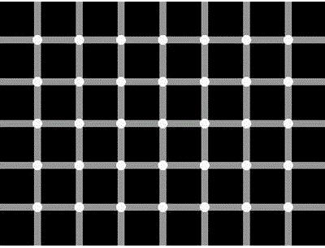

Have you ever woken from a dream and thought, ‘but my God, that seemed so real’? Have you ever hallucinated your tits off? Have you ever _sworn_ to have witnessed something when someone else swears to have witnessed something else?

When our perception of the world fails us, it can be jarring. We take it for granted that our experience is authentic, so when it proves to be false it’s like a bucket of ice water to the face: ‘oh shit,’ you think, ‘my perception is not infallible – maybe I don’t always experience the real, true world.’

>Maybe everything around you is an illusion. Maybe everyone you know is a figment of your imagination.

Films like The Matrix, The Truman Show and Inception compound these thoughts. You start to worry. Maybe everything around you is an illusion. Maybe everyone you know is a figment of your imagination. Oh shit – oh SHIT.

But then you calm down and tell yourself to stop being such a self-obsessed, annoying little loser. Nothing was designed with you in mind, you assure yourself. The universe is bloody massive and you are just a lump of animated carbon whose short time on a rocky planet hurtling round an average star will be fleeting, forgotten and, ultimately, pointless. Dust. In. The. Bloody. Wind.

>You are just a lump of animated carbon whose short time on a rocky planet hurtling round an average star will be fleeting, forgotten and, ultimately, pointless.

So you sigh, pick yourself up, stick the kettle on and read some Descartes. But uh oh. Here come those bloody _thoughts_ again.

You see, 17th Century French philosopher René Descartes – he’s a _professional_ doubter: the unhappy father of that bastard of a philosophical movement, [Skepticism](https://plato.stanford.edu/entries/skepticism/).

What most people quickly dismiss as a childish, narcissistic thought – that the universe was built to deceive its central character: you – the bosom of his great intellect nursed into a nightmarish, crippling existential crisis.

## Descartes's demolition

Descartes was worried that if the foundations of knowledge were not completely solid then anything built upon them would inevitably collapse. He thus decided that if there was reason to doubt the truth of something – no matter how slim the doubt – then it should be discarded as false.

He sets about reviewing and systematically rejecting all kinds of ‘facts’ that he generally held to be true in his [Meditations on First Philosophy](https://www.goodreads.com/book/show/30658.Meditations_on_First_Philosophy) (I think ‘René’s Big Night In’ would have made for a better title):

>I am here quite alone, and at last I will devote myself sincerely and without reservation to the general demolition of my opinions.

That the authenticity of our experience can be occasionally doubted is enough for Descartes to dismiss it as absolutely false: that our senses can sometimes mislead us without our knowing suggests that they could mislead us all the time.

And, if we cannot trust information obtained from our senses, then how can we confirm the existence of an external world?

Maybe our brains are just in vats somewhere, hooked up to a load of computers, and all this ‘experience’ is mere simulation. Or maybe nothing physical exists at all and this is all just one big hallucination – <i>everything</i> is an illusion, a figment of the mental realm.

Poor old Descartes got himself into a right state over all this:

>"So serious are the doubts into which I have been thrown as a result of yesterday's meditations that I can neither put them out of my mind nor see any way of resolving them. It feels as if I have fallen unexpectedly into a deep whirlpool which tumbles me around so that I can neither stand on the bottom nor swim up to the top" — René’s Big Night in (1641).

He sought to repair some of the damage caused by his relentless doubting by groping around for something – anything – we could be absolutely certain of. And, after a while, he found it.

## I think, therefore I am

‘I think, therefore I am’ is an unnecessarily convoluted way of communicating Descartes’s point. On initial reading we think, ‘therefore you’re _what_, René?’ – it seems to hang mid-sentence. A much clearer translation of the original Latin – _cogito ergo sum_ – would be: ‘I am thinking, therefore I exist’.

That arguably western philosophy’s most famous statement is rendered mysterious through an unclear translation is an eternal reminder as to why so many turn their noses up at the subject and conclude that, at best, philosophy’s inaccessible, at worst, a load of bollocks: these are simple ideas, expressed in unnecessarily complicated ways.

But back to Descartes: in his exultant declaration – _cogito ergo sum!!!!_ – he has assured himself of his own existence. Phew. Mop that brow, eh René. It is impossible to doubt the existence of your own thoughts, because in the act of doubting, you are thinking.

>It is impossible to doubt the existence of your own thoughts, because in the act of doubting, you are thinking.

So, we have our base, our solid foundation: a thinking mind must exist. From this point Descartes spends the rest of his meditations attempting to rebuild all human knowledge from the devastating wreckage caused by his initial incessant doubting. Alas, he fails.

## A chasm between the mental and physical

Believe it or not, almost 400 years on, philosophy is still recovering from Descartes. His negative work has been much more influential than his positive (in philosophy at least).

Through absolutely demolishing our confidence in the definite existence of anything but our minds, Descartes inadvertently created two separate realms: the mental and the physical. The mental we can be sure of; the physical needs to, somehow, be linked to it.

>The mental we can be sure of; the physical needs to, somehow, be linked to it.

Ever since Descartes, philosophers have been attempting to bridge this explanatory gap. Locke, Berkeley, Hume, Kant, the existentialists – they’ve all given it a bloody good go, but none of their proposed solutions have really provided an unarguable refutation of Descartes's position, or indeed a definitive answer to Skepticism generally.

The fight to reunite the mental and physical, therefore, is an ongoing one.

## Driving scientific method

Though he wrought much damage in philosophy, Descartes's doubting was the catalyst for driving the progress of science.

Doubt, doubt, and doubt again – that’s essentially what scientific method boils down to. And it's all thanks to Descartes deciding to have a big night in.

Indeed, if we ever want solid, _definite_ knowledge, following Descartes is the only way to go.