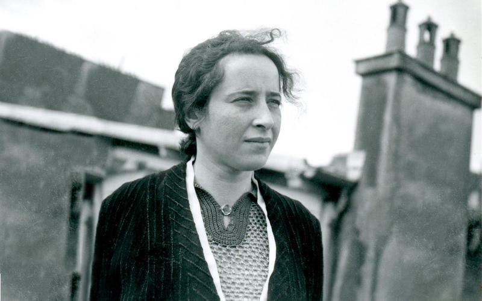

Where does evil come from? Are evil acts always committed by evil people? Whose responsibility is it to identify and stamp out evil? These questions concerned 20th-century philosopher [Hannah Arendt](/reading-lists/hannah-arendt/) throughout her life and work, and in her final (and unfinished) 1977 book <a target="_blank" rel="noopener noreferrer sponsored" href="http://www.amazon.com/gp/product/0156519925/ref=as_li_tl?ie=UTF8&tag=philosophybre-20&camp=1789&creative=9325&linkCode=as2&creativeASIN=0156519925&linkId=39c39f1a44d33157a2cdf520111582c3">The Life of the Mind</a>, she seems to offer a conclusion, writing: 

>The sad truth is that most evil is done by people who never make up their minds to be good or evil.

Indeed, Arendt was a German philosopher and political theorist who saw the techniques and evil consequences of totalitarian regimes firsthand.

Born into a secular-Jewish family, Arendt fled Nazi Germany in the 1930s, eventually settling in New York, where after the war she covered the trial of Nazi war criminal Adolf Eichmann.

In her report for The New Yorker, and later published in her 1963 book <a target="_blank" rel="noopener noreferrer sponsored" href="http://www.amazon.com/gp/product/0143039881/ref=as_li_tl?ie=UTF8&tag=philosophybre-20&camp=1789&creative=9325&linkCode=as2&creativeASIN=0143039881&linkId=cd83ff0ef041e75e7777bc9883b92fa6">Eichmann in Jerusalem: A Report on the Banality of Evil</a>, Arendt expressed how disturbed she was by Eichmann — but for reasons that might not be expected.

Far from the monster she thought he’d be, Eichmann was instead a rather bland, “terrifyingly normal” bureaucrat. He carried out his murderous role with calm efficiency not due to an abhorrent, warped mindset, but because of “a curious, quite authentic inability to think.”

His evil actions, Arendt noted,

>could not be traced to any particularity of wickedness, pathology or ideological conviction in the doer, whose only personal distinction was a perhaps extraordinary shallowness.

Eichmann absorbed the principles of the Nazi regime so unquestioningly — never considering their consequences from anyone’s perspective but his own — that his focus was simply to further his career within the regime and climb its ladders of power.

For Arendt, he embodied 

>the dilemma between the unspeakable horror of the deeds and the undeniable ludicrousness of the man who perpetrated them.

His actions were defined not so much by thought, but by the _absence_ of thought — convincing Arendt of the “banality of evil.”

## The banality of evil: evil is not monstrous, it takes place under the guise of ‘normality’

The “banality of evil” is the idea that evil does not have the Satan-like, villainous appearance we might typically associate it with.

Rather, evil is perpetuated when immoral principles become normalized over time by people who do not think about things from the standpoint of others.

Evil becomes commonplace; it becomes the everyday. Ordinary people — going about their everyday lives — become complicit actors in systems that perpetuate evil.

This idea is best understood within the context of how Arendt viewed our relationship to the world. We live and think not in isolation, but in an interconnected web of social and cultural relations — a framework of shared languages, behaviors, and conventions that we participate in every single day. 

This web of social and cultural relations is so all-encompassing in shaping our thought and behavior we are barely conscious of it. It only becomes noticeable when something or someone doesn’t conform to it. 

For example, if you were invited to a formal dinner, and proceeded to forego cutlery and eat your meal with your hands, you’d draw many a strange and disapproving look — perhaps you’d even be asked to leave by the more militant guests, for whom ‘eating with cutlery at formal dinners’ is such a deeply ingrained principle as to be worth defending with vigor. 

But do we ever take the time to truly challenge the principles we’ve inherited, to ensure they stand up to our own individual scrutiny? Are we even aware of our biases and learned behaviors?

Arendt provides a warning here — for it is precisely our tendency to adopt judgments without thinking that allows evil’s banality to flourish. 

If we’re not careful, evil principles can gradually emerge to become the new normal, and like the militant cutlery-using guests at the formal dinner party, we’ll defend those principles not necessarily because we’ve independently concluded they’re worth defending, but because they’re ‘normal’.

In relation to something as heinous as the crimes of Nazi Germany, this uncomfortable conclusion caused quite a stir in Arendt’s day. It implied the crimes of Nazi Germany were not just the responsibility of a handful of twisted men. Those men kickstarted it, but society enabled it: a lack of empathetic critical thinking, a desensitization, a human susceptibility to totalitarianism — this is what led to the murder of millions.

Arendt had Nazi Germany as her template, but argued systemic oppression and the gradual normalization of evil can occur anywhere, any time, and at any scale.

Can you think of anything you’re desensitized to today?

<!--small subscribe-->

    <h4>In one concise email each Sunday, I break down a famous idea from philosophy. You get the distillation straight to your inbox:</h4>
    

        <form action="https://app.convertkit.com/forms/5812400/subscriptions" method="post" data-sv-form="5812400" data-uid="be0e52d3c0" data-format="inline" data-version="6" data-options="{&quot;settings&quot;:{&quot;after_subscribe&quot;:{&quot;action&quot;:&quot;message&quot;,&quot;success_message&quot;:&quot;Thank you, philosopher! Your welcome email will land in your inbox shortly.&quot;,&quot;redirect_url&quot;:&quot;https://philosophybreak.com/thank-you/&quot;},&quot;analytics&quot;:{&quot;google&quot;:null,&quot;fathom&quot;:null,&quot;facebook&quot;:null,&quot;segment&quot;:null,&quot;pinterest&quot;:null,&quot;sparkloop&quot;:null,&quot;googletagmanager&quot;:null},&quot;modal&quot;:{&quot;trigger&quot;:&quot;timer&quot;,&quot;scroll_percentage&quot;:null,&quot;timer&quot;:5,&quot;devices&quot;:&quot;all&quot;,&quot;show_once_every&quot;:15},&quot;powered_by&quot;:{&quot;show&quot;:false,&quot;url&quot;:&quot;https://convertkit.com/features/forms?utm_campaign=poweredby&amp;utm_content=form&amp;utm_medium=referral&amp;utm_source=dynamic&quot;},&quot;recaptcha&quot;:{&quot;enabled&quot;:false},&quot;return_visitor&quot;:{&quot;action&quot;:&quot;show&quot;,&quot;custom_content&quot;:&quot;&quot;},&quot;slide_in&quot;:{&quot;display_in&quot;:&quot;bottom_right&quot;,&quot;trigger&quot;:&quot;timer&quot;,&quot;scroll_percentage&quot;:null,&quot;timer&quot;:5,&quot;devices&quot;:&quot;all&quot;,&quot;show_once_every&quot;:15},&quot;sticky_bar&quot;:{&quot;display_in&quot;:&quot;top&quot;,&quot;trigger&quot;:&quot;timer&quot;,&quot;scroll_percentage&quot;:null,&quot;timer&quot;:5,&quot;devices&quot;:&quot;all&quot;,&quot;show_once_every&quot;:15}},&quot;version&quot;:&quot;6&quot;}" min-width="400 500 600 700 800">
        
<ul data-element="errors" data-group="alert"></ul>

            

                <input name="email_address" aria-label="Your Email Address..." placeholder="Your Email Address..." required type="email" />
            

            <button class="button primary" type="submit" data-element="submit">

<svg xmlns="http://www.w3.org/2000/svg" viewBox="0 0 512 512"><path d="M464 64H48C21.49 64 0 85.49 0 112v288c0 26.51 21.49 48 48 48h416c26.51 0 48-21.49 48-48V112c0-26.51-21.49-48-48-48zm0 48v40.805c-22.422 18.259-58.168 46.651-134.587 106.49-16.841 13.247-50.201 45.072-73.413 44.701-23.208.375-56.579-31.459-73.413-44.701C106.18 199.465 70.425 171.067 48 152.805V112h416zM48 400V214.398c22.914 18.251 55.409 43.862 104.938 82.646 21.857 17.205 60.134 55.186 103.062 54.955 42.717.231 80.509-37.199 103.053-54.947 49.528-38.783 82.032-64.401 104.947-82.653V400H48z"/></svg>Join 22,000+ Subscribers</button>
            

            

        </form>
        
💭 One short philosophical email each Sunday. Unsubscribe any time.

    

## Standing up to evil’s banality

Arendt’s 1963 book <a target="_blank" rel="noopener noreferrer sponsored" href="http://www.amazon.com/gp/product/0143039881/ref=as_li_tl?ie=UTF8&tag=philosophybre-20&camp=1789&creative=9325&linkCode=as2&creativeASIN=0143039881&linkId=cd83ff0ef041e75e7777bc9883b92fa6">Eichmann in Jerusalem: A Report on the Banality of Evil</a> remains a fascinatingly relevant and disturbing read.

While at the time many criticized Arendt for seemingly letting Eichmann off the hook and placing the blame on society at large, Arendt argued this was a misreading of her position.

Eichmann as an individual was fully responsible for his monstrous actions, Arendt thought: she repeatedly declared him a war criminal and supported his death sentence. What she was startled by and alerting us to was the _nature_ of his monstrosity. He was not a Demon from Hell; he was a shallow, unthinking person in human society.

Arendt went on to explore this connection between thought and morality in subsequent works, asking in <a target="_blank" rel="noopener noreferrer sponsored" href="http://www.amazon.com/gp/product/0143039881/ref=as_li_tl?ie=UTF8&tag=philosophybre-20&camp=1789&creative=9325&linkCode=as2&creativeASIN=0143039881&linkId=cd83ff0ef041e75e7777bc9883b92fa6">The Life of the Mind</a> whether 

>the activity of thinking as such, the habit of examining whatever happens to come to pass or to attract attention, regardless of results and specific content, [could] be among the conditions that make men abstain from evil-doing or even actually ‘condition’ them against it?

While she died before completing <a target="_blank" rel="noopener noreferrer sponsored" href="http://www.amazon.com/gp/product/0143039881/ref=as_li_tl?ie=UTF8&tag=philosophybre-20&camp=1789&creative=9325&linkCode=as2&creativeASIN=0143039881&linkId=cd83ff0ef041e75e7777bc9883b92fa6">The Life of the Mind</a>, Arendt provided compelling insight into her position in a 1964 letter to Gershom Scholem:

>It is indeed my opinion now that evil is never ‘radical’, that it is only extreme, and that it possesses neither depth nor any demonic dimension. It can overgrow and lay waste the whole world precisely because it spreads like a fungus on the surface... Only the good has depth that can be radical.

In other words: evil spreads through shallow passivity, a lack of interest in engaging beyond the surface; a deep and compassionate fighting spirit is needed to keep goodness alive. _Thinking carefully for ourselves_ provides a raft by which to navigate the daily waves of information, custom, and circumstance.

Indeed, evil’s banality suggests its antidote begins in active, empathetic thinking. By being sensitive to different viewpoints and scrutinizing everything we might otherwise adopt or conform to unconsciously, we can be guided by reason, rather than misled by rhetoric or propaganda.

It’s not always easy, but by approaching life _philosophically_ — by actively, carefully considering matters from multiple perspectives — we can weigh things and take responsibility for our judgments and behaviors _independently_, rather than risk becoming an unthinking enabler of principles we wouldn’t necessarily subscribe to, if only we took the time to think about them.

## What do you make of Arendt’s banality of evil?

- Do you agree with Arendt’s assessment that there is nothing radical about evil — that it arises through a failure of empathetic imagination?
- Is critical thinking a way to protect against evil?
- Or do evil’s roots go deeper than Arendt supposes?

## Learn more about Arendt’s philosophy

If you’re interested in learning more about her brilliant, challenging, and insightful work, you might like my article on [Arendt’s critique of the human condition: that productivity is replacing meaning](/articles/hannah-arendt-on-the-human-condition-productivity-will-replace-meaning/). I’ve also put together a reading list of [the best six books by and about Arendt](/reading-lists/hannah-arendt/):

<a class="reading-list cta" href="/reading-lists/hannah-arendt/">
    
    

    

        <svg xmlns="http://www.w3.org/2000/svg" viewBox="0 0 576 512"><path fill="#fff" d="M542.22 32.05c-54.8 3.11-163.72 14.43-230.96 55.59-4.64 2.84-7.27 7.89-7.27 13.17v363.87c0 11.55 12.63 18.85 23.28 13.49 69.18-34.82 169.23-44.32 218.7-46.92 16.89-.89 30.02-14.43 30.02-30.66V62.75c.01-17.71-15.35-31.74-33.77-30.7zM264.73 87.64C197.5 46.48 88.58 35.17 33.78 32.05 15.36 31.01 0 45.04 0 62.75V400.6c0 16.24 13.13 29.78 30.02 30.66 49.49 2.6 149.59 12.11 218.77 46.95 10.62 5.35 23.21-1.94 23.21-13.46V100.63c0-5.29-2.62-10.14-7.27-12.99z"/></svg>READING LIST
        

        <h3>Hannah Arendt</h3>
        
The Best 6 Books to Read

    
    
    <svg class="cta swing" xmlns="http://www.w3.org/2000/svg" viewBox="0 0 320 512"><path d="M285.476 272.971L91.132 467.314c-9.373 9.373-24.569 9.373-33.941 0l-22.667-22.667c-9.357-9.357-9.375-24.522-.04-33.901L188.505 256 34.484 101.255c-9.335-9.379-9.317-24.544.04-33.901l22.667-22.667c9.373-9.373 24.569-9.373 33.941 0L285.475 239.03c9.373 9.372 9.373 24.568.001 33.941z"/></svg>
</a>