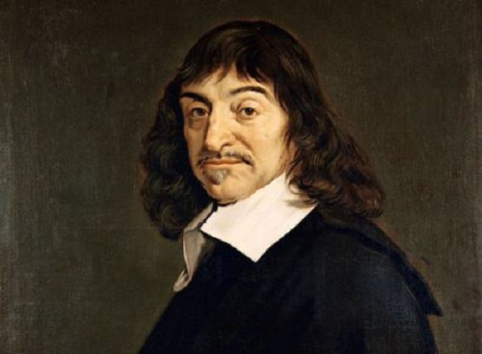

It’s a cool 1640 night in Leiden, Netherlands, and French philosopher René Descartes picks up his pen…⁣ “I am here quite alone,” he writes, “and at last I will devote myself sincerely and without reservation to the general demolition of my opinions.”⁣

What better way to spend the night?

But Descartes was not without reason: in his work as a mathematician, he worried that if the foundations of knowledge were not completely solid, anything built upon them would inevitably collapse. He thus decided that if there was reason to doubt the truth of something — no matter how slim the doubt — then it should be discarded as false.⁣

With this strict criteria for truth in mind, it’s not long before — as depicted with masterful drama in his [Meditations on First Philosophy](http://www.amazon.com/gp/product/1107665736/ref=as_li_tl?ie=UTF8&tag=philosophybre-20&camp=1789&creative=9325&linkCode=as2&creativeASIN=1107665736&linkId=60e77f9fd4ff3c655b9bed5f1eac5124) — Descartes struggles to feel convinced by the existence of, well, anything.

The fact we dream and hallucinate means, for Descartes, our senses aren’t always trustworthy. Indeed, have you ever woken from a dream and thought, “but my God, that seemed so real”? Have you ever hallucinated your socks off? Have you ever _sworn_ to have witnessed something when someone else swears to have witnessed something else?

When our perception of the world fails us, it can be jarring. We take it for granted that our experience is authentic, so when it proves to be false it’s like a bucket of ice water to the face: “oh right,” you think, “my perception is not infallible — maybe I don’t always experience the real, true world.”

But, according to Descartes's strict criteria for truth outlined above, where does that leave us? If the authenticity of our experience can occasionally be doubted, then that is enough for Descartes to dismiss it as absolutely false: that our senses can sometimes mislead us without our knowing suggests that they could mislead us all the time.

And, if we cannot trust information obtained from our senses, then how can we confirm the existence of an external world?

Maybe our brains are just in vats somewhere, hooked up to a load of computers, and all this ‘experience’ is mere simulation. Or maybe nothing physical exists at all and this is all just one big hallucination — _everything_ is an illusion, a figment of the mental realm.

Poor old Descartes got himself into a right state over all this:

>So serious are the doubts into which I have been thrown as a result of yesterday's meditations that I can neither put them out of my mind nor see any way of resolving them. It feels as if I have fallen unexpectedly into a deep whirlpool which tumbles me around so that I can neither stand on the bottom nor swim up to the top.

By this point frantic with worry, Descartes seeks to repair some of the damage caused by his relentless doubting by groping around for something — anything — we can be absolutely certain of. And, after a while, he finds it.

## I think, therefore I am

A clearer translation of Descartes' definitive statement might be, “I am thinking, therefore I exist.” Regardless, in his exultant declaration — _cogito ergo sum!_ — Descartes assures himself of his own existence. Phew. Mop that brow, eh René. It is impossible to doubt the existence of your own thoughts, because in the act of doubting, you are thinking.

    <h4>Philosophy in Your Twitter Feed</h4>
    
Follow Philosophy Break on Twitter to get philosophy's best questions, wisdom, and ideas directly in your Twitter feed.

    <a target="_blank" rel="noopener noreferrer" class="button secondary" href="https://twitter.com/philosophybreak"><svg xmlns="http://www.w3.org/2000/svg" viewBox="0 0 512 512"><path d="M459.37 151.716c.325 4.548.325 9.097.325 13.645 0 138.72-105.583 298.558-298.558 298.558-59.452 0-114.68-17.219-161.137-47.106 8.447.974 16.568 1.299 25.34 1.299 49.055 0 94.213-16.568 130.274-44.832-46.132-.975-84.792-31.188-98.112-72.772 6.498.974 12.995 1.624 19.818 1.624 9.421 0 18.843-1.3 27.614-3.573-48.081-9.747-84.143-51.98-84.143-102.985v-1.299c13.969 7.797 30.214 12.67 47.431 13.319-28.264-18.843-46.781-51.005-46.781-87.391 0-19.492 5.197-37.36 14.294-52.954 51.655 63.675 129.3 105.258 216.365 109.807-1.624-7.797-2.599-15.918-2.599-24.04 0-57.828 46.782-104.934 104.934-104.934 30.213 0 57.502 12.67 76.67 33.137 23.715-4.548 46.456-13.32 66.599-25.34-7.798 24.366-24.366 44.833-46.132 57.827 21.117-2.273 41.584-8.122 60.426-16.243-14.292 20.791-32.161 39.308-52.628 54.253z"/></svg>Follow Philosophy Break</a>

So, we have our base, our solid foundation: a thinking mind must exist. From this point on in his [Meditations on First Philosophy](http://www.amazon.com/gp/product/1107665736/ref=as_li_tl?ie=UTF8&tag=philosophybre-20&camp=1789&creative=9325&linkCode=as2&creativeASIN=1107665736&linkId=60e77f9fd4ff3c655b9bed5f1eac5124), Descartes attempts to rebuild all human knowledge and establish proofs for the existence of, among other things, God. Alas, his work here is generally acknowledged to not quite make up for his initial demolition job.

Indeed, through absolutely bulldozing our confidence in the existence of anything but our thoughts, Descartes inadvertently creates two separate realms: the mental and the physical. The mental we can be sure of; the physical needs to, somehow, be linked to it.

Believe it or not, philosophers have been trying to bridge this explanatory gap ever since.

## Is there an answer to Descartes' skepticism?

Descartes' doubting leaves us with a rather alarming concern: that our experience is not infallible, and that it has no bearing on the existence of an external world. Of course, this state of affairs has prompted a vast literature on whether the skepticism expressed by Descartes is actually anything to worry about, which has in turn spawned commentaries on the limits to what we can know, as well as just how our existences are tied to that of the world around us.

There are a number of deep philosophical issues exposed by Descartes' [Meditations on First Philosophy](http://www.amazon.com/gp/product/1107665736/ref=as_li_tl?ie=UTF8&tag=philosophybre-20&camp=1789&creative=9325&linkCode=as2&creativeASIN=1107665736&linkId=60e77f9fd4ff3c655b9bed5f1eac5124), which is why it's perceived to mark the beginning of modern philosophy in the Western tradition. Combine that with its highly accessible, dramatized style, and it's no wonder that this short text is still pored over by undergraduate students to this day. It's essential reading for anyone interested in philosophy.

Beyond reading Descartes' [Meditations on First Philosophy](http://www.amazon.com/gp/product/1107665736/ref=as_li_tl?ie=UTF8&tag=philosophybre-20&camp=1789&creative=9325&linkCode=as2&creativeASIN=1107665736&linkId=60e77f9fd4ff3c655b9bed5f1eac5124) in full, to further explore the theme of what constitutes the ultimate nature of reality, touched on by Descartes' pondering, check out our five-day [introductory philosophy course, Life's Big Questions](/lifes-big-questions/). 

On day two of [Life's Big Questions](/lifes-big-questions/), we hone in on the question of [whether or not the world around us is real](/articles/is-the-world-around-us-real/), discussing Descartes further, and also considering responses from the philosophical giants who followed (and had a lot to say about Descartes' skepticism about the external world!), including [John Locke](/articles/john-lockes-empiricism-why-we-are-all-tabula-rasas-blank-slates/), [George Berkeley](/articles/george-berkeley-subjective-idealism-the-world-is-in-our-minds/), David Hume, and Immanuel Kant. Interested in learning more? Explore the full course now!

<a class="primary button" href="/lifes-big-questions/"><svg xmlns="http://www.w3.org/2000/svg" viewBox="0 0 512 512"><path d="M504 256C504 119 393 8 256 8S8 119 8 256s111 248 248 248 248-111 248-248zm-448 0c0-110.5 89.5-200 200-200s200 89.5 200 200-89.5 200-200 200S56 366.5 56 256zm72 20v-40c0-6.6 5.4-12 12-12h116v-67c0-10.7 12.9-16 20.5-8.5l99 99c4.7 4.7 4.7 12.3 0 17l-99 99c-7.6 7.6-20.5 2.2-20.5-8.5v-67H140c-6.6 0-12-5.4-12-12z"/></svg>Explore Course Now</a>
