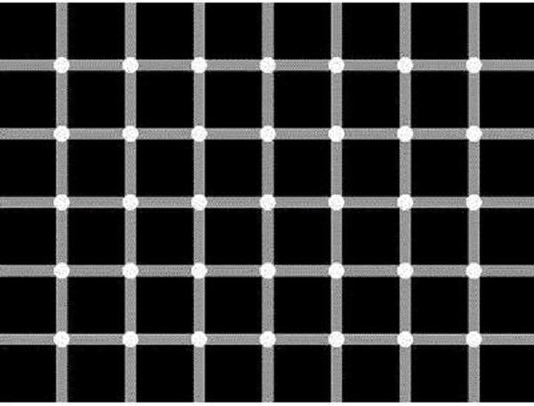
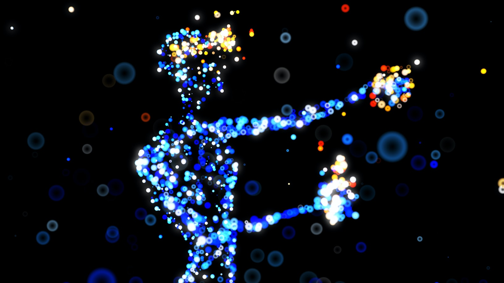

Perhaps Western philosophy’s most famous statement, “I think, therefore I am” is actually a rather confusing translation of its Latin original, _cogito ergo sum_. A clearer translation might be, “I am thinking, therefore I exist.” 

Even with a less ambiguous translation, however, we might still wonder why this statement is so celebrated. 

Doesn’t it just express something really obvious?   

Well, Descartes was not merely conveying a platitude when he coined these famous words. 

For him, “I am thinking, therefore I exist” is a crucial example of a statement which, when thought, _cannot be false_ — and thus a significant step in his search for certain, irrefutable knowledge. 

Indeed, the brilliance of _cogito ergo sum_ — and why it changed Western philosophy forever — really becomes clear once we consider its philosophical background, Descartes’ motivations, and the radical <i>un</i>certainty that brought it about…

## Descartes’ search for certainty, via relentless methodic doubt

It’s a cool 1640 night in Leiden, Netherlands, and French philosopher René Descartes picks up his pen…⁣ “I am here quite alone,” he writes, “and at last I will devote myself sincerely and without reservation to the general demolition of my opinions.”⁣

What better way to spend the night?

But Descartes was not without reason: in his work as a mathematician, he worried that if the foundations of knowledge were not completely solid, anything built upon them would inevitably collapse. 

If we want to establish real, irrefutable certainty about reality, Descartes thinks, we must be strict in our approach.

He thus decides that if there is reason to doubt the truth of something — no matter how slim the doubt — then it should be discarded as false.⁣ In his own words:

>if I am able to find in each \[aspect of an opinion] some reason to doubt, this will suffice to justify my rejecting the whole.

And with his demolition — or _methodic doubt_, as it’s come to be known — Descartes doesn’t intend to focus on each of his opinions one by one; rather he intends to target the _foundations_ which prop them up: 

>for owing to the fact that the destruction of the foundations of necessity brings with it the downfall of the rest of the edifice, I shall only in the first place attack those principles upon which all my former opinions rested.

, meaning business.")

With this strict criteria for truth in mind, and his targets established, it’s not long before — as depicted with masterful drama in his <a target="_blank" rel="noopener noreferrer sponsored" href="http://www.amazon.com/gp/product/1107665736/ref=as_li_tl?ie=UTF8&tag=philosophybre-20&camp=1789&creative=9325&linkCode=as2&creativeASIN=1107665736&linkId=60e77f9fd4ff3c655b9bed5f1eac5124">Meditations on First Philosophy</a> — Descartes struggles to feel convinced by the existence or reliability of, well, anything.

Descartes asserts that most if not all of his opinions are based upon his _experiences_ of the world through his five senses. 

His senses, however, are not always trustworthy — when he dreams or hallucinates, for instance, his experiences do not align to reality. 

Reflecting on this point, Descartes wonders if he can be sure he’s even awake _right now_, writing:

>How often has it happened to me that in the night I dreamt that I found myself in this particular place, that I was dressed and seated near the fire, whilst in reality I was lying undressed in bed! At this moment it does indeed seem to me that it is with eyes awake that I am looking at this paper; that this head which I move is not asleep, that it is deliberately and of set purpose that I extend my hand and perceive it; what happens in sleep does not appear so clear nor so distinct as does all this. But in thinking over this I remind myself that on many occasions I have in sleep been deceived by similar illusions, and in dwelling carefully on this reflection I see so manifestly that there are no certain indications by which we may clearly distinguish wakefulness from sleep that I am lost in astonishment...

Have you ever, like Descartes, woken from a dream and thought, “but my God, that seemed so real”? Have you ever hallucinated your socks off? Have you ever _sworn_ to have witnessed something when someone else swears to have witnessed something else?

As Descartes so eloquently describes, when our perception of the world fails us, it can be jarring. 

We take it for granted that our experience is authentic, so when it proves to be false it’s like a bucket of ice water to the face: “oh right,” you think, “my perception is not infallible — maybe I don’t always experience the real, true world.”

But, according to Descartes’s strict criteria for truth outlined above, where does that leave us? 

If the authenticity of our experience can occasionally be doubted, then that is enough for Descartes to dismiss it as absolutely unreliable: that our senses can sometimes mislead us without our knowing suggests that they could mislead us all the time. He writes:

>All that up to the present time I have accepted as most true and certain I have learned either from the senses or through the senses; but it is sometimes proved to me that these senses are deceptive, and it is wiser not to trust entirely to anything by which we have once been deceived.

And, if we cannot trust information obtained from our senses, then how can we confirm the existence of an external world?

Maybe our brains are just in vats somewhere, hooked up to a load of computers, and all this ‘experience’ is mere simulation. 

Or maybe nothing physical exists at all and this is all just one big hallucination — _everything_ is an illusion, a figment of the mental realm, or even the conjurings of an Evil Demon determined to mislead us about the true nature of reality...

<!--big subscribe-->

    
    <h4>From the Buddha to Nietzsche: join 22,000+ subscribers enjoying my free Sunday Breakdown</h4>
    
In one concise email each Sunday, I break down a famous idea from philosophy. You get the distillation straight to your inbox.

    

        <form action="https://app.convertkit.com/forms/5812400/subscriptions" method="post" data-sv-form="5812400" data-uid="be0e52d3c0" data-format="inline" data-version="6" data-options="{&quot;settings&quot;:{&quot;after_subscribe&quot;:{&quot;action&quot;:&quot;message&quot;,&quot;success_message&quot;:&quot;Thank you, philosopher! Your welcome email will land in your inbox shortly.&quot;,&quot;redirect_url&quot;:&quot;https://philosophybreak.com/thank-you/&quot;},&quot;analytics&quot;:{&quot;google&quot;:null,&quot;fathom&quot;:null,&quot;facebook&quot;:null,&quot;segment&quot;:null,&quot;pinterest&quot;:null,&quot;sparkloop&quot;:null,&quot;googletagmanager&quot;:null},&quot;modal&quot;:{&quot;trigger&quot;:&quot;timer&quot;,&quot;scroll_percentage&quot;:null,&quot;timer&quot;:5,&quot;devices&quot;:&quot;all&quot;,&quot;show_once_every&quot;:15},&quot;powered_by&quot;:{&quot;show&quot;:false,&quot;url&quot;:&quot;https://convertkit.com/features/forms?utm_campaign=poweredby&amp;utm_content=form&amp;utm_medium=referral&amp;utm_source=dynamic&quot;},&quot;recaptcha&quot;:{&quot;enabled&quot;:false},&quot;return_visitor&quot;:{&quot;action&quot;:&quot;show&quot;,&quot;custom_content&quot;:&quot;&quot;},&quot;slide_in&quot;:{&quot;display_in&quot;:&quot;bottom_right&quot;,&quot;trigger&quot;:&quot;timer&quot;,&quot;scroll_percentage&quot;:null,&quot;timer&quot;:5,&quot;devices&quot;:&quot;all&quot;,&quot;show_once_every&quot;:15},&quot;sticky_bar&quot;:{&quot;display_in&quot;:&quot;top&quot;,&quot;trigger&quot;:&quot;timer&quot;,&quot;scroll_percentage&quot;:null,&quot;timer&quot;:5,&quot;devices&quot;:&quot;all&quot;,&quot;show_once_every&quot;:15}},&quot;version&quot;:&quot;6&quot;}" min-width="400 500 600 700 800">
        
<ul data-element="errors" data-group="alert"></ul>

            

                <input name="email_address" aria-label="Your Email Address..." placeholder="Your Email Address..." required type="email" />
            

            <button class="button primary" type="submit" data-element="submit">

<svg xmlns="http://www.w3.org/2000/svg" viewBox="0 0 512 512"><path d="M464 64H48C21.49 64 0 85.49 0 112v288c0 26.51 21.49 48 48 48h416c26.51 0 48-21.49 48-48V112c0-26.51-21.49-48-48-48zm0 48v40.805c-22.422 18.259-58.168 46.651-134.587 106.49-16.841 13.247-50.201 45.072-73.413 44.701-23.208.375-56.579-31.459-73.413-44.701C106.18 199.465 70.425 171.067 48 152.805V112h416zM48 400V214.398c22.914 18.251 55.409 43.862 104.938 82.646 21.857 17.205 60.134 55.186 103.062 54.955 42.717.231 80.509-37.199 103.053-54.947 49.528-38.783 82.032-64.401 104.947-82.653V400H48z"/></svg>Join 22,000+ Subscribers</button>
            

            

        </form>
        
💭 One short philosophical email each Sunday. Unsubscribe any time.

    

## Descartes: are our experiences merely the conjurings of a God-like deceiver?

Descartes himself reflects on this latter idea: that the world is created not by a _good_ God but by a God-like deceiver. He writes: 

>I shall then suppose, not that God who is supremely good and the fountain of truth, but some evil demon not less powerful than deceitful, has employed his whole energies in deceiving me; I shall consider that the heavens, the earth, colors, figures, sound, and all other external things are nought but the illusions and dreams of which this demon has availed himself in order to lay traps for my credulity...

And it’s not just our sensory capabilities that can be thrown into doubt, thinks Descartes: our ability to _reason_ could also be hopelessly impaired. 

If we have reasoned incorrectly before, Descartes notes, how can we ever know for sure that we are reasoning correctly now? 

Maybe 2 + 2 really equals 5, not 4, and it is again the workings of an Evil Demon that makes us think differently. 

Poor old Descartes got himself into a right state over all this:

>So serious are the doubts into which I have been thrown as a result of yesterday’s meditations that I can neither put them out of my mind nor see any way of resolving them. It feels as if I have fallen unexpectedly into a deep whirlpool which tumbles me around so that I can neither stand on the bottom nor swim up to the top.

By this point frantic with worry, Descartes seeks to repair some of the damage caused by his relentless doubting by groping around for something — anything — we can be absolutely certain of. 

And, after a while, he finds it.

## I think, therefore I am

As noted at the beginning, a clearer translation of Descartes’ definitive statement might be, “I am thinking, therefore I exist.” Regardless, in his exultant declaration — _cogito ergo sum!_ — Descartes assures himself of his own existence. 

Phew. Mop that brow, eh René: at last, here is something of which we can be absolutely certain. 

It is impossible to doubt the existence of your own thoughts, because in the act of doubting, you are thinking.

The famous formulation “I think, therefore I am” actually appears in Descartes’ earlier 1637 work, <a target="_blank" rel="noopener noreferrer sponsored" href="https://www.amazon.com/Discourse-Method-Oxford-Worlds-Classics/dp/0199540071?&linkCode=ll1&tag=philosophybre-20&linkId=f3e9f43f3e0afd0fbf66528d9102ec70&language=en_US&ref_=as_li_ss_tl">Discourse on the Method</a>.

In his <a target="_blank" rel="noopener noreferrer sponsored" href="http://www.amazon.com/gp/product/1107665736/ref=as_li_tl?ie=UTF8&tag=philosophybre-20&camp=1789&creative=9325&linkCode=as2&creativeASIN=1107665736&linkId=60e77f9fd4ff3c655b9bed5f1eac5124">Meditations on First Philosophy</a>, the same thought is stated slightly differently, coming at the end of a glorious passage in which Descartes lays out the impossibility of doubting his own existence (or, indeed, of being deceived about it):

>But I was persuaded that there was nothing in all the world, that there was no heaven, no earth, that there were no minds, nor any bodies: was I not then likewise persuaded that I did not exist? Not at all; of a surety I myself did exist _merely because I thought of something_. But there is some deceiver or other, very powerful and very cunning, who ever employs his ingenuity in deceiving me. Then without doubt I exist also if he deceives me, and let him deceive me as much as he will, he can never cause me to be nothing so long as I think that I am something. So that after having reflected well and carefully examined all things, we must come to the definite conclusion that this proposition: _I am, I exist_, is necessarily true each time that I pronounce it, or that I mentally conceive it.

## The importance of cogito ergo sum

Descartes believed his discovery of the _Cogito_ to be hugely significant, for it withstands all the skepticism you can throw at it. When expressed, it _cannot be false_.

Even if you doubt the reliability of your senses, and even if you doubt the reliability of your reason (i.e. the two main sources for knowledge), the _Cogito_ remains true. 

For, however wrong you are in your estimation of reality, however warped your use of reason, you can never be wrong about the fact of your own existence: in order to think you are wrong about something, in order to wrongly use reason, there has to be a _you_ that exists to be wrong.  

So, Descartes establishes his base, his solid foundation for certain, indubitable knowledge: _I am, I exist._

From this point on in his <a target="_blank" rel="noopener noreferrer sponsored" href="http://www.amazon.com/gp/product/1107665736/ref=as_li_tl?ie=UTF8&tag=philosophybre-20&camp=1789&creative=9325&linkCode=as2&creativeASIN=1107665736&linkId=60e77f9fd4ff3c655b9bed5f1eac5124">Meditations on First Philosophy</a>, Descartes investigates what the nature of this “I” might be (concluding it is a “thing which thinks”). He also attempts to rebuild all human knowledge and establish proofs for the existence of, among other things, God. 

Alas, his work here is generally acknowledged to not quite make up for his initial demolition job. 

We may have certainty with the _Cogito_, but the possible unreliability of our senses and reason doesn’t leave much else. 

Through absolutely bulldozing our confidence in the existence of anything but our thoughts, Descartes inadvertently created two separate realms: the mental and the physical. 

The mental “thing which thinks” we can be sure exists (however deceived or deluded that existence may be); the physical world needs to, somehow, be linked to it.

Believe it or not, philosophers have been trying to bridge this explanatory gap ever since.

<!--small subscribe-->

    <h4>In one concise email each Sunday, I break down a famous idea from philosophy. You get the distillation straight to your inbox:</h4>
    

        <form action="https://app.convertkit.com/forms/5812400/subscriptions" method="post" data-sv-form="5812400" data-uid="be0e52d3c0" data-format="inline" data-version="6" data-options="{&quot;settings&quot;:{&quot;after_subscribe&quot;:{&quot;action&quot;:&quot;message&quot;,&quot;success_message&quot;:&quot;Thank you, philosopher! Your welcome email will land in your inbox shortly.&quot;,&quot;redirect_url&quot;:&quot;https://philosophybreak.com/thank-you/&quot;},&quot;analytics&quot;:{&quot;google&quot;:null,&quot;fathom&quot;:null,&quot;facebook&quot;:null,&quot;segment&quot;:null,&quot;pinterest&quot;:null,&quot;sparkloop&quot;:null,&quot;googletagmanager&quot;:null},&quot;modal&quot;:{&quot;trigger&quot;:&quot;timer&quot;,&quot;scroll_percentage&quot;:null,&quot;timer&quot;:5,&quot;devices&quot;:&quot;all&quot;,&quot;show_once_every&quot;:15},&quot;powered_by&quot;:{&quot;show&quot;:false,&quot;url&quot;:&quot;https://convertkit.com/features/forms?utm_campaign=poweredby&amp;utm_content=form&amp;utm_medium=referral&amp;utm_source=dynamic&quot;},&quot;recaptcha&quot;:{&quot;enabled&quot;:false},&quot;return_visitor&quot;:{&quot;action&quot;:&quot;show&quot;,&quot;custom_content&quot;:&quot;&quot;},&quot;slide_in&quot;:{&quot;display_in&quot;:&quot;bottom_right&quot;,&quot;trigger&quot;:&quot;timer&quot;,&quot;scroll_percentage&quot;:null,&quot;timer&quot;:5,&quot;devices&quot;:&quot;all&quot;,&quot;show_once_every&quot;:15},&quot;sticky_bar&quot;:{&quot;display_in&quot;:&quot;top&quot;,&quot;trigger&quot;:&quot;timer&quot;,&quot;scroll_percentage&quot;:null,&quot;timer&quot;:5,&quot;devices&quot;:&quot;all&quot;,&quot;show_once_every&quot;:15}},&quot;version&quot;:&quot;6&quot;}" min-width="400 500 600 700 800">
        
<ul data-element="errors" data-group="alert"></ul>

            

                <input name="email_address" aria-label="Your Email Address..." placeholder="Your Email Address..." required type="email" />
            

            <button class="button primary" type="submit" data-element="submit">

<svg xmlns="http://www.w3.org/2000/svg" viewBox="0 0 512 512"><path d="M464 64H48C21.49 64 0 85.49 0 112v288c0 26.51 21.49 48 48 48h416c26.51 0 48-21.49 48-48V112c0-26.51-21.49-48-48-48zm0 48v40.805c-22.422 18.259-58.168 46.651-134.587 106.49-16.841 13.247-50.201 45.072-73.413 44.701-23.208.375-56.579-31.459-73.413-44.701C106.18 199.465 70.425 171.067 48 152.805V112h416zM48 400V214.398c22.914 18.251 55.409 43.862 104.938 82.646 21.857 17.205 60.134 55.186 103.062 54.955 42.717.231 80.509-37.199 103.053-54.947 49.528-38.783 82.032-64.401 104.947-82.653V400H48z"/></svg>Join 22,000+ Subscribers</button>
            

            

        </form>
        
💭 One short philosophical email each Sunday. Unsubscribe any time.

    

## Is there an answer to Descartes’ methodic doubt? The influence of “I think, therefore I am”

There are a number of deep epistemological and [metaphysical](/articles/metaphysics-what-is-it-why-is-it-important-today/) issues exposed by Descartes’ <a target="_blank" rel="noopener noreferrer sponsored" href="http://www.amazon.com/gp/product/1107665736/ref=as_li_tl?ie=UTF8&tag=philosophybre-20&camp=1789&creative=9325&linkCode=as2&creativeASIN=1107665736&linkId=60e77f9fd4ff3c655b9bed5f1eac5124">Meditations on First Philosophy</a>, which is why it’s perceived to mark the beginning of modern philosophy in the Western tradition. 

Combine that with its highly accessible, dramatized style, and it’s no wonder that this short text is still pored over by undergraduate students to this day: <a target="_blank" rel="noopener noreferrer sponsored" href="http://www.amazon.com/gp/product/1107665736/ref=as_li_tl?ie=UTF8&tag=philosophybre-20&camp=1789&creative=9325&linkCode=as2&creativeASIN=1107665736&linkId=60e77f9fd4ff3c655b9bed5f1eac5124">Meditations on First Philosophy</a> is essential reading for anyone interested in philosophy.

For Descartes’ doubting leaves us with a number of rather alarming concerns: do our senses deceive us? Is any of our knowledge actually valid? Are our reasoning abilities reliable? Is perception reality? How can we bridge the gap between the mental and the physical? What is the self? Is the existence of everything a mere figment of my imagination?

The philosophical position of solipsism (see our [solipsism explainer here](/articles/solipsism-definition-your-mind-is-the-only-thing-that-exists/)) takes Descartes’ skepticism in these areas to their apparent logical conclusion: we cannot have knowledge (or assert the existence) of anything beyond our own minds.

Of course, the solipsist position has prompted a vast literature on whether the skepticism expressed by Descartes is actually anything to worry about — including by the 17th-century philosophers John Locke ([see our explainer on Locke’s _tabula rasa_ here](/articles/john-lockes-empiricism-why-we-are-all-tabula-rasas-blank-slates/)) and George Berkeley ([see our explainer on Berkeley’s subjective idealism here](/articles/george-berkeley-subjective-idealism-the-world-is-in-our-minds/)) — which has in turn spawned commentaries on the limits to what we can know, as well as just how our existences are tied to that of the world around us.

Is Descartes’ approach to knowledge-building reasonable? Is certainty actually required for knowledge? How _else_ might knowledge be construed?

We explore these themes further in our [solipsism explainer](/articles/solipsism-definition-your-mind-is-the-only-thing-that-exists/), our article on [whether the world around us is real](/articles/is-the-world-around-us-real/), as well as our [epistemology reading list](/reading-lists/epistemology/).

But to conclude _this_ article, we can say that while a favorite pastime of philosophers these days is to show where Descartes went wrong, for many his were the first words to inspire further exploration into Western philosophy; it is thus difficult to view his project in <a target="_blank" rel="noopener noreferrer sponsored" href="http://www.amazon.com/gp/product/1107665736/ref=as_li_tl?ie=UTF8&tag=philosophybre-20&camp=1789&creative=9325&linkCode=as2&creativeASIN=1107665736&linkId=60e77f9fd4ff3c655b9bed5f1eac5124">Meditations on First Philosophy</a> without affection.

For, regardless of the fractures, uncertainty, and endless confusion he caused with his methodic doubt, one thing Descartes gave us remains certain for all who think it: _cogito ergo sum_.

## Get one mind-opening philosophical idea in your inbox each Sunday

If you enjoy reflecting on themes like those explored in this article, you might like my free Sunday email. I distill one philosophical idea per week, and invite you to share your view. 

If you’re interested, you can join 22,000+ thinkers and sign up for free below (no spam, and you can unsubscribe any time):

<!--big subscribe-->

    
    <h4>From the Buddha to Nietzsche: join 22,000+ subscribers enjoying my free Sunday Breakdown</h4>
    
In one concise email each Sunday, I break down a famous idea from philosophy. You get the distillation straight to your inbox.

    

        <form action="https://app.convertkit.com/forms/5812400/subscriptions" method="post" data-sv-form="5812400" data-uid="be0e52d3c0" data-format="inline" data-version="6" data-options="{&quot;settings&quot;:{&quot;after_subscribe&quot;:{&quot;action&quot;:&quot;message&quot;,&quot;success_message&quot;:&quot;Thank you, philosopher! Your welcome email will land in your inbox shortly.&quot;,&quot;redirect_url&quot;:&quot;https://philosophybreak.com/thank-you/&quot;},&quot;analytics&quot;:{&quot;google&quot;:null,&quot;fathom&quot;:null,&quot;facebook&quot;:null,&quot;segment&quot;:null,&quot;pinterest&quot;:null,&quot;sparkloop&quot;:null,&quot;googletagmanager&quot;:null},&quot;modal&quot;:{&quot;trigger&quot;:&quot;timer&quot;,&quot;scroll_percentage&quot;:null,&quot;timer&quot;:5,&quot;devices&quot;:&quot;all&quot;,&quot;show_once_every&quot;:15},&quot;powered_by&quot;:{&quot;show&quot;:false,&quot;url&quot;:&quot;https://convertkit.com/features/forms?utm_campaign=poweredby&amp;utm_content=form&amp;utm_medium=referral&amp;utm_source=dynamic&quot;},&quot;recaptcha&quot;:{&quot;enabled&quot;:false},&quot;return_visitor&quot;:{&quot;action&quot;:&quot;show&quot;,&quot;custom_content&quot;:&quot;&quot;},&quot;slide_in&quot;:{&quot;display_in&quot;:&quot;bottom_right&quot;,&quot;trigger&quot;:&quot;timer&quot;,&quot;scroll_percentage&quot;:null,&quot;timer&quot;:5,&quot;devices&quot;:&quot;all&quot;,&quot;show_once_every&quot;:15},&quot;sticky_bar&quot;:{&quot;display_in&quot;:&quot;top&quot;,&quot;trigger&quot;:&quot;timer&quot;,&quot;scroll_percentage&quot;:null,&quot;timer&quot;:5,&quot;devices&quot;:&quot;all&quot;,&quot;show_once_every&quot;:15}},&quot;version&quot;:&quot;6&quot;}" min-width="400 500 600 700 800">
        
<ul data-element="errors" data-group="alert"></ul>

            

                <input name="email_address" aria-label="Your Email Address..." placeholder="Your Email Address..." required type="email" />
            

            <button class="button primary" type="submit" data-element="submit">

<svg xmlns="http://www.w3.org/2000/svg" viewBox="0 0 512 512"><path d="M464 64H48C21.49 64 0 85.49 0 112v288c0 26.51 21.49 48 48 48h416c26.51 0 48-21.49 48-48V112c0-26.51-21.49-48-48-48zm0 48v40.805c-22.422 18.259-58.168 46.651-134.587 106.49-16.841 13.247-50.201 45.072-73.413 44.701-23.208.375-56.579-31.459-73.413-44.701C106.18 199.465 70.425 171.067 48 152.805V112h416zM48 400V214.398c22.914 18.251 55.409 43.862 104.938 82.646 21.857 17.205 60.134 55.186 103.062 54.955 42.717.231 80.509-37.199 103.053-54.947 49.528-38.783 82.032-64.401 104.947-82.653V400H48z"/></svg>Join 22,000+ Subscribers</button>
            

            

        </form>
        
💭 One short philosophical email each Sunday. Unsubscribe any time.

    

