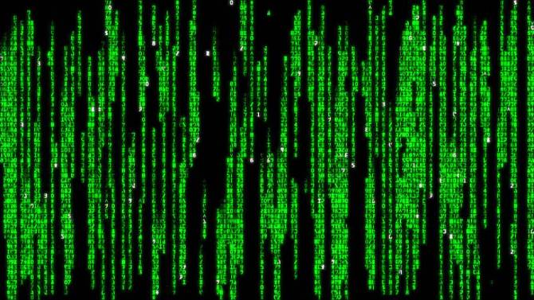

Are you awake, or are you dreaming? Are you lucid, or hallucinating? Are you a human being that lives on planet Earth, or a mere deluded brain in a vat, unknowingly being fed a simulation of what life on a fictional planet called Earth might be like? 

In response to these questions, the majority of us would like to answer that, most of the time anyway, we are awake, lucid, embodied human beings that live on planet Earth, which is not a simulation but made of real, physical matter.

But: _how can we be sure?_ 

At this very moment, you might not be a real, embodied person at all, but a mere brain that’s hooked up to a sophisticated computer program that can perfectly simulate experiences of the outside world — replicating the brain processes necessary for certain perceptions, memories, smells, feelings, tastes, and so on. 

You might have been a ‘proper’ human once, but perhaps you were kidnapped by nefarious scientists while you slept, and they placed your brain into a vat that feeds you a flawless simulation of how your prior life may have played out, with you — in the vat — none the wiser, not even noticing the interruption between ‘real’ life and the simulated existence you now have.

Or perhaps you’ve never been a proper, flesh-and-blood human being at all. You’ve _always_ been a mere brain in a vat, or even just a microchip in a sophisticated computer controlled by master manipulators determined to mislead you about the true nature of reality. 

This is the premise behind the movie The Matrix, in which an artificial intelligence (created by hubristic humans, of course) envats human brains to harvest them as an energy source, while simultaneously feeding them a virtual reality — the matrix — that simulates what life on Earth was like before the artificial intelligence took over, leaving the envatted humans to play out their trivial, deluded existences.

Or, away from all this talk about brains in vats, even if you do qualify as a ‘real’ person, perhaps the world as you know it sprang into existence a mere five minutes ago, and you’ve simply been equipped with certain memories and attachments that make you feel as if your existence has been going on for much longer. 

Now, we might think these rather disconcerting scenarios, while quite ghoulishly stimulating to think about, are incredibly farfetched. 

You might say: of course I’m not a brain in a vat, and of course the world didn’t spring into existence five minutes ago. Modern science shows us that the universe is billions of years old and formed of subatomic particles and governed by the laws of physics. 

But appealing to science doesn't necessarily help us here. Science explains our experiences of the world by postulating different theories based on our observations. But if we cannot be sure of the ultimate reliability of our observations about reality, there’s no reason to think we can rely on scientific theories that explain those observations either. Besides, the scenarios we've just outlined being probable isn’t the issue here: it’s their even being _possible._ 

Dwelling on them raises the question: is there any way we can definitively _prove_ that the world we observe around us is the real, true world? That our experiences inform us about _reality_, that our beliefs and theories about the world, ourselves, and each other are not delusional? 

Or is there _always_ room for skepticism? 

## In search of certainty about reality

17th-century French philosopher [René Descartes was obsessed with finding clarity about reality](/articles/i-think-therefore-i-am-descartes-cogito-ergo-sum-explained/). Coming from his work in mathematics, Descartes recognized the power of deductive logic: starting with solid first principles, and then deducing truth from them. He thought if we could apply this kind of knowledge beyond the realm of mathematics and into our observations about reality, then we could soon develop a mastery of the world around us. 

Descartes sets out on his search for certainty in his celebrated 1641 philosophical classic, [Meditations on First Philosophy](http://www.amazon.com/gp/product/1107665736/ref=as_li_tl?ie=UTF8&tag=philosophybre-20&camp=1789&creative=9325&linkCode=as2&creativeASIN=1107665736&linkId=60e77f9fd4ff3c655b9bed5f1eac5124) — but unfortunately it’s not long before, well, he struggles to find it _anywhere._ 

When you think about it, everything you encounter in life happens inside your brain. Everything is constituted by _your_ experiences, thoughts, feelings, and sense impressions. The feeling of the floor beneath your feet, that itch you get on your arm — even that cloud you watch moving through the sky: this is all just sensory information processed by your brain. 

But what happens inside our heads isn't always a trustworthy guide to what happens outside our heads, argues Descartes: we dream, we hallucinate, we fall for visual illusions. And, if the authenticity of our experience can occasionally be doubted, then that is enough for Descartes to rule it out as a candidate for certain knowledge: that our senses can sometimes mislead us without our knowing suggests they could mislead us all the time.

But if we cannot depend on the reliability of information obtained from our senses, then how can we be sure an external world even _exists?_ Are we not simply left imprisoned within the confines of our own error-prone minds..?

Drawing on a more old school version of our earlier brain-in-the-vat scenario, Descartes frets that ultimately he has no way of knowing if his experience is authentic or the conjurings of an Evil Demon determined to mislead and manipulate him. 

<h5>This extract is taken from Chapter #2 of our introductory philosophy course, <a href="/lifes-big-questions/">Life's Big Questions</a>, in which you can learn philosophy’s best answers to some of life's most troubling questions in less than a week. This particular chapter — dedicated to establishing if our experiences of the world reflect ‘reality’ — goes on to discuss the fascinating, deeply-influential approaches of philosophical giants René Descartes, John Locke, George Berkeley, David Hume, and Immanuel Kant. Interested in learning more? Explore the full course now!</h5>
<a class="primary button" href="/lifes-big-questions/"><svg xmlns="http://www.w3.org/2000/svg" viewBox="0 0 512 512"><path d="M504 256C504 119 393 8 256 8S8 119 8 256s111 248 248 248 248-111 248-248zm-448 0c0-110.5 89.5-200 200-200s200 89.5 200 200-89.5 200-200 200S56 366.5 56 256zm72 20v-40c0-6.6 5.4-12 12-12h116v-67c0-10.7 12.9-16 20.5-8.5l99 99c4.7 4.7 4.7 12.3 0 17l-99 99c-7.6 7.6-20.5 2.2-20.5-8.5v-67H140c-6.6 0-12-5.4-12-12z"/></svg>Explore Course Now</a>

