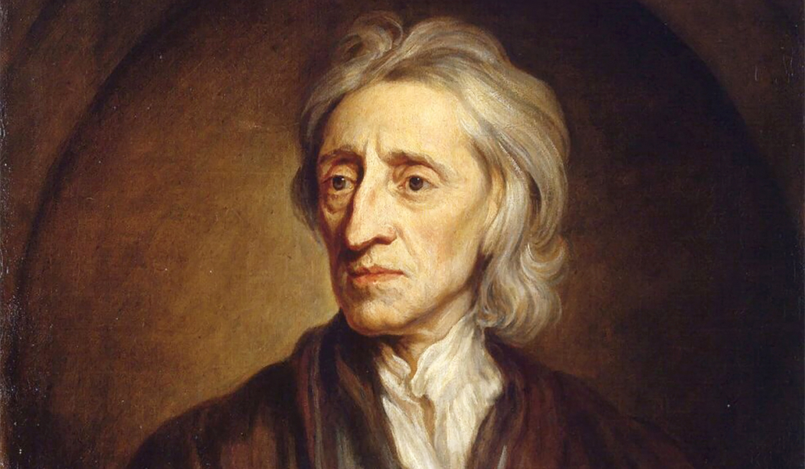
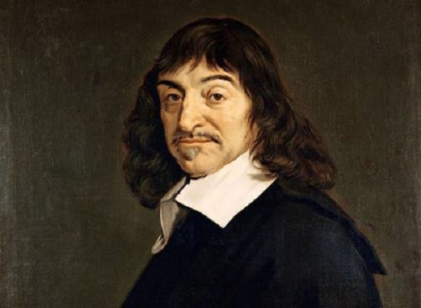
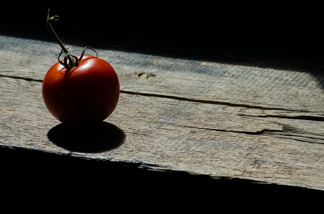

Are we born with innate knowledge? Or do we acquire knowledge only through our sensory experiences? Does the world of our sensory experience align to ‘reality’? Or is experience a poor guide to what’s really there? These are key questions of [epistemology](/reading-lists/epistemology/), the branch of philosophy concerned with what knowledge is, how we acquire it, and whether it has secure foundations. 

A philosopher who had particularly influential things to say about these questions is the 17th-century English philosopher, John Locke, who argued that knowledge is demonstrably acquired _only_ through sensory experience, but that our sensory experience is not infallible.

In his brilliant 1689 work [An Essay Concerning Human Understanding](http://www.amazon.com/gp/product/087220216X/ref=as_li_tl?ie=UTF8&tag=philosophybre-20&camp=1789&creative=9325&linkCode=as2&creativeASIN=087220216X&linkId=ebfa57e638093b07e7676016415fbb51), Locke argues that, at birth, the mind is a _tabula rasa_ (a blank slate) that we fill with ‘ideas’ as we experience the world through the five senses. 

By ‘idea’, Locke means “whatsoever is the Object of the Understanding, when a person thinks.” In other words, an idea is anything you experience or reflect on — and Locke’s key point is we can only get such ‘ideas’ from the senses. 

Our minds cannot _create_ ideas, Locke argues: they can only _combine_ them. Ideas are thus atomic in nature, and can form complex, unique structures: but the constituent parts are all ultimately obtained from sensory experience. As he puts it:

>Let us suppose the mind to be, as we say, a _tabula rasa_, void of all characters, without any ideas. How comes it to be furnished? Whence comes it by that vast store, which the busy and boundless fancy of man has painted on it, with an almost endless variety? When has it all the materials of reason and knowledge? To this I answer, in one word, from _experience_.

For example, you may be able to imagine, say, a new animal. But that new imagined animal could only be made up of parts you've previously encountered through your sensory experience. It might have the horns of a bull, the wings of a dragon, the trunk of an elephant… it might have a heart with 97 chambers. But it couldn't contain any ‘ideas’ you hadn't previously acquired through sensory experience. 

Locke thus champions an approach to understanding the world known as _empiricism:_ knowledge comes from experience, and so by analyzing our experiences we will come to know the truth about reality, and nothing should be asserted unless it can be ratified by experience. 

Today, with the success of empiricist-based science harnessing nature for our benefit, Locke’s views might seem to align nicely with common sense, but it’s important to note that when he was writing, Locke’s arguments most definitely did _not_ align with the common sense of the time. 

Before Locke, it was not empiricist theories of knowledge but scholastic theories founded in _rationalism_ that held sway. Rationalists argue that reason is the chief source and test of knowledge, not experience. A key rationalist thinker was the 17th-century French philosopher, René Descartes. 

[Rationalists like Descartes thought experience could not be trusted](/articles/i-think-therefore-i-am-descartes-cogito-ergo-sum-explained/), and thus sought to understand the world through the certainty of deductive truths, as in mathematics. 

## Answering radical skepticism about the world around us

Empiricism and rationalism are essentially rival responses to the worry of _skepticism_. Skepticism in this context means finding the whole idea of human knowledge unconvincing, and being doubtful that we can really be said to know anything exists at all. 

[Descartes himself outlines the skeptical position](/articles/i-think-therefore-i-am-descartes-cogito-ergo-sum-explained/) very effectively in his wonderful 1641 work, [Meditations on First Philosophy](http://www.amazon.com/gp/product/1107665736/ref=as_li_tl?ie=UTF8&tag=philosophybre-20&camp=1789&creative=9325&linkCode=as2&creativeASIN=1107665736&linkId=60e77f9fd4ff3c655b9bed5f1eac5124), where he worries he has no way of knowing if his experiences of the world are real, or the mere conjurings of an Evil Demon determined to delude and mislead him. 

As our experiences sometimes deceive us, the skeptical argument runs, what basis do we have for trusting experience at _all?_ Hallucinations and the unreliability of eyewitness testimony demonstrate that our senses betray us occasionally — so how are we to know they aren’t deceiving us all the time? How can we prove the world around us even _exists?_  

Descartes’ rationalist answer was to appeal to reason. His starting principle was his [_cogito ergo sum_](/articles/i-think-therefore-i-am-descartes-cogito-ergo-sum-explained/) — I think therefore I am — and from this base he tries to build up truths, from the fact that he exists as a thinking being, all the way up to the existence of God. He does this purely through recognizing certain beliefs as ‘clear and distinct’ — as having no internal contradiction — and by deducing one after the other to establish a theory of knowledge based entirely on reason. 

But Locke dismisses this rationalist response to skepticism, arguing that reason and logical deduction are mere tools: they cannot be innate _sources_ or _foundations_ of knowledge, Locke insists, as all knowledge is ultimately derived from experience, and rationalists like Descartes are wrong in thinking otherwise. 

This is a big claim. If all our knowledge ultimately comes from sensory experience, as Locke argues, then how can we answer the worries of the skeptics, who conclude that our experience is irredeemably untrustworthy? If all we have is unreliable experience, how can we be said to have any knowledge at all? 

## Does our sensory experience tell us anything about reality?

Well, while Locke argues sensory experience is ultimately the source of all our knowledge, he actually agrees wholeheartedly with the skeptics that it’s an unreliable guide to reality. For example, though we experience objects in the external world as being full of color, Locke notes objects themselves cannot possibly be colorized independently, as color exists only in the interaction with a perceiving subject. 

When you look at a ripe tomato, for instance, the redness you see is not a property of the tomato itself, but a result of _light_ reflecting off the tomato into your eye, which is processed by your brain to produce a red sensation. 

To someone from a slightly different vantage point, the color would be slightly different. To someone who was color blind, the tomato would appear different again. Moreover, if you wore blue-lensed glasses, or the source of light changed to dark purple, the color you’d experience when looking at the ripe tomato would change once more. 

Which of these is the ‘true’ color of the tomato? Why should we favor any of them? 

It seems we are forced to conclude that while the tomato _appears_ red under normal perceptual and light conditions, it is not _itself_ red: it just looks that way to _us_ under normal circumstances, because the light reflecting off it leads to a sensation of redness in our minds. We cannot say the object _itself_ has a color at all.

And it turns out this is the case not just for colors, but for all our sensory perceptions: how things taste, smell, sound, and feel are qualities not of things themselves, but of our _interaction_ with those things, and such interactions are based on myriad circumstantial factors, and remain private to the subject undergoing the interaction. As Locke puts it, it’s impossible to know...

>...if the idea that a violet produced in one person’s mind by their eyes were what a marigold produced in another person’s, and vice versa. This could never be known, because one person’s mind couldn’t pass into another person’s body to perceive what appearances were produced.

But while Locke thus agrees with the skeptic that our immediate experience is an unreliable guide to the true nature of reality, he does not agree that this gives us grounds to then doubt the _existence_ of such a reality. Of _course_ the physical world exists independently of us, Locke thinks: for what else causes our experiences? 

## The world must exist independently of us, for what else causes our sensory experiences?

It will be useful here to distinguish between what Locke describes as the _primary_ and _secondary_ qualities of objects. Primary qualities of an object are qualities it has independently of being experienced, like its location, mass, dimensions, and material constitution. These can generally be thought of as its _physical_ or _intrinsic_ properties. Secondary qualities of an object are the qualities _we_ experience, like what it looks like, the color and smell it has, how it feels, tastes, sounds, and so on. These can be thought of as the _mental properties the object gives rise to._ 

For Locke, primary qualities are without dispute. An object’s location, mass, dimensions, and so on can be objectively measured and agreed upon. 

Secondary qualities, however, are subjective, and the cause of much dispute: the colors people see, the textures they feel, the sounds they hear… we experience secondary qualities differently, and this is what gives rise to the skeptic’s concern about the reliability of our senses. 

This distinction allows Locke to neatly answer the skeptic by stating: we need not doubt the existence of _everything_, for all we need to throw out here is the reliability of secondary qualities. Our sensory experience has no bearing on the _primary_ qualities of objects, which exist independently of any interaction with an experiencing subject. 

The upshot of this is a world ‘in-itself’ (the world of primary qualities), which gives rise to the world of our experience (the world of secondary qualities). We can only directly access the latter, Locke thinks, but we can use the latter to extract knowledge of the former. As he puts it:

>Let not the eyes see light, or colors, nor the ears hear sounds, let the palate not taste, nor the nose smell, and all colors, tastes, odors, and sounds, as they are such particular _ideas_, vanish and cease, and are reduced to their causes i.e. bulk, figure, and motion of parts.

This distinction seems to align with common sense, but the skeptic might wonder if Locke’s arguments so far actually justify his assertion that the primary qualities of objects exist independently of our experiencing them. 

If we can only access the primary qualities of an object through its secondary qualities, how can we know about the substance in which its primary qualities actually inhere? 

For example, if we can only measure the size of an object (one of its primary qualities) by relying on our sensory perception of its color, shape, and other secondary qualities, what makes us sure the primary qualities of the object truly exist independently of our sensory experience? How can we be sure the size of the object isn’t as contingent on our sensory apparatus as is its color? 

It seems we are led back to the skeptic’s chief concern: if all we have are mental events happening in our brain, and we can never directly access a ‘physical’ world, why assert the existence of such a world at all?  

Locke, of course, has responses to these concerns, and dedicates significant space to addressing them in [An Essay Concerning Human Understanding](http://www.amazon.com/gp/product/087220216X/ref=as_li_tl?ie=UTF8&tag=philosophybre-20&camp=1789&creative=9325&linkCode=as2&creativeASIN=087220216X&linkId=ebfa57e638093b07e7676016415fbb51). The success of his arguments has since been intensively discussed by Leibniz, Berkeley, Hume, Kant, and many more great thinkers influenced and stimulated by his work. 

## Where does Locke’s empiricism leave us?

The extent to which Locke’s views align with the common sense of today is testament to the enduring influence his empiricism has had on Western thought. His arguments resonated with a lot of thinkers at the time, and challenged rationalism as the dominant approach to epistemology and answering the problem of skepticism. 

As late philosopher Bryan Magee summarizes Locke’s legacy in his philosophical memoirs, [Confessions of a Philosopher](http://www.amazon.com/gp/product/0375750363/ref=as_li_tl?ie=UTF8&tag=philosophybre-20&camp=1789&creative=9325&linkCode=as2&creativeASIN=0375750363&linkId=596dfdfc7e47562aebc7063290597368):

>If Locke has come to be thought of as something of a plain, commonsensical thinker, perhaps even a bit pedestrian, it is because what he had to say has become so familiar that it may be in danger of seeming obvious to us now; but the truth is that when he put it forward it was profoundly original, and not obvious at all. The fact that it can seem obvious now is a measure of his influence. Indeed, it could be seriously argued that he is the most influential philosopher since Aristotle. 

However, while stimulating and influential, Locke’s views are not without problems — and indeed these problems have been long dissected and discussed by brilliant minds since. 

If you’re interested in learning more about how Locke’s empiricism developed in the minds of such thinkers, our introductory philosophy course, [Life's Big Questions](/lifes-big-questions/), might be just what you’re looking for. On day two we hone in on the question, [‘is the world around us real?’](/articles/is-the-world-around-us-real/) — discussing Descartes and Locke further, and also considering responses from the philosophical giants who followed, including George Berkeley, David Hume, and Immanuel Kant. Interested in learning more? Explore the full course now! 

<a class="primary button" href="/lifes-big-questions/"><svg xmlns="http://www.w3.org/2000/svg" viewBox="0 0 512 512"><path d="M504 256C504 119 393 8 256 8S8 119 8 256s111 248 248 248 248-111 248-248zm-448 0c0-110.5 89.5-200 200-200s200 89.5 200 200-89.5 200-200 200S56 366.5 56 256zm72 20v-40c0-6.6 5.4-12 12-12h116v-67c0-10.7 12.9-16 20.5-8.5l99 99c4.7 4.7 4.7 12.3 0 17l-99 99c-7.6 7.6-20.5 2.2-20.5-8.5v-67H140c-6.6 0-12-5.4-12-12z"/></svg>Explore Course Now</a>

