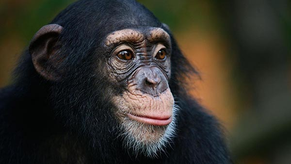
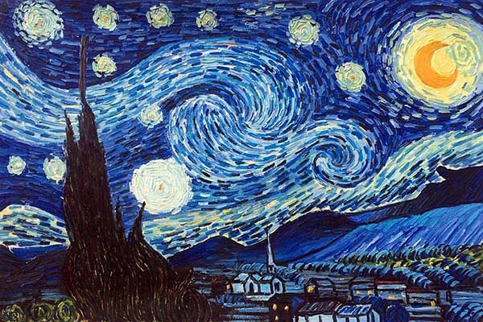

There are around 7,000 human languages spoken across the globe, all with unique sounds, vocabularies, and structures. In light of recent research, it's becoming increasingly clear that each language significantly shapes the cognition of its speakers. 

In Australian Aboriginal community Pormpuraaw, for instance, the concepts ‘left’ and ‘right’ do not exist — instead, locations are referred to by their relation to the sun. [According to cognitive scientist Lera Boroditsky](https://www.wsj.com/articles/SB10001424052748703467304575383131592767868), about a third of the world’s languages discuss space in these kinds of absolute rather than relative terms. Boroditsky remarks:

>As a result of this constant linguistic training, speakers of such languages are remarkably good at staying oriented and keeping track of where they are, even in unfamiliar landscapes.

In Russia, meanwhile, the sky is not blue. At least, not in the way we — in English — think it’s blue. Why? Because in the Russian language there is no single word for blue. Rather, there are separate words for light blue (goluboy) and dark blue (siniy), which leads Russian speakers to distinguish two distinct colors. 

Moreover, those who speak the Zuñi language [have trouble](https://psycnet.apa.org/record/1955-03957-001) telling orange and yellow apart. Why? Because the Zuñi language doesn’t differentiate between them.  

Language impacts not just how we see the world, but our mindset towards it too. Behavioral economist Keith Chen, for instance, is [interested in comparing](https://www.anderson.ucla.edu/faculty_pages/keith.chen/papers/LanguageWorkingPaper.pdf) the thinking patterns between speakers of ‘futured’ and ‘futureless’ languages. Futured languages like English distinguish between the past, present, and future; whereas futureless languages like Chinese use the same phrasing to describe the events of yesterday, today, and tomorrow. 

Chen finds that speaking a futured or futureless language has significant consequences for — you guessed it — attitudes towards the future. [As the TED article](https://ideas.ted.com/5-examples-of-how-the-languages-we-speak-can-affect-the-way-we-think/) summarising his research puts it: 

>Futureless language speakers are 30% more likely to report having saved in any given year than futured language speakers. This amounts to 25% more savings by retirement, if income is held constant. Chen’s explanation: when we speak about the future as more distinct from the present, it feels more distant — and we’re less motivated to save money now in favor of monetary comfort years down the line.

The languages we speak, it seems, shape everything we do: from how we process experiences to how we behave. The question is why: why does language — something apparently so arbitrary, with its sounds and symbols having no connection to meaning beyond those who can interpret them — have such a profound grip on how we experience the world? 

<!--small subscribe-->

    <h4>Enjoying this article? Get one like it delivered to your inbox every Sunday (free)</h4>
    
Every Sunday, I break down one mind-opening idea from philosophy. You get the distillation straight to your inbox.

    

        <form action="https://app.convertkit.com/forms/5812400/subscriptions" method="post" data-sv-form="5812400" data-uid="be0e52d3c0" data-format="inline" data-version="5" data-options="{&quot;settings&quot;:{&quot;after_subscribe&quot;:{&quot;action&quot;:&quot;redirect&quot;,&quot;success_message&quot;:&quot;Success! Now check your email to confirm your subscription.&quot;,&quot;redirect_url&quot;:&quot;https://philosophybreak.com/thank-you/&quot;},&quot;analytics&quot;:{&quot;google&quot;:null,&quot;fathom&quot;:null,&quot;facebook&quot;:null,&quot;segment&quot;:null,&quot;pinterest&quot;:null,&quot;sparkloop&quot;:null,&quot;googletagmanager&quot;:null},&quot;modal&quot;:{&quot;trigger&quot;:&quot;timer&quot;,&quot;scroll_percentage&quot;:null,&quot;timer&quot;:5,&quot;devices&quot;:&quot;all&quot;,&quot;show_once_every&quot;:15},&quot;powered_by&quot;:{&quot;show&quot;:false,&quot;url&quot;:&quot;https://convertkit.com/features/forms?utm_campaign=poweredby&amp;utm_content=form&amp;utm_medium=referral&amp;utm_source=dynamic&quot;},&quot;recaptcha&quot;:{&quot;enabled&quot;:false},&quot;return_visitor&quot;:{&quot;action&quot;:&quot;show&quot;,&quot;custom_content&quot;:&quot;&quot;},&quot;slide_in&quot;:{&quot;display_in&quot;:&quot;bottom_right&quot;,&quot;trigger&quot;:&quot;timer&quot;,&quot;scroll_percentage&quot;:null,&quot;timer&quot;:5,&quot;devices&quot;:&quot;all&quot;,&quot;show_once_every&quot;:15},&quot;sticky_bar&quot;:{&quot;display_in&quot;:&quot;top&quot;,&quot;trigger&quot;:&quot;timer&quot;,&quot;scroll_percentage&quot;:null,&quot;timer&quot;:5,&quot;devices&quot;:&quot;all&quot;,&quot;show_once_every&quot;:15}},&quot;version&quot;:&quot;5&quot;}" min-width="400 500 600 700 800">
        
<ul data-element="errors" data-group="alert"></ul>

            

                <input name="email_address" aria-label="Your Email Address..." placeholder="Your Email Address..." required type="email" />
            

            <button class="button primary" type="submit" data-element="submit">

<svg xmlns="http://www.w3.org/2000/svg" viewBox="0 0 512 512"><path d="M464 64H48C21.49 64 0 85.49 0 112v288c0 26.51 21.49 48 48 48h416c26.51 0 48-21.49 48-48V112c0-26.51-21.49-48-48-48zm0 48v40.805c-22.422 18.259-58.168 46.651-134.587 106.49-16.841 13.247-50.201 45.072-73.413 44.701-23.208.375-56.579-31.459-73.413-44.701C106.18 199.465 70.425 171.067 48 152.805V112h416zM48 400V214.398c22.914 18.251 55.409 43.862 104.938 82.646 21.857 17.205 60.134 55.186 103.062 54.955 42.717.231 80.509-37.199 103.053-54.947 49.528-38.783 82.032-64.401 104.947-82.653V400H48z"/></svg>Join 6,000+ Subscribers</button>
            

            

        </form>
        
One short philosophical email per week. Unsubscribe any time.

    

## How Different Organisms Experience Reality

In ethology, the German word _umwelt_ refers to how different organisms experience reality. The _umwelt_ of a bat, for example, is starkly different to that of, say, a chimpanzee. On the one hand, you have a winged nocturnal organism that emits high-pitched screeches and uses the echoes of those screeches, rather than vision, to navigate; on the other you have a primate whose experience of the world is [much like our own](https://janegoodall.ca/our-stories/10-ways/). 

A being’s _umwelt_ is made up of more than its sensory perception, however. It’s also shaped by the concepts it uses to model and interpret the world — concepts learned from culture. Indeed, observations of culture within different species have led to some compelling findings, [as discussed in The Conversation](https://theconversation.com/a-chimpanzee-cultural-collapse-is-underway-and-its-driven-by-humans-113133):

>Killer whale pods and dolphins exhibit different dialects and use tools differently… Capuchin monkeys of Central and South America exhibit 13 variants of social customs, while different orangutan populations vary their calls and the use of tools, nests or other objects.  Examples of chimpanzee culture range from social customs, such as the way they grasp their hands during grooming, to how males sexually display, to the type of tools used for cracking nuts or ant-dipping.

The _umwelt_ of such organisms as whales, dolphins, monkeys, and chimps, therefore, is determined not only by biochemistry: it’s determined by culture. And, if culture shapes the _umwelt_ of animals, it it absolutely fundamental to that of humans. Indeed, our use of advanced language unlocks richer shared concepts, and thus a richer, more all-encompassing culture. As [the Jane Goodall Institute notes](https://janegoodall.ca/our-stories/chimpanzees-and-culture/):

>Many believe that chimpanzees have not evolved culture on the scale of human beings due to their lack of advanced language.

The noises we make, the expressions we pull, the symbols we draw — all that we mutually understand about each other feeds a conceptual structure that blankets our realities. That’s why language has such a foundational impact on our cognition: our individual _umwelts_ are contextualized entirely by the cultures to which we belong and the languages with which we communicate.  

## The cognitive universes we live in

Commenting on the multitude of languages across the globe, Boroditsky remarks: “the beauty of linguistic diversity is that it reveals to us just how ingenious and how flexible the human mind is. Human minds have invented not one cognitive universe, but 7,000.”

That we _invent_ the cognitive universes we occupy is a powerful thought — and an empowering one. Within languages, specialist vocabulary provides deeper, more detailed conceptual clusters that enrich and inform our understanding of particular subjects. An engineer, for instance, describes a bridge differently to a painter; a violinist hears an orchestra differently to a percussionist; a chef explains a meal differently to a food critic. 

If each language is a cognitive universe, our specializations and interests are word-galaxies within them — and new ones are there for us to explore.

Language is a strange, wonderful thing. It both contextualizes and enables us to share our experiences. By broadening our linguistic capabilities and vocabularies, we broaden our cognitive universes — and so deepen our understanding of the world, each other, and ourselves. Indeed: if our _umwelts_ are of our own making, how will you shape yours?

## Further reading

If you're interested in learning more about the nature of language, we've put together a [reading list featuring the best 7 books on the philosophy of language](/reading-lists/philosophy-of-language/). After reading it, you'll have much clearer understanding as to why the symbols you're currently scanning mean anything at all. Hit the banner below to access the reading list now.  

<a class="reading-list cta" href="/reading-lists/philosophy-of-language/">
    
    

    

        <svg xmlns="http://www.w3.org/2000/svg" viewBox="0 0 576 512"><path fill="#fff" d="M542.22 32.05c-54.8 3.11-163.72 14.43-230.96 55.59-4.64 2.84-7.27 7.89-7.27 13.17v363.87c0 11.55 12.63 18.85 23.28 13.49 69.18-34.82 169.23-44.32 218.7-46.92 16.89-.89 30.02-14.43 30.02-30.66V62.75c.01-17.71-15.35-31.74-33.77-30.7zM264.73 87.64C197.5 46.48 88.58 35.17 33.78 32.05 15.36 31.01 0 45.04 0 62.75V400.6c0 16.24 13.13 29.78 30.02 30.66 49.49 2.6 149.59 12.11 218.77 46.95 10.62 5.35 23.21-1.94 23.21-13.46V100.63c0-5.29-2.62-10.14-7.27-12.99z"/></svg>READING LIST
        

        <h3>Philosophy of Language</h3>
        
The Top 7 Books to Read

    
    
    <svg class="cta swing" xmlns="http://www.w3.org/2000/svg" viewBox="0 0 320 512"><path d="M285.476 272.971L91.132 467.314c-9.373 9.373-24.569 9.373-33.941 0l-22.667-22.667c-9.357-9.357-9.375-24.522-.04-33.901L188.505 256 34.484 101.255c-9.335-9.379-9.317-24.544.04-33.901l22.667-22.667c9.373-9.373 24.569-9.373 33.941 0L285.475 239.03c9.373 9.372 9.373 24.568.001 33.941z"/></svg>
</a>