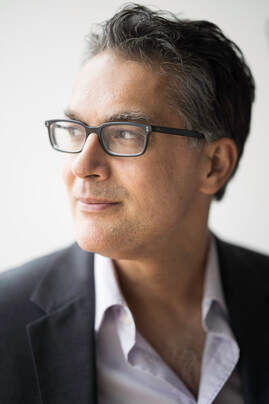
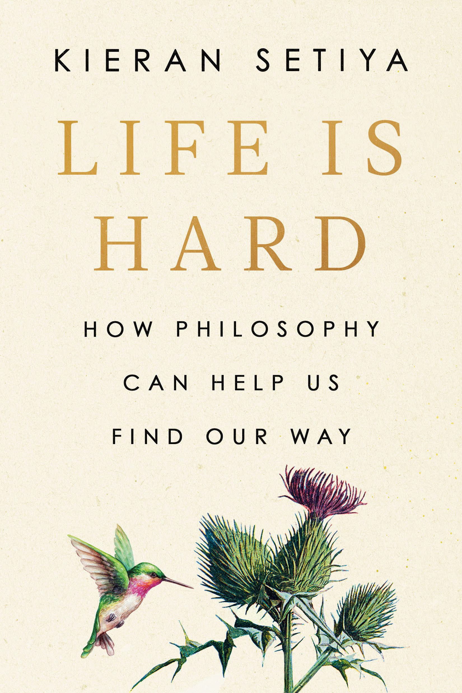

<i><a target="_blank" rel="noopener noreferrer" href="http://www.ksetiya.net/">Kieran Setiya</a> teaches philosophy at MIT, working mainly in ethics, epistemology, and the philosophy of mind. Beyond his academic work, his writing has appeared in the Los Angeles Review of Books, the Times Literary Supplement, and The New York Times. 

    

We caught up with Kieran about his brilliant, thoughtful new book, <a target="_blank" rel="noopener noreferrer sponsored" href="http://www.amazon.com/Life-Hard-Philosophy-Help-Find/dp/0593538218?&linkCode=ll1&tag=philosophybre-20&linkId=c136f8a5d4d5be4678ef693b6785ca82&language=en_US&ref_=as_li_ss_tl">Life is Hard: How Philosophy Can Help Us Find Our Way</a>, which advises us to stop striving for our ‘best life’ and think instead about how to live well. 

With chapters on infirmity, loneliness, grief, failure, injustice, the absurd, and hope, Kieran demonstrates how it is the process of philosophical contemplation, not just the content of it, that can help us navigate adversity.</i>

## How did the idea for your book — investigating the good life through the lens of adversity — come about?

My personal way into the book was through my experience of chronic pain — my chapter on infirmity is about that — and I felt like philosophy was helpful in coming to grips with it. 

For me personally, aiming for some kind of ideal life has a very concrete form of limitation, which is that it’s very unlikely that the condition I have is really curable or treatable. So, the question has to be not _what is the ideal life_, but _what’s a good life in these circumstances?_ 

Here’s an anecdote that may bring this to life a bit more. I remember at some point when I was really taking in that my condition wasn’t going to change, I was sitting somewhere and looking across the room and feeling a kind of bitter envy toward all the people walking by. _You don’t know how good you’ve got it being pain free_, I thought.

And then I paused and thought, actually, I have absolutely no idea what these people are going through any more than they have any idea what I’m going through. While it might not be physical pain, almost everyone is dealing with some kind of adversity. It might be loneliness, it might be grief, it might be failure in their life, it might just be watching the news and being horrified by what’s happening in the world.

I think for me that moment crystallized the idea for a book about how philosophy could approach the good life through the topic of adversity. 

## Why do you think focusing on adversity is important?

There’s a couple of immediate practical things to say about _not_ focusing on adversity. One is that thinking about the ideal or dream life is unrealistic and not really a guide to what to do here and now.

In political philosophy, for example, there’s been a critique of so-called ‘ideal theory’, where you describe an essentially utopian society. One of the objections is that we can never achieve it _\[here’s [Isaiah Berlin’s argument on why pursuing utopia is dangerous](/articles/isaiah-berlin-on-why-the-pursuit-of-the-ideal-is-harmful/)]_. Another is that describing the utopian society actually doesn’t tell us very much about how to deal with injustice in the world around us. 

And I think something like that is true in the ethics of individual flourishing, too — that even if you’re right about what an ideal life would look like, it won’t include whatever circumstances you’re in right now, and so it won’t give you a guide to it.

>Living well involves being in touch with reality. We have to live in the world as it is, not the world as we wish it would be.

So that’s one central thing to say. The other is there’s a distinction I emphasize in the book between feeling happy and living well, and it’s a distinction you can illustrate in thought experiments philosophers are fond of. 

Suppose, for instance, you’re plugged into a simulation, it’s all completely unreal. Maybe it simulates an ideal life and you feel happy, but you’re not really living a good life. You’re not really living at all. 

<!--big subscribe-->

    
    <h4>Get one mind-opening philosophical idea delivered to your inbox every Sunday (free):</h4>
    

        <form style="margin-bottom: 1em" action="https://philosophybreak.us19.list-manage.com/subscribe/post?u=6f4dbbebde3dd2a464df28ec3&amp;id=48d478eebf&amp;f_id=0083aae4f0" method="post" id="mc-embedded-subscribe-form" name="mc-embedded-subscribe-form" target="_blank">
            <input type="email" placeholder="Your Email Address..." ref={this.input} name="EMAIL" required/>
            <input type="hidden" name="tags" value="6266048" />
            <button class="button primary" type="submit"><svg xmlns="http://www.w3.org/2000/svg" viewBox="0 0 512 512"><path d="M464 64H48C21.49 64 0 85.49 0 112v288c0 26.51 21.49 48 48 48h416c26.51 0 48-21.49 48-48V112c0-26.51-21.49-48-48-48zm0 48v40.805c-22.422 18.259-58.168 46.651-134.587 106.49-16.841 13.247-50.201 45.072-73.413 44.701-23.208.375-56.579-31.459-73.413-44.701C106.18 199.465 70.425 171.067 48 152.805V112h416zM48 400V214.398c22.914 18.251 55.409 43.862 104.938 82.646 21.857 17.205 60.134 55.186 103.062 54.955 42.717.231 80.509-37.199 103.053-54.947 49.528-38.783 82.032-64.401 104.947-82.653V400H48z"/></svg>Subscribe to Weekly Emails</button>
        </form>
        
Join 5,500+ subscribers enjoying one nugget of profundity per week. Unsubscribe any time. 

    

That’s an extreme case, but you can see the same contrast in cases of, say, deception, or cases where people’s lives are not in touch with reality.

And what that suggests is that while feeling happy is important, living well involves being in touch with reality. We have to live in the world as it is, not the world as we wish it would be. And once you start thinking about the goal of philosophical self-help as living well, it looks like the only way to do that is to actually take in fully the circumstance you’re in and figure out, okay, if this is really the world I’m dealing with — warts and all — how can I approach it? How _should_ I approach it?

## Is there a balance to be struck in terms of being so remorselessly in touch with reality versus just preserving a sense of well-being? 

What I mean by the idea of being connected to reality is that you’re just trying to accurately describe what’s happening. It’s not simply lugubrious or wallowing in hardship. Really, it’s inspired by the novelist philosopher Iris Murdoch, and her idea that attention to reality is a central aspect of ethical thought. 

Murdoch argues that finding the right words to really describe what you’re going through — or in fact even what’s happening in society — is often crucial to figuring out how to feel about it and what to do about it.

So the idea is that really attending to reality is not just necessary, but also a step towards partly consolation and partly action.

## What would such consolation or action look like, once we attend to reality? The Stoics, for instance, suggest we should reconcile ourselves to what we can’t personally control.

I understand the contemporary resurgence and appeal of [Stoicism](/reading-lists/stoicism/), and there’s real wisdom in not obsessing with trying to change things you can’t control; but I think what can sometimes be problematic with Stoicism is that there’s this _acceptance_ of unfortunate conditions in the world.

>I think there’s a way in which just accepting things can be a failure to acknowledge how bad they are, and that sometimes you have to rail against even things you can’t control.

In 1868 there was a new translation of Epictetus, one of the great Stoic thinkers, that was reviewed by the novelist Henry James. Now, Epictetus was enslaved in ancient Greece, and part of his teachings included his story of adapting to the condition of living under slavery. And in his critique, Henry James imagines what it would be like for a black person in the American South to simply repeat the Stoic mantra of just reconciling yourself to it. 

I think there’s a way in which just accepting things can be a failure to acknowledge how bad they are, and that sometimes you have to rail against even things you can’t control. I think the same thing about the Stoic attitude to grief, which is basically that we can and should extinguish it. 

My view is that we should protest against things even when we can’t control or change them, or we don’t know how we can control or change them.

. How should we balance personal wellbeing with concern for large-scale problems?")

## That said, you discuss ‘doom scrolling’ and how it’s easier than ever to become enraged by events in the world. How do you think we can balance personal wellbeing with, say, engagement with injustice?

When we confront the injustice of the world, it’s very easy to feel overwhelmed and powerless and like there’s very little we can do. And so it’s important to allow for a certain kind of self-compassion.

>I think to some extent it’s consoling just recognizing that in conditions of widespread injustice, a sense of inadequacy is inevitable. 

However, I think it would be a very bad response to that realization to then do nothing. The right response to saying, for instance, “I have very limited power. I can’t change this. I can’t stop climate change tomorrow. I can’t save everyone who’s suffering” is not then to say, “Oh well, I guess I’ll do nothing.” Rather, the right response is to think, “well, what could I do on a smaller scale?”

Then there’s the problem that arises, you know, when you actually do something. We all try different ways to address the injustice of the world around us, and then feel inadequate or like we’re falling short. 

I think to some extent it’s consoling just recognizing that in conditions of widespread injustice, a sense of inadequacy is inevitable. And one way this comes out is talking to my friends who really are activists.

Unlike me, they spend their lives working on, say, climate change — and even though they’re doing so much more than I am, they also think “I’m not doing enough.” 

We have limits psychologically and emotionally to how much we can do. You don’t always really know if you’re hitting the limits. Maybe you could be doing more. But I think we just have to accept that as a condition of reality: we just have to put up with a certain amount of guilt in an unjust world that we can only do so much to change.

<!--small subscribe-->

    <h4>Enjoying this article? Get one like it delivered to your inbox every Sunday (free)</h4>
    
Every Sunday, I break down one mind-opening idea from philosophy. You get the distillation straight to your inbox.

    

        <form style="margin-bottom: 1em" action="https://philosophybreak.us19.list-manage.com/subscribe/post?u=6f4dbbebde3dd2a464df28ec3&amp;id=48d478eebf&amp;f_id=0083aae4f0" method="post" id="mc-embedded-subscribe-form" name="mc-embedded-subscribe-form" target="_blank">
            <input type="email" placeholder="Your Email Address..." ref={this.input} name="EMAIL" required/>
            <input type="hidden" name="tags" value="6266048" />
            <button class="button primary" type="submit"><svg xmlns="http://www.w3.org/2000/svg" viewBox="0 0 512 512"><path d="M464 64H48C21.49 64 0 85.49 0 112v288c0 26.51 21.49 48 48 48h416c26.51 0 48-21.49 48-48V112c0-26.51-21.49-48-48-48zm0 48v40.805c-22.422 18.259-58.168 46.651-134.587 106.49-16.841 13.247-50.201 45.072-73.413 44.701-23.208.375-56.579-31.459-73.413-44.701C106.18 199.465 70.425 171.067 48 152.805V112h416zM48 400V214.398c22.914 18.251 55.409 43.862 104.938 82.646 21.857 17.205 60.134 55.186 103.062 54.955 42.717.231 80.509-37.199 103.053-54.947 49.528-38.783 82.032-64.401 104.947-82.653V400H48z"/></svg>Subscribe to Weekly Emails</button>
        </form>
        
Join 5,500+ subscribers. Unsubscribe any time. 

    

## So, for instance, there’s an important protest march on Saturday, but a friend you haven’t seen in years is coming into town and wants to catch up. What do you prioritize? The answer is not straightforward.

Right, there’s no formula. So another aspect of this idea that we’ve got to attend to reality — that ethical thought is as much about attention and description as it is about an abstract theory — is that we can’t just take some template for how to live off the shelf and then just apply it to our lives.

Figuring out what to do involves figuring out the actual circumstance you’re in. And that’s something that at a certain point, only you or your friends and people who know you can really do. 

So, there’s limits to how much direction I can give. In the book, I try to say useful things but I also often take myself as a case study, partly because that’s a way of illustrating what it will be like in concrete terms, to apply this or that philosophical framework to someone’s actual circumstances. 

And then hopefully people can think, “I see how the general framework operates and I see how he’s attempting to think about his own life and his own shortcomings… I wonder how I would do that for myself.” 

## The ‘show, don’t tell’ approach is very effective in the book, demonstrating how it is the process of philosophical contemplation, rather than just the content of it, that holds the real practical power in unpicking adversity.

I hope that’s true, and in some cases it’s really central to my understanding of the topic. One example of this is in the discussion of grief. 

One of the puzzles about grief is if you’re grieving not for the difficulties in your life occasioned by someone’s death, but just thinking about their loss, that they’re just gone, then the fact that they’re gone is just that — a fact. It’s not changing. It’s not like a year later you can say, “well, their nonexistence isn’t such a big deal for them now because a year has passed.” That doesn’t make any sense. The reason for grief on their behalf is just a permanent fact. It never goes away. 

This leads to a difficult question: why don’t we grieve for them forever? And that’s a case where I think the right response is that reason can only do so much at that point. 

>If someone tried as a philosopher to say, “I’m a philosopher who thinks about grief using pure reason, and I’ve determined that the right way to grieve is _this_” then it would be clear they didn’t know what they were talking about.

Reason can’t dictate how our response to grief should be structured. It might tell us that we have to grieve and that we don’t have to grieve forever, but the exact contours of that are something you can’t legislate — which is where I think practices and rituals of mourning can play a central role, by offering some semblance of structure in lieu of reason. 

I think grief is a particularly extreme example of why it is the process of philosophical contemplation, rather than just the content of it, that holds practical value. If someone tried as a philosopher to say, “I’m a philosopher who thinks about grief using pure reason, and I’ve determined that the right way to grieve is _this_” then it would be clear they didn’t know what they were talking about. People must work through it themselves.

## You finish your chapter on grief by framing it in terms of ‘success’ and ‘failure’, making it clear this binary judgment is not appropriate for something as complex as grief. However, as you go on to discuss in your chapter on failure, that doesn’t stop us applying such stark judgment to other aspects of our lives, or even our lives as a whole. How can philosophy help us face up to and deal with failure?

There are three big ideas about how to deal with failure in the book. One is that I think the idea that your life (or you yourself) can be a failure is partly a function of a way of thinking about human life that is quite popular, which is the idea that part of living well is having a narrative of your life.

And if you think that narrative has to be a kind of linear structure, then it has the structure of a struggle. “I’m aiming for this and then I achieve it, or I don’t.” And there’s a sense that if you let that narrative stand for your whole life, that project to define your life, you’re at risk of allowing yourself to be defined as a failure by your own self-conception.

One way I think philosophy can help push back against our experience of failure is by helping us to resist the idea that a good life involves defining one’s self by some central quest. Like you’re the protagonist of a Hollywood movie, as opposed to someone whose life is extremely diverse and has all kinds of little successes and failures and connections in it.

The second idea is about projects in general, and the way in which we tend to be, I think, a little bit too obsessed with or driven by project-like structures in our lives. 

When you’re focusing on a project, you’re aiming at something in the future, and then as soon as you achieve it, it’s over. What you’re doing is taking this thing that’s structuring your life and attempting to finish it and thereby getting rid of the source of meaning in your life.

The more you focus on things like that, the more you risk setting yourself up for evaluating your life in terms of success and failure. But it’s important to remember that not all activities are like that. 

>The more we recognize the value of the _atelic_ activities we’re engaged in on a daily basis — like walking, eating, interacting with our loved ones — the less we’re structuring our lives entirely in terms of projects that will succeed or fail.

In the book, I draw a distinction between _telic_ activities and _atelic_ activities. The terminology is from linguistics but originates from the Greek word _telos_, meaning ultimate object or aim. 

So, while there are _telic_ projects which aim at some sort of end state where they’re achieved, there are also _atelic_ activities that don’t aim at a goal in this way. While you’re walking home, for instance, you’re also just _walking_, and there’s pleasure to be found in just walking with no urgent destination in mind. 

Having kids is the same: it’s tempting to think you’ve had the baby, what’s the next milestone? Parenting could be viewed as this ongoing activity with lots of projects in it. But the more we recognize the value of the _atelic_ activities we’re engaged in on a daily basis — like walking, eating, interacting with our loved ones — the less we’re structuring our lives entirely in terms of projects that will succeed or fail. So valuing the process is important.

And then there’s a third and final idea which is more complicated because I don’t think philosophy or philosophizing for oneself can really change it. 

But philosophy, together with history and sociology, can illuminate the ways in which the idea of ourselves as failures or successes is structured by the societies in which we live, the way in which that kind of ideology is not something we’re just inventing for ourselves, but that we’re encouraged to think of ourselves as measured by social standards, often standards of financial success or wealth. 

Material ‘success’ is a particular narrative that gets foisted on you, without your choosing, as the test of whether you’re doing well or badly.

I think philosophy can help diagnose this problem, and shed light on how there’s lots of other measures of value in life. But actually changing society so that people aren’t being made to judge their own lives in terms of financial success and failure is a matter of real political and social action, not simply philosophical contemplation.

## Should we banish _telic_ activities, or just place greater emphasis on _atelic_ ones? There’s a nice quotation from the philosopher Robert M. Pirsig, who writes “To live only for some future goal is shallow. It’s the sides of the mountain which sustain life, not the top. But of course, without the top you can’t have any sides. It’s the top that defines the sides. So on we go—” 

Right. And you can’t really opt out. It’s not like the prospect of a human life totally unstructured by projects is a real one. It’s not that you can say, “I’m just not going to engage in a project.” But the question is when you’re engaging in projects, how much do you also recognize where there is value in the process, and not just mortgage everything to the success and failure of your enterprise?

Of course, success and failure in certain projects really does matter. It matters whether the doctor saves a life. But even if the doctor doesn’t save that life, there’s value in the process of medical care. 

>To some extent you can reframe this in terms of thinking about processes as primary and projects as secondary: that we engage in certain kinds of projects in order to be engaged in certain valuable processes.

## Let’s move on to your discussion of absurdity. How can philosophy help us navigate the question of the meaning of life? 

I think the first thing philosophy can help us do is unpack what the question means, because it’s such a perplexing question, perplexing enough that philosophers often avoid it or deny that it’s really meaningful. 

Something I found very helpful in approaching this topic was distinguishing the question of whether an individual has a meaningful life from the question of whether human life as a whole has meaning.

Philosophers have actually said quite a bit about the first question. Susan Wolf for instance has a very good book, <a target="_blank" rel="noopener noreferrer sponsored" href="http://www.amazon.com/Meaning-Matters-University-Center-Values/dp/0691154503?&linkCode=ll1&tag=philosophybre-20&linkId=6e76afdc45d024293022827a49f255ae&language=en_US&ref_=as_li_ss_tl">Meaning in Life and Why It Matters</a>. 

But what philosophers tend to neglect or be puzzled by is the second question: does life as a whole have meaning? 

>We are asking: is there a story you can tell about human life and its place in the cosmos? A story that is both true and informs how we might reconcile the difficulties of life?

I think the way to make sense of the question is something like this: When you seek the answer to meaning in, say, a work of art, you do so in a way that tells you what attitude to take towards it and how to feel about it, what kind of overall vision of and attitude towards the world it leaves you with. I think when we ask about the meaning of life, we seek to establish that same version of meaning. We are asking: is there a story you can tell about human life and its place in the cosmos? A story that is both true and informs how we might reconcile the difficulties of life? 

That’s why religions are ways of giving life meaning. They have narratives that tell us how to feel, or the assurance that there is some kind of story that reconciles life’s suffering. 

The hardest question here is, is there a prospect in secular moral philosophy of a positive answer to the question of life’s meaning? It would have to be some kind of story about the shape of human history and the place of human life in the universe. A story that is true, and that when we tell it, we should, in response to that narrative of human life say, “okay, I’m okay with that. If this is the real whole story, then it reconciles the terrible things in human history.”

## Is there a question that lies even beyond the human story here, the question of the meaning of why anything exists at all? Do you think philosophy can help us with that, or do we have to limit its scope to the human story?

While I think that you can make sense of the question in the same way as we just discussed, it’s less clear to me how you could formulate a positive secular answer. That’s why I focus on the meaning of human life: I think this is an especially urgent question for us as human beings, but also because there I do have a picture of what a positive answer could look like.

A positive secular answer to the question of the meaning of human life as a whole, I think, would be if the arc of human history bends towards justice. If human beings were able to sort themselves out and achieve, if not utopia, then some kind of reasonably just society, then I would think, “well, it doesn’t make up for the terrible injustices and suffering in human history, but at least we got it together. I’m okay with that.”

Whether or not the arc of human history _does_ bend towards justice depends on what we collectively do and how the future goes. It doesn’t depend entirely on us because there’s a lot that’s out of our control. 

So, I’m not saying life _does_ have meaning, but I do think the story of human life could have meaning if the outcome of that story is that we achieve a just society — and we should strive to behave in ways that could bring that meaningful outcome about. 

I’m less clear on what we could do to give the universe as a whole meaning, but I think it’s a good question.

## Perhaps you could argue the meaning of the universe as a whole is almost irrelevant, in that it doesn’t necessarily have to impact the meaning we create for ourselves. There’s a nice example in your book of the philosopher  Thomas Nagel asking us to imagine if we found out human beings were brought into existence as food for extraterrestrial beings. Or that we’re the mere forgotten plaything of some supreme creator. Just because we have an unglamorous origin story — that doesn’t necessarily trump the meaning we create for ourselves.

That’s a great argument. So the thought is even if there was a narrative about the universe that made you think, “Wow, I feel kind of sad or angry about why everything exists,” or “I should feel great about why everything exists,” that wouldn’t actually answer this other question, the one that’s humanly pressing, which is: what meaning do I ascribe to _my_ life as I live it? What meaning do we, as humans, ascribe to humanity? I like that idea.

## Were there any other topics of adversity you wanted to write about that didn’t make it into the book?

Originally that was going to be a chapter on parenthood. But then I had two thoughts about this. One was, oh dear, why am I counting parenthood as one of the great ills of my life? Now, I do think parenthood is very difficult in all sorts of ways, and it raises many challenges that people confront in their daily lives. But I thought, hold on, I’m not going as far as to list parenthood as one of the great adversities of life.

The second was that it’s too big a topic. There was no way to squeeze it into a chapter. I mean, obviously you could write a whole book about any of the chapters, about loneliness or grief, for instance, and so they’re all selective and partial. But in the case of parenthood, I thought there was just no way to do it justice, and it wasn’t quite clear how it fit.

## Is there any kind of suffering or adversity that you think philosophy or philosophical contemplation cannot help with?

For all forms of suffering, philosophy has limits to what it can do; but in principle I don’t think there’s any kind of suffering about which there couldn’t be something philosophically useful to say. 

In part, I think that’s because philosophy is as much about attentive description as it is about abstract argument and theory, and clear acknowledgment has a powerful consoling role for people. 

For example, people do find it meaningful to have someone just describe what they’re going through in a way that’s accurate, even if after describing it the only possible response is solidarity with the problem — “I hear you” — rather than a solution to it. 

And I think this kind of consolation — the consolation of attentive description, which philosophy can provide — is available for all suffering.

## Who would you say is the ideal reader for your book?

Well, I’d hope that even if you weren’t interested in philosophy beforehand, if you are dealing with anything difficult in your life, then I’d hope you’d get something from the book. I’d like the audience to be as unlimited as possible, but of course that’s something I leave to fate! 

&nbsp;

<i>You can order Kieran’s new book <a target="_blank" rel="noopener noreferrer sponsored" href="http://www.amazon.com/Life-Hard-Philosophy-Help-Find/dp/0593538218?&linkCode=ll1&tag=philosophybre-20&linkId=c136f8a5d4d5be4678ef693b6785ca82&language=en_US&ref_=as_li_ss_tl">Life is Hard: How Philosophy Can Help Us Find Our Way here</a>, or simply hit the banner below.</i>

    <a target="_blank" rel="noopener noreferrer sponsored" href="http://www.amazon.com/Life-Hard-Philosophy-Help-Find/dp/0593538218?&linkCode=ll1&tag=philosophybre-20&linkId=c136f8a5d4d5be4678ef693b6785ca82&language=en_US&ref_=as_li_ss_tl">
        
        

            <h4>Life is Hard: How Philosophy Can Help Us Find Our Way</h4>
            
<svg xmlns="http://www.w3.org/2000/svg" viewBox="0 0 50 50"><path d="M48.336,7.54c-0.701,0-1.359,0.007-2.018,0.024V5.326h-0.734c-14.262,0-19.043,3.411-20.585,5.252 c-1.542-1.841-6.323-5.252-20.585-5.252H3.68v2.237C3.022,7.545,2.364,7.54,1.664,7.54H0V39.89h1.664 c17.595,0,21.186,4.035,21.698,4.784h3.302c0.557-0.784,4.218-4.784,21.673-4.784H50V7.54H48.336z M23.899,38.431 c-2.457-1.812-7.611-3.914-18.383-4.054V7.175c15.087,0.194,18.001,4.327,18.383,5V38.431z M44.484,34.377 c-10.772,0.14-15.926,2.24-18.383,4.054V12.184c0.416-0.737,3.412-4.814,18.383-5.007V34.377z"></path></svg>BY KIERAN SETIYA

            <svg xmlns="http://www.w3.org/2000/svg" viewBox="0 0 576 512"><path d="M576 24v127.984c0 21.461-25.96 31.98-40.971 16.971l-35.707-35.709-243.523 243.523c-9.373 9.373-24.568 9.373-33.941 0l-22.627-22.627c-9.373-9.373-9.373-24.569 0-33.941L442.756 76.676l-35.703-35.705C391.982 25.9 402.656 0 424.024 0H552c13.255 0 24 10.745 24 24zM407.029 270.794l-16 16A23.999 23.999 0 0 0 384 303.765V448H64V128h264a24.003 24.003 0 0 0 16.97-7.029l16-16C376.089 89.851 365.381 64 344 64H48C21.49 64 0 85.49 0 112v352c0 26.51 21.49 48 48 48h352c26.51 0 48-21.49 48-48V287.764c0-21.382-25.852-32.09-40.971-16.97z"/></svg>View on Amazon
        

    </a>

