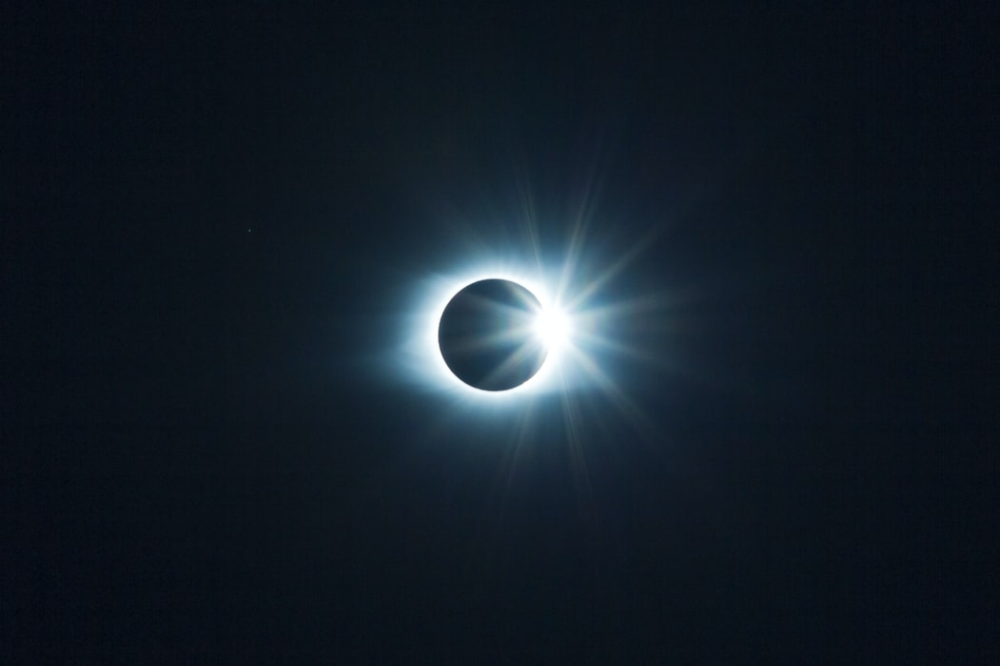

What is the fundamental nature of reality? What is time? What is space? Is there a God? [Is the world around us ‘real’?](/articles/is-the-world-around-us-real/) What is change?  Do numbers exist? What is causation, and can there be such a thing as a ‘first cause’? Why is reality like it is? What does it mean for something to exist?  [Why does _anything_ exist?](/articles/why-does-anything-exist/) 

These are just a few of the questions posed by the oft-derided, mind-melting realm of metaphysics. As 18th-century German philosopher Immanuel Kant puts it: 

>Metaphysics is a dark ocean without shores or lighthouse, strewn with many a philosophic wreck.

## What is metaphysics?

So what _is_ metaphysics, exactly? Like most metaphysical questions, that’s not an easy one to answer. We might think based on the word itself that it refers to some ‘meta’ version of physics, but that's not quite accurate. 

‘Metaphysics’ was actually coined by Andronicus of Rhodes, a bibliographer of Aristotle’s work in the first century BC. Andronicus was looking to categorize the works that came after Aristotle’s writings on ‘Physics’, and thus simply grouped them with the title ‘After Physics’ — or, ‘Metaphysics’. 

Putting its rather arbitrary etymological origins to one side, we can say the word ‘metaphysics’ refers to the exploration of basic issues around substance, existence, causality, determinism, modality, ontology, possibility, and nothingness — most of which are [discussed by Aristotle in those initial writings](/reading-lists/metaphysics/) grouped by Andronicus, but also by philosophers throughout history. 

 artistic movement.")

To borrow American philosopher Wilfrid Sellars famous definition of philosophy, the aim of metaphysics is essentially...

>to understand how things in the broadest possible sense of the term hang together in the broadest possible sense of the term.

Of course, there is overlap with the sciences here — notably physics — and we might think that actually physicists, backed by scientific data and experiment, are much better placed to ponder questions on the fundamental nature of reality than metaphysicians, who depend on armchair reasoning and deductive logic to construct their theories.

But, when it comes to reality, some philosophers argue there are questions that go beyond the scope of physics (after all, physics investigates _what we are able_ to investigate, and philosophers have long suspected that what we are able to investigate may not be all there is). Beyond or right on the edge of physics’ scope is thus where metaphysicians generally reside, restless in their creaking upholstery.

    <h4>Why Does Anything Exist?</h4>
    
Get philosophy's best answers to life's big questions with our celebrated introduction to philosophy course.

    <a class="button secondary" to="/lifes-big-questions/"><svg xmlns="http://www.w3.org/2000/svg" viewBox="0 0 512 512"><path d="M504 256C504 119 393 8 256 8S8 119 8 256s111 248 248 248 248-111 248-248zm-448 0c0-110.5 89.5-200 200-200s200 89.5 200 200-89.5 200-200 200S56 366.5 56 256zm72 20v-40c0-6.6 5.4-12 12-12h116v-67c0-10.7 12.9-16 20.5-8.5l99 99c4.7 4.7 4.7 12.3 0 17l-99 99c-7.6 7.6-20.5 2.2-20.5-8.5v-67H140c-6.6 0-12-5.4-12-12z"/></svg>Learn More</a>

A quick, dirty, and by no means foolproof way to distinguish metaphysics from the sciences is as follows: the sciences concern the specific ‘how’ of reality, metaphysics concerns the general ‘what’ and ‘why’.

For example, physicists may investigate the charge of a particle. A metaphysician asks what _is_ charge, and what _is_ a particle? A physicist may investigate how particles causally interact. A metaphysician attempts to characterize causation itself. A physicist may investigate the origins of the universe and theorize about its fundamental laws; a metaphysician asks [_why_ the universe exists](/articles/why-does-anything-exist/) — and _why_ its laws obtain the way they do. A physicist uses mathematics to express theory; a metaphysician asks what numbers are (i.e. whether numbers actually exist, or if they’re just useful fictions). Indeed, ontology — the study of being or what it means for something to exist — has been a key battleground for metaphysicians throughout the ages.

Scientists or mathematicians may very well ask these questions too; but when they do so, it should be recognized that they are making metaphysical inquiries, and metaphysical positions should not be taken for granted. 

For instance, the principle of physicalism — that everything that exists in the universe is either physical or reducible down to physical ‘stuff’ — might seem commonsensical; but it is actually a _metaphysical position_ — one that philosophers have long disputed, from [George Berkeley denying the existence of matter](/articles/george-berkeley-subjective-idealism-the-world-is-in-our-minds/) (and claiming everything is made of ‘mental stuff’ instead) to [philosophers of consciousness today challenging physicalist conceptions](/articles/why-zombies-cause-problems-brain-science-consciousness/) of the mind. 

The point here is not so much about whether physicalism is correct: it’s recognizing that there is a debate to be had in the first place, and in surfacing and examining any and all presuppositions upon which our theories about the world may rest. 

Metaphysics is a rabbit hole about which many disagree. Beyond the general lines of inquiry referenced above, debates abound over what metaphysics even is or should be — especially in its relation to modern science. However, as a quick summary we can say that, at root, many problems in science and philosophy — including [whether we have free will](/reading-lists/free-will/), whether [consciousness is physical](/reading-lists/consciousness/), and what causation is — are metaphysical in nature.

## Why is metaphysics important today?

Exploring such abstract, evidence-resistant metaphysical questions might seem pointless. Why argue about things we may never have an answer to? Why spill oceans of ink over things so far removed from everyday life? Why intrude on what is clearly now science’s territory and try to make grand arguments and construct complex theories about the fundamental nature of reality, its laws and emergent properties? 

Well, defenders of metaphysics might state that it’s only by running up against the limitations of our language, by attempting to be clear-sighted at the hazy frontiers of our knowledge, that we can inch-by-inch, foot-by-foot, make progress. 

    <h4>5-Day Introduction to Philosophy Course</h4>
    
Learn thousands of years of philosophy in just five days with our celebrated introductory course.

    <a class="button secondary" to="/lifes-big-questions/"><svg xmlns="http://www.w3.org/2000/svg" viewBox="0 0 512 512"><path d="M504 256C504 119 393 8 256 8S8 119 8 256s111 248 248 248 248-111 248-248zm-448 0c0-110.5 89.5-200 200-200s200 89.5 200 200-89.5 200-200 200S56 366.5 56 256zm72 20v-40c0-6.6 5.4-12 12-12h116v-67c0-10.7 12.9-16 20.5-8.5l99 99c4.7 4.7 4.7 12.3 0 17l-99 99c-7.6 7.6-20.5 2.2-20.5-8.5v-67H140c-6.6 0-12-5.4-12-12z"/></svg>Learn More</a>

Metaphysics adds a level of conceptual rigor and clarity that can only improve the steadfastness of our knowledge: it is not here to compete with or replace any other fields, it is here as a necessary supplement to them in our quest for truth about reality. Indeed, some argue that there is no real need to create a hard distinction between metaphysics and the sciences at all, for their aims are continuous and complementary. 

And besides: dwelling on the _actuality_ behind life is interesting, and good for the soul. [As Bertrand Russell puts it](/articles/bertrand-russell-why-philosophy-matters/) about philosophy generally, in a quotation that could readily be used to defend the study of metaphysics specifically:

>Philosophy is to be studied, not for the sake of any definite answers to its questions since no definite answers can, as a rule, be known to be true, but rather for the sake of the questions themselves; because these questions enlarge our conception of what is possible, enrich our intellectual imagination and diminish the dogmatic assurance which closes the mind against speculation; but above all because, through the greatness of the universe which philosophy contemplates, the mind also is rendered great, and becomes capable of that union with the universe which constitutes its highest good.

## Further reading

If you’re ready to explore the murky yet fascinating world of metaphysics further, we’ve assembled the best books about the subject, ranging from accessible and introductory surveys of the field, to stone-cold metaphysical classics from philosophers down the ages. Hit the banner below to access our [metaphysics reading list](/reading-lists/metaphysics/) now.

<a class="reading-list cta" href="/reading-lists/metaphysics/">
    
    

    

        <svg xmlns="http://www.w3.org/2000/svg" viewBox="0 0 576 512"><path fill="#fff" d="M542.22 32.05c-54.8 3.11-163.72 14.43-230.96 55.59-4.64 2.84-7.27 7.89-7.27 13.17v363.87c0 11.55 12.63 18.85 23.28 13.49 69.18-34.82 169.23-44.32 218.7-46.92 16.89-.89 30.02-14.43 30.02-30.66V62.75c.01-17.71-15.35-31.74-33.77-30.7zM264.73 87.64C197.5 46.48 88.58 35.17 33.78 32.05 15.36 31.01 0 45.04 0 62.75V400.6c0 16.24 13.13 29.78 30.02 30.66 49.49 2.6 149.59 12.11 218.77 46.95 10.62 5.35 23.21-1.94 23.21-13.46V100.63c0-5.29-2.62-10.14-7.27-12.99z"/></svg>READING LIST
        

        <h3>Metaphysics</h3>
        
The Top 10 Books to Read

    
    
    <svg class="cta swing" xmlns="http://www.w3.org/2000/svg" viewBox="0 0 320 512"><path d="M285.476 272.971L91.132 467.314c-9.373 9.373-24.569 9.373-33.941 0l-22.667-22.667c-9.357-9.357-9.375-24.522-.04-33.901L188.505 256 34.484 101.255c-9.335-9.379-9.317-24.544.04-33.901l22.667-22.667c9.373-9.373 24.569-9.373 33.941 0L285.475 239.03c9.373 9.372 9.373 24.568.001 33.941z"/></svg>
</a>