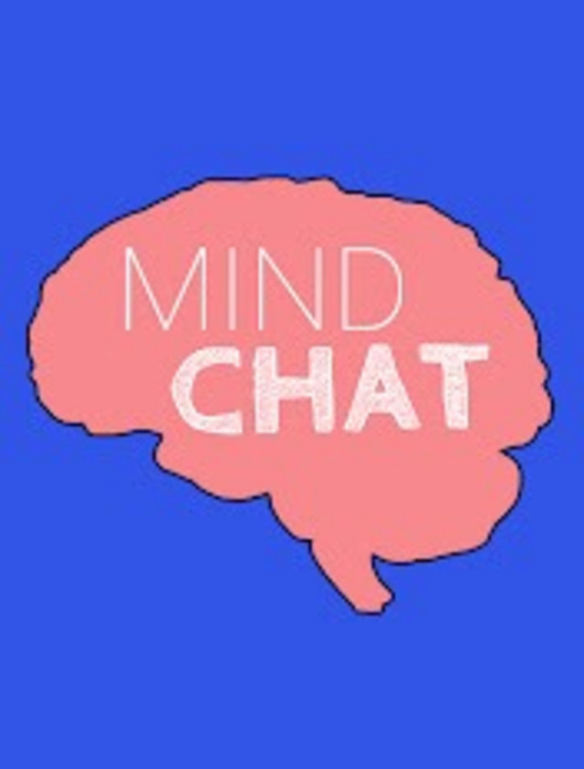

<i>[Philip Goff](https://www.philipgoffphilosophy.com/) is a philosopher and consciousness researcher at Durham University, UK. In his 2019 book, <a target="_blank" rel="noopener noreferrer sponsored" href="http://www.amazon.com/gp/product/0525564772/ref=as_li_tl?ie=UTF8&tag=philosophybre-20&camp=1789&creative=9325&linkCode=as2&creativeASIN=0525564772&linkId=142e92f8c288c8c9507c552d1362800e">Galileo’s Error</a>, he defends panpsychism, the view that consciousness is a fundamental feature of all physical matter. In other words, Philip argues consciousness is not limited to beings with brains and nervous systems, but in fact pervades the universe.

[Keith Frankish](https://www.keithfrankish.com/) is a philosopher and writer, Honorary Reader at the University of Sheffield, UK, Visiting Research Fellow with The Open University, UK, and Adjunct Professor at the University of Crete. In his 2017 volume, <a target="_blank" rel="noopener noreferrer sponsored" href="http://www.amazon.com/gp/product/1845409574/ref=as_li_tl?ie=UTF8&tag=philosophybre-20&camp=1789&creative=9325&linkCode=as2&creativeASIN=1845409574&linkId=c1c898a9cfa941af5d7ba3798d19decb">Illusionism: As a Theory of Consciousness</a>, Keith defends and presents responses to illusionism, the view that our whole concept of consciousness is deeply flawed and, ultimately, illusory. In other words, Keith argues that the consciousness Philip thinks exists everywhere actually does not exist at all (or, at least, core aspects of it don’t).

Philip and Keith host [Mind Chat](https://www.youtube.com/channel/UC1AxUq1hSacfkzyvDepJRaw) from their very different perspectives on consciousness, inviting leading scientists and philosophers to debate with them in an engaging and friendly way in pursuit of truth.</i>

 and Keith (right) introduce the series and discuss dualism with the philosopher Tim O’Connor.")

_We caught up with Philip and Keith about the consciousness debate and their motivations behind Mind Chat._

## Philip, could you briefly introduce your position on consciousness, panpsychism? 

<b>Philip:</b> In our standard way of thinking about things, consciousness exists only in the brains of highly evolved organisms, and hence exists only in a tiny part of the universe, and only in very recent history (cosmically speaking). According to panpsychism, in contrast, consciousness pervades the universe and is a fundamental feature of it.

## Keith, could you briefly introduce your position on consciousness, illusionism? 

<b>Keith:</b> I think that philosophers have a distorted view of what consciousness is. They think it involves being aware of special mental qualities (so-called phenomenal properties or qualia), which are directly presented to us in a private mental world. In their view, seeing a red apple doesn’t just involve being sensitive to the redness of the apple itself and reacting to it in complex ways; it also involves being aware of a private mental redness. I think that’s a fundamental mistake. I think that phenomenal properties are a sort of illusion and that consciousness in that phenomenal sense doesn’t exist.

>Philip and I have the same ultimate goal — understanding consciousness — and though we disagree deeply, we respect each other’s work and learn from each other. We think that’s a good example to set.

## Philip, why do you think Keith’s illusionism is the wrong way to think about consciousness? 

<b>Philip:</b> Nothing is more evident than the reality of one’s own feelings and experiences. If I’m in pain, the reality of that feeling of pain is just totally undeniable. And by attending to my experiences, I understand something of their nature: I grasp the character of the colors, sounds, smells and tastes that populate my waking experience. I can’t think of a more solid foundation upon which to build our theory of reality!

## Keith, why do you think Philip’s panpsychism is the wrong way to think about consciousness?

<b>Keith:</b> I think its starting point is wrong. We know when we’re in pain, of course, and we know that pain is bad, but we don’t necessarily know what pain _is_. It’s tempting to think that there’s a mental essence of pain that is known to us directly and is distinct from the complex reactions that are being triggered in us. But I think that’s a trick created by our brains — our brain’s way of helping us keep track of how things are affecting us. We should focus on understanding how the trick is done and why it’s so compelling, rather than accepting that this essence is real and puzzling about how it fits into our picture of the world. (I’d add, though, that if it were real, then the case for panpsychism would be quite strong. It’s an elegant way of accommodating phenomenal consciousness.)

<!--big subscribe-->

    
    <h4>From the Buddha to Nietzsche: join 15,000+ subscribers enjoying my free Sunday Breakdown</h4>
    
In one concise email each Sunday, I break down a famous idea from philosophy. You get the distillation straight to your inbox.

    

        <form action="https://app.convertkit.com/forms/5812400/subscriptions" method="post" data-sv-form="5812400" data-uid="be0e52d3c0" data-format="inline" data-version="6" data-options="{&quot;settings&quot;:{&quot;after_subscribe&quot;:{&quot;action&quot;:&quot;message&quot;,&quot;success_message&quot;:&quot;Thank you, philosopher! Your welcome email will land in your inbox shortly.&quot;,&quot;redirect_url&quot;:&quot;https://philosophybreak.com/thank-you/&quot;},&quot;analytics&quot;:{&quot;google&quot;:null,&quot;fathom&quot;:null,&quot;facebook&quot;:null,&quot;segment&quot;:null,&quot;pinterest&quot;:null,&quot;sparkloop&quot;:null,&quot;googletagmanager&quot;:null},&quot;modal&quot;:{&quot;trigger&quot;:&quot;timer&quot;,&quot;scroll_percentage&quot;:null,&quot;timer&quot;:5,&quot;devices&quot;:&quot;all&quot;,&quot;show_once_every&quot;:15},&quot;powered_by&quot;:{&quot;show&quot;:false,&quot;url&quot;:&quot;https://convertkit.com/features/forms?utm_campaign=poweredby&amp;utm_content=form&amp;utm_medium=referral&amp;utm_source=dynamic&quot;},&quot;recaptcha&quot;:{&quot;enabled&quot;:false},&quot;return_visitor&quot;:{&quot;action&quot;:&quot;show&quot;,&quot;custom_content&quot;:&quot;&quot;},&quot;slide_in&quot;:{&quot;display_in&quot;:&quot;bottom_right&quot;,&quot;trigger&quot;:&quot;timer&quot;,&quot;scroll_percentage&quot;:null,&quot;timer&quot;:5,&quot;devices&quot;:&quot;all&quot;,&quot;show_once_every&quot;:15},&quot;sticky_bar&quot;:{&quot;display_in&quot;:&quot;top&quot;,&quot;trigger&quot;:&quot;timer&quot;,&quot;scroll_percentage&quot;:null,&quot;timer&quot;:5,&quot;devices&quot;:&quot;all&quot;,&quot;show_once_every&quot;:15}},&quot;version&quot;:&quot;6&quot;}" min-width="400 500 600 700 800">
        
<ul data-element="errors" data-group="alert"></ul>

            

                <input name="email_address" aria-label="Your Email Address..." placeholder="Your Email Address..." required type="email" />
            

            <button class="button primary" type="submit" data-element="submit">

<svg xmlns="http://www.w3.org/2000/svg" viewBox="0 0 512 512"><path d="M464 64H48C21.49 64 0 85.49 0 112v288c0 26.51 21.49 48 48 48h416c26.51 0 48-21.49 48-48V112c0-26.51-21.49-48-48-48zm0 48v40.805c-22.422 18.259-58.168 46.651-134.587 106.49-16.841 13.247-50.201 45.072-73.413 44.701-23.208.375-56.579-31.459-73.413-44.701C106.18 199.465 70.425 171.067 48 152.805V112h416zM48 400V214.398c22.914 18.251 55.409 43.862 104.938 82.646 21.857 17.205 60.134 55.186 103.062 54.955 42.717.231 80.509-37.199 103.053-54.947 49.528-38.783 82.032-64.401 104.947-82.653V400H48z"/></svg>Join 15,000+ Subscribers</button>
            

            

        </form>
        
💭 One short philosophical email each Sunday. Unsubscribe any time.

    

## Why did you start Mind Chat and what do you hope those watching will get out of it? 

<b>Philip:</b> We wanted something that was in depth, but accessible to people with no background in the philosophy and/or science of consciousness. There’s huge interest in these issues, but too often people feel alienated by the technical language that often frames these discussions.

<b>Keith:</b> We also wanted to show that people with very different views can get along with each other and work together, provided there is good faith and openness on both sides. Philip and I have the same ultimate goal — understanding consciousness — and though we disagree deeply, we respect each other’s work and learn from each other. We think that’s a good example to set. 

## Why do you think opening philosophical discussions to a broader audience is important?

<b>Philip:</b> Everything is so specialized these days. I’m jealous of people in the 17th century, when you could be up to date with the latest science, philosophy, and mathematics, without too much difficulty. Especially when it comes to the hard problem of consciousness, this isn’t something that’s going to be tackled just by one field. We’re going to need philosophers and scientists working in tandem if we’re going to make progress.

<b>Keith:</b> I’d add that it’s important for philosophers themselves to communicate with a wider audience. If they talk only to each other, they can become bogged down in technical issues and lose sight of the bigger picture and why it matters. And most importantly, of course, there’s huge popular interest in philosophy, especially in philosophy of mind, and it’s only right that those of us who’ve been lucky enough to spend time working in the field should share our knowledge and ideas with others who are interested. 

## If there was one philosopher from history you could each invite for a lively discussion on Mind Chat, who would it be and why? 

<b>Philip:</b> René Descartes. I think his core insight that the mind is better known than the body was spot on. Although he messed things up when he started to prove the existence of God, and then prove the existence of the external world on that basis (because God wouldn’t deceive us). He was also a damn good sword fighter.

<b>Keith:</b> I’d invite Descartes too! It’s true that his dualist view of the mind has been an inspiration for the view of consciousness I reject — the view that sees it as a private mental world distinct from the physical one. But Descartes was also a scientist, and he believed that much of our everyday behavior can be explained in terms of physical processes in our nervous systems. He just couldn’t see how intellectual activities, such as intelligent language use, could be explained in that way, and that was one reason why he thought we must have immaterial souls as well as brains. But of course that reflected the limited scientific knowledge of his time, and I’d love to know what he would say if he knew something of modern cognitive science. He might even be an illusionist! (Can we get him? Does anyone know a medium who’s in touch with him?)

## If you could recommend one book about consciousness that isn’t your own (or each other’s), which would it be and why?

<b>Philip:</b> Thomas Nagel’s book <a target="_blank" rel="noopener noreferrer sponsored" href="http://www.amazon.com/gp/product/0199919755/ref=as_li_tl?ie=UTF8&tag=philosophybre-20&camp=1789&creative=9325&linkCode=as2&creativeASIN=0199919755&linkId=ebbcba77f74b74aa68ed19b7fc6850b3">Mind and Cosmos</a> is a radical challenge to the current scientific orthodoxy. It got slated in many reviews, but I think that’s just because he’s daring to commit heresy. I don’t agree with all his arguments, but I think he’s right that a revolution is on its way.

<b>Keith:</b> Daniel Dennett’s 1991 book, <a target="_blank" rel="noopener noreferrer sponsored" href="http://www.amazon.com/gp/product/0316180661/ref=as_li_tl?ie=UTF8&tag=philosophybre-20&camp=1789&creative=9325&linkCode=as2&creativeASIN=0316180661&linkId=f6d2896ad24294b31955a1470b9fb918">Consciousness Explained</a> _[see a list of [Dennett’s best books here](/reading-lists/daniel-dennett-best-books/)]_. It’s a groundbreaking book, the first thorough presentation of an illusionist view of consciousness. Some people find it frustrating because it doesn’t explain consciousness in the sense they expect — the phenomenal sense. But that’s not what Dennett’s trying to do. He’s trying to show that there is another, better way of thinking of consciousness, which doesn’t entangle us in all the problems of the traditional view. If you read it carefully and with an open mind, it may radically change the way you think about what it is to be conscious.

&nbsp;

<i>To learn more about the mystery of consciousness, [watch Philip & Keith’s first episode of Mind Chat](https://www.youtube.com/watch?v=AlUsJRKqEVE&t=1s&ab_channel=MindChat), featuring the philosopher Tim O’Connor and his dualist theory of consciousness, and [subscribe to future episodes](https://www.youtube.com/channel/UC1AxUq1hSacfkzyvDepJRaw). You can also find an audio-only version of Mind Chat on [Spotify](https://t.co/1vBXxSFQKX?amp=1) and other podcast platforms.</i>

    <a target="_blank" rel="noopener noreferrer" href="https://www.youtube.com/channel/UC1AxUq1hSacfkzyvDepJRaw">
        
        

            <h4>Mind Chat</h4>
            
<svg xmlns="http://www.w3.org/2000/svg" viewBox="0 0 512 512"><path d="M371.7 238l-176-107c-15.8-8.8-35.7 2.5-35.7 21v208c0 18.4 19.8 29.8 35.7 21l176-101c16.4-9.1 16.4-32.8 0-42zM504 256C504 119 393 8 256 8S8 119 8 256s111 248 248 248 248-111 248-248zm-448 0c0-110.5 89.5-200 200-200s200 89.5 200 200-89.5 200-200 200S56 366.5 56 256z"/></svg>BY PHILIP GOFF & KEITH FRANKISH

            <svg xmlns="http://www.w3.org/2000/svg" viewBox="0 0 576 512"><path d="M576 24v127.984c0 21.461-25.96 31.98-40.971 16.971l-35.707-35.709-243.523 243.523c-9.373 9.373-24.568 9.373-33.941 0l-22.627-22.627c-9.373-9.373-9.373-24.569 0-33.941L442.756 76.676l-35.703-35.705C391.982 25.9 402.656 0 424.024 0H552c13.255 0 24 10.745 24 24zM407.029 270.794l-16 16A23.999 23.999 0 0 0 384 303.765V448H64V128h264a24.003 24.003 0 0 0 16.97-7.029l16-16C376.089 89.851 365.381 64 344 64H48C21.49 64 0 85.49 0 112v352c0 26.51 21.49 48 48 48h352c26.51 0 48-21.49 48-48V287.764c0-21.382-25.852-32.09-40.971-16.97z"/></svg>View on YouTube
        

    </a>

