Friedrich Nietzsche was a 19th-century German philosopher best known for his brilliant, provocative aphorisms and his infamous declaration that [God is dead](/articles/god-is-dead-nietzsche-famous-statement-explained/). 

Writing across a broad range of topics, Nietzsche was primarily concerned with facing up to the problem of _nihilism_. As we discuss in our overview of [Nietzsche’s life, insanity, and legacy](/articles/friedrich-nietzsches-life-insanity-and-legacy/), he dedicated much of his work to dissecting and answering the following question: in a post-God world, how can we move beyond the outdated moralities derived from religion to establish new, healthy foundations for value, beauty, and meaning? 

 lifetime, Nietzsche has become a dominant intellectual force in today’s popular culture, with many of his brilliant and provocative statements floating around the internet in various meme forms.")

However, far from laying out his ideas in clear, structured, organized form, in the majority of his works Nietzsche prefers to challenge his readers with pithy aphorisms and provocative, seemingly disconnected passages. 

The consequence of this is that Nietzsche’s aphorisms often appear on the internet independently, removed from their original context. This probably wouldn’t have upset Nietzsche too much, considering he states the following:

>It is my ambition to say in ten sentences what everyone else says in a whole book — what everyone else does _not_ say in a whole book.

However, the consumption of Nietzsche’s work one quotation at a time can mean that understanding his broader philosophical project is difficult. And, while Nietzsche’s aphorisms are great, his philosophical ideas — taken as a whole — are even better. 

If you’re looking to go beyond his quotations to learn about his actual philosophy, we’ve created a quick [6-part introductory course on Nietzsche’s greatest ideas](/introduction-to-nietzsche/), covering everything from his influential distinction between the Apollonian and Dionysian, his perspectival theory of knowledge, and his infamous proclomation that [God is dead](/articles/god-is-dead-nietzsche-famous-statement-explained/), to his critique of traditional morality, his [introduction of the eternal recurrence](/articles/eternal-recurrence-what-did-nietzsche-really-mean/) and the [Übermensch](/articles/ubermensch-explained-the-meaning-of-nietzsches-superman/), and his theory of the will to power. 

The course gets rave reviews, and if you’re interested in Nietzsche it might be just what you’re looking for. 

<!--nietzsche-->

<h4>Your Myth-Busting Guide to Nietzsche & His 5 Greatest Ideas</h4>
From God is dead to the Übermensch, learn everything you need to know about Friedrich Nietzsche with our concise online guide.
<a class="button primary" href="/introduction-to-nietzsche/"><svg xmlns="http://www.w3.org/2000/svg" viewBox="0 0 512 512"><path d="M504 256C504 119 393 8 256 8S8 119 8 256s111 248 248 248 248-111 248-248zm-448 0c0-110.5 89.5-200 200-200s200 89.5 200 200-89.5 200-200 200S56 366.5 56 256zm72 20v-40c0-6.6 5.4-12 12-12h116v-67c0-10.7 12.9-16 20.5-8.5l99 99c4.7 4.7 4.7 12.3 0 17l-99 99c-7.6 7.6-20.5 2.2-20.5-8.5v-67H140c-6.6 0-12-5.4-12-12z"></path></svg>Get Instant Access</a>
&#9733;&#9733;&#9733;&#9733;&#9733; (50+ reviews for our courses)

We’ve also created a condensed [reading list of the 7 best books by and about Nietzsche](/reading-lists/friedrich-nietzsche/), where we offer some more biographical details about the great philosopher’s life.

Otherwise, below you’ll find 97 of Nietzsche’s cleverest and most provocative quotations, organized chronologically according to the books in which they appear. Enjoy! 

## Nietzsche quotations from The Birth of Tragedy (1872)

    <a target="_blank" rel="noopener noreferrer sponsored" href="https://www.amazon.com/Birth-Tragedy-Spirit-Penguin-Classics/dp/0140433392?&linkCode=ll1&tag=philosophybre-20&linkId=46b3fb5ce95f795e09b414d683d49a59&language=en_US&ref_=as_li_ss_tl">
        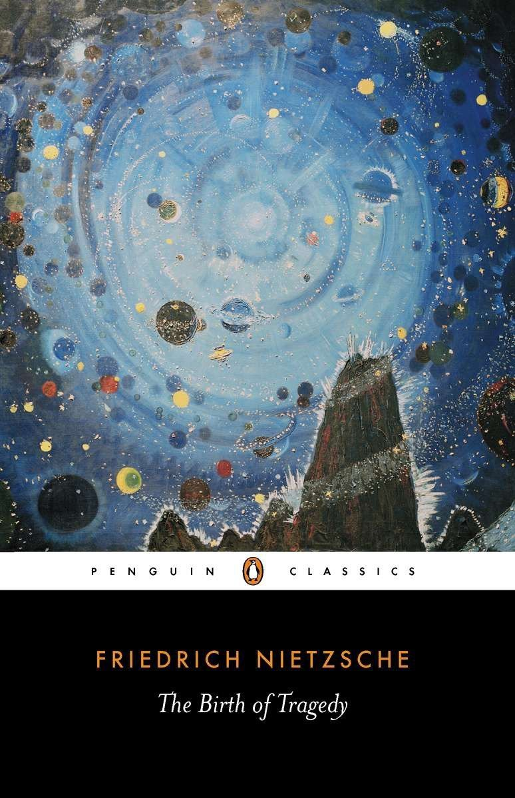
        

            <h4>The Birth of Tragedy</h4>
            
<svg xmlns="http://www.w3.org/2000/svg" viewBox="0 0 50 50"><path d="M48.336,7.54c-0.701,0-1.359,0.007-2.018,0.024V5.326h-0.734c-14.262,0-19.043,3.411-20.585,5.252 c-1.542-1.841-6.323-5.252-20.585-5.252H3.68v2.237C3.022,7.545,2.364,7.54,1.664,7.54H0V39.89h1.664 c17.595,0,21.186,4.035,21.698,4.784h3.302c0.557-0.784,4.218-4.784,21.673-4.784H50V7.54H48.336z M23.899,38.431 c-2.457-1.812-7.611-3.914-18.383-4.054V7.175c15.087,0.194,18.001,4.327,18.383,5V38.431z M44.484,34.377 c-10.772,0.14-15.926,2.24-18.383,4.054V12.184c0.416-0.737,3.412-4.814,18.383-5.007V34.377z"></path></svg>BY FRIEDRICH NIETZSCHE

            <svg xmlns="http://www.w3.org/2000/svg" viewBox="0 0 576 512"><path d="M576 24v127.984c0 21.461-25.96 31.98-40.971 16.971l-35.707-35.709-243.523 243.523c-9.373 9.373-24.568 9.373-33.941 0l-22.627-22.627c-9.373-9.373-9.373-24.569 0-33.941L442.756 76.676l-35.703-35.705C391.982 25.9 402.656 0 424.024 0H552c13.255 0 24 10.745 24 24zM407.029 270.794l-16 16A23.999 23.999 0 0 0 384 303.765V448H64V128h264a24.003 24.003 0 0 0 16.97-7.029l16-16C376.089 89.851 365.381 64 344 64H48C21.49 64 0 85.49 0 112v352c0 26.51 21.49 48 48 48h352c26.51 0 48-21.49 48-48V287.764c0-21.382-25.852-32.09-40.971-16.97z"/></svg>View on Amazon
        

    </a>

1\. “The insatiable will always finds a way to detain its creatures in life and compel them to live on, by means of an illusion spread over things.”

2\. “Knowledge kills action, for action requires a state of being in which we are covered with the veil of illusion.”

>3\. It is only as an _aesthetic phenomenon_ that existence and the world are _eternally justified._

4\. “[The art of ] tragedy transforms those repulsive thoughts about the terrible or absurd nature of existence into representations with which man can live.”

## Nietzsche quotations from Untimely Meditations (1876)

    <a target="_blank" rel="noopener noreferrer sponsored" href="http://www.amazon.com/Nietzsche-Untimely-Meditations-Cambridge-Philosophy/dp/0521585848?keywords=untimely+meditations+nietzsche&qid=1650787731&sprefix=untime%2Caps%2C164&sr=8-1&linkCode=ll1&tag=philosophybre-20&linkId=9555cc9495e8057117e7a260abdd6cea&language=en_US&ref_=as_li_ss_tl">
        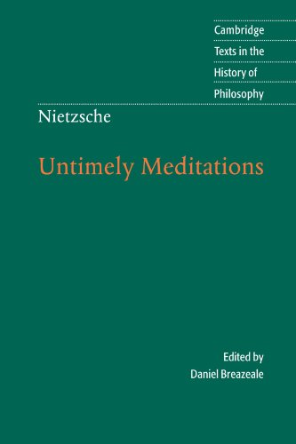
        

            <h4>Untimely Meditations</h4>
            
<svg xmlns="http://www.w3.org/2000/svg" viewBox="0 0 50 50"><path d="M48.336,7.54c-0.701,0-1.359,0.007-2.018,0.024V5.326h-0.734c-14.262,0-19.043,3.411-20.585,5.252 c-1.542-1.841-6.323-5.252-20.585-5.252H3.68v2.237C3.022,7.545,2.364,7.54,1.664,7.54H0V39.89h1.664 c17.595,0,21.186,4.035,21.698,4.784h3.302c0.557-0.784,4.218-4.784,21.673-4.784H50V7.54H48.336z M23.899,38.431 c-2.457-1.812-7.611-3.914-18.383-4.054V7.175c15.087,0.194,18.001,4.327,18.383,5V38.431z M44.484,34.377 c-10.772,0.14-15.926,2.24-18.383,4.054V12.184c0.416-0.737,3.412-4.814,18.383-5.007V34.377z"></path></svg>BY FRIEDRICH NIETZSCHE

            <svg xmlns="http://www.w3.org/2000/svg" viewBox="0 0 576 512"><path d="M576 24v127.984c0 21.461-25.96 31.98-40.971 16.971l-35.707-35.709-243.523 243.523c-9.373 9.373-24.568 9.373-33.941 0l-22.627-22.627c-9.373-9.373-9.373-24.569 0-33.941L442.756 76.676l-35.703-35.705C391.982 25.9 402.656 0 424.024 0H552c13.255 0 24 10.745 24 24zM407.029 270.794l-16 16A23.999 23.999 0 0 0 384 303.765V448H64V128h264a24.003 24.003 0 0 0 16.97-7.029l16-16C376.089 89.851 365.381 64 344 64H48C21.49 64 0 85.49 0 112v352c0 26.51 21.49 48 48 48h352c26.51 0 48-21.49 48-48V287.764c0-21.382-25.852-32.09-40.971-16.97z"/></svg>View on Amazon
        

    </a>

5\. “One has to take a somewhat bold and dangerous line with this existence: especially as, whatever happens, we are bound to lose it.”

6\. “We labor at our daily work more ardently and thoughtlessly than is necessary to sustain our life because it is even more necessary not to have leisure to stop and think. Haste is universal because everyone is in flight from himself.”

>7\. Life has not been devised by morality: it wants deception, it lives on deception.

8\. “Consider the cattle, grazing as they pass you by: they do not know what is meant by yesterday or today, they leap about, eat, rest, digest, leap about again, and so from morn till night and from day to day, fettered to the moment and its pleasure or displeasure, and thus neither melancholy nor bored. This is a hard sight for man to see; for, though he thinks himself better than the animals because he is human, he cannot help envying them their happiness – what they have, a life neither bored nor painful, is precisely what he wants, yet he cannot have it because he refuses to be like an animal…”

9\. “Amazingly, the most obvious question fails to occur to our scholars: what is their work, their hurry, their painful frenzy _supposed to be for?_”

## Nietzsche quotations from Human, All Too Human (1878)

    <a target="_blank" rel="noopener noreferrer sponsored" href="https://www.amazon.com/Human-All-Too-Spirits-Revised/dp/0803283687?&linkCode=ll1&tag=philosophybre-20&linkId=0b44aea23ad08af64e0b581d3141cdad&language=en_US&ref_=as_li_ss_tl">
        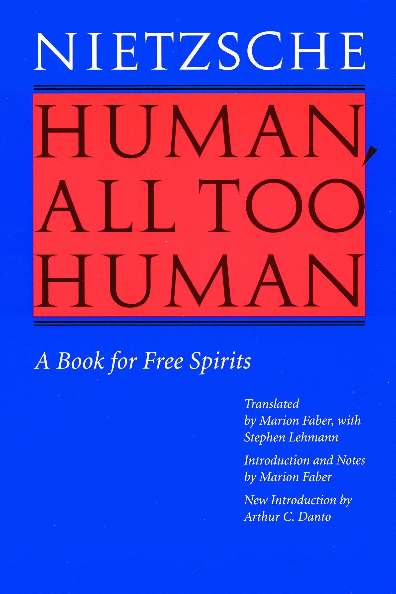
        

            <h4>Human, All Too Human</h4>
            
<svg xmlns="http://www.w3.org/2000/svg" viewBox="0 0 50 50"><path d="M48.336,7.54c-0.701,0-1.359,0.007-2.018,0.024V5.326h-0.734c-14.262,0-19.043,3.411-20.585,5.252 c-1.542-1.841-6.323-5.252-20.585-5.252H3.68v2.237C3.022,7.545,2.364,7.54,1.664,7.54H0V39.89h1.664 c17.595,0,21.186,4.035,21.698,4.784h3.302c0.557-0.784,4.218-4.784,21.673-4.784H50V7.54H48.336z M23.899,38.431 c-2.457-1.812-7.611-3.914-18.383-4.054V7.175c15.087,0.194,18.001,4.327,18.383,5V38.431z M44.484,34.377 c-10.772,0.14-15.926,2.24-18.383,4.054V12.184c0.416-0.737,3.412-4.814,18.383-5.007V34.377z"></path></svg>BY FRIEDRICH NIETZSCHE

            <svg xmlns="http://www.w3.org/2000/svg" viewBox="0 0 576 512"><path d="M576 24v127.984c0 21.461-25.96 31.98-40.971 16.971l-35.707-35.709-243.523 243.523c-9.373 9.373-24.568 9.373-33.941 0l-22.627-22.627c-9.373-9.373-9.373-24.569 0-33.941L442.756 76.676l-35.703-35.705C391.982 25.9 402.656 0 424.024 0H552c13.255 0 24 10.745 24 24zM407.029 270.794l-16 16A23.999 23.999 0 0 0 384 303.765V448H64V128h264a24.003 24.003 0 0 0 16.97-7.029l16-16C376.089 89.851 365.381 64 344 64H48C21.49 64 0 85.49 0 112v352c0 26.51 21.49 48 48 48h352c26.51 0 48-21.49 48-48V287.764c0-21.382-25.852-32.09-40.971-16.97z"/></svg>View on Amazon
        

    </a>

10\. “Every tradition grows ever more venerable — the more remote its origin, the more confused that origin is. The reverence due to it increases from generation to generation. The tradition finally becomes holy and inspires awe.”

11\. “To escape boredom, man works either beyond what his usual needs require, or else he invents play, that is, work that is designed to quiet no need other than that for working in general.”

12\. “Christianity came into existence to lighten the heart, but now it needs to burden the heart to start with so it can lighten it afterwards. Consequently, it will perish.”

>13\. In reality, hope is the worst of all evils, because it prolongs the torments of man.

14\. “A few hours’ mountain climbing make of a rogue and a saint two fairly equal creatures.”

<!--big subscribe-->

    
    <h4>From the Buddha to Nietzsche: join 6,500+ subscribers enjoying my Sunday Breakdown</h4>
    
In one concise email each Sunday, I break down a famous idea from the great philosophers. You get the distillation straight to your inbox.

    

        <form action="https://app.convertkit.com/forms/5812400/subscriptions" method="post" data-sv-form="5812400" data-uid="be0e52d3c0" data-format="inline" data-version="6" data-options="{&quot;settings&quot;:{&quot;after_subscribe&quot;:{&quot;action&quot;:&quot;message&quot;,&quot;success_message&quot;:&quot;Thank you, philosopher! Your welcome email will land in your inbox shortly.&quot;,&quot;redirect_url&quot;:&quot;https://philosophybreak.com/thank-you/&quot;},&quot;analytics&quot;:{&quot;google&quot;:null,&quot;fathom&quot;:null,&quot;facebook&quot;:null,&quot;segment&quot;:null,&quot;pinterest&quot;:null,&quot;sparkloop&quot;:null,&quot;googletagmanager&quot;:null},&quot;modal&quot;:{&quot;trigger&quot;:&quot;timer&quot;,&quot;scroll_percentage&quot;:null,&quot;timer&quot;:5,&quot;devices&quot;:&quot;all&quot;,&quot;show_once_every&quot;:15},&quot;powered_by&quot;:{&quot;show&quot;:false,&quot;url&quot;:&quot;https://convertkit.com/features/forms?utm_campaign=poweredby&amp;utm_content=form&amp;utm_medium=referral&amp;utm_source=dynamic&quot;},&quot;recaptcha&quot;:{&quot;enabled&quot;:false},&quot;return_visitor&quot;:{&quot;action&quot;:&quot;show&quot;,&quot;custom_content&quot;:&quot;&quot;},&quot;slide_in&quot;:{&quot;display_in&quot;:&quot;bottom_right&quot;,&quot;trigger&quot;:&quot;timer&quot;,&quot;scroll_percentage&quot;:null,&quot;timer&quot;:5,&quot;devices&quot;:&quot;all&quot;,&quot;show_once_every&quot;:15},&quot;sticky_bar&quot;:{&quot;display_in&quot;:&quot;top&quot;,&quot;trigger&quot;:&quot;timer&quot;,&quot;scroll_percentage&quot;:null,&quot;timer&quot;:5,&quot;devices&quot;:&quot;all&quot;,&quot;show_once_every&quot;:15}},&quot;version&quot;:&quot;6&quot;}" min-width="400 500 600 700 800">
        
<ul data-element="errors" data-group="alert"></ul>

            

                <input name="email_address" aria-label="Your Email Address..." placeholder="Your Email Address..." required type="email" />
            

            <button class="button primary" type="submit" data-element="submit">

<svg xmlns="http://www.w3.org/2000/svg" viewBox="0 0 512 512"><path d="M464 64H48C21.49 64 0 85.49 0 112v288c0 26.51 21.49 48 48 48h416c26.51 0 48-21.49 48-48V112c0-26.51-21.49-48-48-48zm0 48v40.805c-22.422 18.259-58.168 46.651-134.587 106.49-16.841 13.247-50.201 45.072-73.413 44.701-23.208.375-56.579-31.459-73.413-44.701C106.18 199.465 70.425 171.067 48 152.805V112h416zM48 400V214.398c22.914 18.251 55.409 43.862 104.938 82.646 21.857 17.205 60.134 55.186 103.062 54.955 42.717.231 80.509-37.199 103.053-54.947 49.528-38.783 82.032-64.401 104.947-82.653V400H48z"/></svg>Join 6,500+ Subscribers</button>
            

            

        </form>
        
One short philosophical email each Sunday. Unsubscribe any time.

    

15\. “Admiration for a quality or an art can be so strong that it deters us from striving to possess it.”

>16\. The first opinion that occurs to us when we are suddenly asked about a matter is usually not our own, but only the customary one, appropriate to our caste, position, or parentage; our own opinions seldom swim near the surface.

17\. “A man far oftener appears to have a decided character from persistently following his temperament than from persistently following his principles.”

## Nietzsche quotations from Daybreak (1881)

    <a target="_blank" rel="noopener noreferrer sponsored" href="https://www.amazon.com/Daybreak-Thoughts-Prejudices-Cambridge-Philosophy/dp/0521599636?&linkCode=ll1&tag=philosophybre-20&linkId=8b7424375dc038acace05d69269b4713&language=en_US&ref_=as_li_ss_tl">
        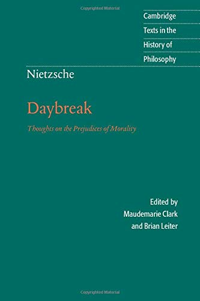
        

            <h4>Daybreak</h4>
            
<svg xmlns="http://www.w3.org/2000/svg" viewBox="0 0 50 50"><path d="M48.336,7.54c-0.701,0-1.359,0.007-2.018,0.024V5.326h-0.734c-14.262,0-19.043,3.411-20.585,5.252 c-1.542-1.841-6.323-5.252-20.585-5.252H3.68v2.237C3.022,7.545,2.364,7.54,1.664,7.54H0V39.89h1.664 c17.595,0,21.186,4.035,21.698,4.784h3.302c0.557-0.784,4.218-4.784,21.673-4.784H50V7.54H48.336z M23.899,38.431 c-2.457-1.812-7.611-3.914-18.383-4.054V7.175c15.087,0.194,18.001,4.327,18.383,5V38.431z M44.484,34.377 c-10.772,0.14-15.926,2.24-18.383,4.054V12.184c0.416-0.737,3.412-4.814,18.383-5.007V34.377z"></path></svg>BY FRIEDRICH NIETZSCHE

            <svg xmlns="http://www.w3.org/2000/svg" viewBox="0 0 576 512"><path d="M576 24v127.984c0 21.461-25.96 31.98-40.971 16.971l-35.707-35.709-243.523 243.523c-9.373 9.373-24.568 9.373-33.941 0l-22.627-22.627c-9.373-9.373-9.373-24.569 0-33.941L442.756 76.676l-35.703-35.705C391.982 25.9 402.656 0 424.024 0H552c13.255 0 24 10.745 24 24zM407.029 270.794l-16 16A23.999 23.999 0 0 0 384 303.765V448H64V128h264a24.003 24.003 0 0 0 16.97-7.029l16-16C376.089 89.851 365.381 64 344 64H48C21.49 64 0 85.49 0 112v352c0 26.51 21.49 48 48 48h352c26.51 0 48-21.49 48-48V287.764c0-21.382-25.852-32.09-40.971-16.97z"/></svg>View on Amazon
        

    </a>

18\. “Wherever there is madness there is also a grain of genius and wisdom… All superior men who were irresistibly drawn to throw off the yoke of any kind of morality and to frame new laws had, _if they were not actually mad,_ no alternative but to make themselves or pretend to be mad.”

>19\. Christianity has done its utmost to close the circle and declared even doubt to be sin. One is supposed to be cast into belief without reason, by a miracle, and from then on to swim in it as in the brightest and least ambiguous of elements: even a glance towards land, even the thought that one perhaps exists for something else as well as swimming, even the slightest impulse of our amphibious nature — is sin! And notice that all this means that the foundation of belief and all reflection on its origin is likewise excluded as sinful. What is wanted are blindness and intoxication and an eternal song over the waves in which reason has drowned.

20\. “Moderation sees itself as beautiful; it is unaware that in the eye of the immoderate it appears black and sober and consequently ugly-looking.”

>21\. The surest way to corrupt a youth is to instruct them to hold in higher esteem those who think alike than those who think differently.

22\. “For those who need consolation no means of consolation is so effective as the assertion that in their case no consolation is possible: it implies so great a degree of distinction that they at once hold up their heads again.”

23\. “All these bold birds who fly out into the wide, widest open—it is true! At some point they will not be able to fly any farther and will squat down on some pylon or sparse crag—and very grateful for this miserable accommodation to boot! But who would want to conclude from this that there was _no longer_ a vast and prodigious trajectory ahead of them, that they had flown as far and wide as one _could_ fly! All our great mentors and precursors have finally come to a stop, and it is hardly the noblest and most graceful of gestures with which fatigue comes to a stop: it will also happen to you and me! Of what concern, however, is that to you and me! _Other birds will fly farther!_” 

## Nietzsche quotations from The Gay Science (1882)

    <a target="_blank" rel="noopener noreferrer sponsored" href="https://www.amazon.com/Gay-Science-Prelude-Rhymes-Appendix/dp/0394719859?&linkCode=ll1&tag=philosophybre-20&linkId=3c4dafed47ee00e7a6b9e9cfe65378e9&language=en_US&ref_=as_li_ss_tl">
        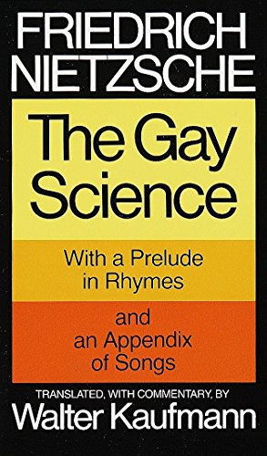
        

            <h4>The Gay Science</h4>
            
<svg xmlns="http://www.w3.org/2000/svg" viewBox="0 0 50 50"><path d="M48.336,7.54c-0.701,0-1.359,0.007-2.018,0.024V5.326h-0.734c-14.262,0-19.043,3.411-20.585,5.252 c-1.542-1.841-6.323-5.252-20.585-5.252H3.68v2.237C3.022,7.545,2.364,7.54,1.664,7.54H0V39.89h1.664 c17.595,0,21.186,4.035,21.698,4.784h3.302c0.557-0.784,4.218-4.784,21.673-4.784H50V7.54H48.336z M23.899,38.431 c-2.457-1.812-7.611-3.914-18.383-4.054V7.175c15.087,0.194,18.001,4.327,18.383,5V38.431z M44.484,34.377 c-10.772,0.14-15.926,2.24-18.383,4.054V12.184c0.416-0.737,3.412-4.814,18.383-5.007V34.377z"></path></svg>BY FRIEDRICH NIETZSCHE

            <svg xmlns="http://www.w3.org/2000/svg" viewBox="0 0 576 512"><path d="M576 24v127.984c0 21.461-25.96 31.98-40.971 16.971l-35.707-35.709-243.523 243.523c-9.373 9.373-24.568 9.373-33.941 0l-22.627-22.627c-9.373-9.373-9.373-24.569 0-33.941L442.756 76.676l-35.703-35.705C391.982 25.9 402.656 0 424.024 0H552c13.255 0 24 10.745 24 24zM407.029 270.794l-16 16A23.999 23.999 0 0 0 384 303.765V448H64V128h264a24.003 24.003 0 0 0 16.97-7.029l16-16C376.089 89.851 365.381 64 344 64H48C21.49 64 0 85.49 0 112v352c0 26.51 21.49 48 48 48h352c26.51 0 48-21.49 48-48V287.764c0-21.382-25.852-32.09-40.971-16.97z"/></svg>View on Amazon
        

    </a>

24\. “I want to learn more and more to see as beautiful what is necessary in things; then I shall be one of those who make things beautiful. _Amor fati_ [love of fate]: let that be my love henceforth! I do not want to wage war against what is ugly. I do not want to accuse; I do not even want to accuse those who accuse. Looking away shall be my only negation. And all in all and on the whole: someday I wish to be only a Yes-sayer.” 

>25\. The secret of the greatest fruitfulness and the greatest enjoyment of existence is: _to live dangerosly!_

26\. “Looking for work in order to be paid: in civilized countries today almost all men are at one in doing that. For all of them work is a means and not an end in itself. Hence they are not very refined in their choice of work, if only it pays well. But there are, if only rarely, men who would rather perish than work without any pleasure in their work. They are choosy, hard to satisfy, and do not care for ample rewards, if the work itself is not to be the reward of rewards. Artists and contemplative men of all kinds belong to this rare breed, but so do even those men of leisure who spend their lives hunting, traveling, or in love affairs and adventures. All of these desire work and misery only if it is associated with pleasure, and the hardest, most difficult work if necessary. Otherwise their idleness is resolute, even if it spells impoverishment, dishonor, and danger to life and limb. They do not fear boredom as much as work without pleasure.”

>27\. To stand in the midst of ... this whole marvelous uncertainty and rich ambiguity in existence without questioning, without trembling with the craving and the rapture of such questioning ... that is what I feel to be contemptible, and this is the feeling for which I look first in everybody. Some folly keeps persuading me that every human has this feeling just because he is human.

28\. “Keeping up appearances, living in borrowed finery, wearing masks, the drapery of convention, play-acting for the benefit of others and oneself ... the constant fluttering of human beings around the one flame of vanity is so much the rule and the law that there is virtually nothing which defies understanding so much as the fact that an honest and pure drive towards truth should ever have emerged in them. They are deeply immersed in illusions and dream-images; their eyes merely glide across the surface of things and see ‘forms’; nowhere does their perception lead to truth.”

29\. “Pity is the most agreeable feeling among those who have little pride and no prospects of great conquests.”

>30\. Possessions are generally diminished by possession.

31\. “God is dead. God remains dead. And we have killed him. How shall we comfort ourselves, the murderers of all murderers? What was holiest and mightiest of all that the world has yet owned has bled to death under our knives: who will wipe this blood off us? What water is there for us to clean ourselves? What festivals of atonement, what sacred games shall we have to invent? Is not the greatness of this deed too great for us? Must we ourselves not become gods simply to appear worthy of it?” 

<a href="/articles/god-is-dead-nietzsche-famous-statement-explained/">

<picture><source type="image/webp" srcset="/static/7add41d629c5e491378a5220725177d7/9285b/nietzsche-munch.webp 150w,
/static/7add41d629c5e491378a5220725177d7/b979a/nietzsche-munch.webp 300w,
/static/7add41d629c5e491378a5220725177d7/2fa07/nietzsche-munch.webp 600w,
/static/7add41d629c5e491378a5220725177d7/f9756/nietzsche-munch.webp 1200w" sizes="(min-width: 600px) 600px, 100vw"></picture><noscript></noscript>

<h4>God is Dead: Nietzsche’s Most Famous Statement Explained</h4>
<svg xmlns="http://www.w3.org/2000/svg" viewBox="0 0 512 512"><path d="M256 8C119 8 8 119 8 256s111 248 248 248 248-111 248-248S393 8 256 8zm0 448c-110.5 0-200-89.5-200-200S145.5 56 256 56s200 89.5 200 200-89.5 200-200 200zm61.8-104.4l-84.9-61.7c-3.1-2.3-4.9-5.9-4.9-9.7V116c0-6.6 5.4-12 12-12h32c6.6 0 12 5.4 12 12v141.7l66.8 48.6c5.4 3.9 6.5 11.4 2.6 16.8L334.6 349c-3.9 5.3-11.4 6.5-16.8 2.6z"></path></svg>5-MIN BREAK

<svg xmlns="http://www.w3.org/2000/svg" viewBox="0 0 512 512"><path d="M504 256C504 119 393 8 256 8S8 119 8 256s111 248 248 248 248-111 248-248zm-448 0c0-110.5 89.5-200 200-200s200 89.5 200 200-89.5 200-200 200S56 366.5 56 256zm72 20v-40c0-6.6 5.4-12 12-12h116v-67c0-10.7 12.9-16 20.5-8.5l99 99c4.7 4.7 4.7 12.3 0 17l-99 99c-7.6 7.6-20.5 2.2-20.5-8.5v-67H140c-6.6 0-12-5.4-12-12z"></path></svg>Read Now
</a>

>32\. God is dead: but considering the state of the species Man is in, there will perhaps be caves, for ages yet, in which his shadow will be shown.

33\. “From such abysses, from such severe sickness… one must return _newborn,_ having shed one’s skin, more ticklish and malicious, with a more delicate taste for joy, with a tenderer tongue for all good things, with merrier senses, with a second dangerous innocence in joy, more childlike and yet a hundred times subtler than one has ever been before.”

34\. “To ‘give style’ to one’s character — a great and rare art! It is practiced by those who survey all the strengths and weaknesses that their nature has to offer and then fit them into an artistic plan until each appears as art and reason and even weaknesses delight the eye. Here a great mass of second nature has been added; there a piece of first nature removed — both times through long practice and daily work at it. Here the ugly that could not be removed is concealed; there it is reinterpreted into sublimity. Much that is vague and resisted shaping has been saved and employed for distant views—it is supposed to beckon towards the remote and immense. In the end, when the work is complete, it becomes clear how it was the force of a single taste that ruled and shaped everything great and small…”

## Nietzsche quotations from Thus Spoke Zarathustra (1883-5)

    <a target="_blank" rel="noopener noreferrer sponsored" href="https://www.amazon.com/gp/product/0140441182?&linkCode=ll1&tag=philosophybre-20&linkId=e08afd371adcb4ca929948fef1ea6124&language=en_US&ref_=as_li_ss_tl">
        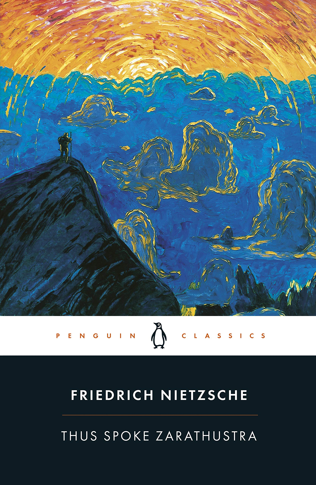
        

            <h4>Thus Spoke Zarathustra</h4>
            
<svg xmlns="http://www.w3.org/2000/svg" viewBox="0 0 50 50"><path d="M48.336,7.54c-0.701,0-1.359,0.007-2.018,0.024V5.326h-0.734c-14.262,0-19.043,3.411-20.585,5.252 c-1.542-1.841-6.323-5.252-20.585-5.252H3.68v2.237C3.022,7.545,2.364,7.54,1.664,7.54H0V39.89h1.664 c17.595,0,21.186,4.035,21.698,4.784h3.302c0.557-0.784,4.218-4.784,21.673-4.784H50V7.54H48.336z M23.899,38.431 c-2.457-1.812-7.611-3.914-18.383-4.054V7.175c15.087,0.194,18.001,4.327,18.383,5V38.431z M44.484,34.377 c-10.772,0.14-15.926,2.24-18.383,4.054V12.184c0.416-0.737,3.412-4.814,18.383-5.007V34.377z"></path></svg>BY FRIEDRICH NIETZSCHE

            <svg xmlns="http://www.w3.org/2000/svg" viewBox="0 0 576 512"><path d="M576 24v127.984c0 21.461-25.96 31.98-40.971 16.971l-35.707-35.709-243.523 243.523c-9.373 9.373-24.568 9.373-33.941 0l-22.627-22.627c-9.373-9.373-9.373-24.569 0-33.941L442.756 76.676l-35.703-35.705C391.982 25.9 402.656 0 424.024 0H552c13.255 0 24 10.745 24 24zM407.029 270.794l-16 16A23.999 23.999 0 0 0 384 303.765V448H64V128h264a24.003 24.003 0 0 0 16.97-7.029l16-16C376.089 89.851 365.381 64 344 64H48C21.49 64 0 85.49 0 112v352c0 26.51 21.49 48 48 48h352c26.51 0 48-21.49 48-48V287.764c0-21.382-25.852-32.09-40.971-16.97z"/></svg>View on Amazon
        

    </a>

35\. “Man is something to be surpassed.”

>36\. Distrust all in whom the impulse to punish is powerful.

37\. “God is a thought which makes crooked all that is straight.”

38\. “How many things are now called the worst evil, which are only twelve feet wide and three months long! But some day greater dragons will come into the world.”

>39\. In solitude there grows what anyone brings into it, the inner beast too. Therefore solitude is inadvisable to many.

40\. “What is the ape to man? A laughing-stock or a painful embarrassment. And just the same shall be man to the Übermensch: a laughing-stock or a painful embarrassment.”

41\. “They vomit their gall and call it a newspaper.”

<!--nietzsche-->

<h4>Your Myth-Busting Guide to Nietzsche & His 5 Greatest Ideas</h4>
From God is dead to the Übermensch, learn everything you need to know about Friedrich Nietzsche with our concise online guide.
<a class="button primary" href="/introduction-to-nietzsche/"><svg xmlns="http://www.w3.org/2000/svg" viewBox="0 0 512 512"><path d="M504 256C504 119 393 8 256 8S8 119 8 256s111 248 248 248 248-111 248-248zm-448 0c0-110.5 89.5-200 200-200s200 89.5 200 200-89.5 200-200 200S56 366.5 56 256zm72 20v-40c0-6.6 5.4-12 12-12h116v-67c0-10.7 12.9-16 20.5-8.5l99 99c4.7 4.7 4.7 12.3 0 17l-99 99c-7.6 7.6-20.5 2.2-20.5-8.5v-67H140c-6.6 0-12-5.4-12-12z"></path></svg>Get Instant Access</a>
&#9733;&#9733;&#9733;&#9733;&#9733; (50+ reviews for our courses)

42\. “The creation of freedom for oneself and a sacred ‘No’ even to duty — for that, my brothers, the lion is needed.”

>43\. Behold! I shall show you the _Last Man_....The earth has become small, and upon it hops the Last Man, who makes everything small... A little poison now and then: that produces pleasant dreams. And a lot of poison at last, for a pleasant death. They still work, for work is entertainment. But they take care the entertainment does not exhaust them... No herdsmen and one herd. Everyone wants the same thing, everyone is the same: whoever thinks otherwise goes voluntarily into the madhouse... ‘We have discovered happiness,’ say the Last Men, and blink.

44\. “I say unto you: one must still have chaos in oneself to be able to give birth to a dancing star. I say unto you: you still have chaos in yourselves.”

45\. “Man is a rope, fastened between animal and _Übermensch_ — a rope over an abyss.”

>46\. You have your way. I have my way. As for the right way, the correct way, the only way, it does not exist.

47\. “The [_Übermensch_](/articles/ubermensch-explained-the-meaning-of-nietzsches-superman/) shall be the meaning of the earth! I entreat you my brethren, remain true to the earth, and do not believe those who speak to you of supra-terrestrial hopes! … Behold, I teach you the _Übermensch:_ he is this lightning, he is this madness! … Behold, I am a prophet of the lightning and a heavy drop from the cloud: but this lightning is called _Übermensch.”_

## Nietzsche quotations from Beyond Good and Evil (1886)

    <a target="_blank" rel="noopener noreferrer sponsored" href="https://www.amazon.com/gp/product/0679724656?&linkCode=ll1&tag=philosophybre-20&linkId=5ecc29f1c46a78a5417cf851de9c9757&language=en_US&ref_=as_li_ss_tl">
        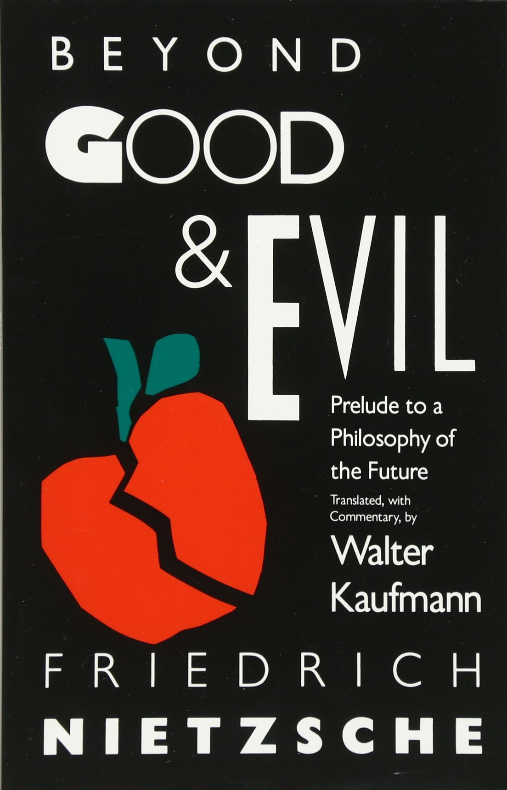
        

            <h4>Beyond Good and Evil</h4>
            
<svg xmlns="http://www.w3.org/2000/svg" viewBox="0 0 50 50"><path d="M48.336,7.54c-0.701,0-1.359,0.007-2.018,0.024V5.326h-0.734c-14.262,0-19.043,3.411-20.585,5.252 c-1.542-1.841-6.323-5.252-20.585-5.252H3.68v2.237C3.022,7.545,2.364,7.54,1.664,7.54H0V39.89h1.664 c17.595,0,21.186,4.035,21.698,4.784h3.302c0.557-0.784,4.218-4.784,21.673-4.784H50V7.54H48.336z M23.899,38.431 c-2.457-1.812-7.611-3.914-18.383-4.054V7.175c15.087,0.194,18.001,4.327,18.383,5V38.431z M44.484,34.377 c-10.772,0.14-15.926,2.24-18.383,4.054V12.184c0.416-0.737,3.412-4.814,18.383-5.007V34.377z"></path></svg>BY FRIEDRICH NIETZSCHE

            <svg xmlns="http://www.w3.org/2000/svg" viewBox="0 0 576 512"><path d="M576 24v127.984c0 21.461-25.96 31.98-40.971 16.971l-35.707-35.709-243.523 243.523c-9.373 9.373-24.568 9.373-33.941 0l-22.627-22.627c-9.373-9.373-9.373-24.569 0-33.941L442.756 76.676l-35.703-35.705C391.982 25.9 402.656 0 424.024 0H552c13.255 0 24 10.745 24 24zM407.029 270.794l-16 16A23.999 23.999 0 0 0 384 303.765V448H64V128h264a24.003 24.003 0 0 0 16.97-7.029l16-16C376.089 89.851 365.381 64 344 64H48C21.49 64 0 85.49 0 112v352c0 26.51 21.49 48 48 48h352c26.51 0 48-21.49 48-48V287.764c0-21.382-25.852-32.09-40.971-16.97z"/></svg>View on Amazon
        

    </a>

48\. “Whoever fights monsters should see to it that in the process he does not become a monster. And when you look long into an abyss, the abyss also looks into you.”

49\. “A man’s maturity: that is to have rediscovered the seriousness he possessed as a child at play.”

>50\. One loves ultimately one’s desires, not the thing desired.

51\. “The thought of suicide is a great consolation: by means of it one gets successfully through many a bad night.”

52\. “Independence is for the very few; it is a privilege of the strong. And whoever attempts it even with the best right but without inner constraint proves that he is probably not only strong, but also daring to the point of recklessness. He enters into a labyrinth, he multiplies a thousandfold dangers which life brings with it in any case, not the least of which is that no one can see how and where he loses his way, becomes lonely, and is torn piecemeal by some minotaur of conscience. Supposing one like that comes to grief, this happens so far from the comprehension of men that they neither feel it nor sympathize. And he cannot go back any longer.”

>53\. It might be a basic characteristic of existence that those who would know it completely would perish, in which case the strength of spirit should be measured according to how much of the "truth" one could still barely endure — or to put it more clearly, to what degree one would require it to be thinned down, shrouded, sweetened, blunted, falsified.

54\. “Words are acoustical signs for concepts; concepts, however, are more or less definite image signs for often recurring and associated sensations, for groups of sensations. To understand one another, it is not enough that one use the same words; one also has to use the same words for the same species of inner experiences; in the end one has to have one's experiences in common.”

<!--big subscribe-->

    
    <h4>From the Buddha to Nietzsche: join 6,500+ subscribers enjoying my Sunday Breakdown</h4>
    
In one concise email each Sunday, I break down a famous idea from the great philosophers. You get the distillation straight to your inbox.

    

        <form action="https://app.convertkit.com/forms/5812400/subscriptions" method="post" data-sv-form="5812400" data-uid="be0e52d3c0" data-format="inline" data-version="6" data-options="{&quot;settings&quot;:{&quot;after_subscribe&quot;:{&quot;action&quot;:&quot;message&quot;,&quot;success_message&quot;:&quot;Thank you, philosopher! Your welcome email will land in your inbox shortly.&quot;,&quot;redirect_url&quot;:&quot;https://philosophybreak.com/thank-you/&quot;},&quot;analytics&quot;:{&quot;google&quot;:null,&quot;fathom&quot;:null,&quot;facebook&quot;:null,&quot;segment&quot;:null,&quot;pinterest&quot;:null,&quot;sparkloop&quot;:null,&quot;googletagmanager&quot;:null},&quot;modal&quot;:{&quot;trigger&quot;:&quot;timer&quot;,&quot;scroll_percentage&quot;:null,&quot;timer&quot;:5,&quot;devices&quot;:&quot;all&quot;,&quot;show_once_every&quot;:15},&quot;powered_by&quot;:{&quot;show&quot;:false,&quot;url&quot;:&quot;https://convertkit.com/features/forms?utm_campaign=poweredby&amp;utm_content=form&amp;utm_medium=referral&amp;utm_source=dynamic&quot;},&quot;recaptcha&quot;:{&quot;enabled&quot;:false},&quot;return_visitor&quot;:{&quot;action&quot;:&quot;show&quot;,&quot;custom_content&quot;:&quot;&quot;},&quot;slide_in&quot;:{&quot;display_in&quot;:&quot;bottom_right&quot;,&quot;trigger&quot;:&quot;timer&quot;,&quot;scroll_percentage&quot;:null,&quot;timer&quot;:5,&quot;devices&quot;:&quot;all&quot;,&quot;show_once_every&quot;:15},&quot;sticky_bar&quot;:{&quot;display_in&quot;:&quot;top&quot;,&quot;trigger&quot;:&quot;timer&quot;,&quot;scroll_percentage&quot;:null,&quot;timer&quot;:5,&quot;devices&quot;:&quot;all&quot;,&quot;show_once_every&quot;:15}},&quot;version&quot;:&quot;6&quot;}" min-width="400 500 600 700 800">
        
<ul data-element="errors" data-group="alert"></ul>

            

                <input name="email_address" aria-label="Your Email Address..." placeholder="Your Email Address..." required type="email" />
            

            <button class="button primary" type="submit" data-element="submit">

<svg xmlns="http://www.w3.org/2000/svg" viewBox="0 0 512 512"><path d="M464 64H48C21.49 64 0 85.49 0 112v288c0 26.51 21.49 48 48 48h416c26.51 0 48-21.49 48-48V112c0-26.51-21.49-48-48-48zm0 48v40.805c-22.422 18.259-58.168 46.651-134.587 106.49-16.841 13.247-50.201 45.072-73.413 44.701-23.208.375-56.579-31.459-73.413-44.701C106.18 199.465 70.425 171.067 48 152.805V112h416zM48 400V214.398c22.914 18.251 55.409 43.862 104.938 82.646 21.857 17.205 60.134 55.186 103.062 54.955 42.717.231 80.509-37.199 103.053-54.947 49.528-38.783 82.032-64.401 104.947-82.653V400H48z"/></svg>Join 6,500+ Subscribers</button>
            

            

        </form>
        
One short philosophical email each Sunday. Unsubscribe any time.

    

55\. “A human being who strives for something great considers everyone he meets on his way either as a means or as a delay and obstacle — or as a temporary resting place.”

>56\. Men of profound sadness betray themselves when they are happy: they have a way of embracing happiness as if they wanted to crush and suffocate it, from jealousy: alas, they know only too well that it will flee.

57\. “More and more it seems to me that the philosopher, being of necessity a man of tomorrow and the day after tomorrow, has always found himself, and had to find himself, in contradiction to his today: his enemy was ever the ideal of today. So far all these extraordinary furtherers of men whom one calls philosophers, though they themselves have rarely felt like friends of wisdom but rather like disagreeable fools and dangerous question marks, have found their task, their hard, unwanted, inescapable task, but eventually also the greatness of their task, in being the bad conscience of their time.”

    <a href="/introduction-to-nietzsche/">
        

<picture><source type="image/webp" srcset="/static/03723fefbc97c079ed7c997885355160/e2229/intro-to-nietzsche-chap1-full.webp 750w,
/static/03723fefbc97c079ed7c997885355160/8ee9d/intro-to-nietzsche-chap1-full.webp 1080w,
/static/03723fefbc97c079ed7c997885355160/23c38/intro-to-nietzsche-chap1-full.webp 1366w,
/static/03723fefbc97c079ed7c997885355160/dded5/intro-to-nietzsche-chap1-full.webp 1412w" sizes="100vw"></picture><noscript></noscript>
        

        

            <h4>Introduction to Nietzsche and His 5 Greatest Ideas</h4>
            
<svg xmlns="http://www.w3.org/2000/svg" viewBox="0 0 50 50"><path d="M48.336,7.54c-0.701,0-1.359,0.007-2.018,0.024V5.326h-0.734c-14.262,0-19.043,3.411-20.585,5.252 c-1.542-1.841-6.323-5.252-20.585-5.252H3.68v2.237C3.022,7.545,2.364,7.54,1.664,7.54H0V39.89h1.664 c17.595,0,21.186,4.035,21.698,4.784h3.302c0.557-0.784,4.218-4.784,21.673-4.784H50V7.54H48.336z M23.899,38.431 c-2.457-1.812-7.611-3.914-18.383-4.054V7.175c15.087,0.194,18.001,4.327,18.383,5V38.431z M44.484,34.377 c-10.772,0.14-15.926,2.24-18.383,4.054V12.184c0.416-0.737,3.412-4.814,18.383-5.007V34.377z"></path></svg>BY PHILOSOPHY BREAK

            
&#9733;&#9733;&#9733;&#9733;&#9733;

            <svg xmlns="http://www.w3.org/2000/svg" viewBox="0 0 512 512"><path d="M504 256C504 119 393 8 256 8S8 119 8 256s111 248 248 248 248-111 248-248zm-448 0c0-110.5 89.5-200 200-200s200 89.5 200 200-89.5 200-200 200S56 366.5 56 256zm72 20v-40c0-6.6 5.4-12 12-12h116v-67c0-10.7 12.9-16 20.5-8.5l99 99c4.7 4.7 4.7 12.3 0 17l-99 99c-7.6 7.6-20.5 2.2-20.5-8.5v-67H140c-6.6 0-12-5.4-12-12z"></path></svg>Learn More
        

    </a>

58\. “There is no such thing as moral phenomena, but only a moral interpretation of phenomena.”

>59\. Madness is something rare in individuals — but in groups, parties, peoples, and ages, it is the rule.

60\. “‘I did that,’ says my memory. ‘I could not have done that,’ says my pride, and remains inexorable. Eventually the memory yields.”

61\. “I shall repeat a hundred times; we really ought to free ourselves from the seduction of words!”

62\. “Whoever despises himself still respects himself as one who despises.”

63\. “Sensuality often hastens the growth of love so much that the roots remain weak and are easily torn up.”

64\. “Christianity gave Eros poison to drink; he did not die of it, certainly, but degenerated to Vice.”

65\. “Blessed are the forgetful, for they get the better even of their blunders.”

>66\. That which is done out of love always takes place beyond good and evil.

67\. “Every great philosophy so far has been the personal confession of its author and a kind of involuntary and unconscious memoir.”

68\. “One must shed the bad taste of wanting to agree with many. ‘Good’ is no longer good when one's neighbor mouths it. And how should there be a ‘common good’! The term contradicts itself: whatever can be common always has little value. In the end it must be as it is and always has been: great things remain for the great, abysses for the profound, nuances and shudders for the refined, and, in brief, all that is rare for the rare.”

## Nietzsche quotations from The Genealogy of Morals (1887)

    <a target="_blank" rel="noopener noreferrer sponsored" href="https://www.amazon.com/gp/product/0141195371?&linkCode=ll1&tag=philosophybre-20&linkId=5ec5912e78e9d6bbdff90712b3dca5ea&language=en_US&ref_=as_li_ss_tl">
        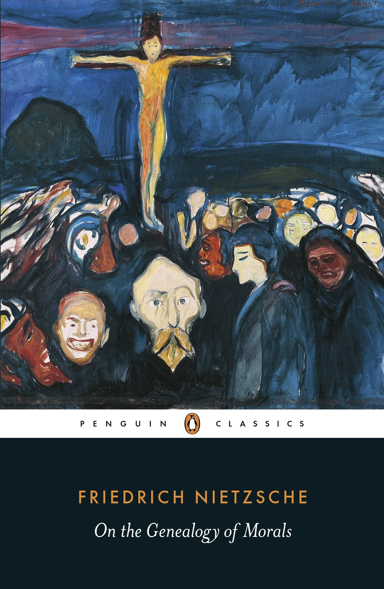
        

            <h4>The Genealogy of Morals</h4>
            
<svg xmlns="http://www.w3.org/2000/svg" viewBox="0 0 50 50"><path d="M48.336,7.54c-0.701,0-1.359,0.007-2.018,0.024V5.326h-0.734c-14.262,0-19.043,3.411-20.585,5.252 c-1.542-1.841-6.323-5.252-20.585-5.252H3.68v2.237C3.022,7.545,2.364,7.54,1.664,7.54H0V39.89h1.664 c17.595,0,21.186,4.035,21.698,4.784h3.302c0.557-0.784,4.218-4.784,21.673-4.784H50V7.54H48.336z M23.899,38.431 c-2.457-1.812-7.611-3.914-18.383-4.054V7.175c15.087,0.194,18.001,4.327,18.383,5V38.431z M44.484,34.377 c-10.772,0.14-15.926,2.24-18.383,4.054V12.184c0.416-0.737,3.412-4.814,18.383-5.007V34.377z"></path></svg>BY FRIEDRICH NIETZSCHE

            <svg xmlns="http://www.w3.org/2000/svg" viewBox="0 0 576 512"><path d="M576 24v127.984c0 21.461-25.96 31.98-40.971 16.971l-35.707-35.709-243.523 243.523c-9.373 9.373-24.568 9.373-33.941 0l-22.627-22.627c-9.373-9.373-9.373-24.569 0-33.941L442.756 76.676l-35.703-35.705C391.982 25.9 402.656 0 424.024 0H552c13.255 0 24 10.745 24 24zM407.029 270.794l-16 16A23.999 23.999 0 0 0 384 303.765V448H64V128h264a24.003 24.003 0 0 0 16.97-7.029l16-16C376.089 89.851 365.381 64 344 64H48C21.49 64 0 85.49 0 112v352c0 26.51 21.49 48 48 48h352c26.51 0 48-21.49 48-48V287.764c0-21.382-25.852-32.09-40.971-16.97z"/></svg>View on Amazon
        

    </a>

69\. “[L]et us guard ourselves better from now on... against the dangerous old conceptual fabrication that posited a ‘pure, will-less, painless, timeless subject of knowledge’; let us guard ourselves against the tentacles of such contradictory concepts as ‘pure reason,’ ‘absolute spirituality,’ ‘knowledge in itself.’”

70\. “Particularly as knowers, let us not be ungrateful toward such resolute reversals of the familiar perspectives and valuations with which the spirit has raged against itself all too long… to see differently in this way for once, _to want_ to see differently, is no small discipline and preparation of the intellect for its future ‘objectivity’—the latter understood not as ‘disinterested contemplation’ (which is a non-concept and absurdity), but rather as the capacity to have one’s Pro and Contra _in one’s power,_ and to shift them in and out, so that one knows how to make precisely the _difference_ in perspectives and affective interpretations useful for knowledge.”

>71\. There is _only_ a perspectival seeing, _only_ a perspectival ‘knowing’; and the more affects we allow to speak about a matter, the more eyes, different eyes, we know how to bring to bear on one and the same matter, that much more complete will our ‘concept’ of this matter, our ‘objectivity’ be. 

72\. “Every instinct which does not vent itself externally _turns inwards_ — this is what I call the _internalization_ of man: it is at this point that what is later called the ‘soul’ first develops in man.”

73\. “The man who is forced into an oppressively narrow and regular morality, who for want of external enemies and resistance impatiently tears, persecutes, gnaws, disturbs, mistreats himself, this animal which is to be ‘tamed’, which rubs himself raw on the bars of his cage… this yearning and desperate prisoner became the inventor of ‘bad conscience’.”

    <a href="/introduction-to-nietzsche/">
        

<picture><source type="image/webp" srcset="/static/03723fefbc97c079ed7c997885355160/e2229/intro-to-nietzsche-chap1-full.webp 750w,
/static/03723fefbc97c079ed7c997885355160/8ee9d/intro-to-nietzsche-chap1-full.webp 1080w,
/static/03723fefbc97c079ed7c997885355160/23c38/intro-to-nietzsche-chap1-full.webp 1366w,
/static/03723fefbc97c079ed7c997885355160/dded5/intro-to-nietzsche-chap1-full.webp 1412w" sizes="100vw"></picture><noscript></noscript>
        

        

            <h4>Introduction to Nietzsche and His 5 Greatest Ideas</h4>
            
<svg xmlns="http://www.w3.org/2000/svg" viewBox="0 0 50 50"><path d="M48.336,7.54c-0.701,0-1.359,0.007-2.018,0.024V5.326h-0.734c-14.262,0-19.043,3.411-20.585,5.252 c-1.542-1.841-6.323-5.252-20.585-5.252H3.68v2.237C3.022,7.545,2.364,7.54,1.664,7.54H0V39.89h1.664 c17.595,0,21.186,4.035,21.698,4.784h3.302c0.557-0.784,4.218-4.784,21.673-4.784H50V7.54H48.336z M23.899,38.431 c-2.457-1.812-7.611-3.914-18.383-4.054V7.175c15.087,0.194,18.001,4.327,18.383,5V38.431z M44.484,34.377 c-10.772,0.14-15.926,2.24-18.383,4.054V12.184c0.416-0.737,3.412-4.814,18.383-5.007V34.377z"></path></svg>BY PHILOSOPHY BREAK

            
&#9733;&#9733;&#9733;&#9733;&#9733;

            <svg xmlns="http://www.w3.org/2000/svg" viewBox="0 0 512 512"><path d="M504 256C504 119 393 8 256 8S8 119 8 256s111 248 248 248 248-111 248-248zm-448 0c0-110.5 89.5-200 200-200s200 89.5 200 200-89.5 200-200 200S56 366.5 56 256zm72 20v-40c0-6.6 5.4-12 12-12h116v-67c0-10.7 12.9-16 20.5-8.5l99 99c4.7 4.7 4.7 12.3 0 17l-99 99c-7.6 7.6-20.5 2.2-20.5-8.5v-67H140c-6.6 0-12-5.4-12-12z"></path></svg>Learn More
        

    </a>

74\. “To demand of strength that it should not express itself as strength, that it should not be a desire to overcome, a desire to throw down, a desire to become master, a thirst for enemies and resistances and triumphs, is just as absurd as to demand of weakness that it should express itself as strength.”

>75\. Man, the boldest animal and the one most accustomed to pain, does _not_ repudiate suffering as such; he _desires_ it, he even seeks it out, provided that he has been shown a _meaning_ for it, a _reason_ for suffering. The meaninglessness of suffering, and _not_ suffering as such, has been the curse which has hung over mankind up to now.

76\. “Man would rather will nothingness than not will at all.”

77\. “Every animal… instinctively strives for an optimum of favorable conditions in which fully to release his power and achieve his maximum feeling of power; every animal abhors equally instinctively, with an acute sense of smell ‘higher than all reason,’ any kind of disturbance and hindrance which blocks or could block his path to the optimum.”

## Nietzsche quotations from The Twilight of the Idols (1888)

    <a target="_blank" rel="noopener noreferrer sponsored" href="https://www.amazon.com/Nietzsche-Anti-Christ-Twilight-Cambridge-Philosophy/dp/0521016886?&linkCode=ll1&tag=philosophybre-20&linkId=87e4680fa2bf9969e82dc6acca3a2266&language=en_US&ref_=as_li_ss_tl">
        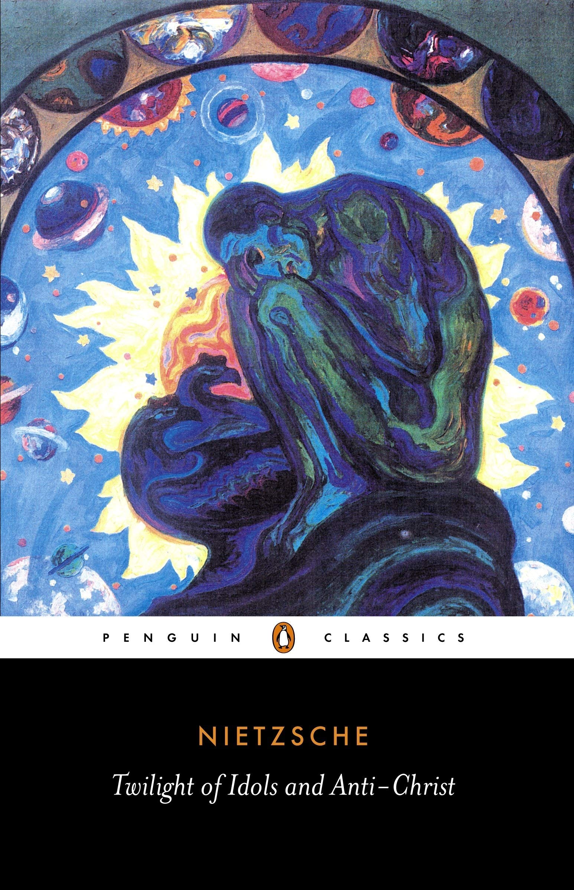
        

            <h4>The Twilight of the Idols</h4>
            
<svg xmlns="http://www.w3.org/2000/svg" viewBox="0 0 50 50"><path d="M48.336,7.54c-0.701,0-1.359,0.007-2.018,0.024V5.326h-0.734c-14.262,0-19.043,3.411-20.585,5.252 c-1.542-1.841-6.323-5.252-20.585-5.252H3.68v2.237C3.022,7.545,2.364,7.54,1.664,7.54H0V39.89h1.664 c17.595,0,21.186,4.035,21.698,4.784h3.302c0.557-0.784,4.218-4.784,21.673-4.784H50V7.54H48.336z M23.899,38.431 c-2.457-1.812-7.611-3.914-18.383-4.054V7.175c15.087,0.194,18.001,4.327,18.383,5V38.431z M44.484,34.377 c-10.772,0.14-15.926,2.24-18.383,4.054V12.184c0.416-0.737,3.412-4.814,18.383-5.007V34.377z"></path></svg>BY FRIEDRICH NIETZSCHE

            <svg xmlns="http://www.w3.org/2000/svg" viewBox="0 0 576 512"><path d="M576 24v127.984c0 21.461-25.96 31.98-40.971 16.971l-35.707-35.709-243.523 243.523c-9.373 9.373-24.568 9.373-33.941 0l-22.627-22.627c-9.373-9.373-9.373-24.569 0-33.941L442.756 76.676l-35.703-35.705C391.982 25.9 402.656 0 424.024 0H552c13.255 0 24 10.745 24 24zM407.029 270.794l-16 16A23.999 23.999 0 0 0 384 303.765V448H64V128h264a24.003 24.003 0 0 0 16.97-7.029l16-16C376.089 89.851 365.381 64 344 64H48C21.49 64 0 85.49 0 112v352c0 26.51 21.49 48 48 48h352c26.51 0 48-21.49 48-48V287.764c0-21.382-25.852-32.09-40.971-16.97z"/></svg>View on Amazon
        

    </a>

78\. “That which does not kill me makes me stronger.”

>79\. The church combats the passions by cutting them off in every sense: its technique, its ‘cure’ is _castration._

80\. “It is in our wild nature that we best recover from our un-nature, our spirituality.”

81\. “When stepped on, the worm curls up. That is a clever thing to do. Thus it reduces its chances of being stepped on again. In the language of morality: humility.”

<!--big subscribe-->

    
    <h4>From the Buddha to Nietzsche: join 6,500+ subscribers enjoying my Sunday Breakdown</h4>
    
In one concise email each Sunday, I break down a famous idea from the great philosophers. You get the distillation straight to your inbox.

    

        <form action="https://app.convertkit.com/forms/5812400/subscriptions" method="post" data-sv-form="5812400" data-uid="be0e52d3c0" data-format="inline" data-version="6" data-options="{&quot;settings&quot;:{&quot;after_subscribe&quot;:{&quot;action&quot;:&quot;message&quot;,&quot;success_message&quot;:&quot;Thank you, philosopher! Your welcome email will land in your inbox shortly.&quot;,&quot;redirect_url&quot;:&quot;https://philosophybreak.com/thank-you/&quot;},&quot;analytics&quot;:{&quot;google&quot;:null,&quot;fathom&quot;:null,&quot;facebook&quot;:null,&quot;segment&quot;:null,&quot;pinterest&quot;:null,&quot;sparkloop&quot;:null,&quot;googletagmanager&quot;:null},&quot;modal&quot;:{&quot;trigger&quot;:&quot;timer&quot;,&quot;scroll_percentage&quot;:null,&quot;timer&quot;:5,&quot;devices&quot;:&quot;all&quot;,&quot;show_once_every&quot;:15},&quot;powered_by&quot;:{&quot;show&quot;:false,&quot;url&quot;:&quot;https://convertkit.com/features/forms?utm_campaign=poweredby&amp;utm_content=form&amp;utm_medium=referral&amp;utm_source=dynamic&quot;},&quot;recaptcha&quot;:{&quot;enabled&quot;:false},&quot;return_visitor&quot;:{&quot;action&quot;:&quot;show&quot;,&quot;custom_content&quot;:&quot;&quot;},&quot;slide_in&quot;:{&quot;display_in&quot;:&quot;bottom_right&quot;,&quot;trigger&quot;:&quot;timer&quot;,&quot;scroll_percentage&quot;:null,&quot;timer&quot;:5,&quot;devices&quot;:&quot;all&quot;,&quot;show_once_every&quot;:15},&quot;sticky_bar&quot;:{&quot;display_in&quot;:&quot;top&quot;,&quot;trigger&quot;:&quot;timer&quot;,&quot;scroll_percentage&quot;:null,&quot;timer&quot;:5,&quot;devices&quot;:&quot;all&quot;,&quot;show_once_every&quot;:15}},&quot;version&quot;:&quot;6&quot;}" min-width="400 500 600 700 800">
        
<ul data-element="errors" data-group="alert"></ul>

            

                <input name="email_address" aria-label="Your Email Address..." placeholder="Your Email Address..." required type="email" />
            

            <button class="button primary" type="submit" data-element="submit">

<svg xmlns="http://www.w3.org/2000/svg" viewBox="0 0 512 512"><path d="M464 64H48C21.49 64 0 85.49 0 112v288c0 26.51 21.49 48 48 48h416c26.51 0 48-21.49 48-48V112c0-26.51-21.49-48-48-48zm0 48v40.805c-22.422 18.259-58.168 46.651-134.587 106.49-16.841 13.247-50.201 45.072-73.413 44.701-23.208.375-56.579-31.459-73.413-44.701C106.18 199.465 70.425 171.067 48 152.805V112h416zM48 400V214.398c22.914 18.251 55.409 43.862 104.938 82.646 21.857 17.205 60.134 55.186 103.062 54.955 42.717.231 80.509-37.199 103.053-54.947 49.528-38.783 82.032-64.401 104.947-82.653V400H48z"/></svg>Join 6,500+ Subscribers</button>
            

            

        </form>
        
One short philosophical email each Sunday. Unsubscribe any time.

    

82\. “Idleness is the beginning of all psychology. What? Could it be that psychology is — a vice?”

>83\. Is man merely a mistake of God’s? Or God merely a mistake of man?

84\. “All truly great thoughts are conceived while walking.”

85\. “To learn to see — to accustom the eye to calmness, to patience, and to allow things to come up to it; to defer judgment, and to acquire the habit of approaching and grasping an individual case from all sides. This is the first preparatory schooling of intellectuality. One must not respond immediately to a stimulus; one must acquire a command of the obstructing and isolating instincts.”

>86\. Freedom is the will to be responsible for ourselves.”

## Nietzsche quotations from The Antichrist (1888)

    <a target="_blank" rel="noopener noreferrer sponsored" href="https://www.amazon.com/Nietzsche-Anti-Christ-Twilight-Cambridge-Philosophy/dp/0521016886?&linkCode=ll1&tag=philosophybre-20&linkId=87e4680fa2bf9969e82dc6acca3a2266&language=en_US&ref_=as_li_ss_tl">
        
        

            <h4>The Antichrist</h4>
            
<svg xmlns="http://www.w3.org/2000/svg" viewBox="0 0 50 50"><path d="M48.336,7.54c-0.701,0-1.359,0.007-2.018,0.024V5.326h-0.734c-14.262,0-19.043,3.411-20.585,5.252 c-1.542-1.841-6.323-5.252-20.585-5.252H3.68v2.237C3.022,7.545,2.364,7.54,1.664,7.54H0V39.89h1.664 c17.595,0,21.186,4.035,21.698,4.784h3.302c0.557-0.784,4.218-4.784,21.673-4.784H50V7.54H48.336z M23.899,38.431 c-2.457-1.812-7.611-3.914-18.383-4.054V7.175c15.087,0.194,18.001,4.327,18.383,5V38.431z M44.484,34.377 c-10.772,0.14-15.926,2.24-18.383,4.054V12.184c0.416-0.737,3.412-4.814,18.383-5.007V34.377z"></path></svg>BY FRIEDRICH NIETZSCHE

            <svg xmlns="http://www.w3.org/2000/svg" viewBox="0 0 576 512"><path d="M576 24v127.984c0 21.461-25.96 31.98-40.971 16.971l-35.707-35.709-243.523 243.523c-9.373 9.373-24.568 9.373-33.941 0l-22.627-22.627c-9.373-9.373-9.373-24.569 0-33.941L442.756 76.676l-35.703-35.705C391.982 25.9 402.656 0 424.024 0H552c13.255 0 24 10.745 24 24zM407.029 270.794l-16 16A23.999 23.999 0 0 0 384 303.765V448H64V128h264a24.003 24.003 0 0 0 16.97-7.029l16-16C376.089 89.851 365.381 64 344 64H48C21.49 64 0 85.49 0 112v352c0 26.51 21.49 48 48 48h352c26.51 0 48-21.49 48-48V287.764c0-21.382-25.852-32.09-40.971-16.97z"/></svg>View on Amazon
        

    </a>

87\. “Against boredom even the gods struggle in vain.”

>88\. What is good?—Everything that enhances people’s feelings of power, will to power, power itself. What is bad?—Everything stemming from weakness. What is happiness?—The feeling that power is _growing,_ that some resistance has been overcome. _Not_ contentedness, but more power; _not_ peace, but war; _not_ virtue, but prowess…

89\. “Great intellects are skeptical.”

90\. “Sin, this supreme form of human self-desecration, was invented to block science, to block culture, to block every elevation and ennoblement of humanity; the priests rule through the invention of sin.”

## Nietzsche quotations from The Will to Power (1901)

    <a target="_blank" rel="noopener noreferrer sponsored" href="http://www.amazon.com/Will-Power-Friedrich-Nietzsche/dp/1522045473?crid=173NP0C6Q4GN3&keywords=the+will+to+power&qid=1650788473&s=books&sprefix=the+will+to+powe%2Cstripbooks%2C142&sr=1-1&linkCode=ll1&tag=philosophybre-20&linkId=33adb89f044ab17f3f1484ecc3768690&language=en_US&ref_=as_li_ss_tl">
        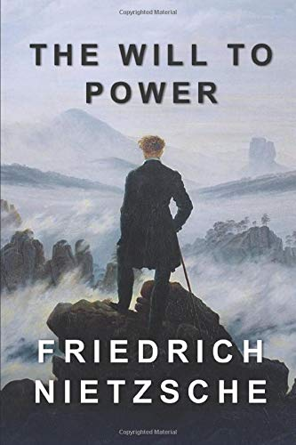
        

            <h4>The Will to Power</h4>
            
<svg xmlns="http://www.w3.org/2000/svg" viewBox="0 0 50 50"><path d="M48.336,7.54c-0.701,0-1.359,0.007-2.018,0.024V5.326h-0.734c-14.262,0-19.043,3.411-20.585,5.252 c-1.542-1.841-6.323-5.252-20.585-5.252H3.68v2.237C3.022,7.545,2.364,7.54,1.664,7.54H0V39.89h1.664 c17.595,0,21.186,4.035,21.698,4.784h3.302c0.557-0.784,4.218-4.784,21.673-4.784H50V7.54H48.336z M23.899,38.431 c-2.457-1.812-7.611-3.914-18.383-4.054V7.175c15.087,0.194,18.001,4.327,18.383,5V38.431z M44.484,34.377 c-10.772,0.14-15.926,2.24-18.383,4.054V12.184c0.416-0.737,3.412-4.814,18.383-5.007V34.377z"></path></svg>BY FRIEDRICH NIETZSCHE

            <svg xmlns="http://www.w3.org/2000/svg" viewBox="0 0 576 512"><path d="M576 24v127.984c0 21.461-25.96 31.98-40.971 16.971l-35.707-35.709-243.523 243.523c-9.373 9.373-24.568 9.373-33.941 0l-22.627-22.627c-9.373-9.373-9.373-24.569 0-33.941L442.756 76.676l-35.703-35.705C391.982 25.9 402.656 0 424.024 0H552c13.255 0 24 10.745 24 24zM407.029 270.794l-16 16A23.999 23.999 0 0 0 384 303.765V448H64V128h264a24.003 24.003 0 0 0 16.97-7.029l16-16C376.089 89.851 365.381 64 344 64H48C21.49 64 0 85.49 0 112v352c0 26.51 21.49 48 48 48h352c26.51 0 48-21.49 48-48V287.764c0-21.382-25.852-32.09-40.971-16.97z"/></svg>View on Amazon
        

    </a>

91\. “And do you know what ‘the world’ is to me? … This world: a monster of energy, without beginning, without end … set in a definite space as a definite force, and not a space that might be ‘empty’ here or there, but rather as force throughout, as a play of forces and waves of forces, at the same time one and many, increasing here and at the same time decreasing here; … — _This world is the will to power — and nothing besides!_ And you yourselves are also this will to power — and nothing besides!”

>92\. We have art in order not to die of the truth.

93\. “Of what is great one must either be silent or speak with greatness.”

94\. “Necessity is not an established fact, but an interpretation.”

## Nietzsche quotations from Ecce Homo (1888)

    <a target="_blank" rel="noopener noreferrer sponsored" href="https://www.amazon.com/Nietzsche-Anti-Christ-Twilight-Cambridge-Philosophy/dp/0521016886?&linkCode=ll1&tag=philosophybre-20&linkId=87e4680fa2bf9969e82dc6acca3a2266&language=en_US&ref_=as_li_ss_tl">
        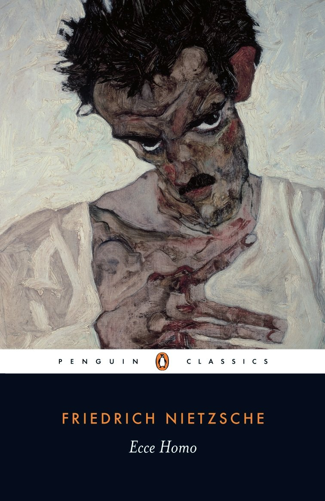
        

            <h4>Ecce Homo</h4>
            
<svg xmlns="http://www.w3.org/2000/svg" viewBox="0 0 50 50"><path d="M48.336,7.54c-0.701,0-1.359,0.007-2.018,0.024V5.326h-0.734c-14.262,0-19.043,3.411-20.585,5.252 c-1.542-1.841-6.323-5.252-20.585-5.252H3.68v2.237C3.022,7.545,2.364,7.54,1.664,7.54H0V39.89h1.664 c17.595,0,21.186,4.035,21.698,4.784h3.302c0.557-0.784,4.218-4.784,21.673-4.784H50V7.54H48.336z M23.899,38.431 c-2.457-1.812-7.611-3.914-18.383-4.054V7.175c15.087,0.194,18.001,4.327,18.383,5V38.431z M44.484,34.377 c-10.772,0.14-15.926,2.24-18.383,4.054V12.184c0.416-0.737,3.412-4.814,18.383-5.007V34.377z"></path></svg>BY FRIEDRICH NIETZSCHE

            <svg xmlns="http://www.w3.org/2000/svg" viewBox="0 0 576 512"><path d="M576 24v127.984c0 21.461-25.96 31.98-40.971 16.971l-35.707-35.709-243.523 243.523c-9.373 9.373-24.568 9.373-33.941 0l-22.627-22.627c-9.373-9.373-9.373-24.569 0-33.941L442.756 76.676l-35.703-35.705C391.982 25.9 402.656 0 424.024 0H552c13.255 0 24 10.745 24 24zM407.029 270.794l-16 16A23.999 23.999 0 0 0 384 303.765V448H64V128h264a24.003 24.003 0 0 0 16.97-7.029l16-16C376.089 89.851 365.381 64 344 64H48C21.49 64 0 85.49 0 112v352c0 26.51 21.49 48 48 48h352c26.51 0 48-21.49 48-48V287.764c0-21.382-25.852-32.09-40.971-16.97z"/></svg>View on Amazon
        

    </a>

95\. “Those who can breathe the air of my writings know that it is an air of the heights, a strong air. One must be made for it. Otherwise there is no small danger that one might catch cold in it. The ice is near, the solitude tremendous — but how calmly all things lie in the light. How freely one breathes! How much one feels beneath oneself.”

96\. “Resentment, born of weakness, harms no one more than the weak person himself.”

>97\. I know my fate. One day my name will be associated with the memory of something tremendous — a crisis without equal on earth, the most profound collision of conscience, a decision that was conjured up against everything that had been believed, demanded, hallowed so far. I am no man, I am dynamite.

## Learn more about Nietzsche 
 
To help you learn more about the entire philosophy of Friedrich Nietzsche — as well as why this controversial, oft-misunderstood thinker holds such a special place in the history of philosophy — we’ve put together a bite-size introduction to his life, work, and 5 greatest ideas, with materials delivered direct to your inbox over 6 days. Learn more and enroll today: [Introduction to Nietzsche and His 5 Greatest Ideas](/introduction-to-nietzsche/).

<!--nietzsche-->

<h4>Your Myth-Busting Guide to Nietzsche & His 5 Greatest Ideas</h4>
From God is dead to the Übermensch, learn everything you need to know about Friedrich Nietzsche with our concise online guide.
<a class="button primary" href="/introduction-to-nietzsche/"><svg xmlns="http://www.w3.org/2000/svg" viewBox="0 0 512 512"><path d="M504 256C504 119 393 8 256 8S8 119 8 256s111 248 248 248 248-111 248-248zm-448 0c0-110.5 89.5-200 200-200s200 89.5 200 200-89.5 200-200 200S56 366.5 56 256zm72 20v-40c0-6.6 5.4-12 12-12h116v-67c0-10.7 12.9-16 20.5-8.5l99 99c4.7 4.7 4.7 12.3 0 17l-99 99c-7.6 7.6-20.5 2.2-20.5-8.5v-67H140c-6.6 0-12-5.4-12-12z"></path></svg>Get Instant Access</a>
&#9733;&#9733;&#9733;&#9733;&#9733; (50+ reviews for our courses)

