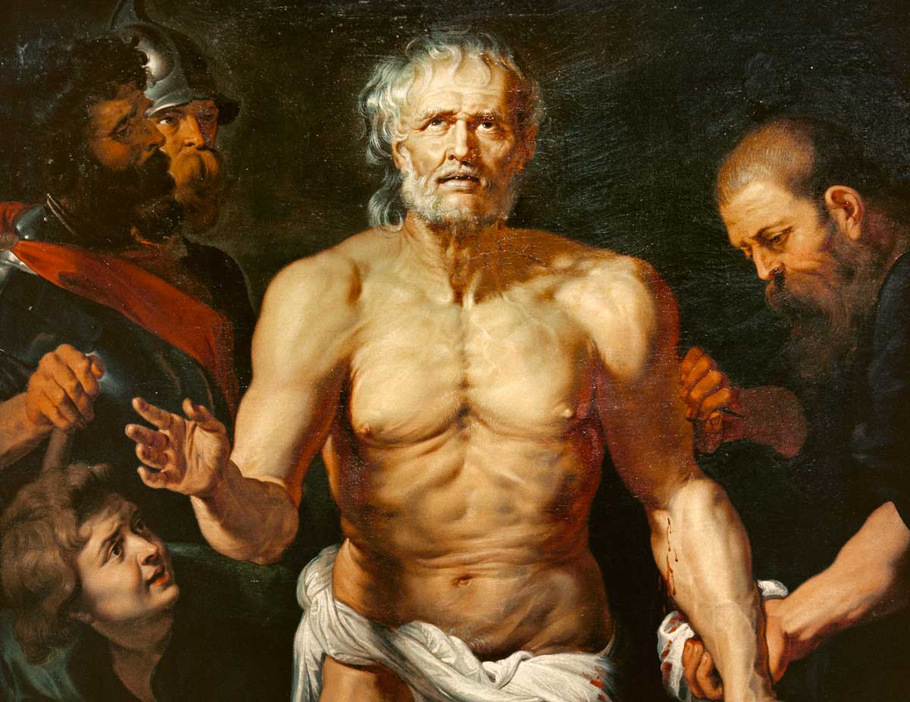
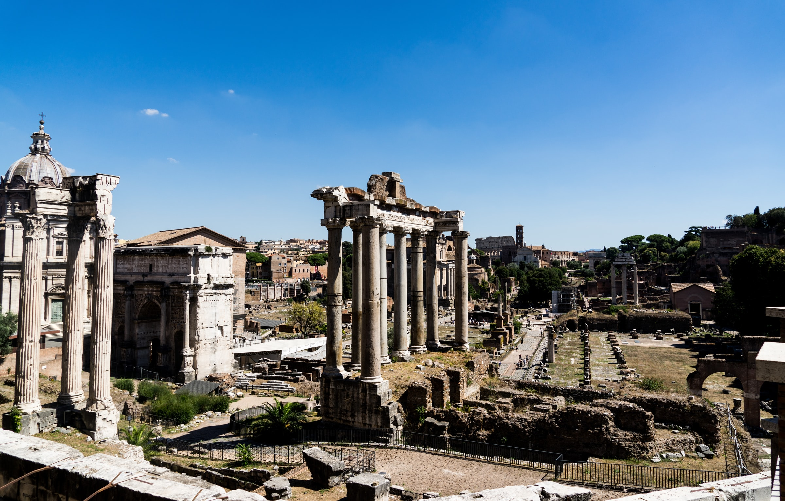

In his brilliant 49 AD essay <a target="_blank" rel="noopener noreferrer sponsored" href="http://www.amazon.com/gp/product/0143036327/ref=as_li_tl?ie=UTF8&tag=philosophybre-20&camp=1789&creative=9325&linkCode=as2&creativeASIN=0143036327&linkId=e31a3b983be0b177d68097379a035cae">On the Shortness of Life</a>, Roman Stoic philosopher Seneca addresses his father-in-law, Paulinus, about the seemingly universal human complaint regarding the shortness of life: we are born, our existences rush swiftly by, and before we know it, we die. 

In the face of this certain fate, how can we shake off the pervasive suspicion that, however we end up living our brief lives, we’re not making the most of them? How can we keep existential frets and despairs at bay?

Well, Seneca thinks our complaints about the shortness of life aren’t really justified: they reflect not the reality of our situation, but rather our malformed attitudes and responses to it. As he writes:

>It is not that we have a short time to live, but that we waste a lot of it. Life is long enough, and a sufficiently generous amount has been given to us for the highest achievements if it were all well invested. But when it is wasted in heedless luxury and spent on no good activity, we are forced at last by death's final constraint to realize that it has passed away before we knew it was passing. So it is: we are not given a short life but we make it short, and we are not ill-supplied but wasteful of it… life is long if you know how to use it. 

So, life itself is not short but we _make_ it short. How so? Well, here Seneca points out several human attitudes and behaviors that contribute to the feeling that life is fleeting. Let’s look at each one in turn, before exploring Seneca’s proposed solution for how we can live fulfilled lives and meet death without fear.

## We do not fully appreciate the preciousness of time

Firstly, Seneca claims we do not fully appreciate the preciousness of time. We attribute value to things like money, belongings, and property, and guard them closely. But when it comes to our time — which, as Seneca puts it, is “the one thing in which it is right to be stingy” — we squander it without thinking. As he explains:

>You are living as if destined to live forever; your own frailty never occurs to you; you don't notice how much time has already passed, but squander it as though you had a full and overflowing supply — though all the while that very day which you are devoting to somebody or something may be your last. You act like mortals in all that you fear, and like immortals in all that you desire.

The money, possessions, and status we chase and trade on in our day-to-day lives do not ultimately give us peace of mind or lasting pleasure. When death approaches, Seneca points out, we would exchange them all for a little more time: 

>People are delighted to accept pensions and gratuities, for which they hire out their labor or their support or their services. But nobody works out the value of time: men use it lavishly as if it cost nothing. But if death threatens these same people, you will see them praying to their doctors; if they are in fear of capital punishment, you will see them prepared to spend their all to stay alive. So inconsistent are they in their feelings.

“Feeble old men pray for a few more years,” Seneca continues: “they pretend they are younger than they are; they comfort themselves by this deception and fool themselves as eagerly as if they fooled Fate at the same time. But when at last some illness has reminded them of their mortality, how terrified do they die, as if they were not just passing out of life but being dragged out of it. They exclaim that they were fools because they have not really lived, and that if only they can recover from this illness they will live in leisure. Then they reflect how pointlessly they acquired things they never would enjoy, and how all their toil has been in vain.”

Why do we leave it until death approaches to suddenly recognize that time is the most precious resource we have? Seneca writes, “if each of us could have the tally of his future years set before him, as we can of our past years, how alarmed would be those who saw only a few years ahead, and how carefully would they use them!” 

So why not start using our time more carefully _now_, rather than waiting until death is round the corner? For all we know, death could be waiting for us tomorrow. Indeed, Seneca says, “it is easy to organize an amount, however small, which is assured; we have to be more careful in preserving what will cease at an unknown point.”

## We are preoccupied with a future that doesn’t exist

As well as placing too much value on possessions rather than time, another human attitude that makes life fleeting is that we tend to spend our day-to-day lives looking forward to a future that doesn’t exist. 

For instance, many of us may have mentally allocated a future portion of our lives, say our retirement years, to when we’ll begin cultivating a more leisurely or fulfilling kind of lifestyle. But this is nonsense, Seneca argues:

>You will hear many people saying: ‘When I am fifty I shall retire into leisure; when I am sixty I shall give up public duties.’ And what guarantee do you have of a longer life? Who will allow your course to proceed as you arrange it? Aren’t you ashamed to keep for yourself just the remnants of your life, and to devote to wisdom only that time which cannot be spent on any business? How late it is to begin really to live just when life must end! How stupid to forget our mortality, and put off sensible plans to our fiftieth and sixtieth years, aiming to begin life from a point at which few have arrived! 

“No one will bring back the years,” Seneca emphasizes: “no one will restore you to yourself. Life will follow the path it began to take, and will neither reverse nor check its course. It will cause no commotion to remind you of its swiftness, but glide on quietly. It will not lengthen itself for a king’s command or a people’s favor. As it started out on its first day, so it will run on, nowhere pausing or turning aside. What will be the outcome? You have been preoccupied while life hastens on. Meanwhile death will arrive, and you have no choice in making yourself available for that.”

    <h4>Philosophy in Your Twitter Feed</h4>
    
Follow Philosophy Break on Twitter to get philosophy's best questions, wisdom, and ideas directly in your Twitter feed.

    <a target="_blank" rel="noopener noreferrer" class="button secondary" href="https://twitter.com/philosophybreak"><svg xmlns="http://www.w3.org/2000/svg" viewBox="0 0 512 512"><path d="M459.37 151.716c.325 4.548.325 9.097.325 13.645 0 138.72-105.583 298.558-298.558 298.558-59.452 0-114.68-17.219-161.137-47.106 8.447.974 16.568 1.299 25.34 1.299 49.055 0 94.213-16.568 130.274-44.832-46.132-.975-84.792-31.188-98.112-72.772 6.498.974 12.995 1.624 19.818 1.624 9.421 0 18.843-1.3 27.614-3.573-48.081-9.747-84.143-51.98-84.143-102.985v-1.299c13.969 7.797 30.214 12.67 47.431 13.319-28.264-18.843-46.781-51.005-46.781-87.391 0-19.492 5.197-37.36 14.294-52.954 51.655 63.675 129.3 105.258 216.365 109.807-1.624-7.797-2.599-15.918-2.599-24.04 0-57.828 46.782-104.934 104.934-104.934 30.213 0 57.502 12.67 76.67 33.137 23.715-4.548 46.456-13.32 66.599-25.34-7.798 24.366-24.366 44.833-46.132 57.827 21.117-2.273 41.584-8.122 60.426-16.243-14.292 20.791-32.161 39.308-52.628 54.253z"/></svg>Follow Philosophy Break</a>

Being preoccupied with the future steals us away from enjoying and finding value in the present. We plan and try to control a future that is ultimately unknowable. We fidget in angst and boredom, frittering our lives away. We drum our fingers, looking ahead to the next event, longing for some kind of future amusement and wishing we could leap over the days in between. Yet when the anticipated event does come, the actual enjoyment is often brief, and as soon as it ends we once again become restless with nothing to do. 

In Seneca’s words, we “lose the day in waiting for the night, and the night in fearing the dawn.” Thus he scolds us:

>Can anything be more idiotic than certain people who boast of their foresight? They keep themselves officiously preoccupied in order to improve their lives; they spend their lives in organizing their lives. They direct their purposes with an eye to a distant future. But putting things off is the biggest waste of life: it snatches away each day as it comes, and denies us the present by promising the future. The greatest obstacle to living is expectancy, which hangs upon tomorrow and loses today. You are arranging what lies in Fortune's control, and abandoning what lies in yours. What are you looking at? To what goal are you straining? The whole future lies in uncertainty: live immediately.

## We give away our lives to things that don’t matter

So far, Seneca has established that we don’t value time, pay too much attention to possessions, and spend much of our lives preoccupied with the future. The next damaging aspect of human attitudes and behavior he targets is our tendency to chase honors and status. We obsess over climbing rank, Seneca argues — be it socially or in our careers. But does acquiring status and honor really add anything of lasting value to our lived experiences?

Ambition begets ambition, Seneca explains. What we strive so hard to achieve will, once we achieve it, never be enough:

>It is inevitable that life will be not just very short but very miserable for those who acquire by great toil what they must keep by greater toil. They achieve what they want laboriously; they possess what they have achieved anxiously; and meanwhile they take no account of time that will never more return. New preoccupations take the place of the old, hope excites more hope and ambition more ambition. They do not look for an end to their misery, but simply change the reason for it.

We might delude ourselves into thinking, “once I achieve _this_, I’ll be happy” — but this is just the same poor reasoning of the preoccupied person. Rather than appreciating what we have and being content _now_, we put our happiness off for a later date, attaching it to a thing or circumstance beyond our immediate control. 

    <h4>Philosophies for Living: the Ultimate Guide to Enriching Your Personal Philosophy</h4>
    
&#9733;&#9733;&#9733;&#9733;&#9733; (50+ reviews)

    
Find meaning, purpose, and become a better you by exploring 7 of the world’s most influential philosophies for living — including Stoicism, Buddhism, and Existentialism.

    <a class="button secondary" href="/philosophies-for-living/"><svg xmlns="http://www.w3.org/2000/svg" viewBox="0 0 512 512"><path d="M504 256C504 119 393 8 256 8S8 119 8 256s111 248 248 248 248-111 248-248zm-448 0c0-110.5 89.5-200 200-200s200 89.5 200 200-89.5 200-200 200S56 366.5 56 256zm72 20v-40c0-6.6 5.4-12 12-12h116v-67c0-10.7 12.9-16 20.5-8.5l99 99c4.7 4.7 4.7 12.3 0 17l-99 99c-7.6 7.6-20.5 2.2-20.5-8.5v-67H140c-6.6 0-12-5.4-12-12z"/></svg>Learn More Now</a>

In this cycle of fleeting highs and endless desires, as Seneca puts it, “there will always be causes for anxiety, whether due to prosperity or to wretchedness. Life will be driven on through a succession of preoccupations: we shall always long for leisure, but never enjoy it.”

So, when we hear of ‘successful’ people — people of _achievement_ — we should not envy them, for they have sacrificed their precious lives for something fleeting: “In order that one year may be dated from their names,” Seneca says, “they will waste all their own years.” He concludes:

>As they rob and are robbed, as they disturb each other's peace, as they make each other miserable, their lives pass without satisfaction, without pleasure, without mental improvement. No one keeps death in view, no one refrains from hopes that look far ahead; indeed, some people even arrange things that are beyond life — massive tombs, dedications of public buildings, shows for their funerals, and ostentatious burials. But in truth, such people's funerals should be conducted with torches and wax tapers, as though they had lived the shortest of lives.

## So how _should_ we spend our time?

The answer for how we should spend our lives, of course, lies in philosophy. “Of all people,” Seneca writes, “only those are at leisure who make time for philosophy, only those are really alive.” And why does Seneca place such value on philosophy as an activity? For three core reasons.

Firstly, by studying philosophy we allow the greatest wisdom from history into our lives, joining the treasures of the past to the glory of the present and thus elongating and enriching time. 

As Seneca puts it, by studying philosophy “we are led into the presence of things which have been brought from darkness into light. We are excluded from no age, but we have access to them all; and if we are prepared in loftiness of mind to pass beyond the narrow confines of human weakness, there is a long period of time through which we can roam.”

Secondly, we can draw on the rich wisdom of philosophy for guidance on any and all challenges we face today. The writings of past philosophers will always be there, whenever we need them. They take nothing from us, and give to us whatever we need. As Seneca writes:

>We can argue with Socrates, express doubt with Carneades, cultivate retirement with Epicurus, overcome human nature with the Stoics, and exceed its limits with the Cynics...  None of these will be too busy to see you, none of these will not send his visitor away happier and more devoted to himself, none of these will allow anyone to depart empty-handed. They are at home to all mortals by night and by day.

Instead of chasing the company of those who may waste our time for the sake of status or supposed advancement, we should seek out the writings of humanity’s greatest thinkers instead. “None of these will force you to die,” Seneca notes, “but all will teach you how to die. None of them will exhaust your years, but each will contribute his years to yours. With none of these will conversation be dangerous, or his friendship fatal, or attendance on him expensive… What happiness, what a fine old age awaits the man who has made himself a client of these!”

Lastly, we should study philosophy because the knowledge we obtain — unlike the status or possessions or achievements we chase — is forever. Seneca writes: 

>Honors, monuments, whatever the ambitious have ordered by decrees or raised in public buildings are soon destroyed: there is nothing that the passage of time does not demolish and remove. But it cannot damage the works which philosophy has consecrated: no age will wipe them out, no age diminish them. 

So living the life of a philosopher will grant us a full and long life, Seneca thinks, for “he is not confined by the same boundary as are others. He alone is free from the laws that limit the human race, and all ages serve him as though he were a god. Some time has passed: he grasps it in his recollection. Time is present: he uses it. Time is to come: he anticipates it. This combination of all times into one gives him a long life.”

As the [Roman philosopher Lucretius also argues in his advocation of Epicureanism](/articles/why-death-is-nothing-to-fear-lucretius-epicureanism/), when we treat time wisely and with respect, death becomes nothing to fear.

However, for those who have no time for philosophy, life will be very short indeed: “life is very short and anxious for those who forget the past, neglect the present, and fear the future,” Seneca writes. “When they come to the end of it, the poor wretches realize too late that for all this time they have been preoccupied in doing nothing.”

## Where do Seneca’s words leave us?

Seneca’s forceful words are intended to jolt us away from living preoccupied lives. He argues that we hustle our lives along, denying the present and longing for the future. But if we recognize the preciousness of time and spend it attending to our own needs rather than chasing fleeting desires, if we organize every day as if it were our last, if we meditate on the wisdom of philosophy and embrace the present, then we can live long, rich, and fulfilling lives — even if their actual duration is short. 

As Seneca reminds us: 

>You must not think a man has lived long because he has white hair and wrinkles: he has not lived long, just existed long. For suppose you should think that a man had had a long voyage who had been caught in a raging storm as he left harbour, and carried hither and thither and driven round and round in a circle by the rage of opposing winds? He did not have a long voyage, just a long tossing about.

Seneca’s <a target="_blank" rel="noopener noreferrer sponsored" href="http://www.amazon.com/gp/product/0143036327/ref=as_li_tl?ie=UTF8&tag=philosophybre-20&camp=1789&creative=9325&linkCode=as2&creativeASIN=0143036327&linkId=e31a3b983be0b177d68097379a035cae">On the Shortness of Life</a>, though written almost 2,000 years ago, feels like it could have been written yesterday, so relevant is it to the same fears we live with today. Packed full of timeless wisdom about how to live a good life, it thoroughly rewards close reading. 

Do you agree with Seneca’s arguments throughout? Do you think he’s successful in remedying some of our concerns about the shortness of life? Is it entirely clear that Seneca’s solution — attending to the present and studying philosophy — will help us overcome our preoccupations? Should we only invest our time in ourselves? Is it misguided to dedicate our lives to something other than ourselves? Or do you think Seneca’s point is more about removing inauthentic or fleeting pursuits from our lives, and placing value on things that truly endure and matter instead?

If you’d like to explore these questions further or learn more about Stoicism generally, check out our explainer of [the four cardinal virtues of Stoicism](/articles/four-cardinal-virtues-stoicism-roadmap-to-the-best-life-possible/), as well as our [reading list on Stoic philosophy](/reading-lists/stoicism/), which features the best five books of and about Stoicism. Hit the banner below to access it now! 

<a class="reading-list cta" href="/reading-lists/stoicism/">
    
    

    

        <svg xmlns="http://www.w3.org/2000/svg" viewBox="0 0 576 512"><path fill="#fff" d="M542.22 32.05c-54.8 3.11-163.72 14.43-230.96 55.59-4.64 2.84-7.27 7.89-7.27 13.17v363.87c0 11.55 12.63 18.85 23.28 13.49 69.18-34.82 169.23-44.32 218.7-46.92 16.89-.89 30.02-14.43 30.02-30.66V62.75c.01-17.71-15.35-31.74-33.77-30.7zM264.73 87.64C197.5 46.48 88.58 35.17 33.78 32.05 15.36 31.01 0 45.04 0 62.75V400.6c0 16.24 13.13 29.78 30.02 30.66 49.49 2.6 149.59 12.11 218.77 46.95 10.62 5.35 23.21-1.94 23.21-13.46V100.63c0-5.29-2.62-10.14-7.27-12.99z"/></svg>READING LIST
        

        <h3>Stoicism</h3>
        
The Top 5 Books to Read

    
    
    <svg class="cta swing" xmlns="http://www.w3.org/2000/svg" viewBox="0 0 320 512"><path d="M285.476 272.971L91.132 467.314c-9.373 9.373-24.569 9.373-33.941 0l-22.667-22.667c-9.357-9.357-9.375-24.522-.04-33.901L188.505 256 34.484 101.255c-9.335-9.379-9.317-24.544.04-33.901l22.667-22.667c9.373-9.373 24.569-9.373 33.941 0L285.475 239.03c9.373 9.372 9.373 24.568.001 33.941z"/></svg>
</a>