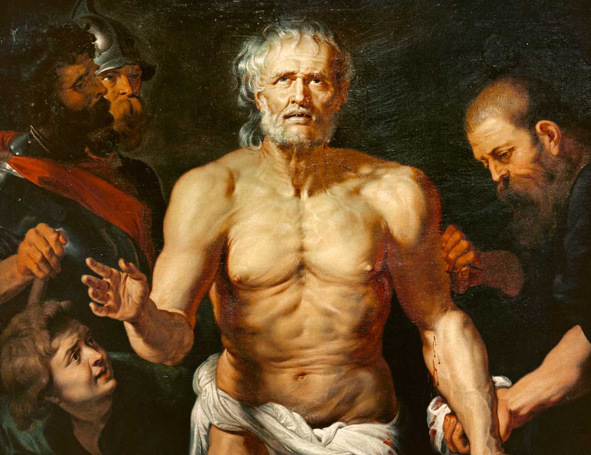

In a letter to his friend Lucilius, the ancient Roman philosopher Seneca (4 BCE - 65 CE) reflects on the following statement from the ancient Greek philosopher, Epicurus: 

>If you live according to nature, you will never be poor; if you live to please the opinions of others, you will never be rich.

Commenting on this observation, Seneca adds: 

>For nature has very few demands, whereas the tyranny of opinion is immense.

To illustrate this point, Seneca asks Lucilius to imagine what would occur if he inherited vast wealth:

>Suppose you inherit the estates of many rich men. Fortune carries you well beyond the normal limits of a private income and covers you with gold, clothes you in the finest purple, and brings you to such an apex of luxury and wealth that you can pave your land with marble till you not merely possess riches but actually walk on them. On top of this you have statues, paintings and the ultimate adornments of luxury that any of the arts can devise…

What might the result of all this wealth be? Would Lucilius find long-term happiness at last?

Probably not, Seneca writes. In fact:

>The only thing you will learn from all this will be to want still more.

Indeed, the problem with things like wealth and fame is that _they have no limit:_ there is always more popularity to secure; always more money to accumulate.

What seemed enough yesterday has simply reset today’s baseline: _we must have more._

As Seneca writes:

>The desires implanted by nature [i.e. for food, water, human connection] have a limit, but those born from false opinion have no way of reaching an end…

If we measure ourselves according to external status symbols, we will never be satisfied ― for where does it end? 

The upshot, then, is that if we are to possibly feel at peace in life, we cannot allow ourselves to be enslaved by desires that are impossible to fulfill.

“Pull yourself back from empty pursuits,” Seneca commands: 

>and if you want to know whether your ambitions stem from a natural desire or from some blind and trivial impulse, just ask whether they have a definite terminus. If, no matter how far you travel, there always seems to be some further place you need to reach, that is a sure sign that the desire is contrary to nature…

We must ask ourselves: what destination are we really trying to reach?

Might we be there already?

## Rather than be pulled along by unfulfillable desires, live now

Of course, we need money and resources to survive; Seneca is not denying this. His point is simply not to confuse ‘survive’ with ‘thrive’. 

If we have enough resources so that our natural desires (and those of our dependents) are reliably met, then why bother seeking more? What’s it all actually _for?_ 

If we dedicate our (only) lives to the accumulation of status and resources, we climb aboard a golden treadmill, frantically moving but not actually going anywhere. 

“The life of such people is always unfinished,” Seneca says, and:

>We cannot stand prepared for death if we are just beginning to live. We must instead make sure that we have already lived enough. And no one could think this about himself if he is forever involved in starting to live. You should not suppose that such people are few in number: almost everyone is like this. Indeed, they begin to live only when it is time to stop. If you think this strange, I will add something which will surprise you even more: some people leave off living before they have even begun…

If the purpose of philosophy is to prepare us for death, as many of the ancients thought, then we can view Seneca’s words as a challenge. 

Will we vainly, blindly strut upon the gilded treadmill of wealth and fame and resource accumulation, ever grasping forward but with no real destination in mind? 

Or will we climb off, and with eyes wide open, appreciate the richness, the beauty, the _joy_ of life that is right here before us, ready for us to claim it?

## What do you make of Seneca’s analysis?

- Do you agree that it is silly to chase desires that cannot be fulfilled? What about the desire for more knowledge? Or for more wisdom? Or human greatness? Isn’t ‘wanting more’ the drive for human progress? 
- Is it so easy to decouple our lives from the ‘tyranny of opinion’?
- If not chasing wealth, status, or success, how else might we spend our lives? What’s important for you in life?

## Learn more about Seneca’s Stoic philosophy

If you’re interested in learning more about how Seneca thought we could live good lives, <a target="_blank" rel="noopener noreferrer sponsored" href="http://www.amazon.com/gp/product/0140442103/ref=as_li_tl?ie=UTF8&tag=philosophybre-20&camp=1789&creative=9325&linkCode=as2&creativeASIN=0140442103&linkId=53524be7bd4e91403113c3e5494786ac">Letters from a Stoic</a> collects his most important and illuminating writings, and features on our list of [Stoicism’s best books](/reading-lists/stoicism/). 

You might also enjoy the following related reads:

- [Seneca On Coping with the Shortness of Life](/articles/seneca-on-coping-with-the-shortness-of-life/)
- [Byung-Chul Han’s Burnout Society: Our Only Imperative is to Achieve](/articles/byung-chul-han-burnout-society-our-only-imperative-is-to-achieve/)
- [The 4 Cardinal Virtues: Stoicism’s Roadmap to the Best Life Possible](/articles/four-cardinal-virtues-stoicism-roadmap-to-the-best-life-possible/)
- [The Dichotomy of Control: a Stoic Device for a Tranquil Mind](/articles/dichotomy-of-control-a-stoic-device-for-a-tranquil-mind/)
- [The Last Time Meditation: a Stoic Tool for Living in the Present](/articles/the-last-time-meditation-a-stoic-tool-for-living-in-the-present/)
- [Marcus Aurelius: To Live a Good Life, Practice Kindness](/articles/marcus-aurelius-to-live-a-good-life-practice-kindness/)
- [Epicureanism Defined: Philosophy is a Form of Therapy](/articles/epicureanism-defined-philosophy-is-a-form-of-therapy/)

Finally, if you enjoyed this article, you might like my free Sunday breakdown. I distill one piece of wisdom from philosophy each week; you get the summary delivered straight to your email inbox, and are invited to share your view. Consider joining 17,000+ subscribers and signing up below:

<!--big subscribe-->

    
    <h4>From the Buddha to Nietzsche: join 17,000+ subscribers enjoying my free Sunday Breakdown</h4>
    
In one concise email each Sunday, I break down a famous idea from philosophy. You get the distillation straight to your inbox.

    

        <form action="https://app.convertkit.com/forms/5812400/subscriptions" method="post" data-sv-form="5812400" data-uid="be0e52d3c0" data-format="inline" data-version="6" data-options="{&quot;settings&quot;:{&quot;after_subscribe&quot;:{&quot;action&quot;:&quot;message&quot;,&quot;success_message&quot;:&quot;Thank you, philosopher! Your welcome email will land in your inbox shortly.&quot;,&quot;redirect_url&quot;:&quot;https://philosophybreak.com/thank-you/&quot;},&quot;analytics&quot;:{&quot;google&quot;:null,&quot;fathom&quot;:null,&quot;facebook&quot;:null,&quot;segment&quot;:null,&quot;pinterest&quot;:null,&quot;sparkloop&quot;:null,&quot;googletagmanager&quot;:null},&quot;modal&quot;:{&quot;trigger&quot;:&quot;timer&quot;,&quot;scroll_percentage&quot;:null,&quot;timer&quot;:5,&quot;devices&quot;:&quot;all&quot;,&quot;show_once_every&quot;:15},&quot;powered_by&quot;:{&quot;show&quot;:false,&quot;url&quot;:&quot;https://convertkit.com/features/forms?utm_campaign=poweredby&amp;utm_content=form&amp;utm_medium=referral&amp;utm_source=dynamic&quot;},&quot;recaptcha&quot;:{&quot;enabled&quot;:false},&quot;return_visitor&quot;:{&quot;action&quot;:&quot;show&quot;,&quot;custom_content&quot;:&quot;&quot;},&quot;slide_in&quot;:{&quot;display_in&quot;:&quot;bottom_right&quot;,&quot;trigger&quot;:&quot;timer&quot;,&quot;scroll_percentage&quot;:null,&quot;timer&quot;:5,&quot;devices&quot;:&quot;all&quot;,&quot;show_once_every&quot;:15},&quot;sticky_bar&quot;:{&quot;display_in&quot;:&quot;top&quot;,&quot;trigger&quot;:&quot;timer&quot;,&quot;scroll_percentage&quot;:null,&quot;timer&quot;:5,&quot;devices&quot;:&quot;all&quot;,&quot;show_once_every&quot;:15}},&quot;version&quot;:&quot;6&quot;}" min-width="400 500 600 700 800">
        
<ul data-element="errors" data-group="alert"></ul>

            

                <input name="email_address" aria-label="Your Email Address..." placeholder="Your Email Address..." required type="email" />
            

            <button class="button primary" type="submit" data-element="submit">

<svg xmlns="http://www.w3.org/2000/svg" viewBox="0 0 512 512"><path d="M464 64H48C21.49 64 0 85.49 0 112v288c0 26.51 21.49 48 48 48h416c26.51 0 48-21.49 48-48V112c0-26.51-21.49-48-48-48zm0 48v40.805c-22.422 18.259-58.168 46.651-134.587 106.49-16.841 13.247-50.201 45.072-73.413 44.701-23.208.375-56.579-31.459-73.413-44.701C106.18 199.465 70.425 171.067 48 152.805V112h416zM48 400V214.398c22.914 18.251 55.409 43.862 104.938 82.646 21.857 17.205 60.134 55.186 103.062 54.955 42.717.231 80.509-37.199 103.053-54.947 49.528-38.783 82.032-64.401 104.947-82.653V400H48z"/></svg>Join 17,000+ Subscribers</button>
            

            

        </form>
        
💭 One short philosophical email each Sunday. Unsubscribe any time.

    

