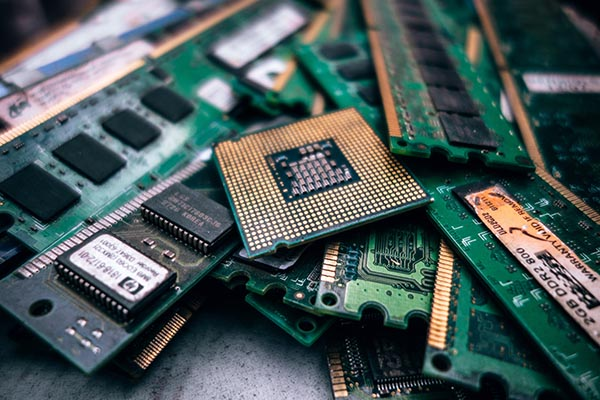

However unsettling, it’s a persuasive possibility that the world around us is not ‘real’ but simulated by a computer. In 2003, Nick Bostrom - a Swedish philosopher at the University of Oxford - posited [The Simulation Argument](https://www.simulation-argument.com/simulation.html), a compelling line of reasoning with a deeply unsettling conclusion.

Bostrom's conclusion suggests that, rather than the fun-loving carbon-based lifeforms we believe ourselves to be, we are in fact the artificial simulations of future civilizations, existent only as silicon chips in their data warehouses.

That might seem crazy. But consider this. [It’s widely agreed](http://www.visualcapitalist.com/visualizing-trillion-fold-increase-computing-power/) that our computational power will continue to grow exponentially. And, in principle, there’s no reason why - given the same computational structures and processes - consciousness cannot exist on silicon chip neural networks rather than the neural networks of carbon-based biological lifeforms (more on this later).

At some point, then, any issues surrounding technical capability will be overcome: we will one day be computationally advanced enough to, firstly, run human consciousness on silicon, and secondly, create simulations as rich as the one we (might) currently inhabit. Bostrom calls this level of technological advancement the ‘post-human’ stage.

Within this introductory context, Bostrom then argues that one of the following three statements <i>must</i> be true:

> 1\. The human species is very likely to go extinct before reaching a ‘post-human’ stage.  2. Any ‘post-human' civilization is extremely unlikely to run a significant number of simulations of their evolutionary history (or variations of it).  3. We are almost certainly living in a computer simulation.

The first statement is rather depressing. It essentially means that we’ll destroy ourselves before being sufficiently technologically advanced to create simulations of the required nature at all. So let’s be optimistic for a moment and discount it as false.

The likelihood of the second statement can also be called into question, considering the [sorts of worlds we’re already developing](https://virtualrealitytimes.com/2017/03/13/full-list-of-virtual-reality-worlds/) with virtual reality technology today.

If future anthropologists had the ability to recreate certain periods of human history and play them out, for example, why wouldn’t they?

So, if we discount the first two statements… well, where does that leave us?

>We are almost certainly living in a computer simulation.

If the first two statements are false, the reason we’re left with the unsettling conclusion that we're living in a simulation is that the chances of us - now - being the _original, first_ advanced civilization are, in the face of the countless simulations that future civilizations could run, staggeringly small. Far more likely, Bostrom argues, we are _already living_ in a virtual reality.

Before we go crazy and riot in the streets in the name of nothing-means-anything despair, however, let’s have a look at how we could possibly respond to Bostrom’s argument.

## Can human consciousness _really_ run on silicon?

Bostrom’s Simulation Argument is based on a key assumption of _substrate-independence_. Within the literature of philosophy of mind, substrate-independence refers to the idea that mental states can supervene on any physical system, provided that system implements the right sort of computational structures and processes.

In other words, conscious states don’t have to exist in carbon-based biological form. They could exist on, say, computer processors. This means - in theory - you could download human minds onto silicon microchips.

If this idea seems controversial, that’s because it is. Bostrom takes it for granted that, as our computational power grows, our knowledge regarding the human brain and consciousness will too - and it’ll simply be a case of replicating a brain through programming its secrets into a bit of software.

There are significant questions around whether or not technology could ever facilitate the necessary conditions for replicating human experience. Conscious, mental ‘stuff’ might simply be non-transferrable or irreconcilable to non-biological, physical ‘stuff’.

But, then again, if we’re currently living in a simulation, this is a moot point. They’ve already figured out how to do it.

## So, if we are in a simulation...?

If we accept the validity and soundness of The Simulation Argument - and while many don’t, some influential figures such as Elon Musk [very publicly do](https://www.independent.co.uk/life-style/gadgets-and-tech/news/elon-musk-ai-artificial-intelligence-computer-simulation-gaming-virtual-reality-a7060941.html) - what are the consequences?

Well, if we _are_ in a simulation, you could argue that nothing matters. We have no free will. We’re not even real.

But, you could also argue: who cares? Nothing mattered anyway, [we had no free will](/articles/free-will-illusion-sam-harris) anyway - and what _is_ real, anyway?

The possibility of being in a simulation shouldn’t really alter the way we live. We can reassure ourselves with [Descartes’s _cogito ergo sum_](/articles/hallucinating-with-descartes) - even if we live in a virtual world, at least we exist. It’s still our job to ascribe meaning to our lives.

If you wanted to get really tinfoil hat, you could even say that living in a simulation is almost comforting.

Who knows, whoever’s running the simulation might be testing us in this virtual life, before porting our consciousness onto some crazy new amazing place where everyone is good and everything is amazing. Or some terrible place full of fire and demons.

Sound familiar?

If you’re weary with existential confusion and fear, don’t worry. Perhaps we can turn to the closing words of Bostrom’s essay for some comfort:

>"Unless we are now living in a simulation, our descendants will almost certainly never run an ancestor‐simulation."

Oh. Perhaps not.