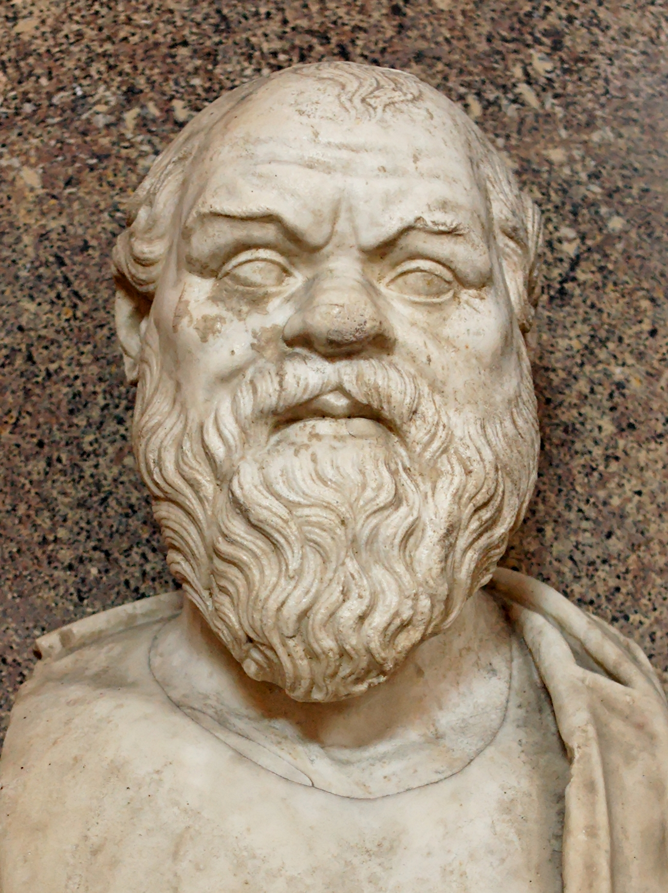

Socrates is philosophy’s martyr. Sentenced to death in 399BC Athens for ‘corrupting the minds of the youth,’ Socrates never wrote anything down. We know of his thinking only through the writings of his contemporaries, particularly his student Plato. ⁣

[Plato’s Socratic dialogues](http://www.amazon.com/gp/search?ie=UTF8&tag=philosophybre-20&linkCode=ur2&linkId=d76afcbb3930456671a7e40bb4bf0372&camp=1789&creative=9325&index=books&keywords=plato) feature Socrates in lively conversation on a wide range of subjects, from justice and virtue to art and politics. The central theme in his thinking, however, concerned the nature of knowledge - specifically, on how none of us really have any. As a statement often attributed to Socrates puts it:

>True wisdom comes to each of us when we realize how little we understand about life, ourselves, and the world around us.⁣

During Socrates's life, the Oracle of Delphi proclaimed him the wisest of all people. Socrates, regularly declaring ignorance as he did, could not agree. He therefore set out on a quest to find someone wiser to prove the Oracle wrong.

## Why? But why? But why?

Socrates approached influential Athenians considered wise by the people of the day - statesmen, poets, and teachers. He conversed with these individuals using what is now known as the Socratic method: a form of argumentative dialogue that uses incisive questioning to stimulate critical thinking and draw out presuppositions. 

A more straightforward way to think about the Socratic method is to imagine a petulant child asking ‘why’ after every single explanation an adult offers - though Socrates, of course, was not a petulant child but a famously ugly adult male.

By using his method of bottomless questioning, Socrates soon discovered that, in fact, nobody really knew anything about anything they claimed to know. He thus concludes, as reported in [Plato's Apology](http://www.amazon.com/gp/product/0140449280/ref=as_li_tl?ie=UTF8&camp=1789&creative=9325&creativeASIN=0140449280&linkCode=as2&tag=philosophybre-20&linkId=816a23479cf93ae4636655c4aa3e6863), that the Oracle might be right:⁣

>For my part, as I went away, I reasoned with regard to myself: I am wiser than this human being. For probably neither of us knows anything noble and good, but he supposes he knows something when he does not know, while I, just as I do not know, do not even suppose that I do. I am likely to be a little bit wiser than he in this very thing: that whatever I do not know, I do not even suppose I know.⁣

In other words, Socrates believes himself to be wiser than those he speaks to because, unlike them, he admits his ignorance. This thought is encapsulated by the paradoxical statement:

>I know that I know nothing.⁣

Known as the Socratic paradox, this phrase is not one that Socrates is recorded as saying, but thought to be derived from the passage in [Plato's Apology](http://www.amazon.com/gp/product/0140449280/ref=as_li_tl?ie=UTF8&camp=1789&creative=9325&creativeASIN=0140449280&linkCode=as2&tag=philosophybre-20&linkId=816a23479cf93ae4636655c4aa3e6863) outlined above. 

Regardless, it's a significant statement for epistemology, the branch of philosophy concerned with the theory of knowledge. Socrates's discussions over two thousand years ago set in motion the profound doubting, the uncertainty as to what we can know, that came to the fore with [Descartes's _cogito ergo sum_](/articles/hallucinating-with-descartes/). 

## Annoying people to death

Socrates’s failure to find anyone wiser than himself, though perhaps noble in its pursuit of knowledge, made a lot of powerful people in Athens look very foolish. Death is a harsh punishment, but it is perhaps not surprising that authority figures wanted Socrates silenced.

Plato’s [The Last Days of Socrates](http://www.amazon.com/gp/product/0140449280/ref=as_li_tl?ie=UTF8&camp=1789&creative=9325&creativeASIN=0140449280&linkCode=as2&tag=philosophybre-20&linkId=816a23479cf93ae4636655c4aa3e6863), which includes dialogues covering Socrates’s imprisonment, trial, and death, reveals how Socrates went on annoying his accusers until the very end, with wonderful expositions on justice, piety, and the value of questioning what we know. 

Blackson's [Ancient Greek Philosophy](http://www.amazon.com/gp/product/1444335731/ref=as_li_tl?ie=UTF8&camp=1789&creative=9325&creativeASIN=1444335731&linkCode=as2&tag=philosophybre-20&linkId=f4805b14f023c0d6963bc982b21c14ce), meanwhile, brilliantly contextualizes Socrates by analyzing the philosophers who came before, during, and after: it's essential reading for anyone interested in Ancient Greek philosophy.

Everything we know about Socrates, depicted as he is through the writings of others, must be taken with a pinch of salt. Nonetheless, his legacy as the martyr of philosophy remains secure, decorated by an epitaph of his own making: 

>The unexamined life is not worth living. ⁣