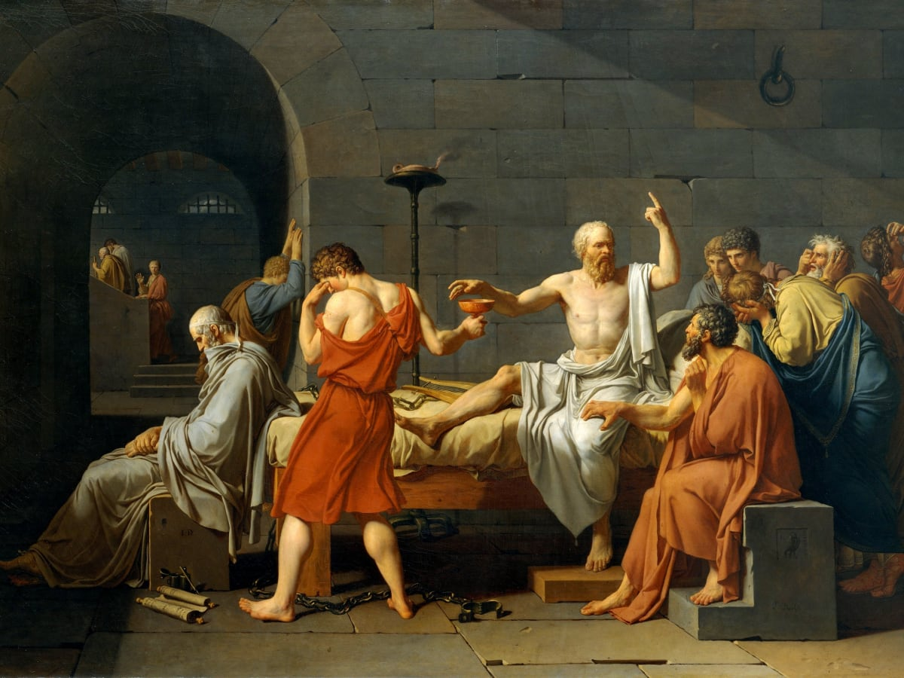

The Socratic method is a form of cooperative dialogue whereby participants make assertions about a particular topic, investigate those assertions with questions designed to uncover presuppositions and stimulate critical thinking, and finally come to mutual agreement and understanding about the topic under discussion. 

In more formal educational settings, the Socratic method is harnessed by teachers to ‘draw out’ knowledge from students. The teacher does not directly impart knowledge, but asks probing, thought-provoking questions to kickstart a dialogue between teacher and student, allowing students to formulate answers and principles for themselves. 

As Stanford University comment in [an issue of their Speaking of Teaching newsletter](https://tomprof.stanford.edu/posting/810):

>The Socratic method uses questions to examine the values, principles, and beliefs of students. Through questioning, the participants strive first to identify and then to defend their moral intuitions about the world which undergird their ways of life. Socratic inquiry deals not with producing a recitation of facts... but demands rather that the participants account for themselves, their thoughts, actions, and beliefs... Socratic inquiry aims to reveal the motivations and assumptions upon which students lead their lives.

Proponents of the Socratic method argue that, by coming to answers themselves, students better remember both the answer and the logical reasoning that led them there than they would if someone had simply announced a conclusion up front. Furthermore, people are generally more accepting of views they’ve come to based on their own rational workings. 

The great philosopher Bertrand Russell once commented, “As usual in philosophy, the first difficulty is to see that the problem is difficult.” Being an inquisitive dialogue, the Socratic method is particularly effective here, revealing hidden subtleties and complexities in subjects that may otherwise appear obvious or simple, such as [whether the world around us is ‘real’](/articles/is-the-world-around-us-real/). 

Apply the Socratic method to such a subject, and participants quickly discover how difficult it is to establish a solid answer. This is a good outcome, Russell thinks, for informed skepticism has replaced uninformed conviction — or, as he puts it, “the net result is to substitute articulate hesitation for inarticulate certainty.”

As such, the Socratic method is at its most effective when applied to topics about which people hold deep convictions, such as questions on [ethics](/reading-lists/ethics-and-morality/), value, [politics](/reading-lists/political-philosophy/), and how to live. 

After just a little probing on the foundations of our convictions on such topics, we learn that what may have appeared simple is in fact a very complicated issue mired in difficulty, uncertainty, and nuance — and that our initial convictions might be less justified than we first thought. 

## Why is it called the Socratic method?

The Socratic method derives its name from the conversational technique of ancient Greek philosopher Socrates, as presented in his student Plato’s dialogues written between 399 BC and 347 BC. The son of a midwife, Socrates draws parallels between his method and midwifery. In [Plato’s dialogue Theaetetus](http://www.amazon.com/gp/product/0915144816/ref=as_li_tl?ie=UTF8&tag=philosophybre-20&camp=1789&creative=9325&linkCode=as2&creativeASIN=0915144816&linkId=f2329e902542711d0c4006f84da94f7e), Socrates states:

>The only difference [between my trade and that of midwives] is… my concern is not with the body but with the soul that is experiencing birth pangs. And the highest achievement of my art is the power to try by every test to decide whether the offspring of a young person’s thought is a false phantom or is something imbued with life and truth.

Socrates’s approach of sometimes relentless inquiry differed to the teachers in ancient Athens at the time, known as the Sophists, who went for the more conventional ‘sage on a stage’ educational method, trying to persuade people round to their viewpoints on things through impressive presentation and rhetoric. 

This distinction in approach made Socrates somewhat of a celebrity of contrarian thought. While the Sophists tried to demonstrate their knowledge, Socrates did his best to demonstrate his (and everybody else’s) ignorance. His guiding principle was that we know nothing — and so, as W. K. C. Guthrie argues in [The Greek Philosophers](http://www.amazon.com/gp/product/0061310085/ref=as_li_tl?ie=UTF8&tag=philosophybre-20&camp=1789&creative=9325&linkCode=as2&creativeASIN=0061310085&linkId=989dfd27b4929d53dd18e6e17715c30d), the Socratic method was for Socrates as much a device for establishing ignorance as it was establishing knowledge. 

    <h4>Philosophy in Your Twitter Feed</h4>
    
Follow Philosophy Break on Twitter to get philosophy's best questions, wisdom, and ideas directly in your Twitter feed.

    <a target="_blank" rel="noopener noreferrer" class="button secondary" href="https://twitter.com/philosophybreak"><svg xmlns="http://www.w3.org/2000/svg" viewBox="0 0 512 512"><path d="M459.37 151.716c.325 4.548.325 9.097.325 13.645 0 138.72-105.583 298.558-298.558 298.558-59.452 0-114.68-17.219-161.137-47.106 8.447.974 16.568 1.299 25.34 1.299 49.055 0 94.213-16.568 130.274-44.832-46.132-.975-84.792-31.188-98.112-72.772 6.498.974 12.995 1.624 19.818 1.624 9.421 0 18.843-1.3 27.614-3.573-48.081-9.747-84.143-51.98-84.143-102.985v-1.299c13.969 7.797 30.214 12.67 47.431 13.319-28.264-18.843-46.781-51.005-46.781-87.391 0-19.492 5.197-37.36 14.294-52.954 51.655 63.675 129.3 105.258 216.365 109.807-1.624-7.797-2.599-15.918-2.599-24.04 0-57.828 46.782-104.934 104.934-104.934 30.213 0 57.502 12.67 76.67 33.137 23.715-4.548 46.456-13.32 66.599-25.34-7.798 24.366-24.366 44.833-46.132 57.827 21.117-2.273 41.584-8.122 60.426-16.243-14.292 20.791-32.161 39.308-52.628 54.253z"/></svg>Follow Philosophy Break</a>

Indeed, Plato presents Socrates approaching various influential thinkers from ancient Athenian society and discussing many different subjects with them, including justice, [knowledge](/reading-lists/epistemology/), beauty, and what it means to live a good life. 

Typically the interlocutor in discussion with Socrates begins by making a confident, seemingly self-evident assertion about a particular topic. Socrates then asks them questions about said topic, wrapping them in a tangled web of contradictions and false presuppositions, before concluding that the assertion that began the discussion is hopelessly misguided. 

Given this consistent outcome of most if not all of Plato’s dialogues, some have questioned whether Socrates himself actually provides an effective template for the Socratic method as we know it today, in that while the illusion of cooperative dialogue is present, the conversations are largely dominated by Socrates picking apart the views of others. 

## Was Socrates’s method successful?

The purpose of Socrates’s questioning was usually to jolt people out of their presuppositions and assumptions, and most of Plato’s dialogues end with Socrates kindly declaring the ignorance or even stupidity of those he spoke to. [The only knowledge available to us, Socrates assures us, is knowing that we know nothing](/articles/socrates-and-the-socratic-paradox-i-know-that-i-know-nothing/).

Socrates’s apparent victories in the name of reason and logic, while hugely entertaining and intellectually stimulating for the reader today, led to many important people in ancient Athens getting rather annoyed. Alas, Socrates was sentenced to death for corrupting the minds of the youth — but went on annoying his accusers til the very end with a wondrous exposition on piety and death, as recorded in a collection of Plato’s dialogues, [The Trial and Death of Socrates](http://www.amazon.com/gp/product/0872205541/ref=as_li_tl?ie=UTF8&tag=philosophybre-20&camp=1789&creative=9325&linkCode=as2&creativeASIN=0872205541&linkId=90955dbaab2985a7487b0d2c4ed767a0).

Following Socrates’s death, Plato continued to write dialogues featuring Socrates as the protagonist in honor of his great teacher. This has led to lively discussion around how much of the Socrates featured in Plato’s dialogues represents Socrates, and how much he represents Plato. Regardless, [Plato’s dialogues](http://www.amazon.com/gp/product/0872203492/ref=as_li_tl?ie=UTF8&tag=philosophybre-20&camp=1789&creative=9325&linkCode=as2&creativeASIN=0872203492&linkId=8901486cfbee73226648b5e5d6bb3319) — written over 2,000 years ago — are wondrous, and we are lucky to have them. 

## How can you use the Socratic method today?

Though things ended rather morbidly for Socrates, his method of questioning has evolved and lived on as a brilliant way to draw people out of ignorance, encourage critical thinking, and cooperate in the pursuit of knowledge. Socrates is a martyr not just for philosophy, but for educational dialogue and productive, stimulating exchanges of different perspectives around interesting subjects of all kinds. 

Any time you ask questions to get people to think differently about things, any time you participate in healthy, productive debate or problem solving, any time you examine principles and presuppositions and come to an answer for yourself, you channel the same principles Socrates championed all those years ago.

    <h4>How Should We Approach Life?</h4>
    
Get philosophy's best answers delivered direct to your inbox with our celebrated introduction to philosophy course.

    <a class="button secondary" href="/lifes-big-questions/"><svg xmlns="http://www.w3.org/2000/svg" viewBox="0 0 512 512"><path d="M504 256C504 119 393 8 256 8S8 119 8 256s111 248 248 248 248-111 248-248zm-448 0c0-110.5 89.5-200 200-200s200 89.5 200 200-89.5 200-200 200S56 366.5 56 256zm72 20v-40c0-6.6 5.4-12 12-12h116v-67c0-10.7 12.9-16 20.5-8.5l99 99c4.7 4.7 4.7 12.3 0 17l-99 99c-7.6 7.6-20.5 2.2-20.5-8.5v-67H140c-6.6 0-12-5.4-12-12z"/></svg>Learn More</a>

People tend to assent to uncomfortable conclusions more when they’ve done the reasoning and come to the answer themselves. This and a host of other benefits is why the Socratic method is still modelled by many educational institutions today: students are not told ‘what’ to think, but shown ‘how’ to think by being supplied with thoughtful questions rather than straight answers.  

So, next time you’re locked in an argument with someone, or looking to inform an audience about a subject you’re experienced in, remember Socrates and the brilliant tradition of respecting different viewpoints, digging out presuppositions, and working together to find an answer. 

## Further reading

If you’re interested in learning more about Socrates, reason, logic, or philosophy generally, then check out our [introduction to philosophy reading list](/reading-lists/introduction-to-philosophy/). It features the best five general introductions to philosophy. Remember, Socrates died for the right to use logic and reasoning to come to our own conclusions about things — studying philosophy sets you on that path! To access the reading list, hit the banner below now. 

<a class="reading-list cta" href="/reading-lists/introduction-to-philosophy/">
    
    

    

        <svg xmlns="http://www.w3.org/2000/svg" viewBox="0 0 576 512"><path fill="#fff" d="M542.22 32.05c-54.8 3.11-163.72 14.43-230.96 55.59-4.64 2.84-7.27 7.89-7.27 13.17v363.87c0 11.55 12.63 18.85 23.28 13.49 69.18-34.82 169.23-44.32 218.7-46.92 16.89-.89 30.02-14.43 30.02-30.66V62.75c.01-17.71-15.35-31.74-33.77-30.7zM264.73 87.64C197.5 46.48 88.58 35.17 33.78 32.05 15.36 31.01 0 45.04 0 62.75V400.6c0 16.24 13.13 29.78 30.02 30.66 49.49 2.6 149.59 12.11 218.77 46.95 10.62 5.35 23.21-1.94 23.21-13.46V100.63c0-5.29-2.62-10.14-7.27-12.99z"/></svg>READING LIST
        

        <h3>An Introduction to Philosophy</h3>
        
The Top 5 Books to Read

    
    
    <svg class="cta swing" xmlns="http://www.w3.org/2000/svg" viewBox="0 0 320 512"><path d="M285.476 272.971L91.132 467.314c-9.373 9.373-24.569 9.373-33.941 0l-22.667-22.667c-9.357-9.357-9.375-24.522-.04-33.901L188.505 256 34.484 101.255c-9.335-9.379-9.317-24.544.04-33.901l22.667-22.667c9.373-9.373 24.569-9.373 33.941 0L285.475 239.03c9.373 9.372 9.373 24.568.001 33.941z"/></svg>
</a>