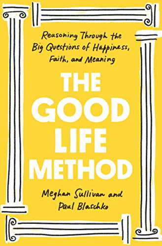

<i><a target="_blank" rel="noopener noreferrer" href="https://meghansullivan.org/">Meghan Sullivan</a> is the Wilsey Family Collegiate Professor of Philosophy at the University of Notre Dame. She serves as Director of the NDIAS, a university-wide research institute based in Notre Dame Research. The NDIAS promotes issue-engaged, inclusive, and interdisciplinary study of questions that affect our ability to lead valuable, meaningful lives. 

<a target="_blank" rel="noopener noreferrer" href="http://www.paulblaschko.com/">Paul Blaschko</a> is an assistant teaching professor at the University of Notre Dame where he teaches about <a target="_blank" rel="noopener noreferrer" href="https://workinglife.nd.edu/">work</a> and <a target="_blank" rel="noopener noreferrer" href="https://godandgoodlife.nd.edu/">the good life</a>. He leads a program on work and the liberal arts in the College of Arts and Letters, and produces public-facing philosophy on <a target="_blank" rel="noopener noreferrer" href="https://www.youtube.com/channel/UCxgkx_t6mkkBE-iN_MUyaTg">YouTube</a> and <a target="_blank" rel="noopener noreferrer" href="https://www.tiktok.com/@profblaschko?lang=en">TikTok</a>.

We caught up with Meghan and Paul about the value of philosophy and the story behind their new book, <a target="_blank" rel="noopener noreferrer sponsored" href="http://www.amazon.com/gp/product/1984880306/ref=as_li_tl?ie=UTF8&tag=philosophybre-20&camp=1789&creative=9325&linkCode=as2&creativeASIN=1984880306&linkId=cc4750f78af3e98220edece473548dcf">The Good Life Method</a>.</i>

## What is the definition of philosophy, from your perspectives? 

<b>Paul:</b> When my five-year-old son asked me this a few months back, I told him that philosophy is “thinking hard about everything,” and I pretty much stand by that definition. Philosophy is many different things — an academic discipline, a tradition with a particular cultural history — but something that shows up anytime people are “doing philosophy” is this commitment to subject our beliefs to critical and rigorous modes of thinking. [Socrates did this](/articles/socratic-method-what-is-it-how-can-you-use-it/) by wandering around the public square in ancient Greece asking people deep questions about the nature of love, justice, and virtue. Today we do this in classrooms or on YouTube or around the dinner table with people we love. If you’re motivated by a love of truth, and you’re willing to think hard in whatever direction the evidence leads, I’d say you’re doing philosophy.

>Philosophy gives us tools and a common language for working together to pursue the truth... I think we need it more than ever to try to rekindle meaning in our lives.

<b>Meghan:</b> I love this metaphor of “joining up the circles” that some of the ancients use to describe philosophy. Philosophy is a way of living your life, where you try to make your knowledge of the world and your goals coherent. Professional philosophers are people who are especially skilled at noticing fissures and gaps in our ways of thinking and presenting us with new options for how to connect and clarify. No topics are too practical or too abstract for needing this philosophical treatment, and life is constantly dealing us new challenges that call out for understanding.

## Why do you think learning about philosophy or philosophical ideas is important today?

<b>Meghan:</b> Modern folks seem to feel more stressed than ever talking with other people about topics like what we ought to believe, what’s worth being committed to, how to care for other people. It can feel like Idea Wars. But it is human nature to wonder about such issues — thinking about these questions is part of what makes our lives meaningful. Philosophy gives us tools and a common language for working together to pursue the truth on these kinds of questions. I think we need it more than ever to try to rekindle meaning in our lives.

<b>Paul:</b> Philosophy can help free us from misconceptions about ourselves, and from some of our most persistent worries. One example of this comes to us from [the Stoics](/reading-lists/stoicism/), who noticed that we tend to become very invested in “worldly goods” like money, power, and even health. But these are things that can be taken away from us in an instant, and we really don’t have as much control over them as we might like to think. Luckily, in their view, these aren’t what we should be building our lives around anyway. By refocusing on virtue, on the way we react to changes in our life, we can bring our mind back to what really matters. This process, which they see as a kind of philosophical meditation, can put our anxious minds at ease, and can help us “detach” from things we really can’t control anyway. 

<!--big subscribe-->

    
    <h4>Get one mind-opening philosophical idea delivered to your inbox every Sunday (free):</h4>
    

        <form action="https://app.convertkit.com/forms/5812400/subscriptions" method="post" data-sv-form="5812400" data-uid="be0e52d3c0" data-format="inline" data-version="5" data-options="{&quot;settings&quot;:{&quot;after_subscribe&quot;:{&quot;action&quot;:&quot;redirect&quot;,&quot;success_message&quot;:&quot;Success! Now check your email to confirm your subscription.&quot;,&quot;redirect_url&quot;:&quot;https://philosophybreak.com/thank-you/&quot;},&quot;analytics&quot;:{&quot;google&quot;:null,&quot;fathom&quot;:null,&quot;facebook&quot;:null,&quot;segment&quot;:null,&quot;pinterest&quot;:null,&quot;sparkloop&quot;:null,&quot;googletagmanager&quot;:null},&quot;modal&quot;:{&quot;trigger&quot;:&quot;timer&quot;,&quot;scroll_percentage&quot;:null,&quot;timer&quot;:5,&quot;devices&quot;:&quot;all&quot;,&quot;show_once_every&quot;:15},&quot;powered_by&quot;:{&quot;show&quot;:false,&quot;url&quot;:&quot;https://convertkit.com/features/forms?utm_campaign=poweredby&amp;utm_content=form&amp;utm_medium=referral&amp;utm_source=dynamic&quot;},&quot;recaptcha&quot;:{&quot;enabled&quot;:false},&quot;return_visitor&quot;:{&quot;action&quot;:&quot;show&quot;,&quot;custom_content&quot;:&quot;&quot;},&quot;slide_in&quot;:{&quot;display_in&quot;:&quot;bottom_right&quot;,&quot;trigger&quot;:&quot;timer&quot;,&quot;scroll_percentage&quot;:null,&quot;timer&quot;:5,&quot;devices&quot;:&quot;all&quot;,&quot;show_once_every&quot;:15},&quot;sticky_bar&quot;:{&quot;display_in&quot;:&quot;top&quot;,&quot;trigger&quot;:&quot;timer&quot;,&quot;scroll_percentage&quot;:null,&quot;timer&quot;:5,&quot;devices&quot;:&quot;all&quot;,&quot;show_once_every&quot;:15}},&quot;version&quot;:&quot;5&quot;}" min-width="400 500 600 700 800">
        
<ul data-element="errors" data-group="alert"></ul>

            

                <input name="email_address" aria-label="Your Email Address..." placeholder="Your Email Address..." required type="email" />
            

            <button class="button primary" type="submit" data-element="submit">

<svg xmlns="http://www.w3.org/2000/svg" viewBox="0 0 512 512"><path d="M464 64H48C21.49 64 0 85.49 0 112v288c0 26.51 21.49 48 48 48h416c26.51 0 48-21.49 48-48V112c0-26.51-21.49-48-48-48zm0 48v40.805c-22.422 18.259-58.168 46.651-134.587 106.49-16.841 13.247-50.201 45.072-73.413 44.701-23.208.375-56.579-31.459-73.413-44.701C106.18 199.465 70.425 171.067 48 152.805V112h416zM48 400V214.398c22.914 18.251 55.409 43.862 104.938 82.646 21.857 17.205 60.134 55.186 103.062 54.955 42.717.231 80.509-37.199 103.053-54.947 49.528-38.783 82.032-64.401 104.947-82.653V400H48z"/></svg>Join 6,500+ Subscribers</button>
            

            

        </form>
        
One short email per week. Unsubscribe any time.

    

## What would be your response to someone who dismisses philosophy as boring, outdated, or unimportant? 

<b>Meghan:</b> I bet they don’t realize how much philosophy they already do on a daily basis. Say you are trying to figure out whether this is the year to tell your child “the truth” about Santa Claus, but you aren’t exactly sure how to explain the difference between faith, lies and myths. Or suppose you are thinking about quitting your job, but you are worried that you owe it to your co-workers to stick it out. Or suppose you wonder if there are better or worse ways to relax. These are, at their root, questions about [epistemology](/reading-lists/epistemology/), contemplation, and [ethics](/reading-lists/ethics-and-morality/). And knowing a bit of philosophy will get you much more interesting and useful answers. It will also make you better at giving advice to your loved ones on parenting, work-life, and vacations.

>Philosophers have thought about all kinds of different topics in all kinds of different ways, and if you haven’t been struck by any of them yet, my guess is you just haven’t met your philosophical soulmate.

<b>Paul:</b> One of the lovely things about philosophy is that it’s such an expansive tradition, and it has such a rich history, that there’s really something for everyone. Think of it like the world’s biggest and most interesting dinner party. If you’re not into Saint Thomas Aquinas’s systematic, exhaustive treatment of the nature of God, you can dismiss yourself and walk into another room where [Hannah Arendt](/reading-lists/hannah-arendt/) and Martin Heidegger are debating the nature of death and authenticity. If that’s not your thing, you can find Augustine conversing about the nature of love, or you might want to meet my friend Elizabeth Anscombe to talk about Catholicism and radical critiques of violence in the twenty-first century. Philosophers have thought about all kinds of different topics in all kinds of different ways, and if you haven’t been struck by any of them yet, my guess is you just haven’t met your philosophical soulmate.

## What can ancient thinkers like Aristotle teach us about our fast-paced modern lives of work and burnout?

<b>Meghan:</b> In his book on community life, <a target="_blank" rel="noopener noreferrer sponsored" href="http://www.amazon.com/gp/product/0199538735/ref=as_li_tl?ie=UTF8&tag=philosophybre-20&camp=1789&creative=9325&linkCode=as2&creativeASIN=0199538735&linkId=8b38717d791a65e22e1a7b110f2a5fad">The Politics</a>, Aristotle warns us that once we start trading with each other in the marketplace, the temptation will be to measure the good life in terms of “getting goods”. The modern analogue of this is measuring the value of your work — or worse, your life — by your salary, by how much you produce, by how much more your team has than other guys. We will never be satisfied in such a system. We’d do so much better (and the busy bee Greeks knew this as well) to focus on finding ways to connect our modern workplaces to this constant human need for eudaimonia.  

<b>Paul:</b> One of the really striking philosophical ideas to come down to us from Aristotle is the idea that even though we tend to live very active lives, we’re actually creatures that are ultimately built for contemplation. If you think about what separates us from all other animals, it’s — at least in part — our ability to consciously think, reflect on our lives, and intentionally direct those lives in accord with our vision of what’s good. To put things anachronistically, Aristotle predicted that lives of pure action would bottom out in meaninglessness and vanity. We’ll eventually run out of meaningful goals to achieve, or we’ll lose the capacity to achieve things at all. And that’s because action just never comes to a satisfying conclusion. At the very end of <a target="_blank" rel="noopener noreferrer sponsored" href="http://www.amazon.com/gp/product/0199213615/ref=as_li_tl?ie=UTF8&tag=philosophybre-20&camp=1789&creative=9325&linkCode=as2&creativeASIN=0199213615&linkId=f18186fee7d024481a9574760906cea9">The Nicomachean Ethics</a>, Aristotle puts this point almost poetically, when he says “we must, so far as we can, make ourselves immortal, and strain every nerve to live in accordance with the best thing in us.”

## How can philosophy help us reconcile ‘the good life’ with suffering, loss, and death?

<b>Meghan:</b> Suffering, loss, and death are challenges to the good life, no doubt. We cannot predict which kinds of suffering and loss we will have to face, or even when death will come. Philosophy can help us in at least three ways. First, it can help us understand what we are and are not responsible for, and that responsibility will guide us in understanding how we feel about loss and how we will understand its meaning in the context of the rest of our lives. Second, philosophy can help us develop virtues like courage, love, and faith before we need such traits to carry us through a challenging time. Finally thinking philosophically about death — what it will mean, what you hope for after this life — will often clarify what really matters to you in this life.   

<!--small subscribe-->

    <h4>Enjoying this article? Get one like it delivered to your inbox every Sunday (free)</h4>
    
Every Sunday, I break down one mind-opening idea from philosophy. You get the distillation straight to your inbox.

    

        <form action="https://app.convertkit.com/forms/5812400/subscriptions" method="post" data-sv-form="5812400" data-uid="be0e52d3c0" data-format="inline" data-version="5" data-options="{&quot;settings&quot;:{&quot;after_subscribe&quot;:{&quot;action&quot;:&quot;redirect&quot;,&quot;success_message&quot;:&quot;Success! Now check your email to confirm your subscription.&quot;,&quot;redirect_url&quot;:&quot;https://philosophybreak.com/thank-you/&quot;},&quot;analytics&quot;:{&quot;google&quot;:null,&quot;fathom&quot;:null,&quot;facebook&quot;:null,&quot;segment&quot;:null,&quot;pinterest&quot;:null,&quot;sparkloop&quot;:null,&quot;googletagmanager&quot;:null},&quot;modal&quot;:{&quot;trigger&quot;:&quot;timer&quot;,&quot;scroll_percentage&quot;:null,&quot;timer&quot;:5,&quot;devices&quot;:&quot;all&quot;,&quot;show_once_every&quot;:15},&quot;powered_by&quot;:{&quot;show&quot;:false,&quot;url&quot;:&quot;https://convertkit.com/features/forms?utm_campaign=poweredby&amp;utm_content=form&amp;utm_medium=referral&amp;utm_source=dynamic&quot;},&quot;recaptcha&quot;:{&quot;enabled&quot;:false},&quot;return_visitor&quot;:{&quot;action&quot;:&quot;show&quot;,&quot;custom_content&quot;:&quot;&quot;},&quot;slide_in&quot;:{&quot;display_in&quot;:&quot;bottom_right&quot;,&quot;trigger&quot;:&quot;timer&quot;,&quot;scroll_percentage&quot;:null,&quot;timer&quot;:5,&quot;devices&quot;:&quot;all&quot;,&quot;show_once_every&quot;:15},&quot;sticky_bar&quot;:{&quot;display_in&quot;:&quot;top&quot;,&quot;trigger&quot;:&quot;timer&quot;,&quot;scroll_percentage&quot;:null,&quot;timer&quot;:5,&quot;devices&quot;:&quot;all&quot;,&quot;show_once_every&quot;:15}},&quot;version&quot;:&quot;5&quot;}" min-width="400 500 600 700 800">
        
<ul data-element="errors" data-group="alert"></ul>

            

                <input name="email_address" aria-label="Your Email Address..." placeholder="Your Email Address..." required type="email" />
            

            <button class="button primary" type="submit" data-element="submit">

<svg xmlns="http://www.w3.org/2000/svg" viewBox="0 0 512 512"><path d="M464 64H48C21.49 64 0 85.49 0 112v288c0 26.51 21.49 48 48 48h416c26.51 0 48-21.49 48-48V112c0-26.51-21.49-48-48-48zm0 48v40.805c-22.422 18.259-58.168 46.651-134.587 106.49-16.841 13.247-50.201 45.072-73.413 44.701-23.208.375-56.579-31.459-73.413-44.701C106.18 199.465 70.425 171.067 48 152.805V112h416zM48 400V214.398c22.914 18.251 55.409 43.862 104.938 82.646 21.857 17.205 60.134 55.186 103.062 54.955 42.717.231 80.509-37.199 103.053-54.947 49.528-38.783 82.032-64.401 104.947-82.653V400H48z"/></svg>Join 6,500+ Subscribers</button>
            

            

        </form>
        
One short email per week. Unsubscribe any time.

    

<b>Paul:</b> I’ve been thinking about suffering from lots of different philosophical angles for years now. In college, I always thought that the problem of suffering, or the “problem of evil,” was one of the biggest problems for religious belief. How can an all good, all powerful God allow the kind of suffering we see in the world? But I always bristled at the way philosophers would try to deal with this problem — quantifying pain or nit-picking about what counts as “gratuitous” suffering. Still, I figured the arguments were more or less good. But then I encountered some real suffering when my son was born. He had a cyst in his mouth, and we initially weren’t sure if he was going to survive delivery. After he did, we were sent to a children’s hospital to await testing to see if it was a malignant tumor of some sort. In that experience, it was actually a different wisdom tradition — the book of Job, and Ecclesiastes — that spoke loudest to me. In these texts, suffering is seen as a part of an incomprehensibly vast universe. There are parallels with the Stoics, actually, in the way that the cosmos is described by God to Job as he shows him stars collapsing and unimaginably large creatures in the sea. That encounter helped me to appreciate the perspective we need to take when thinking philosophically about suffering and death, and it helped me see the philosophical continuity in several different philosophical traditions I’d never connected before.

## Why did you write your new book, The Good Life Method, and what do you hope to achieve with it?

<b>Meghan:</b> We love philosophy, especially sharing these conversations with our students, co-workers, and families. I hope folks will read this book and be inspired to try to take up a philosophical habit as a result. Maybe you will start asking more surprising questions at dinner parties. Maybe you will learn how to tell a new story about an episode in your life, one that is more morally revealing and interesting. Maybe it will shape how you read the news, noticing more of the big existential questions behind the crisis of the week. I hope you read the book and start seeing questions of virtue ethics in particular everywhere.

<b>Paul:</b> The book is based on a course we teach at Notre Dame called God and the Good Life, and my hope is that readers will become as enthusiastic about philosophy as many of our students. My own encounter with philosophy has been so transformative over the years that I’m overjoyed every time I see a student, friend, or family member open up to it. I also hope we can introduce readers to some of the great, lesser known thinkers from the history of philosophy, and inspire them to take a deeper look at some of their best ideas.

&nbsp;

<i>You can order Meghan and Paul’s new book <a target="_blank" rel="noopener noreferrer sponsored" href="http://www.amazon.com/gp/product/1984880306/ref=as_li_tl?ie=UTF8&tag=philosophybre-20&camp=1789&creative=9325&linkCode=as2&creativeASIN=1984880306&linkId=cc4750f78af3e98220edece473548dcf">The Good Life Method here</a>, or simply hit the banner below.</i>

    <a target="_blank" rel="noopener noreferrer sponsored" href="http://www.amazon.com/gp/product/1984880306/ref=as_li_tl?ie=UTF8&tag=philosophybre-20&camp=1789&creative=9325&linkCode=as2&creativeASIN=1984880306&linkId=cc4750f78af3e98220edece473548dcf">
        
        

            <h4>The Good Life Method</h4>
            
<svg xmlns="http://www.w3.org/2000/svg" viewBox="0 0 50 50"><path d="M48.336,7.54c-0.701,0-1.359,0.007-2.018,0.024V5.326h-0.734c-14.262,0-19.043,3.411-20.585,5.252 c-1.542-1.841-6.323-5.252-20.585-5.252H3.68v2.237C3.022,7.545,2.364,7.54,1.664,7.54H0V39.89h1.664 c17.595,0,21.186,4.035,21.698,4.784h3.302c0.557-0.784,4.218-4.784,21.673-4.784H50V7.54H48.336z M23.899,38.431 c-2.457-1.812-7.611-3.914-18.383-4.054V7.175c15.087,0.194,18.001,4.327,18.383,5V38.431z M44.484,34.377 c-10.772,0.14-15.926,2.24-18.383,4.054V12.184c0.416-0.737,3.412-4.814,18.383-5.007V34.377z"></path></svg>BY MEGHAN SULLIVAN & PAUL BLASCHKO

            <svg xmlns="http://www.w3.org/2000/svg" viewBox="0 0 576 512"><path d="M576 24v127.984c0 21.461-25.96 31.98-40.971 16.971l-35.707-35.709-243.523 243.523c-9.373 9.373-24.568 9.373-33.941 0l-22.627-22.627c-9.373-9.373-9.373-24.569 0-33.941L442.756 76.676l-35.703-35.705C391.982 25.9 402.656 0 424.024 0H552c13.255 0 24 10.745 24 24zM407.029 270.794l-16 16A23.999 23.999 0 0 0 384 303.765V448H64V128h264a24.003 24.003 0 0 0 16.97-7.029l16-16C376.089 89.851 365.381 64 344 64H48C21.49 64 0 85.49 0 112v352c0 26.51 21.49 48 48 48h352c26.51 0 48-21.49 48-48V287.764c0-21.382-25.852-32.09-40.971-16.97z"/></svg>View on Amazon
        

    </a>

