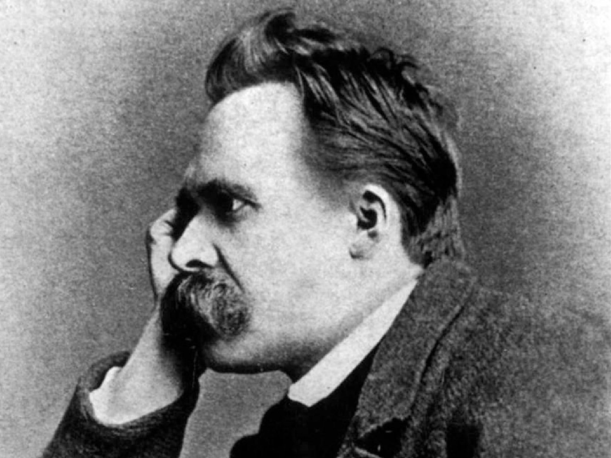

What would the best version of ‘you’ be like? And what do you need to do in order to become that version? Furthermore, what does ‘best’ actually mean? By what standards are you judging yourself? Does the best version of you mean the fastest, strongest, kindest, funniest, most intelligent, most artistic, most compassionate, most disciplined version? Or, out of all the possible values you could embody, are some more important or ‘better’ than others?  

It is normative questions such as these that the brilliant 19th-century philosopher [Friedrich Nietzsche](/reading-lists/friedrich-nietzsche/) investigated throughout his work, particularly with his character of the Übermensch — meaning ‘superman’, ‘overman’, or ‘beyond-man’.

## What is the Übermensch?

The Übermensch is Nietzsche’s vision of what we each _could_ be, were we not so bogged down by outdated religions and moralities. 

For Nietzsche, the Übermensch is a being who is able to completely _affirm_ life: someone who says ‘yes’ to everything that comes their way; a being who is able to be their _own_ determiner of value; sculpt their characteristics and circumstances into a beautiful, empowered, ecstatic whole; and fulfill their ultimate potential to _become who they truly are_. 

To fully appreciate the significance of the Übermensch in Nietzsche’s philosophy, we must first understand the context of his thinking — for, writing at the end of the 19th century, Nietzsche repeatedly warns us that modernity is in crisis. 

## God is dead

Following the enlightenment and the separation of church and state across Europe, Nietzsche notes that Christianity does not have the authority or legitimacy it once had. In fact, [God is dead](/articles/god-is-dead-nietzsche-famous-statement-explained/). And that means everything built on top of God, including the entire western value system, is destined for collapse.

The trouble is, many people haven’t realized this yet. As we discuss in our short explainer piece on [Nietzsche’s infamous ‘God is dead’ declaration](/articles/god-is-dead-nietzsche-famous-statement-explained/), many in Nietzsche’s day greeted the decline of Christianity with a shrug, or even jubilation. 

Nietzsche thought these were the wrong reactions.

While Nietzsche is no fan of Christianity, he recognizes that the removal of its values is dangerous. Christianity, flawed though it is, at least provides some structure and meaning to people’s lives. It offers not just a set of values but a coping mechanism for suffering. 

Erode Christian values — erode the coping mechanism — and how will people bear existence? How will they stand the yawning abyss of meaninglessness? How will they deal with the inevitable pain and suffering that all humans, living imperfect mortal lives, must face?

## The Last Man

Nietzsche worried that, if we’re not careful, the death of God would lead to a deep nihilism. Recognizing western values (derived from Christianity) as foundationless, yet not proactively replacing them with anything, we’d inevitably end up burying our existential angst deep down. We’d pick our fates from one of the following: delude ourselves with false beliefs, become irretrievably depressed, or distract ourselves with vacuous pursuits and meaningless entertainment. 

Nietzsche characterizes this predicament in his 1883-5 work <a target="_blank" rel="noopener noreferrer sponsored" href="http://www.amazon.com/gp/product/0140441182/ref=as_li_tl?ie=UTF8&tag=philosophybre-20&camp=1789&creative=9325&linkCode=as2&creativeASIN=0140441182&linkId=463ca60c2eea3d8021001814ba19d397">Thus Spoke Zarathustra</a>, presenting us with a devastating sketch of an apathetic, shallow, distracted humanity:

>Behold! I shall show you the Last Man....The earth has become small, and upon it hops the Last Man, who makes everything small... A little poison now and then: that produces pleasant dreams. And a lot of poison at last, for a pleasant death. They still work, for work is entertainment. But they take care the entertainment does not exhaust them... No herdsmen and one herd. Everyone wants the same thing, everyone is the same: whoever thinks otherwise goes voluntarily into the madhouse... ‘We have discovered happiness,’ say the Last Men, and blink.

So, what’s the solution? How can we avoid becoming the Last Man? Following the death of God, how can we avoid slipping into a deep nihilism, without numbing ourselves with meaningless entertainment, or deluding ourselves with (now obviously false) religions and baseless moralities? 

## Übermensch: determine your own values

Enter Nietzsche’s Übermensch, an alternative future for humanity, where we need not rely on any standard of values but our _own_. 

The idea of the Übermensch fills the void left by the death of God. Defying nihilism, it provides a new basis for value. 

However, with his Übermensch, Nietzsche doesn’t just want to provide a _replacement_ for decaying, unhealthy Christian values; he wants to provide a template for radical _improvement_.

One of the main problems Nietzsche has with Christian values is they aspire to what he calls an ‘ascetic ideal’: the denial of inner drives or desires we cannot help but have (like those for food or sex) in the name of ‘virtue’. This repression, this invention of ‘sin’, is psychologically unhealthy, and leads to perpetual guilt and self-loathing. 

Nietzsche thinks we must thus discard notions of ‘sin’ and asceticism and rebuild our value systems in healthier, life-affirming ways. As he notes in his 1889 work, <a target="_blank" rel="noopener noreferrer sponsored" href="http://www.amazon.com/Twilight-Idols-Anti-Christ-Philosophize-Classics/dp/0140445145?keywords=twilight+of+the+idols+nietzsche&qid=1650788348&s=books&sprefix=twilight+of+the+idols%2Cstripbooks%2C140&sr=1-1&linkCode=ll1&tag=philosophybre-20&linkId=7adfbdd46587db24b1c9c0033f8d2cfc&language=en_US&ref_=as_li_ss_tl">Twilight of the Idols</a>:

>The church combats the passions by cutting them off in every sense: its technique, its ‘cure’ is _castration_. It never asks: ‘how can a desire be spiritualized, beautified, deified?’

Nietzsche’s Übermensch, by contrast, _does_ ask such questions. And, in his 1882 work <a target="_blank" rel="noopener noreferrer sponsored" href="http://www.amazon.com/gp/product/0394719859/ref=as_li_tl?ie=UTF8&tag=philosophybre-20&camp=1789&creative=9325&linkCode=as2&creativeASIN=0394719859&linkId=56f8e2d8aef7bc2ab60d5aed696e0fdf">The Gay Science</a>, Nietzsche provides an early sketch of how such questions might be answered:

>To ‘give style’ to one’s character — a great and rare art! It is practiced by those who survey all the strengths and weaknesses that their nature has to offer and then fit them into an artistic plan until each appears as art and reason and even weaknesses delight the eye. 

Assess the strengths and weaknesses of your character. Weaknesses need not be hidden or repressed, Nietzsche advises: they are part of _you_, and can appear beautiful if molded according to a particular ‘artistic plan’. He continues: 

>Here a great mass of second nature has been added; there a piece of first nature removed — both times through long practice and daily work at it. Here the ugly that could not be removed is concealed; there it is reinterpreted into sublimity. Much that is vague and resisted shaping has been saved and employed for distant views—it is supposed to beckon towards the remote and immense.

With work, we can shape ourselves into something beautiful — where even the ugly, undesirable, unchangeable parts of ourselves can be used to lend intrigue, mystique, _depth_. 

The target of self-discipline, then, should not be self-castigation or self-loathing or repression — as Nietzsche thinks it often is with ascetic religious traditions — but rather self-stylization and _mastery_. 

Not the rejection of our desires, not the denial of the urges and forces that make up our lives, but the sublimation, sculpting and channeling of them into a psychologically healthy and beautiful creation, an aesthetic whole. As Nietzsche finishes the passage:

>In the end, when the work is complete, it becomes clear how it was the force of a _single taste_ that ruled and shaped everything great and small…

For, Nietzsche suggests, it is by living up to an indepedent _aesthetic_, rather than to an external ‘ethical’ standard, that humans can truly fulfill their potential. As he famously declares in his 1872 work, <a target="_blank" rel="noopener noreferrer sponsored" href="http://www.amazon.com/Birth-Tragedy-Spirit-Penguin-Classics/dp/0140433392?crid=3P4QPQ8RR92BA&keywords=the+birth+of+tragedy&qid=1650786632&sprefix=the+birth+of+tragedy%2Caps%2C132&sr=8-1&linkCode=ll1&tag=philosophybre-20&linkId=40882a22fcc22c3e2a1e43c5d2742a01&language=en_US&ref_=as_li_ss_tl">The Birth of Tragedy</a> (in a typically compelling statement that features in our list of [Nietzsche’s best quotes](/articles/nietzsche-quotes-97-of-his-cleverest-statements/)): 

>It is only as an aesthetic phenomenon that existence and the world are _eternally justified_.

## Übermensch: human become God

When announcing the death of God, Nietzsche questions: “Is not the greatness of this deed too great for us? Must we ourselves not become gods simply to appear worthy of it?” The Übermensch is the answer to this question: he is _human-become-god_. 

Rather than look externally, the Übermensch is his _own_ determiner of value. He transcends the petty needs of ‘man’ and moves beyond illusions to live and take joy in the _here_ and _now_ of life on Earth. He affirms his own character, and has the power and fortitude to say ‘yes’ to all of life’s joys and all of life’s pains.

    <a href="/introduction-to-nietzsche/">
        

<picture><source type="image/webp" srcset="/static/03723fefbc97c079ed7c997885355160/e2229/intro-to-nietzsche-chap1-full.webp 750w,
/static/03723fefbc97c079ed7c997885355160/8ee9d/intro-to-nietzsche-chap1-full.webp 1080w,
/static/03723fefbc97c079ed7c997885355160/23c38/intro-to-nietzsche-chap1-full.webp 1366w,
/static/03723fefbc97c079ed7c997885355160/dded5/intro-to-nietzsche-chap1-full.webp 1412w" sizes="100vw"></picture><noscript></noscript>
        

        

            <h2>Introduction to Nietzsche and His 5 Greatest Ideas</h2>
            
<svg xmlns="http://www.w3.org/2000/svg" viewBox="0 0 50 50"><path d="M48.336,7.54c-0.701,0-1.359,0.007-2.018,0.024V5.326h-0.734c-14.262,0-19.043,3.411-20.585,5.252 c-1.542-1.841-6.323-5.252-20.585-5.252H3.68v2.237C3.022,7.545,2.364,7.54,1.664,7.54H0V39.89h1.664 c17.595,0,21.186,4.035,21.698,4.784h3.302c0.557-0.784,4.218-4.784,21.673-4.784H50V7.54H48.336z M23.899,38.431 c-2.457-1.812-7.611-3.914-18.383-4.054V7.175c15.087,0.194,18.001,4.327,18.383,5V38.431z M44.484,34.377 c-10.772,0.14-15.926,2.24-18.383,4.054V12.184c0.416-0.737,3.412-4.814,18.383-5.007V34.377z"></path></svg>BY PHILOSOPHY BREAK

            
&#9733;&#9733;&#9733;&#9733;&#9733;

            <svg xmlns="http://www.w3.org/2000/svg" viewBox="0 0 512 512"><path d="M504 256C504 119 393 8 256 8S8 119 8 256s111 248 248 248 248-111 248-248zm-448 0c0-110.5 89.5-200 200-200s200 89.5 200 200-89.5 200-200 200S56 366.5 56 256zm72 20v-40c0-6.6 5.4-12 12-12h116v-67c0-10.7 12.9-16 20.5-8.5l99 99c4.7 4.7 4.7 12.3 0 17l-99 99c-7.6 7.6-20.5 2.2-20.5-8.5v-67H140c-6.6 0-12-5.4-12-12z"></path></svg>Learn More
        

    </a>

So, though some popular interpretations of Nietzsche’s concept of the Übermensch say it hints at some sort of superior human _race_ — as the Nazis, for instance, tragically had it — it is more about _self_-overcoming, rather than necessarily overcoming other people. As the philosopher Jacob Golomb puts it in his 2013 essay, _Will to Power_ (which features in <a target="_blank" rel="noopener noreferrer sponsored" href="http://www.amazon.com/Oxford-Handbook-Nietzsche-Handbooks/dp/019877673X?crid=2E7HX4I01D34E&keywords=the+oxford+handbook+of+nietzsche&qid=1656080884&sprefix=the+oxford+handbook+of+nietzsch%2Caps%2C199&sr=8-1&linkCode=ll1&tag=philosophybre-20&linkId=a9a7719e1842c33076ee84bbf34bcd22&language=en_US&ref_=as_li_ss_tl">The Oxford Handbook of Nietzsche</a>): 

>Nietzsche’s Übermensch is one who has used this power to sublimate his naturally conflicting drives into a unified and authentic whole; he is one who has overcome his own ‘human, all too human’ nature; rather than one who tries to literally overcome other humans, as the most facile interpretations would have it.

## How can the Übermensch emerge?

Nietzsche sees the Übermensch as a potential endpoint for humanity. However, becoming Übermensch is far from guaranteed. The much easier, and much more likely, possibility is that following the death of God we give into nihilism and become the Last Man. In the prologue of <a target="_blank" rel="noopener noreferrer sponsored" href="http://www.amazon.com/gp/product/0140441182/ref=as_li_tl?ie=UTF8&tag=philosophybre-20&camp=1789&creative=9325&linkCode=as2&creativeASIN=0140441182&linkId=463ca60c2eea3d8021001814ba19d397">Thus Spoke Zarathustra</a> (which features on our list of the [best books by and about Nietzsche](/reading-lists/friedrich-nietzsche/)), Nietzsche thus writes: 

>Man is a rope, fastened between animal and _Übermensch_ — a rope over an abyss.

So, how can we become Übermensch, rather than succumb to Nietzsche’s Last Man? 

In <a target="_blank" rel="noopener noreferrer sponsored" href="http://www.amazon.com/gp/product/0140441182/ref=as_li_tl?ie=UTF8&tag=philosophybre-20&camp=1789&creative=9325&linkCode=as2&creativeASIN=0140441182&linkId=463ca60c2eea3d8021001814ba19d397">Thus Spoke Zarathustra</a>, Nietzsche places the burden on us as individuals. He has Zarathustra preach a process of self-overcoming: we must throw off the chains of religion and morality. We must give style to our characters and act like the poets of our own lives, not mere members of a frightened, apathetic herd. We must each revalue our values to _become who we really are_. Zarathustra declares: 

>I teach you the _Übermensch_. Man is something that should be overcome. What have you done to overcome him? 

And, considering this is very much a _personal_ project: one where we must determine and affirm our own values and sculpt our own, unique inner drives into something complete in _their own authentic way_, there is no one-size-fits-all solution. 

Not everyone can become Shakespeare, Napoleon, or Wagner — figures who, though not quite ‘Übermensch’ standard, Nietzsche admired and upheld as examples of great individuals who powerfully organized themselves around a single purpose, a single taste, and furthered humanity in some way. Indeed, as Zarathustra advises: 

>You have your way, I have my way. As for the right way, the correct way, the only way, it does not exist. 

What is the aesthetic vision around which _you_ could organize yourself to fulfill your greatest potential?

## Does the Übermensch embody any general values? 

While the Übermensch is less about the type or nature of particular desires, drives, or values themselves, and more about _how they are affirmed, sculpted, and deified by the individual who has them_, there are perhaps some general value principles we can derive from Nietzsche’s picture. 

Indeed, it seems it is values like _independence, self-realization, personal liberation, self-determination_, and psychological completeness and _health_ that are most prominent in Nietzsche’s Übermensch. 

Nietzsche sought to cultivate such values in his own lifestyle, hiking alone in the Swiss Alps as he did, and recording the significant epiphanies he had while up there. 

Presumably it was during such a mountainside epiphany that he was inspired to recognize that we do not need promises of the afterlife to find joy in existence on Earth, declaring through Zarathustra: 

>The _Übermensch_ shall be the meaning of the earth! I entreat you my brethren, remain true to the earth, and do not believe those who speak to you of supra-terrestrial hopes! … Behold, I teach you the _Übermensch:_ he is this lightning, he is this madness! … Behold, I am a prophet of the lightning and a heavy drop from the cloud: but this lightning is called _Übermensch_.

There is no life beyond this one on Earth — and according to Zarathustra’s preaching of the _eternal recurrence_ (see our quick [eternal recurrence explainer here](/articles/eternal-recurrence-what-did-nietzsche-really-mean/)), it’s a life that will recur again and again for eternity. So what could possibly be advised other than to become the best version of exactly who you are, to embrace all that comes your way, to take joy in every single moment? 

## Is the Übermensch possible, or even desirable?

The cryptic nature of <a target="_blank" rel="noopener noreferrer sponsored" href="http://www.amazon.com/gp/product/0140441182/ref=as_li_tl?ie=UTF8&tag=philosophybre-20&camp=1789&creative=9325&linkCode=as2&creativeASIN=0140441182&linkId=463ca60c2eea3d8021001814ba19d397">Thus Spoke Zarathustra</a>, the work in which Nietzsche’s discussion of the Übermensch mostly took place, means it is open for much interpretation, and leaves us with a number of questions. 

For instance: do you think humanity is capable of what Nietzsche describes as ‘self-overcoming’, of becoming a being resembling the Übermensch? Moreover, what would a world of Übermensch look like? Is a happy society filled with independent, self-determining Übermensch realistic? 

Furthermore, are all human ‘drives’ permissible? What about our drives for cruelty? How can we channel those in positive ways? How can we make cruelty beautiful? Is cultivating our lives and characters so that they’re beautiful as an ‘aesthetic package’ more important than, say, fighting for justice? Should we really aspire to live aesthetically rather than ethically?

## In just 6 days, you’ll understand Nietzsche’s philosophy

To explore these questions and Nietzsche’s general philosophy further, check out our [introduction to Nietzsche course](/introduction-to-nietzsche/), which delivers materials direct to your inbox over 6 days. 

We distill Nietzsche’s best and most misunderstood ideas — from perspectivism and slave morality, to the Übermensch and the will the power — and illuminate exactly why Nietzsche routinely changes people’s perspectives, and will perhaps change your own.

Read the reviews and see if the course is for you by hitting the banner below now.

    <a href="/introduction-to-nietzsche/">
        

<picture><source type="image/webp" srcset="/static/03723fefbc97c079ed7c997885355160/e2229/intro-to-nietzsche-chap1-full.webp 750w,
/static/03723fefbc97c079ed7c997885355160/8ee9d/intro-to-nietzsche-chap1-full.webp 1080w,
/static/03723fefbc97c079ed7c997885355160/23c38/intro-to-nietzsche-chap1-full.webp 1366w,
/static/03723fefbc97c079ed7c997885355160/dded5/intro-to-nietzsche-chap1-full.webp 1412w" sizes="100vw"></picture><noscript></noscript>
        

        

            <h2>Introduction to Nietzsche and His 5 Greatest Ideas</h2>
            
<svg xmlns="http://www.w3.org/2000/svg" viewBox="0 0 50 50"><path d="M48.336,7.54c-0.701,0-1.359,0.007-2.018,0.024V5.326h-0.734c-14.262,0-19.043,3.411-20.585,5.252 c-1.542-1.841-6.323-5.252-20.585-5.252H3.68v2.237C3.022,7.545,2.364,7.54,1.664,7.54H0V39.89h1.664 c17.595,0,21.186,4.035,21.698,4.784h3.302c0.557-0.784,4.218-4.784,21.673-4.784H50V7.54H48.336z M23.899,38.431 c-2.457-1.812-7.611-3.914-18.383-4.054V7.175c15.087,0.194,18.001,4.327,18.383,5V38.431z M44.484,34.377 c-10.772,0.14-15.926,2.24-18.383,4.054V12.184c0.416-0.737,3.412-4.814,18.383-5.007V34.377z"></path></svg>BY PHILOSOPHY BREAK

            
&#9733;&#9733;&#9733;&#9733;&#9733;

            <svg xmlns="http://www.w3.org/2000/svg" viewBox="0 0 512 512"><path d="M504 256C504 119 393 8 256 8S8 119 8 256s111 248 248 248 248-111 248-248zm-448 0c0-110.5 89.5-200 200-200s200 89.5 200 200-89.5 200-200 200S56 366.5 56 256zm72 20v-40c0-6.6 5.4-12 12-12h116v-67c0-10.7 12.9-16 20.5-8.5l99 99c4.7 4.7 4.7 12.3 0 17l-99 99c-7.6 7.6-20.5 2.2-20.5-8.5v-67H140c-6.6 0-12-5.4-12-12z"></path></svg>Learn More
        

    </a>

