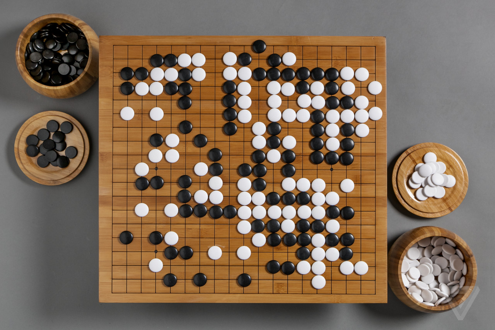

Last month, former champion of the ancient board game Go, Lee Se-dol, retired from professional play. His reason? “With the debut of AI in Go games,” Lee Se-dol [told Yonhap News Agency in Seoul](https://en.yna.co.kr/view/AEN20191127004800315), “I’ve realized… even if I become the number one, there is an entity that cannot be defeated.”

Lee is referring to [AlphaGo](https://deepmind.com/research/case-studies/alphago-the-story-so-far), an artificial intelligence system created by Google-owned company, DeepMind. 

AlphaGo played Lee at Go in 2016, and shocked the world by beating him four matches to one. Go is an extremely sophisticated game, and success at the top level is generally reserved for only very gifted human brains. DeepMind’s use of neural network technology to outsmart the best human player on the planet, therefore, marks a seismic change in the perceived sophistication and potential of AI. 

Since that fateful match in 2016, the team at DeepMind have released [AlphaGo Zero](https://deepmind.com/blog/article/alphago-zero-starting-scratch), an even more advanced version of the program. Within three days of training by playing itself over and over, AlphaGo Zero surpassed the original AlphaGo program, beating it 100 matches to zero. 

No wonder poor Lee Se-dol regards any possibility of reclaiming his 'best ever player' status as futile.

## Could AI get out of hand..?

Accomplishments in AI like the AlphaGo project have led some commentators to worry that, eventually, all this deep learning could get a bit out of control, culminating in a catastrophe event that’s become known as the ‘singularity’. 

As philosopher David J. Chalmers puts it in his paper, [The Singularity: A Philosophical Analysis](http://consc.net/papers/singularity.pdf):

>What happens when machines become more intelligent than humans? One view is that this event will be followed by an explosion to ever-greater levels of intelligence, as each generation of machines creates more intelligent machines in turn. This intelligence explosion is now often known as the ‘singularity’.

The singularity is typically associated with world-ending consequences, with tech mavens like Elon Musk pronouncing it [humanity’s greatest existential threat](https://www.vanityfair.com/news/2017/03/elon-musk-billion-dollar-crusade-to-stop-ai-space-x). Put simply, the concern is if we’re capable of creating machines more intelligent than we are, then that generation of machines is capable of creating machines more intelligent again. This would lead to an exponential situation where human intelligence is quickly and irretrievably left far behind by machine intelligence. Consequently, we’d lose authority and control. 

Best case, we become slaves to the machines; worst case, we’re exterminated as surplus to requirements. 

American philosopher Daniel Dennett, however, doesn’t buy it. In the final chapter of his latest book, [From Bacteria to Bach and Back](https://www.amazon.com/gp/product/0393355500/ref=as_li_tl?ie=UTF8&tag=philosophybre-20&camp=1789&creative=9325&linkCode=as2&creativeASIN=0393355500&linkId=1df61311519828d11acf4f3d14004e1d), Dennett reflects on the role technology is playing and will come to play in our lives. As he puts it:

>I am not worried about humanity creating a race of super-intelligent agents destined to enslave us, but that does not mean I am not worried. I see other, less dramatic, but much more likely, scenarios in the immediate future that are cause for concern and call for immediate action.

## Our reliance on AI could lead to negligence

For Dennett, while a singularity event remains possible in principle, “the task is orders of magnitude larger and more difficult than the cheerleaders have claimed.” He argues that smart technology presents us with more practical threats that have a far higher likelihood of occuring. As he clarifies:

>The real danger, I think, is not that machines more intelligent than we are will usurp our role as captains of our destinies, but that we will _over_-estimate the comprehension of our latest thinking tools, prematurely ceding authority to them far beyond their competence.

Take transport. It’s not just aviation and shipping industries that depend on GPS for safe and efficient navigation: how many individuals now turn to their smartphones instead of using a road map? 

 intelligence.")

Alternatively, take medicine. Computer-based systems now outperform the best human diagnosticians on their own turf, identifying early stages of cancer and other diseases with unprecedented precision. What does this imply about how we train doctors? Will we be encouraged to jettison huge chunks of traditional medical education, because machines can now do certain parts of the job more effectively? 

As Dennett summarizes:

>_Use it or lose it_ is the rule of thumb cited at this point… how concerned should we be that we are dumbing ourselves down by our growing reliance on intelligent machines?

It could be argued that we’ve always used technology to make our lives easier throughout history, and that AI is just the latest ‘dangerous’ invention we’ll soon all calm down about. 

However, the difference here is that while something like, say, a tractor replaces human labor, it doesn’t replace human comprehension: the human brain still plays a central role in plowing fields. AI is different because it _does_ replace human comprehension: we cede not just labor but intellectual authority and expertise to the machine. 

This, for Dennett, is what's dangerous. What happens when the machines break? Will there be enough clued-up human experts to step in? If a coronal mass ejection from the sun were to wipe out global electronics, for example, are we confident civilization could survive? 

As [NASA states](https://www.nasa.gov/topics/earth/features/2012-superFlares.html) in an article on solar flares:

>In an increasingly technological world, where almost everyone relies on cell phones and GPS controls not just your in-car map system, but also airplane navigation and the extremely accurate clocks that govern financial transactions, space weather is a serious matter.

So, besides preparing our machines for such space weather, what can we do _culturally_ to prevent ourselves becoming too dependent on technology? How can we ensure we never overestimate the competence of machines to run societies on our behalf?

## Calling out the incompetences in software

Dennett’s solution to the problem of over-reliance is to make absolutely explicit the boundary between machines that are tools and those that claim to replace our comprehension. 

>We should expose and ridicule all gratuitous anthropomorphism in systems, the cute, ever-more-human voices, the perky (but canned) asides. _When you are interacting with a computer, you should know you are interacting with a computer_.

We should make it fashionable to identify and point out flaws in systems, Dennett argues. What's more, we should write it into law that any advertisements for technology must acknowledge all shortcomings in the software — just like healthcare companies are obliged to list side effects. 

As Dennett forcefully puts it:

>Systems that deliberately conceal their shortcuts and gaps of incompetence should be deemed fraudulent, and their creators should go to jail for committing the crime of creating or using an artificial intelligence that impersonates a human being.

This might seem alarmist, but Dennett’s argument should be considered in the context of how societies currently operate. 

Comprehension is already spread thin amongst various power structures. Politicians know some things; scientists and professors know some things; business leaders know some things; emergency services know some things — but nobody knows everything. Specialization in society is rife. And if we start ceding that specialist knowledge to machines, then just as society becomes more complex humans will know less about how to deal with it.

We can reboot machines easily (and frequently do to fix problems); but we can’t reboot civilization without causing serious harm. As Dennett concludes:

>Civilization is a work in progress, and we abandon our attempt to understand it at our peril.

## Give human intelligence a go

What do you think? Is AI dangerous? Does the singularity pose a serious existential threat to society? Is our dependence on technology the more realistic path to civilization’s downfall? Or is all this talk of downfall merely alarmist thinking?

[From Bacteria to Bach and Back](https://www.amazon.com/gp/product/0393355500/ref=as_li_tl?ie=UTF8&tag=philosophybre-20&camp=1789&creative=9325&linkCode=as2&creativeASIN=0393355500&linkId=1df61311519828d11acf4f3d14004e1d) is a wide ranging and fascinating book. As well as his reflection on technology discussed above, Dennett tackles a bunch of outrageously difficult questions in typically entertaining style. What are the origins of language and culture? What is human consciousness? How did it become possible for our minds to even ask this question?

Dennett takes the reader on a riveting journey from natural selection and ‘design without a designer’ through to cultural evolution and the birth of intelligent (human) design. For minds slipping into the warm, numbing embrace of machine intelligence, [From Bacteria to Bach and Back](https://www.amazon.com/gp/product/0393355500/ref=as_li_tl?ie=UTF8&tag=philosophybre-20&camp=1789&creative=9325&linkCode=as2&creativeASIN=0393355500&linkId=1df61311519828d11acf4f3d14004e1d) is Dennett’s glorious bucket of ice-cold water, twisting human comprehension inside out.

And if that doesn't float your boat, [we've compiled a reading list](/reading-lists/consciousness/) of the most essential, compelling, and accessible works on the philosophy of human consciousness. Hit the banner below to access it now.

<a class="reading-list cta" href="/reading-lists/consciousness/">
    
    

    

        <svg xmlns="http://www.w3.org/2000/svg" viewBox="0 0 576 512"><path fill="#fff" d="M542.22 32.05c-54.8 3.11-163.72 14.43-230.96 55.59-4.64 2.84-7.27 7.89-7.27 13.17v363.87c0 11.55 12.63 18.85 23.28 13.49 69.18-34.82 169.23-44.32 218.7-46.92 16.89-.89 30.02-14.43 30.02-30.66V62.75c.01-17.71-15.35-31.74-33.77-30.7zM264.73 87.64C197.5 46.48 88.58 35.17 33.78 32.05 15.36 31.01 0 45.04 0 62.75V400.6c0 16.24 13.13 29.78 30.02 30.66 49.49 2.6 149.59 12.11 218.77 46.95 10.62 5.35 23.21-1.94 23.21-13.46V100.63c0-5.29-2.62-10.14-7.27-12.99z"/></svg>READING LIST
        

        <h3>Consciousness</h3>
        
The Top 5 Books to Read

    
    
    <svg class="cta swing" xmlns="http://www.w3.org/2000/svg" viewBox="0 0 320 512"><path d="M285.476 272.971L91.132 467.314c-9.373 9.373-24.569 9.373-33.941 0l-22.667-22.667c-9.357-9.357-9.375-24.522-.04-33.901L188.505 256 34.484 101.255c-9.335-9.379-9.317-24.544.04-33.901l22.667-22.667c9.373-9.373 24.569-9.373 33.941 0L285.475 239.03c9.373 9.372 9.373 24.568.001 33.941z"/></svg>
</a>