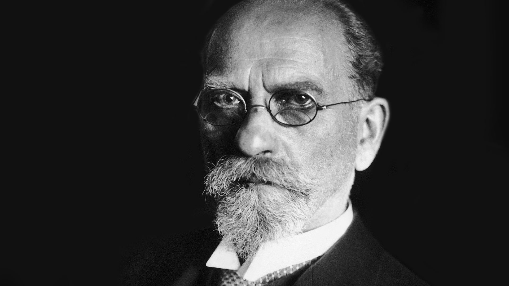

If you were asked to picture a typical existentialist, you might think of an angsty person situated in a Parisian cafe, adorned with a black turtleneck, drinking cocktails, miserably smoking cigarettes — a person who laments about the meaninglessness of life, and despairs that we must somehow forge a living for ourselves in strange societies into which none of us even asked to be born.

And, in many ways, this picture — based on the crude popular culture conception of existentialism — is entirely accurate. The Parisian cafe scene of the 1930s-50s _was_ the hub for such famous existentialist figures as Jean-Paul Sartre, Simone de Beauvoir, Maurice Merleau-Ponty, and Albert Camus — all of whom discussed the meaninglessness of life and most definitely _did_ fuel themselves with cocktails and cigarettes. 

But beyond this fond caricature of the lifestyles and demeanours of existentialists, the philosophy of existentialism of course goes much deeper. For many, it's a fascinating way of thinking about the world, as well as our place in it. 

So what _is_ existentialism, exactly? Well, in a nutshell, existentialism concerns itself with finding ways to explain the individual human experience, focusing like a laser on what it means to exist as an individual human being in a universe we don’t understand.

Defining it further than this requires some clarification, for existentialism is a term not limited to philosophers, but also used to describe the work of novelists, playwrights, and artists — notably Fyodor Dostoevsky (see our [reading list on Dostoevsky’s best books here](/reading-lists/fyodor-dostoevsky-best-books/)), Franz Kafka, and Samuel Beckett — making existentialism as much a general cultural movement as it is a specific philosophy. 

Let's take a quick look at the cultural movement, before diving into the three key principles of formal existentialist philosophy.

## Existentialism as a cultural movement

The broader cultural use of the term ‘existentialist’ typically describes any thinker who places an emphasis on _individual lived experience_ — particularly on the tension between the fact we are ultimately responsible for our choices, yet lack a clear framework for knowing if the decisions we make are the right ones, or if they even matter at all.

<!--big subscribe-->

    
    <h4>From the Buddha to Nietzsche: join 10,000+ subscribers enjoying my free Sunday Breakdown</h4>
    
In one concise email each Sunday, I break down a famous idea from philosophy. You get the distillation straight to your inbox.

    

        <form action="https://app.convertkit.com/forms/5812400/subscriptions" method="post" data-sv-form="5812400" data-uid="be0e52d3c0" data-format="inline" data-version="6" data-options="{&quot;settings&quot;:{&quot;after_subscribe&quot;:{&quot;action&quot;:&quot;message&quot;,&quot;success_message&quot;:&quot;Thank you, philosopher! Your welcome email will land in your inbox shortly.&quot;,&quot;redirect_url&quot;:&quot;https://philosophybreak.com/thank-you/&quot;},&quot;analytics&quot;:{&quot;google&quot;:null,&quot;fathom&quot;:null,&quot;facebook&quot;:null,&quot;segment&quot;:null,&quot;pinterest&quot;:null,&quot;sparkloop&quot;:null,&quot;googletagmanager&quot;:null},&quot;modal&quot;:{&quot;trigger&quot;:&quot;timer&quot;,&quot;scroll_percentage&quot;:null,&quot;timer&quot;:5,&quot;devices&quot;:&quot;all&quot;,&quot;show_once_every&quot;:15},&quot;powered_by&quot;:{&quot;show&quot;:false,&quot;url&quot;:&quot;https://convertkit.com/features/forms?utm_campaign=poweredby&amp;utm_content=form&amp;utm_medium=referral&amp;utm_source=dynamic&quot;},&quot;recaptcha&quot;:{&quot;enabled&quot;:false},&quot;return_visitor&quot;:{&quot;action&quot;:&quot;show&quot;,&quot;custom_content&quot;:&quot;&quot;},&quot;slide_in&quot;:{&quot;display_in&quot;:&quot;bottom_right&quot;,&quot;trigger&quot;:&quot;timer&quot;,&quot;scroll_percentage&quot;:null,&quot;timer&quot;:5,&quot;devices&quot;:&quot;all&quot;,&quot;show_once_every&quot;:15},&quot;sticky_bar&quot;:{&quot;display_in&quot;:&quot;top&quot;,&quot;trigger&quot;:&quot;timer&quot;,&quot;scroll_percentage&quot;:null,&quot;timer&quot;:5,&quot;devices&quot;:&quot;all&quot;,&quot;show_once_every&quot;:15}},&quot;version&quot;:&quot;6&quot;}" min-width="400 500 600 700 800">
        
<ul data-element="errors" data-group="alert"></ul>

            

                <input name="email_address" aria-label="Your Email Address..." placeholder="Your Email Address..." required type="email" />
            

            <button class="button primary" type="submit" data-element="submit">

<svg xmlns="http://www.w3.org/2000/svg" viewBox="0 0 512 512"><path d="M464 64H48C21.49 64 0 85.49 0 112v288c0 26.51 21.49 48 48 48h416c26.51 0 48-21.49 48-48V112c0-26.51-21.49-48-48-48zm0 48v40.805c-22.422 18.259-58.168 46.651-134.587 106.49-16.841 13.247-50.201 45.072-73.413 44.701-23.208.375-56.579-31.459-73.413-44.701C106.18 199.465 70.425 171.067 48 152.805V112h416zM48 400V214.398c22.914 18.251 55.409 43.862 104.938 82.646 21.857 17.205 60.134 55.186 103.062 54.955 42.717.231 80.509-37.199 103.053-54.947 49.528-38.783 82.032-64.401 104.947-82.653V400H48z"/></svg>Join 10,000+ Subscribers</button>
            

            

        </form>
        
💭 One short philosophical email each Sunday. Unsubscribe any time.

    

This tension is generally accompanied by the suspicion that, beyond the everyday, there lies a deeper human need that natural science and traditional religions have not been able to fulfill. As such, existentialist works commonly feature themes like dread, boredom, anxiety, alienation, the absurd, freedom, commitment, nothingness, and what it really means to be an embodied being in an apparently uncaring, unknowable universe.

In this regard, Dostoevsky’s <a target="_blank" rel="noopener noreferrer sponsored" href="http://www.amazon.com/gp/product/067973452X/ref=as_li_tl?ie=UTF8&tag=philosophybre-20&camp=1789&creative=9325&linkCode=as2&creativeASIN=067973452X&linkId=2a50a57b64e10025951baef7a6061f5a">Notes from the Underground</a> and Kafka’s <a target="_blank" rel="noopener noreferrer sponsored" href="http://www.amazon.com/gp/product/0805209999/ref=as_li_tl?ie=UTF8&tag=philosophybre-20&camp=1789&creative=9325&linkCode=as2&creativeASIN=0805209999&linkId=de194533fffd29a01939dff34c16581c">The Trial</a> are classic examples of existentialist novels, and <a target="_blank" rel="noopener noreferrer sponsored" href="http://www.amazon.com/gp/product/0571229158/ref=as_li_tl?ie=UTF8&tag=philosophybre-20&camp=1789&creative=9325&linkCode=as2&creativeASIN=0571229158&linkId=6be05873e4d375f03777771d71d116a5">the plays of Samuel Beckett</a> and sculptures of Alberto Giacometti explore existentialist themes in fascinating, disturbing ways. 

”, 1956. Swiss artist Alberto Giacometti explored the human condition through his figurative sculpture.")

## Existentialism as a philosophy

The more formal philosophical side of existentialism, meanwhile, grapples with its core themes and concepts more directly, and it’s worth taking a brief look at its history, which can be confusing.

For instance, the 19th-century Dane Søren Kierkegaard (see our reading list of [Kierkegaard’s best books here](/reading-lists/soren-kierkegaard-best-books/)) is commonly regarded as the first existentialist philosopher, though he himself never used the term — and probably would have dismissed the label, had he been alive to do so (for more on this, check out our article on [Kierkegaard’s influence on existentialism](/articles/kierkegaard-on-finding-the-meaning-of-life/)).

In fact, 20th-century philosophers Martin Heidegger and [Albert Camus](/reading-lists/albert-camus/) _did_ dismiss the label during their lifetimes, despite being considered core to existentialist thought.

The word ‘existentialism’ was first introduced by the French philosopher Gabriel Marcel in 1943, and only explicitly adopted by Jean-Paul Sartre and Simone de Beauvoir, with the former coming to define the subject around his own works. Only then were earlier thinkers like Kierkegaard and [Friedrich Nietzsche](/reading-lists/friedrich-nietzsche/) retrospectively recognized as precursors to the movement — with a number of Sartre and de Beauvoir’s contemporaries also lumped in under the term, regardless of whether they explicitly identified as such.

Given the confused allocation of who is and who is not an existentialist, some argue that only the work of Jean-Paul Sartre should be labelled _pure_ existentialism, seeing as he was the most explicit in accepting (and organizing his work around) the term. It’s true that Sartre perhaps provided the main thrust of existentialism as a movement, but as we shall see his work was deeply influenced and informed by his precursors and contemporaries. 

Of this work, there are generally three core principles that emerge as central to existentialist philosophy: phenomenology, freedom, and authenticity. Let’s take a quick look at each in turn.

## 1. Phenomenology

Phenomenology is a philosophical movement developed by Edmund Husserl in the early 20th century and later adapted by Heidegger, Karl Jaspers, and others. Phenomenologists are interested in examining the underlying structures of consciousness and experience, typically emphasizing the crucial importance (and inseparability) of the _first-person perspective_ in understanding ourselves and the world around us.

For example, if we were to describe our experience of, say, looking at a bowl of fruit, typically we would rather passively describe the distinct objects we see: a banana, an apple, some oranges, the bowl itself. 

But phenomenologists would encourage us to take a step back here. What do we actually _experience_ when looking at the bowl of fruit? Is it just these distinct objects? Or is it rather a unified multitude of shapes, textures, colors, sounds, smells, the passing of time, our mood, perhaps a brief desire for an orange, the overpowering repulsion of a fruit we don’t like?

The point is that, when you think about it, our experience of the world is characterized wholly by _intentionality_. 

Though we may typically describe our experiences as though we are mere subjects passively perceiving objects, we do not actually _experience_ the world in this way. Rather we are _immersed_ in whatever we are experiencing, existing in the world through an ever-shifting kaleidoscopic lens of memory, desire, mood, attention, inattention, intention. 

So, when looking at the bowl of fruit we see not mere passive objects but a _potential snack_ — or even a potential allergic reaction. We cast our own selves into the world and they stick to every object of our experience: our perceptions are our concepts and intentions mirrored back at us. Thus, to take an example from Heidegger, we see not just a piece of wood attached to some metal but a _hammer_, a _tool_ — something we can intentionally _use_.

<!--small subscribe-->

    <h4>In one concise email each Sunday, I break down a famous idea from philosophy. You get the distillation straight to your inbox:</h4>
    

        <form action="https://app.convertkit.com/forms/5812400/subscriptions" method="post" data-sv-form="5812400" data-uid="be0e52d3c0" data-format="inline" data-version="6" data-options="{&quot;settings&quot;:{&quot;after_subscribe&quot;:{&quot;action&quot;:&quot;message&quot;,&quot;success_message&quot;:&quot;Thank you, philosopher! Your welcome email will land in your inbox shortly.&quot;,&quot;redirect_url&quot;:&quot;https://philosophybreak.com/thank-you/&quot;},&quot;analytics&quot;:{&quot;google&quot;:null,&quot;fathom&quot;:null,&quot;facebook&quot;:null,&quot;segment&quot;:null,&quot;pinterest&quot;:null,&quot;sparkloop&quot;:null,&quot;googletagmanager&quot;:null},&quot;modal&quot;:{&quot;trigger&quot;:&quot;timer&quot;,&quot;scroll_percentage&quot;:null,&quot;timer&quot;:5,&quot;devices&quot;:&quot;all&quot;,&quot;show_once_every&quot;:15},&quot;powered_by&quot;:{&quot;show&quot;:false,&quot;url&quot;:&quot;https://convertkit.com/features/forms?utm_campaign=poweredby&amp;utm_content=form&amp;utm_medium=referral&amp;utm_source=dynamic&quot;},&quot;recaptcha&quot;:{&quot;enabled&quot;:false},&quot;return_visitor&quot;:{&quot;action&quot;:&quot;show&quot;,&quot;custom_content&quot;:&quot;&quot;},&quot;slide_in&quot;:{&quot;display_in&quot;:&quot;bottom_right&quot;,&quot;trigger&quot;:&quot;timer&quot;,&quot;scroll_percentage&quot;:null,&quot;timer&quot;:5,&quot;devices&quot;:&quot;all&quot;,&quot;show_once_every&quot;:15},&quot;sticky_bar&quot;:{&quot;display_in&quot;:&quot;top&quot;,&quot;trigger&quot;:&quot;timer&quot;,&quot;scroll_percentage&quot;:null,&quot;timer&quot;:5,&quot;devices&quot;:&quot;all&quot;,&quot;show_once_every&quot;:15}},&quot;version&quot;:&quot;6&quot;}" min-width="400 500 600 700 800">
        
<ul data-element="errors" data-group="alert"></ul>

            

                <input name="email_address" aria-label="Your Email Address..." placeholder="Your Email Address..." required type="email" />
            

            <button class="button primary" type="submit" data-element="submit">

<svg xmlns="http://www.w3.org/2000/svg" viewBox="0 0 512 512"><path d="M464 64H48C21.49 64 0 85.49 0 112v288c0 26.51 21.49 48 48 48h416c26.51 0 48-21.49 48-48V112c0-26.51-21.49-48-48-48zm0 48v40.805c-22.422 18.259-58.168 46.651-134.587 106.49-16.841 13.247-50.201 45.072-73.413 44.701-23.208.375-56.579-31.459-73.413-44.701C106.18 199.465 70.425 171.067 48 152.805V112h416zM48 400V214.398c22.914 18.251 55.409 43.862 104.938 82.646 21.857 17.205 60.134 55.186 103.062 54.955 42.717.231 80.509-37.199 103.053-54.947 49.528-38.783 82.032-64.401 104.947-82.653V400H48z"/></svg>Join 10,000+ Subscribers</button>
            

            

        </form>
        
💭 One short philosophical email each Sunday. Unsubscribe any time.

    

This intentional, first-person perspective — the way we _actually experience life_ — is all too often stripped from our descriptions of the world, phenomenologists argue, when it is precisely in examining this moment-to-moment, direct kind of experience that rich philosophical insight is to be found.

For our first-person intentionality is not just a property of our minds, Husserl argues: it is the framework through which the world and our minds become intelligible. Removing it from our considerations (as we attempt to do in science to create a third-person ‘objective’ perspective) leaves an unintelligible picture of human experience, and causes strange philosophical problems between mind and body that led to centuries of confusion arising from [Descartes’s skepticism and _cogito ergo sum_](/articles/i-think-therefore-i-am-descartes-cogito-ergo-sum-explained/). 

So, reclaiming the first-person perspective in all its immediacy and complexity — and acknowledging how entangled this perspective is with the world we perceive — lies at the heart of phenomenology, and became a useful way of thinking about the world for existentialists like Sartre. [As philosophy professor Steven Crowell](https://plato.stanford.edu/entries/existentialism/) writes in his summary of existentialist thought:

>The phenomenological approach gave philosophical shape to the basic existential insight that thinking about human existence requires new categories not found in the conceptual repertoire of ancient or modern thought; human beings can be understood neither as substances with fixed properties, nor as subjects interacting with a world of objects.

## 2. Freedom

If the principle of phenomenology gave existentialism its basic shape — i.e. a technique for getting at how things _really are_, for going behind the stale categorizations of common sense and natural science to describe human existence for what it really is — then the principle of _freedom_ gave existentialism its founding value. As contemporary philosopher Jonathan Webber argues in his 2018 work, <a target="_blank" rel="noopener noreferrer sponsored" href="http://www.amazon.com/gp/product/0198866763/ref=as_li_tl?ie=UTF8&tag=philosophybre-20&camp=1789&creative=9325&linkCode=as2&creativeASIN=0198866763&linkId=20ef2ccc8c2cda700f9482b060858b4e">Rethinking Existentialism</a>:

>As originally defined by Simone de Beauvoir and Jean-Paul Sartre, existentialism is the ethical theory that we ought to treat the freedom at the core of human existence as intrinsically valuable and the foundation of all other values.

As many existentialist thinkers were atheists, they believed no pre-ordained paths or objectives are assigned to any of us, and that human beings do not possess any inherent ‘nature’ or ‘value’ more fundamental than the fact we exist. In other words, being conscious of our own existences is the most fundamental thing about what it means to be a human being. 

Sartre sloganizes this thought with his famous saying, [_existence precedes essence_](/articles/existence-precedes-essence-what-sartre-really-meant/), and concludes that it is thus up to us, moment to moment, to use our existences to shape our own natures and values, to create whatever ‘essence’ — whatever human being — we choose to become. 

As Sartre puts it in his 1946 work, <a target="_blank" rel="noopener noreferrer sponsored" href="http://www.amazon.com/Existentialism-Humanism-Jean-Paul-Sartre/dp/0300115466?crid=UPF8047QW078&linkCode=ll1&tag=philosophybre-20&linkId=6bb88418483d73a3062f594572e693ea&language=en_US&ref_=as_li_ss_tl">Existentialism Is a Humanism</a>: 

>Man first of all exists, encounters himself, surges up in the world — and defines himself afterwards.

The upshot of this is that, on the existentialist view, we bear total responsibility for who we are, and the decisions we make are _ours_ (of course, many neuroscientists and philosophers today disagree that we have such freedom, arguing that [free will is an illusion](/articles/free-will-illusion-sam-harris/)). 

But for the existentialists, in a universe apparently devoid of direction, purpose, or meaning, this dizzying freedom is the source of much of our anxiety — leading Sartre to assert that we are in fact ‘condemned’ to be free:

>Man is condemned to be free. Condemned, because he did not create himself; because, once hurled into the world, he is responsible for everything he does.

Kierkegaard summarizes this thought — that our existential freedom leads to anxiety about the limitless possibilities available to us — in his 1844 work, <a target="_blank" rel="noopener noreferrer sponsored" href="http://www.amazon.com/Concept-Anxiety-Psychologically-Deliberation-Hereditary/dp/1631490044?&linkCode=ll1&tag=philosophybre-20&linkId=84a4c593f9794322bb3f9e82d1abf277&language=en_US&ref_=as_li_ss_tl">The Concept of Anxiety</a>:

>Anxiety may be compared with dizziness. He whose eye happens to look down the yawning abyss becomes dizzy. But what is the reason for this? It is just as much in his own eye as in the abyss, for suppose he had not looked down. Hence, anxiety is the dizziness of freedom, which emerges when the spirit wants to posit the synthesis and freedom looks down into its own possibility, laying hold of finiteness to support itself. 

## 3. Authenticity

Finally, once we’ve acknowledged the importance of the first-person perspective, and recognized the ultimate freedom we have in our lived existence moment-to-moment, we come to another core principle of existentialist philosophy: adopting a stance of _authenticity_. 

To overcome the anxiety and alienation that a recognition of our ultimate freedom and responsibility can cause in us, we should face up to who we are — including the fact that we are mortals who will one day die, [as other philosophies like Epicureanism advise](/articles/why-death-is-nothing-to-fear-lucretius-epicureanism/) — and be true to it, refusing to bow down to anything that compromises our personal freedom or authenticity, be it external pressures, societal norms, or escapist pleasures. 

As Webber puts it, the existentialism of Sartre and de Beauvoir begins with “eudaimonist arguments for the virtue of authenticity” and finally affirms “a categorical moral imperative of authenticity”.

Yale professor Noreen Khawaja, meanwhile, in her work <a target="_blank" rel="noopener noreferrer sponsored" href="http://www.amazon.com/gp/product/B01NBG611K/ref=as_li_tl?ie=UTF8&tag=philosophybre-20&camp=1789&creative=9325&linkCode=as2&creativeASIN=B01NBG611K&linkId=38cffdee0e816a693095289fae1d474a">The Religion of Existence</a> confirms that “the idea of personal authenticity [is] at the center of existential thought.”

## Where does existentialism leave us?

In summary, then, while the popular conception of existentialism rather narrowly revolves around dread and angst in a meaningless universe, the formal philosophical movement is more holistic, and generally involves three core principles.

Firstly, it involves a recognition of the foundational importance of the _phenomenological, intentional_ first-person perspective in properly understanding ourselves and the world. Secondly, it refers to an acknowledgement of the _freedom and responsibility_ we have in our lived experience. And finally, it defends the idea that personal _authenticity_ is our chief virtue, for it allows us to face up to who we are, live in harmony with the world, and thereby reduce our feelings of anxiety and alienation.

This rather spiritual struggle takes place against the backdrop of an uncaring, Godless universe — one that we have been ‘thrown’ into and left to deal with ourselves — meaning that though many existentialists were atheists, their writing, as Khawaja puts it, “_feels_ religious to its readers.”

If you’re interested in learning more about existentialist philosophy, you might like the following related reads:

- [Existence Precedes Essence: What Sartre Really Meant](/articles/existence-precedes-essence-what-sartre-really-meant/)
- [Sartre’s Waiter, ‘Bad Faith’, and the Harms of Inauthenticity](/articles/sartre-waiter-bad-faith-and-the-harms-of-inauthenticity/)
- [Authentic Love: Simone de Beauvoir on What Makes a Healthy Relationship](/articles/authentic-love-simone-de-beauvoir-on-what-makes-a-healthy-relationship/)
- [Kierkegaard On Finding the Meaning of Life](/articles/kierkegaard-on-finding-the-meaning-of-life/)
- [Kierkegaard: Life Can Only Be Understood Backwards, But It Must Be Lived Forwards](/articles/kierkegaard-life-can-only-be-understood-backwards-but-must-be-lived-forwards/)

Finally, consider also checking out our [existentialism reading list](/reading-lists/existentialism/). It contains a mix of primary and secondary literature — from introductions and anthologies to the original texts of the deeply influential existentialist figureheads themselves. Hit the banner below to access it now. 

<a class="reading-list cta" href="/reading-lists/existentialism/">
    
    

    

        <svg xmlns="http://www.w3.org/2000/svg" viewBox="0 0 576 512"><path fill="#fff" d="M542.22 32.05c-54.8 3.11-163.72 14.43-230.96 55.59-4.64 2.84-7.27 7.89-7.27 13.17v363.87c0 11.55 12.63 18.85 23.28 13.49 69.18-34.82 169.23-44.32 218.7-46.92 16.89-.89 30.02-14.43 30.02-30.66V62.75c.01-17.71-15.35-31.74-33.77-30.7zM264.73 87.64C197.5 46.48 88.58 35.17 33.78 32.05 15.36 31.01 0 45.04 0 62.75V400.6c0 16.24 13.13 29.78 30.02 30.66 49.49 2.6 149.59 12.11 218.77 46.95 10.62 5.35 23.21-1.94 23.21-13.46V100.63c0-5.29-2.62-10.14-7.27-12.99z"/></svg>READING LIST
        

        <h3>Existentialism</h3>
        
The Top 9 Books to Read

    
    
    <svg class="cta swing" xmlns="http://www.w3.org/2000/svg" viewBox="0 0 320 512"><path d="M285.476 272.971L91.132 467.314c-9.373 9.373-24.569 9.373-33.941 0l-22.667-22.667c-9.357-9.357-9.375-24.522-.04-33.901L188.505 256 34.484 101.255c-9.335-9.379-9.317-24.544.04-33.901l22.667-22.667c9.373-9.373 24.569-9.373 33.941 0L285.475 239.03c9.373 9.372 9.373 24.568.001 33.941z"/></svg>
</a>