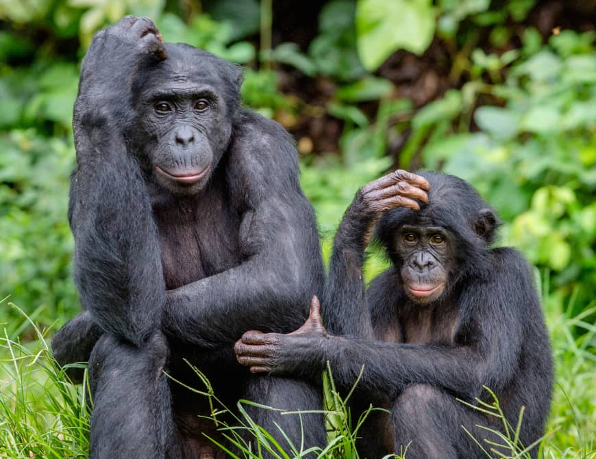

It’s breakfast time. You’re hungry. There’s a plate on the table. Two toasted bagels lie waiting. The most glorious array of fillings and condiments you’ve ever seen lie next to them. Salivation. Salvation. Any combination imaginable. It’s all yours...

But then suddenly I shove my way past you and eat both bagels right in your face.

And I chew with my mouth wide open.

And I’d already eaten breakfast.

I doubt there’s a human being on Earth who’d find my behavior tolerable here. We humans like our food, but our sensitivity to fairness is keener even than hunger. From children decrying the confiscation of their favorite toys and the rage felt for commuters jumping queues, to more serious issues like gross wealth inequality and racial discrimination: wherever unfairness goes in human affairs, outrage often follows.

Our sensitivity to fairness indicates our status as moral beings. We all have ideas about what constitutes ‘right’ and ‘wrong’, ‘just’ and ‘unjust’, ‘good’ and ‘evil’. Philosophers, especially, have spilled oceans of ink throughout the ages attempting to articulate their ideas on such matters.

But _why_ do we act morally? And where do our moral ideas come from? Are they given to us? Are they reached through reason? Or are they hardwired into our DNA?

## Rules come from above: top-down morality

For the vast majority of human civilization, morality has been viewed as something that sits on top of human nature. Human nature cannot be trusted — we’re all selfish monsters — so we need rules to ensure good, cooperative behavior.

Who creates these rules? Well, religions cast God as the moral authority; while philosophers from Aristotle to Kant have put forward frameworks that permit Reason to settle all things right and wrong. 

It doesn’t really matter which authority is invoked here — God or Reason — what is important is that these kinds of theories formulate principles and then impose them on human conduct. The Ten Commandments; The Golden Rule (treat others as you wish to be treated); Utilitarianism — all these moral systems share this top-down orientation, and imply that without imposed rules our natural tendency would be to run riot.

    <h4>How Should We Approach Life?</h4>
    
Get philosophy's best answers delivered direct to your inbox with our celebrated introduction to philosophy course.

    <a class="button secondary" href="/lifes-big-questions/"><svg xmlns="http://www.w3.org/2000/svg" viewBox="0 0 512 512"><path d="M504 256C504 119 393 8 256 8S8 119 8 256s111 248 248 248 248-111 248-248zm-448 0c0-110.5 89.5-200 200-200s200 89.5 200 200-89.5 200-200 200S56 366.5 56 256zm72 20v-40c0-6.6 5.4-12 12-12h116v-67c0-10.7 12.9-16 20.5-8.5l99 99c4.7 4.7 4.7 12.3 0 17l-99 99c-7.6 7.6-20.5 2.2-20.5-8.5v-67H140c-6.6 0-12-5.4-12-12z"/></svg>Explore Course Now</a>

Articulating the optimal top-down moral system has caused much excitement over the course of human civilization. Despite wars fought with both weapons and words, establishing a victor has proven difficult: finding a set of universal moral laws that suits everyone, it turns out, is not particularly easy. Religious people fight religious people; religious people fight nonreligious people; and nonreligious people fight nonreligious people.

This lack of progress has enabled a new player to enter the game. With compelling research into animal behavior over the last few decades, biology has arrived to turn top-down moral frameworks quite literally on their heads.

## Rules come from within: bottom-up morality

In his book [The Bonobo and the Atheist](http://www.amazon.com/gp/product/0393347796/ref=as_li_tl?ie=UTF8&camp=1789&creative=9325&creativeASIN=0393347796&linkCode=as2&tag=philosophybre-20&linkId=b8d22117bc2c7ae9baab95ffa07722dc), Dutch primatologist Frans de Waal sets out his stall early. “Perhaps it’s just me,” he says, “but I am wary of any persons whose belief system is the only thing standing between them and repulsive behavior. Why not assume that our humanity, including the self-control needed for a livable society, is built into us?”

De Waal acknowledges his alignment to the moral project of David Hume, the brilliant 18th-century philosopher who famously stated that “reason is the slave of the passions” and argued our moral status is rooted not in our rationality but in our emotions. 

In [The Bonobo and the Atheist](http://www.amazon.com/gp/product/0393347796/ref=as_li_tl?ie=UTF8&camp=1789&creative=9325&creativeASIN=0393347796&linkCode=as2&tag=philosophybre-20&linkId=b8d22117bc2c7ae9baab95ffa07722dc), De Waal aims to support this case and pulls together decades of research to show that key components of human morality — fairness, kindness, empathy — are dependent not on rational thought, nor unique to human nature, but have evolved as _impulses_ in multiple mammalian groups to further cooperation and survival.

De Waal talks fondly — with a hint of anthropomorphism, critics might say — of how bonobos look after disadvantaged members of the group, care for their elderly, and peacefully settle disputes. Indeed, his discussions suggest that the only authority that need be invoked when it comes to the origin of right and wrong is our own biology.

>Our best-known ‘moral laws’ offer nice post hoc summaries of what we consider moral, but are limited in scope and full of holes. Morality has much more humble beginnings, which are recognizable in the behavior of other animals. Everything science has learned in the last few decades argues against the pessimistic view that morality is a thin veneer over a nasty human nature. On the contrary, our evolutionary background lends a massive helping hand without which we would never have gotten this far.

Think about it, demands De Waal: do we make everyday moral decisions by painstakingly reasoning over them, consulting internal rulebooks? Instead, he wonders, “what if morality is created in day-to-day social interaction, not at some abstract mental level? What if it is grounded in the emotions, which most of the time escape the neat categorizations that science is fond of?”

Indeed, it is little wonder that we have struggled to find a blanket moral framework that works for everyone's rationale, De Waal thinks, for Hume had it right: morality has its roots in our emotions. 

Top-down moral frameworks were thought up thanks to, as De Waal puts it, “a huge push in the rear from our background as social animals.” In other words, our fundamental motivation to devise such moral theories comes not from special holy or rational insight, but from social and emotional intuitions that have evolved over millennia.

After all, questions De Waal: 

>Would it be realistic to urge people to be considerate of others if we didn’t already have a natural inclination to be so? Would it make sense to appeal to fairness and justice if we didn’t have powerful reactions to their absence?

## We're all just monkeys refusing cucumber for grapes

De Waal’s arguments, backed by accumulating research as they are, are difficult to ignore for advocates of top-down moral frameworks. That morality is grounded in emotional intuition may be an unpopular idea for lovers of reason like Immanuel Kant, but it is an unarguable one for followers of Hume, an intuitive one in day-to-day lived experience — and a research-backed one in biology.

Even if you are unconvinced by De Waal's arguments, [The Bonobo and the Atheist](http://www.amazon.com/gp/product/0393347796/ref=as_li_tl?ie=UTF8&camp=1789&creative=9325&creativeASIN=0393347796&linkCode=as2&tag=philosophybre-20&linkId=b8d22117bc2c7ae9baab95ffa07722dc) remains a fascinating read, packed full of interesting and sometimes hilarious animal studies on fairness — not least [this one](https://www.youtube.com/watch?v=meiU6TxysCg) regarding an outraged monkey absolutely refusing to eat cucumber slices on seeing his partner receive grapes.

As De Waal puts it, if nothing else, his Humean, bottom-up, biology-driven approach to morality acts as an important counterweight to top-down, hyper-religious or hyper-‘rational’ views:

>[It] deserves attention at a time in which even avowed atheists are unable to wean themselves from a semi-religious morality, thinking that the world would be a better place if only a white-coated priesthood could take over from the frocked one.

## Further reading

If you're interested in learning more about ethics and morality generally, and in exploring some counterpunches to De Waal's position regarding its origins, [we've compiled a reading list](/reading-lists/ethics-and-morality/) consisting of the subject's best writings. Hit the banner below to access it now. 

<a class="reading-list cta" href="/reading-lists/ethics-and-morality/">
    
    

    

        <svg xmlns="http://www.w3.org/2000/svg" viewBox="0 0 576 512"><path fill="#fff" d="M542.22 32.05c-54.8 3.11-163.72 14.43-230.96 55.59-4.64 2.84-7.27 7.89-7.27 13.17v363.87c0 11.55 12.63 18.85 23.28 13.49 69.18-34.82 169.23-44.32 218.7-46.92 16.89-.89 30.02-14.43 30.02-30.66V62.75c.01-17.71-15.35-31.74-33.77-30.7zM264.73 87.64C197.5 46.48 88.58 35.17 33.78 32.05 15.36 31.01 0 45.04 0 62.75V400.6c0 16.24 13.13 29.78 30.02 30.66 49.49 2.6 149.59 12.11 218.77 46.95 10.62 5.35 23.21-1.94 23.21-13.46V100.63c0-5.29-2.62-10.14-7.27-12.99z"/></svg>READING LIST
        

        <h3>Ethics and Morality</h3>
        
The Top 9 Books to Read

    
    
    <svg class="cta swing" xmlns="http://www.w3.org/2000/svg" viewBox="0 0 320 512"><path d="M285.476 272.971L91.132 467.314c-9.373 9.373-24.569 9.373-33.941 0l-22.667-22.667c-9.357-9.357-9.375-24.522-.04-33.901L188.505 256 34.484 101.255c-9.335-9.379-9.317-24.544.04-33.901l22.667-22.667c9.373-9.373 24.569-9.373 33.941 0L285.475 239.03c9.373 9.372 9.373 24.568.001 33.941z"/></svg>
</a>