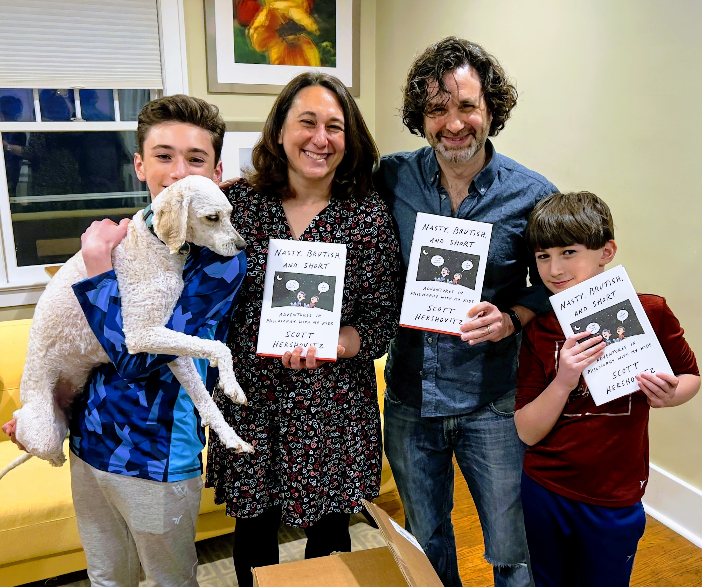
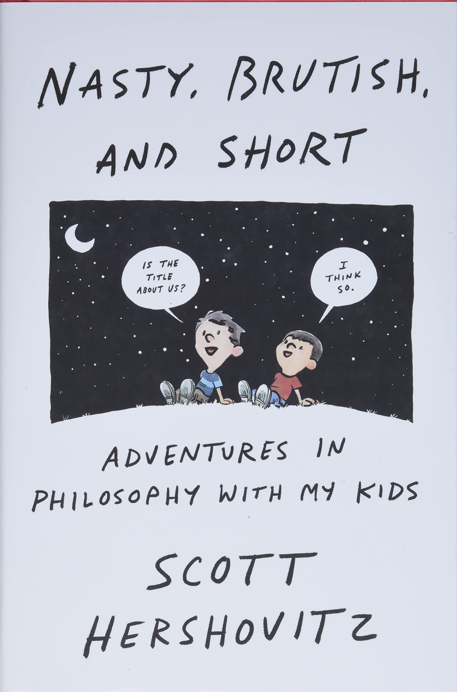

<i><a target="_blank" rel="noopener noreferrer" href="https://www.scotthershovitz.com/">Scott Hershovitz</a> is the Thomas G. and Mabel Long Professor of Law and Professor of Philosophy at the University of Michigan. His academic work focuses on law and philosophy, and has appeared in the Harvard Law Review, The Yale Law Journal, and Ethics, among other places.

We caught up with Scott about his new book, <a target="_blank" rel="noopener noreferrer sponsored" href="http://www.amazon.com/Nasty-Brutish-Short-Adventures-Philosophy/dp/1984881817?&linkCode=ll1&tag=philosophybre-20&linkId=800e142093390a09b2939a04e163bc9d&language=en_US&ref_=as_li_ss_tl">Nasty, Brutish, and Short: Adventures in Philosophy with My Kids</a>, which offers an incredibly entertaining and informative introduction to philosophy through conversations Scott has with his two young sons, Rex and Hank. 

Together, Scott, Rex, and Hank explore classic and contemporary philosophy, discussing questions like, how does Hank know he’s not dreaming all the time? Does Scott have authority over Rex and Hank? Is the red Rex sees the same as the red everyone else sees? When is it okay to swear? And, does the number six exist? Scott seeks to demonstrate that, ultimately, we shouldn’t just encourage children in their boundless questioning about existence: we should join them, so that we can rekindle our own curiosity about the world.</i>

## How did the idea for your book — investigating philosophy with children — come about?

So the idea came in stages, actually. Shortly after I had kids, I realized I was talking about them a lot to my students in class. If we were discussing punishment, for example, I’d describe something one of my kids had done and ask my students how they thought I should respond. It was a way of getting a conversation going about the purposes of punishment, without necessarily diving straight into the abstract philosophy I’d prepared for the day. 

I teach my students about the philosophy of law and authority. And my kids are challenging my authority all the time. When he was around three years old, for instance, my older son, Rex, picked up _“you’re not the boss of me.”_ And I thought, well, actually, I kind of am... But I put that question to my class: _am I his boss?_ If so, why? And then we eventually transition to thinking about authority among adults or in the legal system. 

So, for years, it was just part of my stock of teaching tricks. But I never really thought about writing a book until I was out at the University of California, Irvine. There’s a philosopher there named Aaron James who wrote a popular book a while ago called <a target="_blank" rel="noopener noreferrer sponsored" href="http://www.amazon.com/Assholes-Theory-Aaron-James/dp/0804171351?&linkCode=ll1&tag=philosophybre-20&linkId=dac03b39d5f2c8bfe44f8528d553f070&language=en_US&ref_=as_li_ss_tl">Assholes: A Theory</a>. I was out at UC Irvine giving a paper, and I met Aaron and a few others for dinner. I was having trouble getting people to see a particular point I was making, and so I told them a story about my little one, Hank, and about arguments we’ve had about the rules in our house. 

As I finished telling that story, two things happened. One is that everyone at the table understood what I was saying, and the second was that Aaron leaned over and said, “that’s your book.” 

So Aaron provided a huge assist, and ever since he said that I was thinking, “how can I make this happen?” And I eventually got connected to an agent and took all these stories that I use for teaching and put them in a book for a bigger audience.

## What do you think makes children have such an aptitude for philosophy?

I think it’s a couple of things. Firstly, they don’t know a lot about the world: they’re just really puzzled by it. And part of not knowing about the world is not knowing what other people take for granted, or what the standard explanations of things are. They’re constantly seeing things and wondering, for example, why someone gets to tell them what to do, or how big the universe is — whatever it is that pops into their head, they’re curious about it and thinking it through. 

And then I think the second thing is they’re just fearless as thinkers, for a variety of reasons. They’re not afraid about being wrong — they’re wrong all the time — and it’s not embarrassing to them that they’re wrong. 

>I think there’s this sweet spot for kids, before they are really focused on what other people think of them, when they’re just really willing to share their ideas and questions.

An example in the book is Rex’s argument, when he was seven, about how big the universe is. He argues it must be infinite, because if it was finite, what would happen if he traveled to the edge? Rex suggests if he punches the edge, he’d either punch through it, meaning there’s no edge after all, or something would stop his punch, meaning — again — that there is something beyond the apparent edge.

I think if he thought of that argument when he was older, not even that much older, say when he was thirteen rather than seven, he wouldn’t have been so forthcoming with it. Self-consciousness may have held him back: “what makes _you_ think you can figure out how big the universe is?” So, I think there’s this sweet spot for kids, before they are really focused on what other people think of them, when they’re just really willing to share their ideas and questions. 

## You give some examples of questions children ask that cut right to the heart of philosophical issues, for example a boy named Ian who, unable to watch his favorite TV channel because three people want to watch something else, asks: “why is it better for three people to be selfish than one?”

That is maybe my favorite question in the book, actually. It was recorded by Gareth Matthews, a philosopher who dedicated most of his career to kids. 

The point is that the child who asked that question, Ian, hasn’t yet been acculturated in the way we make decisions, so this is the first time he’s encountered the idea that if more people want something, that makes it the right or fair thing to do. His question is a challenge to certain economic ways of thinking about the world, i.e. that we should just be trying to maximize the satisfaction of people’s preferences. It’s also a challenge to democracy in a really interesting way: if people are voting for their selfish interests, why is that a good way of making decisions?

Ian’s is a fantastic question and is typical of the kind that children ask seemingly effortlessly in ways that undermine our social practices. Once you have an eye out for these kinds of inquiries, you’ll start noticing kids saying all sorts of philosophically interesting things just with their casual comments and queries.

<!--big subscribe-->

    
    <h4>From the Buddha to Nietzsche: join 8,000+ subscribers enjoying my free Sunday Breakdown</h4>
    
In one concise email each Sunday, I break down a famous idea from philosophy. You get the distillation straight to your inbox.

    

        <form action="https://app.convertkit.com/forms/5812400/subscriptions" method="post" data-sv-form="5812400" data-uid="be0e52d3c0" data-format="inline" data-version="6" data-options="{&quot;settings&quot;:{&quot;after_subscribe&quot;:{&quot;action&quot;:&quot;message&quot;,&quot;success_message&quot;:&quot;Thank you, philosopher! Your welcome email will land in your inbox shortly.&quot;,&quot;redirect_url&quot;:&quot;https://philosophybreak.com/thank-you/&quot;},&quot;analytics&quot;:{&quot;google&quot;:null,&quot;fathom&quot;:null,&quot;facebook&quot;:null,&quot;segment&quot;:null,&quot;pinterest&quot;:null,&quot;sparkloop&quot;:null,&quot;googletagmanager&quot;:null},&quot;modal&quot;:{&quot;trigger&quot;:&quot;timer&quot;,&quot;scroll_percentage&quot;:null,&quot;timer&quot;:5,&quot;devices&quot;:&quot;all&quot;,&quot;show_once_every&quot;:15},&quot;powered_by&quot;:{&quot;show&quot;:false,&quot;url&quot;:&quot;https://convertkit.com/features/forms?utm_campaign=poweredby&amp;utm_content=form&amp;utm_medium=referral&amp;utm_source=dynamic&quot;},&quot;recaptcha&quot;:{&quot;enabled&quot;:false},&quot;return_visitor&quot;:{&quot;action&quot;:&quot;show&quot;,&quot;custom_content&quot;:&quot;&quot;},&quot;slide_in&quot;:{&quot;display_in&quot;:&quot;bottom_right&quot;,&quot;trigger&quot;:&quot;timer&quot;,&quot;scroll_percentage&quot;:null,&quot;timer&quot;:5,&quot;devices&quot;:&quot;all&quot;,&quot;show_once_every&quot;:15},&quot;sticky_bar&quot;:{&quot;display_in&quot;:&quot;top&quot;,&quot;trigger&quot;:&quot;timer&quot;,&quot;scroll_percentage&quot;:null,&quot;timer&quot;:5,&quot;devices&quot;:&quot;all&quot;,&quot;show_once_every&quot;:15}},&quot;version&quot;:&quot;6&quot;}" min-width="400 500 600 700 800">
        
<ul data-element="errors" data-group="alert"></ul>

            

                <input name="email_address" aria-label="Your Email Address..." placeholder="Your Email Address..." required type="email" />
            

            <button class="button primary" type="submit" data-element="submit">

<svg xmlns="http://www.w3.org/2000/svg" viewBox="0 0 512 512"><path d="M464 64H48C21.49 64 0 85.49 0 112v288c0 26.51 21.49 48 48 48h416c26.51 0 48-21.49 48-48V112c0-26.51-21.49-48-48-48zm0 48v40.805c-22.422 18.259-58.168 46.651-134.587 106.49-16.841 13.247-50.201 45.072-73.413 44.701-23.208.375-56.579-31.459-73.413-44.701C106.18 199.465 70.425 171.067 48 152.805V112h416zM48 400V214.398c22.914 18.251 55.409 43.862 104.938 82.646 21.857 17.205 60.134 55.186 103.062 54.955 42.717.231 80.509-37.199 103.053-54.947 49.528-38.783 82.032-64.401 104.947-82.653V400H48z"/></svg>Join 8,000+ Subscribers</button>
            

            

        </form>
        
💭 One short philosophical email each Sunday. Unsubscribe any time.

    

## Why do you think parents or adults sometimes shut down these kinds of questions? 

I think for a few reasons. One is often they don’t know the answers. I think grown ups are a little bit uncomfortable when they don’t know the answer to kids’ questions — and that’s any question, not just philosophical questions. 

>I think what a lot of adults are missing is that philosophy can be fun _because_ you don’t know the answer. 

I remember before my wife and I had kids, a philosophy professor at UCLA, Mark Greenberg, came to visit us along with his wife and daughter. Mark’s daughter asked him a question about some steam coming out of a grate, and Mark actually knew the answer. What I was so struck by, because I hadn’t spent a lot of time around parents or kids, is that he gave a complete scientific answer — he explained exactly where the water vapor was coming from and why it looked the way it did. And I thought, how cool is that? He just treated her like a grown up who didn’t know the explanation, and he gave this girl who was probably three or four at the time the complete answer. And I thought if I have kids, I’m going to do that.

You realize, of course, that you’re limited in your ability. And sometimes you have to say things like “I don’t know” or “here’s a guess. Maybe we’ll go look it up.” But I think what a lot of adults are missing is that philosophy can be fun _because_ you don’t know the answer. 

This is a point that Gareth Mathews makes: that most conversations between adults and kids are hierarchical, where adults _tell_ kids the answer; whereas in philosophy, it’s much easier to say, “Hey, I don't know, what do you think?” And then have a collaborative conversation about it.

## And kids aren’t going to judge you for that. They’re going to be excited to participate in a dialogue.  

That’s right. They’re pleased to have you take their views seriously and that you’re interested in what they have to say... I suppose another reason adults may find it uncomfortable when kids ask philosophical questions, if we think back to Ian’s question about selfishness, is that sometimes within the question is a challenge to the adults, an implicit criticism that they’ve made a mistake, and that can make the questions not so well received.

## How do you strike a balance between exploring the philosophical content of a child’s question, and sometimes just having to parent?

I mean, I’m pretty indulgent, as you can tell by the book. But one piece of advice I have for folks is if you don’t have time or you’re just too frazzled in the moment, just return to the question later. The most fruitful time in our family to have conversations, for example, is at bedtime, as the kids are trying to extend the time before the lights go out. It’s also quiet and peaceful and you can say, hey, earlier you asked about this, you’re wondering about that, or this happened… so I try to come back to the questions if I don’t have time to deal with them in the moment.

## Your wife Julie is a social worker and features as a harmonious figure in the book. Does she ever become impatient with your philosophical questioning of the children? 

I think she’s more amused than impatient, though I suspect sometimes she might be a little impatient, too! When Rex and Hank first came along, she sometimes commented that she never would have thought to talk to them about, say, infinity, authority, or whether the universe is a simulation — but there’s certainly no tension between us on that.

## Why is thinking philosophically something we want to encourage in children?

I think there’s a few reasons. Maybe it’s just the kind of philosopher I am, but I’m committed to thinking having philosophical conversations with your kids is a fun, worthwhile activity that doesn’t have to be instrumentally valuable. So that’s part of what I want to say to parents: your kids are really smart and deep thinkers, and you should appreciate them as they are, not just think of them as a project or runway to someplace else. So partly I just want to say: enjoy this aspect of your kid, and you’ll have fun, too. 

I also hope that by encouraging kids to really think deeply and carefully about things — and be open to questioning things — that they can carry such an attitude into adulthood. 

And, to the extent that kids may close down a little bit because they think other people aren’t interested in their ideas, by having these thoughtful conversations with your kids maybe you can help them recognize that their ideas are valuable, and that thinking philosophically is a valuable activity.

## Are there any areas of discussion you think are off-limits for children?

I don’t think there’s any topics entirely off limits, but you might want to change the way you talk about certain things. From the time kids hear about death, there are going to be lots of questions about death. And we want our kids to be aware in general terms of what’s going on. So, for example, we’ve had conversations about the war, about the killings of civilians in the war, about police brutality in the States, but we don’t then go ahead and turn on the news and show them videos of that. 

I think it’s not about being selective with topics, it’s more about being selective with the imagery and ideas you put in their heads around those topics.

## There’s a very interesting discussion in the book on echo chambers, and how you try not to share your views on the credibility of various media sources with your kids, as you want to be careful not to impose bias. How do you try to ensure they’re able to judge the credibility of sources on their own? 

I’m still thinking about that, actually. And if you asked me parts of the book where I’m a little uncertain about what I said, this part is one of them. And that’s because in the States, we have a real problem with some media sources that are just relentlessly ideological and present false narratives about the world. And I don’t want to hide that fact from my kids, but I also don’t want to impose my own judgments on them. 

So, I suggest a set of questions, such as: are these real journalists? If these people discovered they were wrong, do I trust them to tell me? Do they issue corrections? 

I want to teach my kids that when you encounter news stories, here’s a way in which you go about evaluating their credibility. But, with that, the way the balance is struck is to make it clear to them that the mere fact that someone disagrees with you, or has a viewpoint different to yours, is not evidence that they’re wrong.

## Who would you say is the ideal reader for your book?

There are a number of different buckets here. Maybe first and foremost, I think parents of young kids will get a lot out of the book. They may see their own kids in it and learn new ways of talking to their kids. And beyond parents there’s grandparents, teachers, and really anybody that spends time with young kids. 

But I hope the book can find a broader audience than that, because as I mentioned earlier, people just light up when you talk about kids. Kids are fun, they’re funny, and they make these questions accessible. And so I wrote the book in the hope that it would be a fun introduction to philosophy for anybody who’s new to the field.

<!--small subscribe-->

    <h4>In one concise email each Sunday, I break down a famous idea from philosophy. You get the distillation straight to your inbox:</h4>
    

        <form action="https://app.convertkit.com/forms/5812400/subscriptions" method="post" data-sv-form="5812400" data-uid="be0e52d3c0" data-format="inline" data-version="6" data-options="{&quot;settings&quot;:{&quot;after_subscribe&quot;:{&quot;action&quot;:&quot;message&quot;,&quot;success_message&quot;:&quot;Thank you, philosopher! Your welcome email will land in your inbox shortly.&quot;,&quot;redirect_url&quot;:&quot;https://philosophybreak.com/thank-you/&quot;},&quot;analytics&quot;:{&quot;google&quot;:null,&quot;fathom&quot;:null,&quot;facebook&quot;:null,&quot;segment&quot;:null,&quot;pinterest&quot;:null,&quot;sparkloop&quot;:null,&quot;googletagmanager&quot;:null},&quot;modal&quot;:{&quot;trigger&quot;:&quot;timer&quot;,&quot;scroll_percentage&quot;:null,&quot;timer&quot;:5,&quot;devices&quot;:&quot;all&quot;,&quot;show_once_every&quot;:15},&quot;powered_by&quot;:{&quot;show&quot;:false,&quot;url&quot;:&quot;https://convertkit.com/features/forms?utm_campaign=poweredby&amp;utm_content=form&amp;utm_medium=referral&amp;utm_source=dynamic&quot;},&quot;recaptcha&quot;:{&quot;enabled&quot;:false},&quot;return_visitor&quot;:{&quot;action&quot;:&quot;show&quot;,&quot;custom_content&quot;:&quot;&quot;},&quot;slide_in&quot;:{&quot;display_in&quot;:&quot;bottom_right&quot;,&quot;trigger&quot;:&quot;timer&quot;,&quot;scroll_percentage&quot;:null,&quot;timer&quot;:5,&quot;devices&quot;:&quot;all&quot;,&quot;show_once_every&quot;:15},&quot;sticky_bar&quot;:{&quot;display_in&quot;:&quot;top&quot;,&quot;trigger&quot;:&quot;timer&quot;,&quot;scroll_percentage&quot;:null,&quot;timer&quot;:5,&quot;devices&quot;:&quot;all&quot;,&quot;show_once_every&quot;:15}},&quot;version&quot;:&quot;6&quot;}" min-width="400 500 600 700 800">
        
<ul data-element="errors" data-group="alert"></ul>

            

                <input name="email_address" aria-label="Your Email Address..." placeholder="Your Email Address..." required type="email" />
            

            <button class="button primary" type="submit" data-element="submit">

<svg xmlns="http://www.w3.org/2000/svg" viewBox="0 0 512 512"><path d="M464 64H48C21.49 64 0 85.49 0 112v288c0 26.51 21.49 48 48 48h416c26.51 0 48-21.49 48-48V112c0-26.51-21.49-48-48-48zm0 48v40.805c-22.422 18.259-58.168 46.651-134.587 106.49-16.841 13.247-50.201 45.072-73.413 44.701-23.208.375-56.579-31.459-73.413-44.701C106.18 199.465 70.425 171.067 48 152.805V112h416zM48 400V214.398c22.914 18.251 55.409 43.862 104.938 82.646 21.857 17.205 60.134 55.186 103.062 54.955 42.717.231 80.509-37.199 103.053-54.947 49.528-38.783 82.032-64.401 104.947-82.653V400H48z"/></svg>Join 8,000+ Subscribers</button>
            

            

        </form>
        
💭 One short philosophical email each Sunday. Unsubscribe any time.

    

I also hope that the book is doing enough new along the way that people who were, say, philosophy majors or have a general interest in philosophy and want to revisit it will find some things that are familiar and some things that are new to think about. The book was quite consciously twelve chapters in length to mirror the kind of thing you could spread out over the course of a semester at university, or maybe even secondary school.

## Speaking of school, would you like to see philosophy on the school curriculum?

I am completely behind that. I think there are lots of benefits, some of which we’ve already spoken about — like raising kids who are willing to challenge things, to question assumptions, to think deeply and carefully about the world, and so on. 

But I also think that what you see through the existing programs of philosophy in schools is they’re teaching kids additional skills about how to disagree agreeably: how to have calm conversations with each other about difficult issues.

>My hope would be if this kind of philosophical discussion was a more regular part of our education, then we could have a culture that thought deeper and was more respectful, rather than one side shouting at the other.

For example, I just taught a class to my law students, an older group of course, but it was called Life, Death, Love and the Law. It was about ethical issues that arise at the beginning and end of life, ethical issues about whether you should have kids, ethical questions about abortion, ethical questions about euthanasia. The students in my class had a really wide range of backgrounds — different religious upbringings, different political views, so there were lots of different perspectives in the room on these questions.

We set a tone early on: we’re going to question each other’s views, we’re going to question our own views, we’re going to be respectful of each other and the fact that many people in the room have personal experience of these issues. If you’re not up for a really deep interrogation of these issues, then you don’t have to be here. You can drop this class. There’s no point in being in this room. 

The semester was phenomenal. People who on the one side, for instance, may have felt that abortion is a kind of murder, and people on the other side who thought that equality absolutely demands the right to terminate a pregnancy — these people had really thoughtful discussions with each other and came to better understand each other’s views. 

My hope would be if this kind of philosophical discussion was a more regular part of our education, then we could have a culture that thought deeper and was more respectful, rather than one side shouting at the other. 

Maybe that’s a bit of a pipe dream, but if I can ask you questions or criticize your view without shouting you down, if I can respect that given you’re a person in the world, it’s worth trying to understand how you came to have your view, then maybe I’ll learn something. Maybe I’ll discover that I’m wrong; maybe I’ll spot reasons I think you’re wrong and share them with you, calmly and respectfully. If we could get in the practice of doing that more regularly, we’d be in a better place, I think. 

&nbsp;

<i>You can order Scott’s new book <a target="_blank" rel="noopener noreferrer sponsored" href="http://www.amazon.com/Nasty-Brutish-Short-Adventures-Philosophy/dp/1984881817?&linkCode=ll1&tag=philosophybre-20&linkId=800e142093390a09b2939a04e163bc9d&language=en_US&ref_=as_li_ss_tl">Nasty, Brutish, and Short: Adventures in Philosophy with My Kids here</a>, or simply hit the banner below.</i>

    <a target="_blank" rel="noopener noreferrer sponsored" href="http://www.amazon.com/Nasty-Brutish-Short-Adventures-Philosophy/dp/1984881817?&linkCode=ll1&tag=philosophybre-20&linkId=800e142093390a09b2939a04e163bc9d&language=en_US&ref_=as_li_ss_tl">
        
        

            <h4>Nasty, Brutish, and Short: Adventures in Philosophy with My Kids</h4>
            
<svg xmlns="http://www.w3.org/2000/svg" viewBox="0 0 50 50"><path d="M48.336,7.54c-0.701,0-1.359,0.007-2.018,0.024V5.326h-0.734c-14.262,0-19.043,3.411-20.585,5.252 c-1.542-1.841-6.323-5.252-20.585-5.252H3.68v2.237C3.022,7.545,2.364,7.54,1.664,7.54H0V39.89h1.664 c17.595,0,21.186,4.035,21.698,4.784h3.302c0.557-0.784,4.218-4.784,21.673-4.784H50V7.54H48.336z M23.899,38.431 c-2.457-1.812-7.611-3.914-18.383-4.054V7.175c15.087,0.194,18.001,4.327,18.383,5V38.431z M44.484,34.377 c-10.772,0.14-15.926,2.24-18.383,4.054V12.184c0.416-0.737,3.412-4.814,18.383-5.007V34.377z"></path></svg>BY SCOTT HERSHOVITZ

            <svg xmlns="http://www.w3.org/2000/svg" viewBox="0 0 576 512"><path d="M576 24v127.984c0 21.461-25.96 31.98-40.971 16.971l-35.707-35.709-243.523 243.523c-9.373 9.373-24.568 9.373-33.941 0l-22.627-22.627c-9.373-9.373-9.373-24.569 0-33.941L442.756 76.676l-35.703-35.705C391.982 25.9 402.656 0 424.024 0H552c13.255 0 24 10.745 24 24zM407.029 270.794l-16 16A23.999 23.999 0 0 0 384 303.765V448H64V128h264a24.003 24.003 0 0 0 16.97-7.029l16-16C376.089 89.851 365.381 64 344 64H48C21.49 64 0 85.49 0 112v352c0 26.51 21.49 48 48 48h352c26.51 0 48-21.49 48-48V287.764c0-21.382-25.852-32.09-40.971-16.97z"/></svg>View on Amazon
        

    </a>

