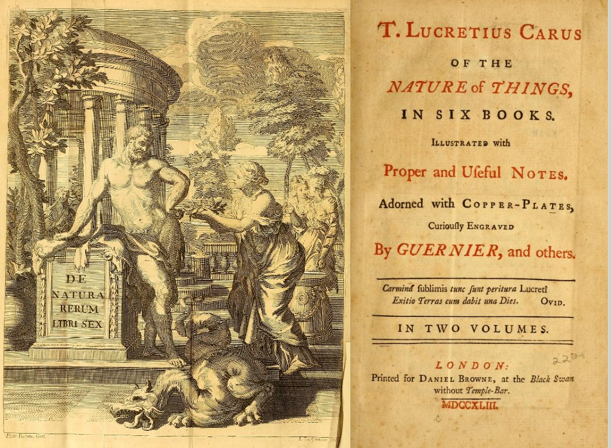

Lucretius was a Roman poet and philosopher born in 94 BCE, best-known for his epic poem De Rerum Natura (On The Nature of Things). <a target="_blank" rel="noopener noreferrer sponsored" href="https://www.amazon.com/gp/product/0140447962/ref=as_li_tl?ie=UTF8&tag=philosophybre-20&camp=1789&creative=9325&linkCode=as2&creativeASIN=0140447962&linkId=479a12c489586060bdaa64ed1703fd90">On The Nature of Things</a> is a didactic, six-book work exploring everything from the fundamental nature of reality and what we can know, to the character of goodness and how we should best live. Since its publication over 2,000 years ago, the poem has been celebrated by such thinkers as Montaigne, Thomas Jefferson, and Einstein.

Why has <a target="_blank" rel="noopener noreferrer sponsored" href="https://www.amazon.com/gp/product/0140447962/ref=as_li_tl?ie=UTF8&tag=philosophybre-20&camp=1789&creative=9325&linkCode=as2&creativeASIN=0140447962&linkId=479a12c489586060bdaa64ed1703fd90">On The Nature of Things</a> been valued so highly throughout the ages? Well, not only does Lucretius write beautifully, but he also reveals crucial insight into the works of ancient Greek philosopher Epicurus, much of whose work had been lost. Indeed, in all the ground it covers, Lucretius’s poem essentially propounds the core tenets and [philosophy of Epicureanism](/articles/epicureanism-defined-philosophy-is-a-form-of-therapy/).

## What is Epicureanism?

Epicureanism, as we [define it in our short Epicureanism explainer](/articles/epicureanism-defined-philosophy-is-a-form-of-therapy/), is a system of philosophy based on the teachings of ancient Greek thinker Epicurus, founded around 307 BCE. Often caricatured today as an exclusively pleasure-seeking, hedonistic stance towards the world, Epicurean thinking is actually more focused on eradicating pain, fear, and anxiety from our day-to-day lives. This is clear from [Epicurus’s Principal Doctrines](/articles/epicurus-principal-doctrines-40-aphorisms-for-living-well/), a remaining fragment of his work that consists of 40 brilliant aphorisms on how to live well, and which features in our list of the [Epicureanism’s best books](/reading-lists/epicureanism/). 

As Lucretius summarizes in book two of <a target="_blank" rel="noopener noreferrer sponsored" href="http://www.amazon.com/gp/product/0140447962/ref=as_li_tl?ie=UTF8&tag=philosophybre-20&camp=1789&creative=9325&linkCode=as2&creativeASIN=0140447962&linkId=479a12c489586060bdaa64ed1703fd90">On The Nature of Things</a>, Epicurists believe the ultimate good for human nature is as follows:

>To avoid bodily pain, to have a mind free from anxiety and fear, and to enjoy the pleasures of the senses.

And, to satisfy these goods, Lucretius continues, we don’t need anything lavish, expensive, or complicated: the solutions to our needs can be remarkably simple. As he expounds:

>It is plain to see that our bodily nature needs very few things to banish pain, and to furnish us with many pleasures that are enjoyable from time to time. Nature herself does not complain if the halls are not full of golden statues of youths holding flaming torches to light up the banquets that go on all night, or if the house is not sparkling with silver and gleaming with gold, while the music echoes round the gilded rafters. For by the riverside, stretched out on the soft grass under the shade of a tall tree, people can relax and enjoy themselves far better without all that expense, especially when the weather smiles on them and the spring scatters the green meadow with flowers.

But Epicureanism goes beyond prescribing how to live: it also offers a complete description of reality, one that is startlingly prescient to the physics of today. Advocating an atomic view of the universe, Epicurean thought on this matter can largely be summed up by a quote from an even earlier thinker, Democritus (born around 460 BCE): 

>Nothing exists except atoms and empty space, everything else is opinion.

Indeed, Epicurus taught that the basic constituents of the world are irreducible bits of matter flying through the void, and he tried to explain all natural phenomena in such terms. He rejected the existence of an immaterial soul, or of anything non-physical, and said that the gods have no influence on our lives.

<!--big subscribe-->

    
    <h4>From the Buddha to Nietzsche: join 11,000+ subscribers enjoying my free Sunday Breakdown</h4>
    
In one concise email each Sunday, I break down a famous idea from philosophy. You get the distillation straight to your inbox.

    

        <form action="https://app.convertkit.com/forms/5812400/subscriptions" method="post" data-sv-form="5812400" data-uid="be0e52d3c0" data-format="inline" data-version="6" data-options="{&quot;settings&quot;:{&quot;after_subscribe&quot;:{&quot;action&quot;:&quot;message&quot;,&quot;success_message&quot;:&quot;Thank you, philosopher! Your welcome email will land in your inbox shortly.&quot;,&quot;redirect_url&quot;:&quot;https://philosophybreak.com/thank-you/&quot;},&quot;analytics&quot;:{&quot;google&quot;:null,&quot;fathom&quot;:null,&quot;facebook&quot;:null,&quot;segment&quot;:null,&quot;pinterest&quot;:null,&quot;sparkloop&quot;:null,&quot;googletagmanager&quot;:null},&quot;modal&quot;:{&quot;trigger&quot;:&quot;timer&quot;,&quot;scroll_percentage&quot;:null,&quot;timer&quot;:5,&quot;devices&quot;:&quot;all&quot;,&quot;show_once_every&quot;:15},&quot;powered_by&quot;:{&quot;show&quot;:false,&quot;url&quot;:&quot;https://convertkit.com/features/forms?utm_campaign=poweredby&amp;utm_content=form&amp;utm_medium=referral&amp;utm_source=dynamic&quot;},&quot;recaptcha&quot;:{&quot;enabled&quot;:false},&quot;return_visitor&quot;:{&quot;action&quot;:&quot;show&quot;,&quot;custom_content&quot;:&quot;&quot;},&quot;slide_in&quot;:{&quot;display_in&quot;:&quot;bottom_right&quot;,&quot;trigger&quot;:&quot;timer&quot;,&quot;scroll_percentage&quot;:null,&quot;timer&quot;:5,&quot;devices&quot;:&quot;all&quot;,&quot;show_once_every&quot;:15},&quot;sticky_bar&quot;:{&quot;display_in&quot;:&quot;top&quot;,&quot;trigger&quot;:&quot;timer&quot;,&quot;scroll_percentage&quot;:null,&quot;timer&quot;:5,&quot;devices&quot;:&quot;all&quot;,&quot;show_once_every&quot;:15}},&quot;version&quot;:&quot;6&quot;}" min-width="400 500 600 700 800">
        
<ul data-element="errors" data-group="alert"></ul>

            

                <input name="email_address" aria-label="Your Email Address..." placeholder="Your Email Address..." required type="email" />
            

            <button class="button primary" type="submit" data-element="submit">

<svg xmlns="http://www.w3.org/2000/svg" viewBox="0 0 512 512"><path d="M464 64H48C21.49 64 0 85.49 0 112v288c0 26.51 21.49 48 48 48h416c26.51 0 48-21.49 48-48V112c0-26.51-21.49-48-48-48zm0 48v40.805c-22.422 18.259-58.168 46.651-134.587 106.49-16.841 13.247-50.201 45.072-73.413 44.701-23.208.375-56.579-31.459-73.413-44.701C106.18 199.465 70.425 171.067 48 152.805V112h416zM48 400V214.398c22.914 18.251 55.409 43.862 104.938 82.646 21.857 17.205 60.134 55.186 103.062 54.955 42.717.231 80.509-37.199 103.053-54.947 49.528-38.783 82.032-64.401 104.947-82.653V400H48z"/></svg>Join 11,000+ Subscribers</button>
            

            

        </form>
        
💭 One short philosophical email each Sunday. Unsubscribe any time.

    

It is with these two Epicurean principles in mind — that being free from pain and anxiety is the highest good, and that reality is fundamentally godless and atomic in nature — that Lucretius thus turns his attention to our biggest fear of all: death. 

## We all fear death, and material things don't allay that fear

According to Lucretius, our fear of death is buried deep, and not always conscious: its presence “tinges everything we do with death’s blackness, leaving no pleasure clean and pure…” — indeed, try as we might to fill our lives with activity or distract ourselves with material things, nothing truly allays this deep, all-pervasive fear of death. 

For, as Lucretius puts it, death does not discriminate:

>Suppose you are watching a whole fleet of your ships sailing home on the broad sea: does such a sight drive the fearful superstitions from your mind? Does the fear of death lose its hold on your mind and leave it carefree? Or are not such lavish displays in truth ridiculous and absurd? For the reality is that our human fears, the anxieties that pursue us, are not scared off by the sound of arms and fearsome weapons. They thrive just as much in the company of kings and powerful leaders, and show no respect for the glitter of gold or the glowing splendor of richly coloured clothes.

We can keep ourselves busy, but as [Kierkegaard also notes in Either/Or](/articles/kierkegaard-on-why-busy-people-are-ridiculous/), voluntarily keeping busy is just a way of avoiding confrontation with things we do not want to confront. Lucretius continues:

>Look at the man who keeps leaving his vast mansion because he feels bored at home, and then suddenly decides to come back because he feels no better abroad. He drives full speed to his country retreat… and then rushes back to see the city again. Thus does everyone try to escape from themselves…

So, if we cannot outrun or distract ourselves from it, how can we overcome the fear, anxiety, and self-denial that our mortality causes within us? For Lucretius, the power to banish our fear of death belongs to reason alone — darkness of mind must be dispelled by contemplating nature and understanding its workings:

>We hate ourselves because we are sick, yet we cannot grasp the cause of our sickness; but if we could see it, we would abandon such frantic activity and first try to understand the nature of the universe.

## The mind depends on the body, so dying is nothing to us

Lucretius’s first step in seeking to dispel our fear of death is to assert that, as we live in an atomic universe, it follows that our minds too must be physical or _bodily_ in nature. From this base — that the mind is part of the physical body — Lucretius says we must therefore conclude that the mind’s existence is linked irretrievably to the fate of the body: 

>The mind is but one part of the human being, which occupies a definite location, just like the ears and the eyes and the other senses that guide our life; and since the hands or eyes or nose cannot feel or function when they are separated from us, but soon putrefy and rot, so the soul cannot exist without the body, or without the whole human being…

So, if we acknowledge that our conscious minds depend on our bodies, it follows that as soon as our bodies cease to be alive, our minds will cease to exist: in death, no conscious element of ourselves persists. This leads Lucretius to thus conclude that “death is nothing to us” — because it literally _will_ be nothing to us: there is nothing to experience in death, because the experiencer no longer exists. 

This echoes [the fuller Epicurean slogan: “Death is nothing to us](/articles/epicurus-on-why-death-should-not-concern-us/). When we exist, death is not; and when death exists, we are not. All sensation and consciousness ends with death and therefore in death there is neither pleasure nor pain.”

From this doctrine arose the epitaph: _Non fui, fui, non sum, non curo_ (I was not; I was; I am not; I do not care) – which is inscribed on the gravestones of Epicurus's followers and seen on many ancient gravestones of the Roman Empire. ⁣⁣

<!--small subscribe-->

    <h4>In one concise email each Sunday, I break down a famous idea from philosophy. You get the distillation straight to your inbox:</h4>
    

        <form action="https://app.convertkit.com/forms/5812400/subscriptions" method="post" data-sv-form="5812400" data-uid="be0e52d3c0" data-format="inline" data-version="6" data-options="{&quot;settings&quot;:{&quot;after_subscribe&quot;:{&quot;action&quot;:&quot;message&quot;,&quot;success_message&quot;:&quot;Thank you, philosopher! Your welcome email will land in your inbox shortly.&quot;,&quot;redirect_url&quot;:&quot;https://philosophybreak.com/thank-you/&quot;},&quot;analytics&quot;:{&quot;google&quot;:null,&quot;fathom&quot;:null,&quot;facebook&quot;:null,&quot;segment&quot;:null,&quot;pinterest&quot;:null,&quot;sparkloop&quot;:null,&quot;googletagmanager&quot;:null},&quot;modal&quot;:{&quot;trigger&quot;:&quot;timer&quot;,&quot;scroll_percentage&quot;:null,&quot;timer&quot;:5,&quot;devices&quot;:&quot;all&quot;,&quot;show_once_every&quot;:15},&quot;powered_by&quot;:{&quot;show&quot;:false,&quot;url&quot;:&quot;https://convertkit.com/features/forms?utm_campaign=poweredby&amp;utm_content=form&amp;utm_medium=referral&amp;utm_source=dynamic&quot;},&quot;recaptcha&quot;:{&quot;enabled&quot;:false},&quot;return_visitor&quot;:{&quot;action&quot;:&quot;show&quot;,&quot;custom_content&quot;:&quot;&quot;},&quot;slide_in&quot;:{&quot;display_in&quot;:&quot;bottom_right&quot;,&quot;trigger&quot;:&quot;timer&quot;,&quot;scroll_percentage&quot;:null,&quot;timer&quot;:5,&quot;devices&quot;:&quot;all&quot;,&quot;show_once_every&quot;:15},&quot;sticky_bar&quot;:{&quot;display_in&quot;:&quot;top&quot;,&quot;trigger&quot;:&quot;timer&quot;,&quot;scroll_percentage&quot;:null,&quot;timer&quot;:5,&quot;devices&quot;:&quot;all&quot;,&quot;show_once_every&quot;:15}},&quot;version&quot;:&quot;6&quot;}" min-width="400 500 600 700 800">
        
<ul data-element="errors" data-group="alert"></ul>

            

                <input name="email_address" aria-label="Your Email Address..." placeholder="Your Email Address..." required type="email" />
            

            <button class="button primary" type="submit" data-element="submit">

<svg xmlns="http://www.w3.org/2000/svg" viewBox="0 0 512 512"><path d="M464 64H48C21.49 64 0 85.49 0 112v288c0 26.51 21.49 48 48 48h416c26.51 0 48-21.49 48-48V112c0-26.51-21.49-48-48-48zm0 48v40.805c-22.422 18.259-58.168 46.651-134.587 106.49-16.841 13.247-50.201 45.072-73.413 44.701-23.208.375-56.579-31.459-73.413-44.701C106.18 199.465 70.425 171.067 48 152.805V112h416zM48 400V214.398c22.914 18.251 55.409 43.862 104.938 82.646 21.857 17.205 60.134 55.186 103.062 54.955 42.717.231 80.509-37.199 103.053-54.947 49.528-38.783 82.032-64.401 104.947-82.653V400H48z"/></svg>Join 11,000+ Subscribers</button>
            

            

        </form>
        
💭 One short philosophical email each Sunday. Unsubscribe any time.

    

To see just how little we need to worry about our own deaths, Lucretius continues:

>Consider the time before we were born: we felt no distress when the Carthaginians were attacking Rome on every side; and the whole world was shaken by the frightening tumult of that war… and in the same way in the future, when we shall no longer exist, and the final breaking up occurs for the body and spirit from which we are now compounded into a single unit, nothing whatever will be able to happen to us, or produce any sensation — not even if the the earth should collapse in to the sea, or the sea explode in the sky…

The _act_ of dying, then — and _being_ dead — is nothing to reasonably worry about, because, just like before we were born, there is no part of our consciousness that exists to experience it. 

## But what if it’s not death that concerns us, but a fear of missing out, or leaving our loved ones?

So far, we might think, yes, Lucretius’s confrontation of our mortality has somewhat revealed death itself to be nothing to _logically_ worry about, because we won’t even consciously experience it. But what if the act of dying is not really what drives our anxiety? What if it’s more worrying about the _life_ we’ll miss out on, the loved ones we’ll leave, everything we didn’t manage to do?

For Lucretius, this is one and the same worry. Our lust for life and our fear of death are the same thought, merely framed differently. By fretting about not having enough time with our loved ones, by not completing what we want to complete in life — we are really fretting about death. And, as Lucretius puts it, “it is this evil and excessive desire for life that makes us tremble with doubts and forebodings”:

>People often feel a weight on their minds that bears down upon them and exhausts them. But if they could only know what are its causes, they would not live their lives in the way we so often observe: no one knowing what they want, everyone wanting to change their position in life, as if they could thereby lay down their burdens…

Indeed, it is this unfocused longing for life, springing from a fear of death, that makes us so indecisive, so unhappy with our lot, so wanting for things we don’t have: “our mouths are always gaping open,” as Lucretius puts it, “with a constant thirst for life.”

As [Seneca also comments in his discussion on the apparent shortness of life](/articles/seneca-on-coping-with-the-shortness-of-life/), we are ever preoccupied with the future, and rarely attentive to the present.   

So what’s the solution? We must remember death is nothing to us, and acknowledge that our unfocused craving for life in fact damages the only life we get: it removes us from appreciating what we already have. So, rather than forego current pleasures by worrying about future inevitabilities, we should accept and celebrate our mortality and live simply and authentically in the face of it. We should acknowledge that our time here is limited, but remind ourselves that it’s okay — because we’ll spend the time well, thankful for the present, without trying to control a future that ultimately we cannot escape, a future we won’t even experience.  

Besides, by prolonging life we subtract nothing from the time when we shall be dead. As Lucretius frankly puts it: 

>No matter how many generations you live through, the same eternal death is still waiting, and someone who ends life as the sun goes down today will have just as long a period of non-existence as one who died many months and years before. 

Mortality is part of our nature. We wouldn’t expect a flower to live forever — and in fact its beauty in full-bloom, we might argue, is only magnified by its artful impermanence. 

## Living authentically in the face of death

And so, in seeking to advocate the Epicurean principle of removing excess desire, fear, and anxiety from our lives, Lucretius set his sights on our biggest sickness of all, the root of many of our faults: our fear of death. Do you think he succeeds in using further Epicurean principles, like living in an atomic world, to allay this fear? Are you ready to live authentically in the moment, and banish your worries about the non-existent future? Or do you think Lucretius’s analysis, within the starkly godless universe of nothingness he portrays, provides little comfort?

Whichever side we fall on Lucretius’s arguments, <a target="_blank" rel="noopener noreferrer sponsored" href="https://www.amazon.com/gp/product/0140447962/ref=as_li_tl?ie=UTF8&tag=philosophybre-20&camp=1789&creative=9325&linkCode=as2&creativeASIN=0140447962&linkId=479a12c489586060bdaa64ed1703fd90">On The Nature of Things</a> remains a fascinating view into how people over two thousand years ago wrestled with the same fears we do today, and a uniquely beautiful, timeless work about the human condition and nature of the universe. It bears <a target="_blank" rel="noopener noreferrer sponsored" href="https://www.amazon.com/gp/product/0140447962/ref=as_li_tl?ie=UTF8&tag=philosophybre-20&camp=1789&creative=9325&linkCode=as2&creativeASIN=0140447962&linkId=479a12c489586060bdaa64ed1703fd90">exploring in full</a>.

If you’re looking to delve deeper into theories on life, the universe, and other existential themes, we’ve created a reading list of the best introductions to the whole of philosophy. Hit the banner below to access it now. 

<a class="reading-list cta" href="/reading-lists/introduction-to-philosophy/">
    
    

    

        <svg xmlns="http://www.w3.org/2000/svg" viewBox="0 0 576 512"><path fill="#fff" d="M542.22 32.05c-54.8 3.11-163.72 14.43-230.96 55.59-4.64 2.84-7.27 7.89-7.27 13.17v363.87c0 11.55 12.63 18.85 23.28 13.49 69.18-34.82 169.23-44.32 218.7-46.92 16.89-.89 30.02-14.43 30.02-30.66V62.75c.01-17.71-15.35-31.74-33.77-30.7zM264.73 87.64C197.5 46.48 88.58 35.17 33.78 32.05 15.36 31.01 0 45.04 0 62.75V400.6c0 16.24 13.13 29.78 30.02 30.66 49.49 2.6 149.59 12.11 218.77 46.95 10.62 5.35 23.21-1.94 23.21-13.46V100.63c0-5.29-2.62-10.14-7.27-12.99z"/></svg>READING LIST
        

        <h3>An Introduction to Philosophy</h3>
        
The Top 5 Books to Read

    
    
    <svg class="cta swing" xmlns="http://www.w3.org/2000/svg" viewBox="0 0 320 512"><path d="M285.476 272.971L91.132 467.314c-9.373 9.373-24.569 9.373-33.941 0l-22.667-22.667c-9.357-9.357-9.375-24.522-.04-33.901L188.505 256 34.484 101.255c-9.335-9.379-9.317-24.544.04-33.901l22.667-22.667c9.373-9.373 24.569-9.373 33.941 0L285.475 239.03c9.373 9.372 9.373 24.568.001 33.941z"/></svg>
</a>