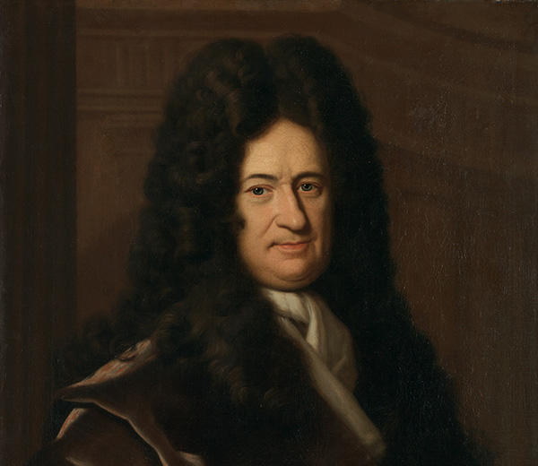

You exist. Let’s just take that in for a moment. You _exist_. And you exist not in some general, abstract way, but in a highly specific form, at a very particular time and place. You are _you_. A human being, here, now, existing on a planet that’s hurtling through space at 30 kilometers per second. 

And it’s not just you. Other people, you assume, exist here too. As does the place you grew up, and the screen upon which you’re reading these very words. All of it’s _here_.

The reason for the existence of most of the things we encounter in our day-to-day lives can be explained quite easily: something caused it. 

Take your screen: it exists because someone created it. Take you: you exist because some people created you. Take the people who created you: they exist because some people created them. And so on, and so on… stretching all the way back through thousands of years to your first non-human ancestor, and before even then to single-celled organisms.

And before then?

At this point, the historical details get a bit fuzzy. But we’re confident that, whatever happened, it was due to _certain preconditions that caused it to happen_. 

Every event, we nod knowingly, must have a cause. Life propagated on Earth due to certain preconditions. And before that, Earth formed as one of a number of planets in the solar system due to certain preconditions. And before that, the Milky Way formed due to certain preconditions… and so on. 

But what happens when we rewind this causal chain of preconditions all the way back to its beginning? 

Physicists postulate there was a Big Bang. But experience tells us that explosions don’t just happen spontaneously… they, like all other events, must have a cause.

Now we’re approaching the heart of the matter.

Indeed, if our universal chain of causation starts at the moment of the Big Bang, then _what set the preconditions for the Big Bang?_ 

In other words, why does _anything_ exist? Surely, it would have been simpler for nothing to have existed at all, rather than for all this _stuff_ to spring into existence...

## Framing the question

Nothing being simpler than _something_ is certainly what 17th-century German philosopher Gottfried Wilhelm Leibniz propounds in his 1714 work, Principles of Nature and Grace. 

Leibniz argues that nothingness — no Earth, no stars, no galaxies, no universe, no atoms, no physical laws — would have been “simpler and easier” than the existence of the universe we see around us. That our universe _does_ exist, therefore, demands an explanation. 

Leibniz was the first thinker in recorded history to succinctly express this demand as the question: “why is there something rather than nothing?” 

Framed this way, the question of why anything exists hits especially hard. We are creatures driven by narrative, and that every event has a cause is our fundamental way of understanding the world. 

But, when we reflect on why there is something rather than nothing, it hurts our brains. It seems, firstly, unreasonable that something should be favored over nothing when the latter is the simpler option, and secondly, just impossible that something could ever _generate_ from nothing. Because, as ancient Greek philosopher Parmenides put it over 2,500 years ago, “out of nothing, nothing comes.”

19th-century American philosopher William James, reflecting on this conundrum, concludes that “the question of being is the darkest in all philosophy.” Why? Because the paradoxical nature of the question itself denies the very possibility of an answer: “from nothing to being,” James writes, “there is no logical bridge.”

Thus on initial reflection we are left confounded. _Nothingness_, it seems, would just be so much simpler and easier than the complicated universe we see around us... so what on earth produced all this _stuff_, where did it all come from and why did it spring into existence in the first place? 

## There has _always_ been something

One potential answer is to say, well, there _had_ to be something. This was the approach of Leibniz’s contemporary, the 17th-century Dutch philosopher Baruch Spinoza. 

<h5>This extract is taken from Chapter #1 of our introductory philosophy course, <a href="/lifes-big-questions/">Life's Big Questions</a>. Interested in reading more? Explore the full course now!</h5>
<a class="primary button" href="/lifes-big-questions/"><svg xmlns="http://www.w3.org/2000/svg" viewBox="0 0 512 512"><path d="M504 256C504 119 393 8 256 8S8 119 8 256s111 248 248 248 248-111 248-248zm-448 0c0-110.5 89.5-200 200-200s200 89.5 200 200-89.5 200-200 200S56 366.5 56 256zm72 20v-40c0-6.6 5.4-12 12-12h116v-67c0-10.7 12.9-16 20.5-8.5l99 99c4.7 4.7 4.7 12.3 0 17l-99 99c-7.6 7.6-20.5 2.2-20.5-8.5v-67H140c-6.6 0-12-5.4-12-12z"/></svg>Explore Course Now</a>

