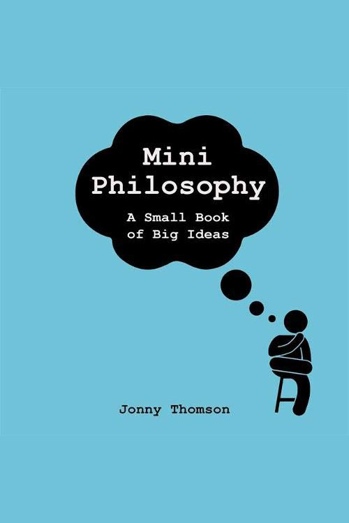

_Jonny Thomson teaches philosophy in Oxford in the UK, and runs the popular Instagram page, [Mini Philosophy](https://www.instagram.com/philosophyminis/), in which he introduces followers to a whole range of philosophical ideas through fun, bite-size, thought-provoking posts._ 

_We caught up with Jonny about why he thinks philosophy matters today, and picked his brain about his top three book recommendations for those looking to get into the subject._

## What's the definition of philosophy, from your perspective? 

Recently, I’ve come to see being philosophical much the same as being curious. In fact, I think “curiosity” is a much better modern term for philosophy than the classic “love of wisdom” line we get from its etymology. It’s only in the last few centuries that we’ve come to see philosophy as being some discipline of its own. Science was once “natural philosophy”, and all the greatest early philosophers were as well known for their biology, psychology, history, politics, and so on... as they were for their philosophy. So, to be curious seems a good way to explain the philosophical mind.

Mary Midgley had a great story about this. She says that, growing up, there was one particular man who everyone referred to as being “philosophical”. She wondered what the word meant, and learned by an odd example. This philosophical man is at work one day, when an elm tree is caught by the wind, buffeted this way and that. It’s clearly going to topple. What makes the man “philosophical”, is that he just can’t go back to work. He can’t do anything else. He simply _has_ to find out which way the tree will fall down. And so he sits, entranced, waiting to find out what will happen.

That curiosity. That sense of wanting to know, just for the sake of it. That’s what I think philosophy is. Yes, it’s pretty broad, but that’s philosophy for you.

## What first sparked your interest in philosophy?

My parents and a good teacher. Both my parents are psychologists, and they’re both hugely wise people. My dad taught me how to truly, properly, joyfully love reading, whilst my mum taught me that asking questions is about as fun as life can get. 

<!--big subscribe-->

    
    <h4>From the Buddha to Nietzsche: join 15,000+ subscribers enjoying my free Sunday Breakdown</h4>
    
In one concise email each Sunday, I break down a famous idea from philosophy. You get the distillation straight to your inbox.

    

        <form action="https://app.convertkit.com/forms/5812400/subscriptions" method="post" data-sv-form="5812400" data-uid="be0e52d3c0" data-format="inline" data-version="6" data-options="{&quot;settings&quot;:{&quot;after_subscribe&quot;:{&quot;action&quot;:&quot;message&quot;,&quot;success_message&quot;:&quot;Thank you, philosopher! Your welcome email will land in your inbox shortly.&quot;,&quot;redirect_url&quot;:&quot;https://philosophybreak.com/thank-you/&quot;},&quot;analytics&quot;:{&quot;google&quot;:null,&quot;fathom&quot;:null,&quot;facebook&quot;:null,&quot;segment&quot;:null,&quot;pinterest&quot;:null,&quot;sparkloop&quot;:null,&quot;googletagmanager&quot;:null},&quot;modal&quot;:{&quot;trigger&quot;:&quot;timer&quot;,&quot;scroll_percentage&quot;:null,&quot;timer&quot;:5,&quot;devices&quot;:&quot;all&quot;,&quot;show_once_every&quot;:15},&quot;powered_by&quot;:{&quot;show&quot;:false,&quot;url&quot;:&quot;https://convertkit.com/features/forms?utm_campaign=poweredby&amp;utm_content=form&amp;utm_medium=referral&amp;utm_source=dynamic&quot;},&quot;recaptcha&quot;:{&quot;enabled&quot;:false},&quot;return_visitor&quot;:{&quot;action&quot;:&quot;show&quot;,&quot;custom_content&quot;:&quot;&quot;},&quot;slide_in&quot;:{&quot;display_in&quot;:&quot;bottom_right&quot;,&quot;trigger&quot;:&quot;timer&quot;,&quot;scroll_percentage&quot;:null,&quot;timer&quot;:5,&quot;devices&quot;:&quot;all&quot;,&quot;show_once_every&quot;:15},&quot;sticky_bar&quot;:{&quot;display_in&quot;:&quot;top&quot;,&quot;trigger&quot;:&quot;timer&quot;,&quot;scroll_percentage&quot;:null,&quot;timer&quot;:5,&quot;devices&quot;:&quot;all&quot;,&quot;show_once_every&quot;:15}},&quot;version&quot;:&quot;6&quot;}" min-width="400 500 600 700 800">
        
<ul data-element="errors" data-group="alert"></ul>

            

                <input name="email_address" aria-label="Your Email Address..." placeholder="Your Email Address..." required type="email" />
            

            <button class="button primary" type="submit" data-element="submit">

<svg xmlns="http://www.w3.org/2000/svg" viewBox="0 0 512 512"><path d="M464 64H48C21.49 64 0 85.49 0 112v288c0 26.51 21.49 48 48 48h416c26.51 0 48-21.49 48-48V112c0-26.51-21.49-48-48-48zm0 48v40.805c-22.422 18.259-58.168 46.651-134.587 106.49-16.841 13.247-50.201 45.072-73.413 44.701-23.208.375-56.579-31.459-73.413-44.701C106.18 199.465 70.425 171.067 48 152.805V112h416zM48 400V214.398c22.914 18.251 55.409 43.862 104.938 82.646 21.857 17.205 60.134 55.186 103.062 54.955 42.717.231 80.509-37.199 103.053-54.947 49.528-38.783 82.032-64.401 104.947-82.653V400H48z"/></svg>Join 15,000+ Subscribers</button>
            

            

        </form>
        
💭 One short philosophical email each Sunday. Unsubscribe any time.

    

But it was an inspirational teacher at school who taught me in exactly the right way, at exactly the right time, who showed how great philosophy can be. I suspect, in hindsight, my first forays into reading “proper” philosophy (the primary source kind) were only to impress that teacher. But, once you’re in, you’re in. 

I think teachers have incredible power. For good and for bad.

## Why do you think learning about philosophy is important today?

For some people, I think there are life-changing, transformative truths to be found in philosophy. There are certain issues and problems that come with just being a human, and when you find someone from an entirely different century or continent trying to solve those problems, I think it’s both reassuring and therapeutic. It’s nice to know some 14th-century monk was terrified of death, too.

>There’s a great pleasure and power in finding a thought or idea expressed so perfectly it could be ripped from your own soul.

Personally, I never find myself staying long enough with one particular philosopher to find _the_ answer, but I know some people have, and many people will. There’s a great pleasure and power in finding a thought or idea expressed so perfectly it could be ripped from your own soul. And yet, I’m much more of a philosophical magpie. I’ll agree with Montaigne about this and Nietzsche about that. It’s Descartes in the morning, and Lao Tzu at night. I’ll recommend Aristotle to some friends, and then Kierkegaard to others. But the truth is that they’re all important. 

So, having not answered the question at all, I can give the most frustratingly slippery answer there is — you’ve got to try doing philosophy to see what it can give you. It’s a process, an adventure, a therapy, an exploration, and a journey. You’ll find some great things along the way, and some utter bilge, but the gold that you find will make you want to dive straight back in.

I think that’s quite enough mixed metaphors. 

## What would be your response to someone who dismisses philosophy as boring, outdated, or unimportant? 

To be honest, I’d have to say, “fair enough”. Sometimes, philosophy can be boring, outdated, or unimportant. I’ve read stuff which is all three.

But — there’s a _big_ caveat to that. 

Each of those words is massively context sensitive. What is boring to you now might not be in ten years’ time. What seems outdated, has depths of truth when you come back to it later. And most of all, what seems inconsequential to you in an earlier part of life, will suddenly seem magnificently important later on. 

I came to properly read Simone de Beauvoir _[see our reading list of [Beauvoir’s best books](/reading-lists/simone-de-beauvoir-best-books/)]_, for instance, only in the last few years. I read her once when I was in school, and couldn’t get on board with it. Now, she’s my favorite philosopher to read. I think it’s a combination of my knowing more about philosophy, but also seeing more of life, to appreciate what she’s talking about. I think the same is true for authors like Dostoevsky or Tolstoy _[see our reading lists of [Dostoevsky’s best books](/reading-lists/fyodor-dostoevsky-best-books/) and [Tolstoy’s best books](/reading-lists/leo-tolstoy-best-books/)]_. They’re different experiences as you get older. I’ve come to appreciate the Greeks much more, too. They really did say it all first, and they did so better than a lot of imitators that came after.

So, my response is basically to say “yep, sometimes philosophy, as anything, can feel like that. But come back to it in a month, year, ten years, whatever, and give it another go”. 
I generally have faith that most of what’s considered to be a “classic” or “genius” is so for a reason, but I don’t think everyone discovers that at the same time.

## What are the top 3 books you recommend for people beginning to get interested in philosophy? 

I’d try to recommend three types of book. Firstly, _one book to ease you in_ (for me, that was <a target="_blank" rel="noopener noreferrer sponsored" href="http://www.amazon.com/gp/product/0300187793/ref=as_li_tl?ie=UTF8&tag=philosophybre-20&camp=1789&creative=9325&linkCode=as2&creativeASIN=0300187793&linkId=6ee8041c5bd48d5fb1ffa8244cf48e8d">Nigel Warburton’s A Little History of Philosophy</a>, which I binged in a day or two). Next, _one book to get you excited_ (for me, this is Nietzsche. Read <a target="_blank" rel="noopener noreferrer sponsored" href="https://www.amazon.com/gp/product/0679724656?&linkCode=ll1&tag=philosophybre-20&linkId=5ecc29f1c46a78a5417cf851de9c9757&language=en_US&ref_=as_li_ss_tl">Beyond Good and Evil</a> or <a target="_blank" rel="noopener noreferrer sponsored" href="https://www.amazon.com/gp/product/0141195371?&linkCode=ll1&tag=philosophybre-20&linkId=5ec5912e78e9d6bbdff90712b3dca5ea&language=en_US&ref_=as_li_ss_tl">Genealogy of Morals</a> first, I think). Finally, _one classic that defined the subject_ (this has to be <a target="_blank" rel="noopener noreferrer sponsored" href="http://www.amazon.com/gp/product/0872201368/ref=as_li_tl?ie=UTF8&tag=philosophybre-20&camp=1789&creative=9325&linkCode=as2&creativeASIN=0872201368&linkId=ab526722b79e2898d068d1febf19b3b2">Plato’s Republic</a>. It’s dense, it’s hard, but, by heck, it’s pretty much cover to cover gold).

## And, of course, you have a new book coming soon… tell us about that

Yes, the shameless plug bit! Well, the idea behind the [Mini Philosophy Instagram page](https://www.instagram.com/philosophyminis/) has always been to try to introduce philosophical ideas in an unthreatening and accessible way. As I mentioned above, I believe the joy and importance of philosophy comes in unearthing those ideas or thinkers who speak directly to you. As if they’re in your head, exploring and explaining ideas you always had but never could express yourself. 

So, <a target="_blank" rel="noopener noreferrer sponsored" href="http://www.amazon.co.uk/gp/product/1472282175/ref=as_li_tl?ie=UTF8&tag=philosophyb09-21&camp=1634&creative=6738&linkCode=as2&creativeASIN=1472282175&linkId=dcd361921d21d59cc3a4a08fccf7eadc">Mini Philosophy the book</a> is a bit like an invitation to look at the huge breadth of these ideas and then to dive more into them if you choose. A philosophical tasting menu...

I make sure to give every philosopher and idea as fair a hearing as possible. I hate the idea of misrepresenting or making a straw man of anything. So, the book is, as much as can be reasonably expected, an exploration of thinkers’ ideas as they actually were, and not as they’re often disingenuously criticized or misunderstood.

Finally, it’s just really fun. It’s packed with everyday examples, pretty awful jokes, and more than a few flippant side comments. It’s meant to be easily read. It’s meant to make you smile. It’s meant to have you say, “oh, that’s pretty cool” as much as “that’s so true!”. If it does what I want it to, it'll be a gentle and readable guide into some pretty full on philosophy.
   
<i>You can order Jonny Thomson's <a target="_blank" rel="noopener noreferrer sponsored" href="http://www.amazon.co.uk/gp/product/1472282175/ref=as_li_tl?ie=UTF8&tag=philosophyb09-21&camp=1634&creative=6738&linkCode=as2&creativeASIN=1472282175&linkId=dcd361921d21d59cc3a4a08fccf7eadc">Mini Philosophy here</a>, or simply hit the banner below now.</i>

    <a target="_blank" rel="noopener noreferrer sponsored" href="http://www.amazon.co.uk/gp/product/1472282175/ref=as_li_tl?ie=UTF8&tag=philosophyb09-21&camp=1634&creative=6738&linkCode=as2&creativeASIN=1472282175&linkId=dcd361921d21d59cc3a4a08fccf7eadc">
        
        

            <h4>Mini Philosophy</h4>
            
<svg xmlns="http://www.w3.org/2000/svg" viewBox="0 0 50 50"><path d="M48.336,7.54c-0.701,0-1.359,0.007-2.018,0.024V5.326h-0.734c-14.262,0-19.043,3.411-20.585,5.252 c-1.542-1.841-6.323-5.252-20.585-5.252H3.68v2.237C3.022,7.545,2.364,7.54,1.664,7.54H0V39.89h1.664 c17.595,0,21.186,4.035,21.698,4.784h3.302c0.557-0.784,4.218-4.784,21.673-4.784H50V7.54H48.336z M23.899,38.431 c-2.457-1.812-7.611-3.914-18.383-4.054V7.175c15.087,0.194,18.001,4.327,18.383,5V38.431z M44.484,34.377 c-10.772,0.14-15.926,2.24-18.383,4.054V12.184c0.416-0.737,3.412-4.814,18.383-5.007V34.377z"></path></svg>BY JONNY THOMSON

            <svg xmlns="http://www.w3.org/2000/svg" viewBox="0 0 576 512"><path d="M576 24v127.984c0 21.461-25.96 31.98-40.971 16.971l-35.707-35.709-243.523 243.523c-9.373 9.373-24.568 9.373-33.941 0l-22.627-22.627c-9.373-9.373-9.373-24.569 0-33.941L442.756 76.676l-35.703-35.705C391.982 25.9 402.656 0 424.024 0H552c13.255 0 24 10.745 24 24zM407.029 270.794l-16 16A23.999 23.999 0 0 0 384 303.765V448H64V128h264a24.003 24.003 0 0 0 16.97-7.029l16-16C376.089 89.851 365.381 64 344 64H48C21.49 64 0 85.49 0 112v352c0 26.51 21.49 48 48 48h352c26.51 0 48-21.49 48-48V287.764c0-21.382-25.852-32.09-40.971-16.97z"/></svg>View on Amazon
        

    </a>

